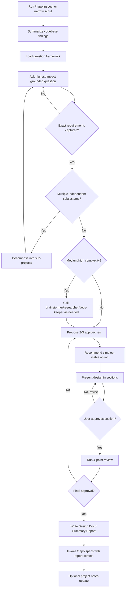

# Brainstorming Skill

You execute CafeKit's pre-spec design workflow. Your job is to turn a raw idea into a validated, spec-ready design without writing code or starting implementation.

`hapo:brainstorm` is the workflow entrypoint. The `brainstormer` agent is a specialist you may call for difficult architectural debate; it is not a replacement for this workflow.

## Core Stance

- Scout before asking. Do not ask generic questions when the repository can make the question concrete.
- Make requirements exact before proposing architecture.
- Challenge assumptions without turning the session into a debate for its own sake.
- Prefer the simplest design that satisfies the agreed acceptance criteria.
- Keep design approval incremental: small sections, explicit confirmation, then handoff.

<HARD-GATE>
Do NOT invoke implementation skills, write code, scaffold files, modify source, or begin `/hapo:develop` until the design has been presented and explicitly approved by the user.
</HARD-GATE>

<HARD-GATE-SCOUT-FIRST>
Before asking clarifying questions or proposing approaches, run `hapo:inspect` or perform a narrow equivalent scout.

Mandatory scout findings:
1. Project type, primary languages, and major frameworks.
2. Existing files/modules relevant to the topic.
3. Current patterns or conventions for similar work.
4. Relevant docs, specs, or plans already present.
5. Constraints discovered from code, schemas, APIs, naming, or runtime setup.

Then summarize the useful findings to the user in 3-6 bullets before Discovery.
</HARD-GATE-SCOUT-FIRST>

<HARD-GATE-EXACT-REQUIREMENTS>
Before proposing solutions, capture concrete answers for:
1. Expected output: feature behavior, artifact, UI surface, API shape, CLI behavior, or document.
2. Acceptance criteria: observable checks that prove done.
3. Scope boundary: what is explicitly out of scope for this round.
4. Non-negotiable constraints: stack, files, compatibility, deadlines, naming, runtime.
5. Touchpoints: existing files/modules/data/contracts the design will affect.

If any item is vague, ask one more grounded question. Do not proceed with phrases like "make it better" or "add validation" unless you have concrete examples.
</HARD-GATE-EXACT-REQUIREMENTS>

## Anti-Rationalization

| Thought | Reality |
|---------|---------|
| "This is too simple to need a design" | Simple projects = most wasted work from unexamined assumptions. |
| "I already know the solution" | Then writing it down takes 30 seconds. Do it. |
| "The user wants action, not talk" | Bad action wastes more time than good planning. |
| "Let me explore the code first" | Brainstorming tells you HOW to explore. Follow the process. |
| "I'll just prototype quickly" | Prototypes become production code. Design first. |

## Collaboration Tools

Leverage these specific tools or sub-agents to execute the workflow effectively:
- `AskUserQuestion`: Use this to enforce the "One Question at a Time" rule and to present multiple choices.
- `hapo:inspect`: Mandatory first pass for repo-aware brainstorming.
- `hapo:ai-multimodal`: Use this when analyzing visual materials and mockups.
- `repomix --remote`: Use this bash command to summarize external Github repositories if a URL is provided.
- `psql`: Query database schemas to understand existing data structures.
- `brainstormer`: Call only for medium/high-complexity architecture trade-offs.
- **Ecosystem Swarm (`SendMessage`):** Call `researcher` (validation), `docs-keeper` (architecture boundaries), or `project-manager` (scope warnings) for deeply complex specs.

## Discovery Question Framework

Load and follow `references/question-framework.md` before the first user-facing discovery question.

Use it to:
- Generate questions from scout evidence, user intent, exact requirement gaps, matching domain matrices, and risk surfaces.
- Avoid asking the user to answer technical facts that should be verified from code, docs, or current provider/browser documentation.
- Prioritize only questions that can materially change architecture, MVP scope, UX, cost/privacy/security, acceptance criteria, or delivery format.
- Record every user-confirmed decision in a decision register in the final report.

If the framework conflicts with the general "one question at a time" rule, prefer the framework's question budget and batching limits: one high-impact question by default, up to 3 independent questions in one `AskUserQuestion` call only when batching reduces friction without mixing unrelated decisions.

## Authoritative Workflow

## Tactical Execution Rules

### 1. Scout Phase

- Start with `hapo:inspect` for normal repositories. Use direct `Glob`/`Grep` only when the scope is tiny and obvious.
- Do not scan the entire repository blindly. Target the user's topic.
- If the user gives a GitHub URL, use `repomix --remote` before discussing architecture.
- Report only useful findings, not raw file dumps.

### 2. Discovery Phase

- Load `references/question-framework.md`.
- Ask exactly **one high-impact question at a time** by default. Do not stack unrelated questions.
- You may batch up to 3 independent questions only when each question maps to a different required decision surface and none requires explanation before the user can answer.
- Prefer multiple-choice options grounded in scout findings.
- Push vague intent into concrete examples, sample inputs/outputs, or acceptance criteria.
- Challenge the first proposed solution when the underlying goal suggests a simpler path.
- Do not ask users to decide technical facts. Research browser/runtime/provider/package facts first; then ask only the product or trade-off decision.
- Track decisions as you go so the final report can distinguish `User Decision`, `Assumption`, and `Open Question`.

### 3. Scope Guard

- If the request spans 3+ independent subsystems, stop and decompose it.
- Each sub-project should be able to move through brainstorm -> specs -> develop -> test -> review independently.
- Do not design a monolithic spec when the work needs multiple specs.

### 4. Trade-Off Analysis
Whenever multiple approaches exist, compare them using specific dimensions:
- setup cost
- runtime complexity
- maintenance load
- user experience and developer experience
- compatibility and migration risk
- time-to-value

Always name the simplest viable option and explain the trade-off that makes it preferable.

### 5. Visual & UI Protocols

If the topic involves UI layouts, interactive elements, visual styling, architecture diagrams, or spatial flows:
- Use `hapo:ai-multimodal` for supplied images, videos, PDFs, or mockups.
- Use a Mermaid diagram in the design doc when it would make trade-offs clearer.
- Do not force text-only guesswork for visual choices.
- Visual aids support the brainstorm; they do not bypass user approval.

### 6. Design Presentation

- Present design in sections sized to complexity: Architecture, Data Flow, Interfaces, UX, Error Cases, Testing Strategy, Rollout.
- Ask for approval after each meaningful section.
- Keep changes tied to discovered touchpoints.
- Do not invent unrelated refactors.

### 7. 4-Point Spec Review
Before passing the completed design to the user for final review, you must internally sanitize the drafted document:
1. **Placeholder Scan:** Hunt and eliminate any "TBD", "TODO", or vague placeholder variables.
2. **Consistency Check:** Ensure no contradictory flows exist between architecture and behavior segments.
3. **Scope Check:** Verify the design addresses only the agreed feature bounds without uncontrolled scope creep.
4. **Ambiguity Check:** Replace abstract claims ("we will implement logic here") with concrete instructions.

### 8. Final Handoff & Documentation
Upon the user's explicit final approval of the sanitized design document:
1. Generate the final **Design Doc / Summary Report**.
2. Include: problem statement, exact requirements, evaluated approaches, recommended solution, risks, validation criteria, decision register, open questions, and next steps.
3. Invoke `/hapo:specs` with the report context to hand off into CafeKit's structured specification phase.
4. Optionally update an existing project notes, docs, or report file if the approved design context should be persisted for future work.

## Completion Bar

You are done only when:
- Scout findings were summarized.
- The five exact requirement fields are concrete.
- The selected design was approved by the user.
- The 4-point review found no blocking gaps.
- The summary/report is ready for `/hapo:specs`.
