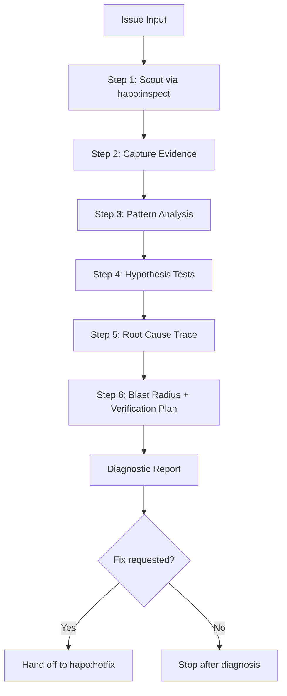

# Debug - Evidence-First Root Cause Analysis

Debugging is diagnosis, not repair. Find the source of the failure before changing product code.

## Arguments

- `--quick` - Abbreviated path for syntax, lint, type, or single-test failures with obvious local scope
- `--ci` - Focus on CI/CD logs, runner environment, dependency versions, and pipeline setup
- `--frontend` - Include browser console, screenshot, accessibility tree, network, and responsive checks
- `--perf` - Include baseline measurements, bottleneck layer, profiling, and before/after targets

Default: systematic diagnosis with no product-code edits, scout first.

<DIAGNOSTIC-ONLY-GATE>
`hapo:debug` is read-only for product code.
Do NOT edit product code, apply fixes, create migrations, or add regression tests as implementation.
Do NOT change config, dependency versions, generated assets, or test snapshots to make the failure disappear.
Temporary instrumentation is allowed only when it is the minimal way to observe hidden state; record the file/line, capture the proof, remove it before finishing, and report `Temporary instrumentation: removed`.
</DIAGNOSTIC-ONLY-GATE>

<HARD-GATE-SCOUT-FIRST>
Before hypotheses, inspect the actual codebase context.
You must identify:
- project type, language, framework, runtime, and test runner
- affected files/modules and exact symptom location
- direct callers, dependents, and data/config boundaries
- related tests and reproduction commands
- recent commits touching affected paths
- adjacent known-good implementation patterns

After scout, provide a 3-6 bullet codebase-context summary before evidence capture.
Do not ask generic questions before this step unless the issue cannot be located from the prompt or repository.
</HARD-GATE-SCOUT-FIRST>

<ROOT-CAUSE-GATE>
Do NOT recommend a fix until the root-cause contract is complete.
Do NOT stop at the first plausible explanation. Test hypotheses against evidence.
If 2+ hypotheses are refuted, change strategy before continuing.
If evidence is insufficient, report `Root cause: unknown`, `Missing Evidence`, and `Next Diagnostic Action`; do not hand off to `hapo:hotfix` as ready.
</ROOT-CAUSE-GATE>

If the user asks to fix while still inside `hapo:debug`, finish the debug report first. Then hand off only the completed root-cause contract to `hapo:hotfix`.

## Process Flow



**This diagram is the authoritative workflow.** `hapo:debug` stops at diagnosis unless the user explicitly asks to fix.

---

## Step 1: Scout

Understand the affected code before forming hypotheses.

**Action:** Activate `hapo:inspect` for the relevant scope.
If `hapo:inspect` is unavailable, use direct read-only reconnaissance (`rg`, file reads, test discovery, and `git log`) and state that fallback.

**Checklist:**
- [ ] Project type, language, framework, runtime, and test runner identified
- [ ] Affected files and modules identified
- [ ] Direct dependencies and call paths mapped
- [ ] Inputs/outputs, data boundaries, and config/env boundaries mapped
- [ ] Related tests located
- [ ] Recent changes checked: `git log --oneline -10 -- <affected-files>`
- [ ] Existing working examples or adjacent patterns identified

**Output:** `✓ Step 1: Scouted - [N] files, [M] deps, [K] tests` plus a 3-6 bullet context summary.

---

## Step 2: Capture Evidence

Create a baseline that can later prove whether the issue changed.

**Capture:**
- Exact command, URL, user flow, or trigger
- Exact error message, stack trace, failing assertion, or visual symptom
- Expected vs actual behavior
- Relevant logs with timestamps
- Environment facts: runtime, dependency versions, OS, browser, CI runner, config
- Whether the issue reproduces consistently or intermittently

For frontend issues, use `.claude/references/debugger/frontend-verification.md`.
For CI/log issues, use `.claude/references/debugger/log-ci-analysis.md`.
For performance issues, use `.claude/references/debugger/performance-diagnostics.md`.

**Output:** `✓ Step 2: Evidence captured - baseline command/symptom recorded`

---

## Step 3: Pattern Analysis

Before proposing a cause, compare against known-good patterns.

**Check:**
- Similar implementation that works
- Similar tests that pass
- Recent code that changed the same contract
- Config/env differences between passing and failing contexts
- Dependency/API contract changes

**Output:** `✓ Step 3: Patterns compared - [working reference] vs [failing path]`

---

## Step 4: Hypothesis Tests

Create 2-3 competing hypotheses. Test one variable at a time.

```text
Hypothesis: [statement]
Confirm if: [evidence that proves it]
Refute if: [evidence that disproves it]
Quick test: [command/search/log/query]
Result: confirmed | refuted | inconclusive
```

Rules:
- Never batch unrelated changes as a test.
- Prefer read-only evidence: logs, grep, stack traces, DB queries, browser traces.
- For flaky async tests, use `.claude/references/debugger/condition-based-waiting.md`.
- If 2+ hypotheses are refuted, use inversion: ask what evidence would make the current explanation impossible.

**Output:** `✓ Step 4: Hypotheses tested - [confirmed/refuted counts]`

---

## Step 5: Root Cause Trace

Trace backward from symptom to origin.

```text
Symptom
  <- immediate cause
    <- contributing factor
      <- ROOT CAUSE
```

**Exact root-cause contract:**
- Symptom: exact observable failure
- Reproduction: command/user flow/log trigger
- Expected vs actual behavior
- Root cause: file:line or config/env source
- Why now: recent change, data state, dependency, environment, timing, or load factor
- Evidence chain: observations that prove this cause
- Blast radius: files/modules/tests/users/workflows affected

**Output:** `✓ Step 5: Root cause traced - [file:line/config/env]`

---

## Step 6: Blast Radius + Verification Plan

Prepare the handoff to `hapo:hotfix` or the user.

**Verification plan must include:**
- Original failing command or reproduction path
- Targeted regression test or scenario
- Affected-module tests
- Typecheck/lint/build commands when relevant
- UI screenshot/console/network checks when relevant
- Side-effect sweep from `.claude/references/debugger/side-effect-gate.md`

**Output:** `✓ Step 6: Verification planned - [commands/scenarios]`

---

## Diagnostic Report Format

```markdown
## Debug Report

**Issue:** [one-line summary]
**Mode:** quick | standard | ci | frontend | perf
**Root cause confidence:** high | medium | low | unknown

### Root Cause Contract
- Symptom:
- Reproduction:
- Expected:
- Actual:
- Root cause:
- Why now:
- Evidence chain:
- Blast radius:

### Hypotheses Tested
1. [confirmed/refuted/inconclusive] [hypothesis] - [evidence]

### Verification Plan
- Original reproduction:
- Regression guard:
- Side-effect sweep:

### Temporary Instrumentation
- none | removed: [file:line, purpose, proof captured]

### Recommended Fix Direction
[Smallest root-cause fix, or "insufficient evidence"]

### Missing Evidence
- [Only when root cause is unknown]

### Next Diagnostic Action
- [Only when root cause is unknown]

### Unresolved Questions
- [Only if any]
```

## Relationship To Hotfix

- Use `hapo:debug` to determine what is wrong.
- Use `hapo:hotfix` to change code only after the root-cause contract is complete.
- A `Root cause: unknown` report is not ready for hotfix; continue diagnosis or ask for the missing artifact.
- If `hapo:hotfix` verification fails, return to `hapo:debug` with the new evidence.

## References

Load as needed:
- `.claude/references/debugger/core-philosophy.md` - Anti-guessing discipline
- `.claude/references/debugger/root-cause-tracing.md` - Backward trace to origin
- `.claude/references/debugger/verification-protocol.md` - Fresh evidence requirements
- `.claude/references/debugger/log-ci-analysis.md` - Logs and CI/CD failure analysis
- `.claude/references/debugger/parallel-agent-hydration.md` - Parallel reconnaissance
- `.claude/references/debugger/frontend-verification.md` - Browser/UI verification
- `.claude/references/debugger/performance-diagnostics.md` - Performance investigation
- `.claude/references/debugger/condition-based-waiting.md` - Flaky async test diagnosis
- `.claude/references/debugger/side-effect-gate.md` - Regression and blast-radius checks
