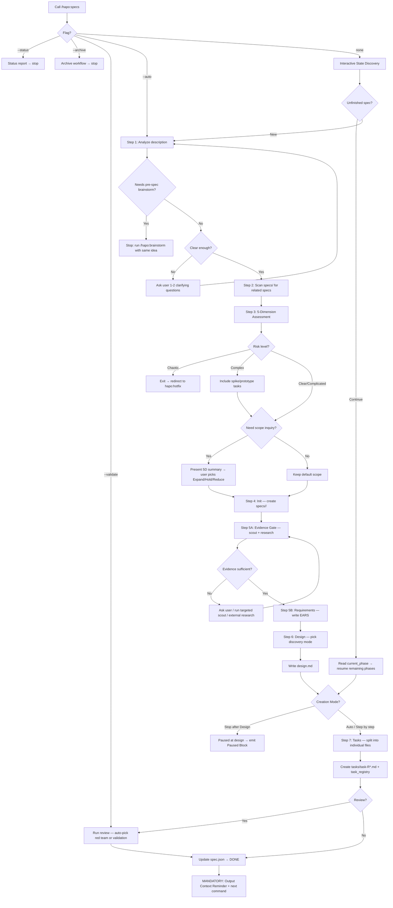

# Specs (SDD — Specification-Driven Development)

> A structured specification system that turns vague ideas into actionable, implementable task lists.

## Overview

This skill provides a 10-step workflow to transform ideas into evidence-backed specs:

```
Analyze → Dependency Scan → Complexity Assessment → Init → Evidence Gate + Requirements → Design → Tasks → Review → Completion
```

An entry/dispatch layer sits in front of the pipeline: four flags (`--auto`, `--validate`, `--status`, `--archive`) plus **Interactive State Discovery** (the no-flag path) decide *which part of the pipeline to run and where to stop* — see **Default Behavior**. The pipeline itself is unchanged regardless of how it is invoked.

**CRITICAL:** Before starting, the system MUST:
1. Scan `specs/` directory for incomplete specs
2. If any spec is `in_progress` (accept legacy `in-progress` when reading) → ask user whether to continue or create new
3. Detect cross-spec dependencies (see `references/cross-spec-dependency.md`)

## Core Responsibilities & Rules

### Development Principles
- **YAGNI** — Don't add functionality until it's actually needed
- **KISS** — Prefer simple solutions over complex ones
- **DRY** — Don't repeat existing code/logic
- **Be honest, direct, to the point, concise.**

### Phase Separation Rules
- Each phase (Init → Requirements → Design → Tasks) must complete before the next begins
- No skipping — don't write design without requirements
- Exception: simple tasks may merge requirements + design into one step
- A `/hapo:specs <feature-description>` run defaults to **Interactive State Discovery**: it asks the Creation Mode (Auto / Stop after Design / Step by step) before running. `--auto` runs the full pipeline end-to-end without asking. Either way, phases never skip — each completes before the next begins, and Init is never a stop point.

### Scope Rules
- Respect `scope_lock` absolutely once user has confirmed
- Never silently expand or shrink scope
- If scope change needed → ask user, record reason in `spec.json`

### State & Integrity Rules
- Canonical active status string is `in_progress`. Legacy `in-progress` may be READ for compatibility but MUST NOT be generated in new specs.
- `current_phase` is required for live work and must track the active phase (`init`, `requirements`, `design`, `tasks`, `develop`, `test`, `review`).
- `task_files` in `spec.json` MUST exactly match the real files under `tasks/` after Step 7.
- `task_registry` in `spec.json` MUST exist once task files are generated and MUST contain one entry per task file, keyed by relative path.
- `ready_for_implementation` is a hard gate, not a convenience flag. Never set it before the finalization audit passes.
- Non-trivial specs MUST have an evidence trail in `research.md` before requirements, design, or tasks are finalized. Evidence can be codebase scout findings, external/current research, or an explicit skip rationale.

### Language & Canonical Rules
- **English is the canonical language for every spec artifact** (`spec.json`, `requirements.md`, `research.md`, `design.md`, `tasks/*.md`) — write them in English regardless of the session's response language.
- If the configured language (`.claude/settings.json` → `language`) is not English, you MAY additionally generate a **reference-only translation mirror** under `i18n/<lang>/`. See `references/translation-mirror.md`. The mirror never replaces canonical and is never a source of truth.

### Output Criteria
- Never implement code — only create spec documents
- Return file paths and a brief summary
- Spec files must be self-contained (full context)
- Insert code samples/pseudocode when needed to clarify flow
- Comply with `./docs/development-rules.md` if it exists

### Hard Output Contract
For a normal `/hapo:specs <feature-description>` run, the persistent spec artifacts MUST use this shape:

```
specs/<feature>/
├── spec.json
├── requirements.md
├── research.md
├── design.md
├── tasks/
│   ├── task-R0-01-<slug>.md
│   ├── task-R1-01-<slug>.md
│   └── ...
└── reports/
    └── <optional-review-or-research-report>.md
```

Forbidden generated artifacts:
- Do NOT create `specs/<feature>/init.json`.
- Do NOT create `specs/<feature>/spec-state.json`.
- Do NOT create `specs/<feature>/hydration.md`.
- Do NOT create shorthand task files such as `tasks/task-R0-1.md`, `tasks/task-R1-1.md`, or `tasks/R0-1-<slug>.md`.
- The template file name is never the output file name. `templates/spec-state.json` is only the schema source for generated `spec.json`.
- Before marking a spec ready, run the deterministic validator:
  - `node .opencode/scripts/validate-spec-output.cjs specs/<feature>`
  - Any validator failure blocks `ready_for_implementation = true`.

### Writing Style
- Concise, prefer bullet lists
- Get straight to the point, no fluff
- Unresolved questions → list at the end of each document

## Default Behavior

> **This section is the entry/dispatch layer ONLY.** It decides *which part of the pipeline to run and where to stop*. It does NOT change any pipeline step, the validator, templates, or rules. The detailed Steps 1–10 below are unchanged.

`hapo:specs` exposes exactly **four flags**: `--auto`, `--validate`, `--status`, `--archive`. Everything else (which spec, new vs continue, how far to run) is resolved by **Interactive State Discovery**, never by extra flags.

**Back-compat aliases** (accepted silently, not advertised): bare `status` / `archive` / `resume`, and `--validate` as today. Treat them as their `--flag` equivalents.

### Dispatch order

1. `--status` (or bare `status`) → run the status report (see **Subcommands**), then stop.
2. `--validate <feature>` → jump to **Step 8** (the `--validate` rules below are unchanged).
3. `--archive` (or bare `archive`) → run the archive workflow, then stop.
4. `--auto` → **non-interactive run**. If the argument matches an unfinished spec → resume it from `current_phase` and finish to Tasks. Otherwise create new and run the full pipeline (Step 1→10) end-to-end. Either way: auto-approve and skip the Creation Mode question; if a new description is missing, ask only for it; the hard safety gates still apply.
5. Otherwise (`/hapo:specs` or `/hapo:specs "<description>"`) → **Interactive State Discovery**.

### Interactive State Discovery (no-flag path)

Goal: ask the user enough to determine **state** and **intent**, then run the existing pipeline. This only chooses *what to run and where to stop* — it does not alter any step's logic.

1. **Detect state.** Scan `specs/` for unfinished specs (`status=in_progress` / `ready_for_implementation=false`) and git-branch match.
   - Found → `AskUserQuestion`: `Continue <spec A> · Continue <spec B> · Create new spec`.
   - None → default to create-new.
2. **Create-new + no description yet** → ask for the description, then analyze it (logic unchanged):
   - If description is too short (< 20 words) or missing one concrete detail → stop and ask 1-2 clarifying questions
   - If the idea has unresolved architecture choices, unclear acceptance criteria, unclear scope boundaries, or multiple plausible approaches → stop and route to `/hapo:brainstorm <idea>` before creating spec artifacts
   - If task is simple (small bugfix, config change) → suggest "A spec may not be needed for this. Continue anyway?"
   - If task is complex (multi-module, security/migration related) → auto-activate deep research, ask user 3 scope questions
   - For non-trivial specs, execute the Step 5 Evidence Gate before writing final requirements. Do not design from memory when codebase or current external evidence can answer the question.
3. **Creation Mode Gate** (how far to run) — see the dedicated section below. Options: `Auto (→ Tasks)` · `Stop after Design` · `Step by step`. If `.claude/settings.json` → `language` is not English, also offer the **Translation Mirror** (see below).
4. **Continue an unfinished spec** → read `spec.json.current_phase`, then `AskUserQuestion` offering the **remaining** stop points (e.g. `→ Design`, `→ Tasks`, `Step by step`) and resume the existing pipeline from that phase. If a message accompanied the call, treat it as added context for the next phase (scope expansion → ask, per `references/ask-user-question-gates.md`).
5. **Run the chosen scope.** On an early stop, emit the Paused Block (Step 9b). Sync `spec.json` per `state-sync.md`.

> The pipeline, validator, templates, and rules are unchanged. "Stop after Design" simply halts before Step 7; it runs Steps 1–6 exactly as specified.

### Creation Mode Gate

Shown once (via `AskUserQuestion`) on the no-flag create path, after the description passes the safety gates. It selects the **stop point only** — every phase that runs uses the unchanged Step logic.

| Option | Runs | Stops after | Approvals |
|---|---|---|---|
| **Auto (→ Tasks)** | Step 1→10 end-to-end | full (ready gate) | each phase `generated=true` + `approved=true` |
| **Stop after Design** | Step 1→6 | `design` (before Step 7) | requirements + design `approved=true`; `ready_for_implementation=false` |
| **Step by step** | one phase at a time | after each phase | per phase `generated=true`, `approved=false` until user approves |

Rules:
- `--auto` equals choosing **Auto (→ Tasks)** without showing this gate.
- **Stop after Design** / **Step by step** leave `ready_for_implementation=false` and emit the Paused Block (Step 9b).
- Continuing later: run `/hapo:specs` again → Interactive State Discovery detects the unfinished spec and offers the remaining stop points. No flag or keyword required.

### Translation Mirror (optional reference copy)

Load `references/translation-mirror.md`. This is the only language feature in the entry layer; canonical artifacts are always English.

- Read `.claude/settings.json` → `language`. If it is **not** English and the run is **interactive** (no `--auto`), ask once via `AskUserQuestion`: "Generate a `<language>` reference copy of this spec? (kept in sync, read-only)".
- On `Yes` → set `spec.json.translation` (`enabled`, `language`, `language_code`, `dir: i18n/<code>`, `sync: always`) and, after each canonical doc is written in Steps 5–7, regenerate the matching file under `i18n/<code>/` with the reference-only marker.
- `--auto` does not prompt for a mirror, so an `--auto` create makes none. But if the spec already has `translation.enabled = true` (set in an earlier interactive run), always-sync still applies: an `--auto` resume keeps regenerating the mirror after each canonical write.
- The mirror is reference-only: never validated, never a source of truth, ignored by `hapo:develop`.

### When called WITH `--validate` argument

System IMMEDIATELY jumps to **Step 8: Validation Review**.
The system MUST NOT execute Steps 1-8. Instead, load `references/review.md` and follow it **step-by-step**.

#### `--validate` Guardrails (NON-NEGOTIABLE)

1. **Red Team cannot be skipped by the system.** If auto-decision says "Red Team + Validate", you MUST run Red Team. A previous `code-auditor` review does NOT count — code-auditor reviews source code, NOT specifications. Only the USER can downgrade to "Validate only" by explicitly saying so.
2. **MUST use the 4 Personas** defined in `review.md` Part A Step 3 (Security Adversary, Failure Mode Analyst, Assumption Destroyer, Scope & Complexity Critic). Generic observations without persona attribution are REJECTED.
3. **MUST use the Finding Format** defined in `review.md` Part A (Severity, Location, Flaw, Failure scenario, Evidence, Suggested fix, Disposition, Rationale). Shortened or custom formats are REJECTED.
4. **MUST create `reports/red-team-report.md`** when Red Team runs (review.md Part A Step 8).
5. **MUST NOT create implementation code files** (`.ts`, `.js`, `.py`, etc.). The validate workflow produces ONLY markdown spec documents and reports. If a fix requires a new shared module, describe it in the relevant task file instead of creating the actual code file.
6. **MUST NOT over-engineer fixes.** Apply YAGNI — if user says "configure later", add an abstraction note to the task, do NOT generate 4 concrete provider implementations.
7. **MUST follow auto-decision table exactly.** Count task files + scan for keywords → pick mode. No self-justification to override the table result.
8. **MUST run deterministic validator.** Before reporting validation PASS, run `node .opencode/scripts/validate-spec-output.cjs specs/<feature>`. If it exits non-zero, validation is FAIL/BLOCKED, `ready_for_implementation` remains `false`, and output MUST NOT suggest `/hapo:develop`.

## Workflow Diagram



**This diagram is the authoritative workflow.** If text below conflicts with the diagram, follow the diagram.

## Detailed Workflow

### Step 1: Analyze Description
- Load `references/ask-user-question-gates.md` before asking user questions. Ask only at documented gates; do not ask questions that repo evidence or official/current docs can answer.
- Assess clarity and complexity of the description
- Route to `hapo:brainstorm` before creating files when:
  - the expected output or acceptance criteria are not concrete
  - the scope boundary is unknown
  - the request has 2-3 viable architectures and no user-approved direction
  - the feature spans 3+ independent subsystems and needs decomposition
  - the user is explicitly asking to explore, compare, debate, or decide
- **Multimodal & Document Auto-Ingestion (MANDATORY)**: If the input includes file paths or URLs pointing to images, audio, video, or Office documents, activate the matching skill workflow to extract content BEFORE proceeding:
  - `.mp3`, `.wav`, `.mp4`, `.mov`, `.jpg`, `.png`, `.webp` → use `hapo:ai-multimodal` to transcribe/analyze the file
  - `.pdf` → use `hapo:pdf` to extract text and tables
  - `.docx` → use `hapo:docx` to extract document content
  - `.pptx` → use `hapo:pptx` to extract slide content
  - `.xlsx`, `.csv` → use `hapo:xlsx` to extract data
  - *Append the extracted findings into your working memory as the enriched "description".*
- If description < 20 words or lacks concrete nouns → ask 1-2 clarifying questions
- If task is too simple → warn user that a spec may not be needed

### Step 2: Cross-Spec Dependency Scan
Load: `references/cross-spec-dependency.md`
- Scan `specs/` for incomplete specs
- Compare scope: overlapping files, shared dependencies, same feature area
- Update `spec.json` bidirectionally if relationship detected

### Step 3: Complexity Assessment & Scope Inquiry
Load: `references/scope-inquiry.md`
- Also load `references/ask-user-question-gates.md` when scope, evidence, contract, or architecture decisions require user input.
- Evaluate the request across **5 dimensions**: Semantic Intent, Implementation Hypothesis, Gap Sizing, Risk/Uncertainty (Cynefin), and Blast Radius
- If Risk = **Chaotic** → exit spec workflow, redirect to `hapo:hotfix`
- If Risk = **Complex** → include spike/prototype tasks in the spec
- If Blast Radius = **Critical Path** → spec MUST include rollback strategy and test coverage requirements
- **Complexity smell check (by numbers)** — quick YAGNI tripwires: >8 files touched / >2 new classes-services / >12 task files → challenge or simplify; **>15 task files → split into sibling specs** (a mega-spec is slow + failure-prone, per field test). Surface tripwires in the scope summary; never silently build the mega-version.
- User picks scope level: Expand / Hold / Reduce
- **Skip if:** trivial task (< 20 words, 1 file, user says "just do it")

#### Execution Tier (auto-scale — set right after the 5-Dimension assessment)
Pick ONE tier from the assessment; it controls how deep the pipeline runs so small specs stay cheap. Record it in `spec.json.design_context.execution_tier`.

| Tier | Trigger | Research (Step 5 external) | Discovery (Step 6) | Red-Team (Step 8) | Always runs |
|---|---|---|---|---|---|
| **Light** | Cynefin Clear + Blast Isolated + likely ≤2 tasks | skip (record skip rationale) | minimal | skip → Validate-only | scope_lock, EARS, **Layer 1 + Layer 2 grounding** |
| **Standard** | default (Complicated / Moderate blast / 3-4 tasks) | targeted | light | per Step 8 auto-decision | all of the above |
| **Deep** | Complex/Critical-path / security-migration / 5+ tasks | full (researchers + per-area scout) | full | Red-Team → Validate (mandatory) | all of the above |

Rules:
- Grounding (Layer 2) + structural validator (Layer 1) + scope_lock **never skip**, any tier — they are the quality floor, not depth knobs.
- Light tier is the antidote to "small spec, full-pipeline overhead". Do NOT use Light for auth/payment/migration/schema/privacy work — those force Deep regardless of size.
- Tier only changes *research/discovery/review depth*; it never changes the Hard Output Contract or DoCT.

### Step 4: Init
- Check for duplicate slugs in `specs/` via Glob
- Create directory `specs/<feature-name>/`
- Create `spec.json` from template `templates/spec-state.json`. The output file name MUST be `spec.json`; never write the template filename into the spec directory.
- Create empty `requirements.md` from template `templates/requirements-init.md`
- Initialize `scope_lock` in `spec.json`:
  - `source`: original description
  - `in_scope`: confirmed scope items
  - `out_of_scope`: excluded items
  - `expansion_policy`: `requires-user-approval`
- Step 4 itself only initializes files. The Creation Mode Gate (or `--auto`) decides how far the run proceeds; in every mode Step 4 continues into Step 5 — Init is never a stop point.

### Step 5: Evidence Gate, Requirements & Research
- Read `spec.json` — stop if init hasn't completed
- Stop if requirements already exist, unless user wants to regenerate
- Respect `scope_lock` — keep new requirements within `in_scope`
- Load `references/research-strategy.md` and `references/codebase-analysis.md`
- Classify evidence needs before writing requirements:
  - **Targeted codebase scout is mandatory** when the spec changes existing behavior, touches an API/CLI/package export/schema/auth/session/permission/config/hook/runtime contract, lacks exact file paths, may invalidate tests, resumes an older spec, or crosses monorepo/package/runtime boundaries.
  - **External/current research is mandatory** when the spec depends on third-party APIs, libraries, platform policies, AI providers/models/tooling, security/auth/payment/privacy/delete-data rules, performance/accessibility/SEO/security standards, or the user asks for "best", "optimal", "latest", "recommended", or equivalent.
  - **Skip evidence gathering only** for trivial one-file edits, internal text/docs changes, isolated new files with no integration points, or decisions already backed by a recent user-provided report. Record the skip rationale in `research.md`.
- Codebase scout must be targeted, not a blind full-repo crawl. Identify relevant files/modules, current patterns, existing tests, contracts, and likely blast radius.
- External/current research must prefer official docs, standards, primary sources, or maintained upstream references. Record source links and the date/context of the finding.
- Write `research.md` before final requirements. It MUST include an Evidence Summary with: codebase scout result, external research result or skip rationale, selected decision, rejected alternatives, remaining gaps, and downstream task/test implications.
- If evidence exposes unresolved architecture choices, unclear acceptance criteria, or multiple viable approaches with no obvious winner, stop and route to `/hapo:brainstorm` instead of forcing a spec.
- Write requirements in **EARS** format (see `rules/ears-format.md`). Give each acceptance criterion an **explicit literal ID `R{N}.{M}`** (e.g. `- **R1.1** When ...`), NOT a bare numbered list. This activates per-criterion coverage at Layer 1 (each `R1.1` must be mapped by a task `_Requirements: 1.1_`). A bare `1. 2. 3.` list silently disables sub-criterion coverage — do not use it for non-trivial specs.
- **Feasibility Check:** Cross-check each requirement against known technical constraints from `research.md`.
- Each requirement gets a unique numeric ID
- **Verify Quality:** Before proceeding, assert each requirement is: *Singular, Unambiguous, Testable, and has a numeric ID*. Include Non-Functional Requirements (Performance, Security, Scalability, Reliability, Accessibility).
- Record any findings in `research.md` from template `templates/research.md`
- Update `spec.json` phase + timestamps

### Step 6: Design
- Read `spec.json` — stop if requirements haven't completed
- Pick discovery mode: `minimal` / `light` / `full` based on complexity. **Default: `light`** unless certain it is simple UI (minimal) or complex integration (full).
- Load `rules/design-principles.md`
- Load `rules/phase-decision-matrix.md` to define implementation slices, task clusters, foundation boundaries, spike needs, integration gates, and verification gates before task generation.
- Load `references/ask-user-question-gates.md` if a design decision would change scope, contract, provider/platform, or implementation safety.
- Load `rules/design-discovery-[mode].md`:
  - **minimal**: UI-only or simple CRUD
  - **light**: extending existing system
  - **full**: integration, security, schema, or performance
- Record findings in `research.md` before finalizing design
- Write `design.md` from template `templates/design.md` (see `rules/design-principles.md`)
- Design decisions MUST trace back to `research.md` evidence. If a design choice lacks evidence and is not a user-approved constraint, gather more evidence or ask the user before finalizing.
- Add diagrams only when design has multi-step or cross-boundary flows
- For auth/session, transport/entrypoint, persistence/schema, generated-artifact, or runtime-sensitive work, the design MUST fill the `Canonical Contracts & Invariants` section and tasks MUST inherit the same decisions verbatim.
- When a data shape must stay byte-identical across layers (e.g. an API response consumed by both a backend task and a frontend task, or a DB row shape), declare it as a **named contract block** — `<!-- contract:NAME -->` followed by a fenced block — per `templates/design.md`. Tasks that produce/consume it add `Contracts: NAME` and copy the block verbatim; the validator then hard-fails on cross-layer drift. Prefer this for any spec spanning BE/FE/DB.
- Update `spec.json` phase, timestamps, discovery mode

### Step 7: Task Breakdown
- Read `spec.json` — stop if `requirements.md` or `design.md` missing
- Respect `scope_lock` — only use valid requirement IDs within `in_scope`
- Load `rules/tasks-generation.md` for core principles
- Load `rules/phase-decision-matrix.md` before generating task files. Treat "phase" as an implementation slice/task cluster, not a `phase-XX.md` artifact.
- Load `rules/task-scoring-rubric.md` for every candidate task to decide priority, split/merge, spike needs, dependencies, parallel eligibility, and evidence depth.
- Load `references/ask-user-question-gates.md`; if scoring reveals unapproved scope expansion or an unresolved user-owned choice, pause before writing task files.
- **Scaffold is mandatory — raw `Write` to a task file is blocked.** A PreToolUse hook (`task-scaffold-guard.cjs`) rejects any `Write` whose path matches `specs/<feature>/tasks/task-*.md`. The only path to a task file is scaffold → Edit. Once the task list is decided, generate the stubs:
  `node .opencode/scripts/spec-scaffold.cjs <feature> --tasks "R0-01-slug,R1-01-slug,..." --tasks-only`
  This creates each `tasks/task-R*.md` from `templates/task.md` and merges `task_files` + `task_registry` into the existing `spec.json` (pending, no overwrite of already-filled tasks). Then **Edit-fill** the `{{...}}` placeholders in each stub (`Edit`/`MultiEdit` are allowed; `Write` is not). (The guard fails open if the scaffold script is absent, and can be disabled via `"spec": { "scaffold_guard": false }` in `.opencode/runtime.json`.)
- Each task file follows template `templates/task.md` (scaffold already applies it). **Leave NO `{{...}}` placeholder unfilled** — a stub with placeholders is an incomplete task.
- `Related Files` and test plans must inherit paths, contracts, and test targets from the codebase scout. If exact files/tests cannot be named for an enhancement, run targeted inspect before generating tasks. Every `Related Files` path will be grounded (Layer 2) at Step 8.5 — phantom paths hard-fail, so cite real paths.
- Each task file MUST include `Completion Criteria` and `Evidence` sections detailed enough that a downstream quality gate can prove the task is truly done. Existing specs may use `Task Test Plan & Verification Evidence` or legacy `Verification & Evidence`.
- Each task's `Evidence` MUST choose the right proof type for the touched surface: unit for pure logic, component/integration for UI or state wiring, E2E/UI flow for complete user workflows, visual/responsive checks for style/layout work, accessibility checks for interactive UI, smoke checks for scaffold/config, regression checks for bug fixes, and performance/security checks only when the requirement or risk calls for them.
- Every task MUST preserve the approved `scope_lock`: implement all scoped acceptance criteria for its requirement, avoid out-of-scope features, and record any intentional deferral as a named later task rather than implicit omission.
- For UI/app/runtime features, generate a final integration/reachability task or final section that names the real runtime entrypoint and proves prior task outputs are imported, mounted, registered, invoked, or otherwise reachable.
- Build `spec.json.task_registry` alongside `task_files`. For each task file, register at minimum:
  - `id`
  - `title`
  - `status` (`pending` by default)
  - `dependencies` (relative task paths, not prose labels)
  - `blocker`
  - `started_at`
  - `completed_at`
  - `last_updated_at`
- Update `spec.json` phase + task metadata

#### Requirement-Covered Task Grouping (MANDATORY)
Tasks MUST be organized by implementation flow while preserving explicit requirement coverage. Foundation work uses `R0`; feature work uses `R1+`.

**Naming convention:** `tasks/task-R{N}-{SEQ}-<slug>.md`
- `R{N}` = foundation or implementation cluster (R0 foundation, R1+ feature work)
- `{SEQ}` = sequential number within that requirement (01, 02, 03...)
- `<slug>` = descriptive kebab-case name

**Example output:**
```
tasks/
├── task-R0-01-database-schema-foundation.md  # Shared foundation
├── task-R0-02-auth-routing-foundation.md     # Shared foundation
├── task-R1-01-captions-observer.md
├── task-R1-02-gap-marker-detector.md
├── task-R1-03-chunk-api-endpoint.md
├── task-R2-01-summarize-orchestrator.md
├── task-R2-02-provider-integration.md
├── task-R3-01-consent-onboarding.md
...
```

**Splitting rules:**
- Split by real implementation dependency chain first: model/schema -> service -> API -> UI -> integration.
- A task file MAY cover multiple requirement IDs when one code change naturally satisfies them.
- A requirement MAY be covered by multiple task files when it spans layers.
- Do not create all tasks under `R0`; `R0` is only shared foundation/setup.
- After generating all tasks: verify **every requirement ID** appears in at least one task file's `## Requirements` section — gaps = failure.
- **Legacy Protection:** If the `research.md` identified existing codebase files or tests that will be broken (Blast Radius), you MUST generate explicitly tasked files (e.g., `task-R5-01-update-legacy-tests.md`) to fix those breakages. Do not leave broken tests out of scope.

**Dependency ordering:** Tasks within the same requirement are ordered by natural implementation flow. Cross-requirement dependencies use `Dependencies:` field referencing other task file names.

#### Task File Quality Requirements (MANDATORY)
Each task file MUST be **self-contained and implementation-ready** — detailed enough for a junior developer or AI coding agent to execute without guessing.

**Structure per task file:**
1. **Context** — why this task exists, current state, target outcome, relevant exact files.
2. **Constraints** — MUST / SHOULD / MUST NOT / SCOPE guardrails.
3. **Steps** — concise implementation checklist with business intent and code-level detail.
4. **Requirements** — list requirement IDs and acceptance criteria covered by this task.
5. **Related Files** — table with exact paths, action type, and descriptions when paths are known; otherwise run scout first.
6. **Completion Criteria** — observable, testable criteria.
7. **Evidence** — automated command(s), artifact/runtime proof, negative-path proof, and runtime reachability proof.
8. **Risk Assessment** — table with risk, severity, mitigation.

**Template fidelity is mandatory:** preserve the task template headings exactly. Do NOT rename `## Context` to `## Objective`, do NOT replace `## Completion Criteria` with prose, do NOT remove `## Related Files`, `## Constraints`, or `## Risk Assessment`, and do NOT collapse `## Evidence` into generic QA scenarios. Compact wording is fine; missing sections are invalid.

**Parallel markers:** Append `(P)` to tasks that can run concurrently (no data dependency, no shared files, no prerequisite approval from another task). Tasks serving DIFFERENT requirements are often parallelizable.

**FORBIDDEN:** Task files with only vague checkboxes and no exact files, requirements, or evidence. Compact is good; vague is invalid.

#### Definition of a Complete Task (DoCT) — the quality bar
A task is "complete enough to implement without guessing" only when ALL hold. Each item is enforced by a named mechanism, not goodwill:

| DoCT element | Enforced by |
|---|---|
| **Related Files** name exact real paths (Create/Modify/Delete) | Layer 2 grounding (`spec-ground.cjs`) — phantom path fails |
| **Contract** (API/DB/event shape) stated concretely | Layer 1 contract-drift check (`<!-- contract:NAME -->`) |
| **Acceptance** measurable (no "fast/nice/safe" without a threshold) | EARS rule + reviewer judgment |
| **Evidence** uses commands that exist in the project (`package.json`) | Author + grounding spirit; never invent test commands |
| **Reachability** names a real entrypoint/caller | `Runtime reachability verification` (Layer 1 presence) + judgment |
| **Requirements mapping** present (`_Requirements: x.y_`) | Layer 1 coverage check |
| **FE fidelity** — if a visual reference (image/Figma/tokens/style guide) is provided, the task carries the concrete values (hex/font/spacing/verbatim text) + a `match <reference>` constraint | `tasks-generation.md` Frontend Fidelity Rule + reviewer/visual check |

A stub with unfilled `{{...}}` placeholders fails DoCT by definition. The two scripts (Layer 1 structural + Layer 2 grounding) are the floor; reviewer judgment covers the rest.

### Step 8: Validation Review (Optional)
Load: `references/review.md` + `rules/design-review.md`
- Load `references/ask-user-question-gates.md` before applying validation or red-team changes. User approval is required when findings modify approved scope, requirements, canonical contracts, design decisions, or task behavior.
- System auto-evaluates spec complexity and decides review depth:
  - **< 3 task files, no security concerns** → Validate only (lightweight interview)
  - **>= 5 task files OR security/migration keywords** → Red Team first, then Validate
  - **User explicit request** → respect user's intent
- Set `design_context.validation_recommended = true` if the spec includes any of: auth/session, privacy, deletion, migration, schema change, external AI/provider switching, browser extension permissions, or 5+ task files.
- When both run: Red Team ALWAYS before Validate (red team may change the spec)
- **PROHIBITION:** The system MUST NOT skip Red Team because of a prior code-auditor review. Code review ≠ Spec review.
- **PROHIBITION:** The system MUST NOT create `.ts`, `.js`, `.py` or any implementation files during validation. Spec-only outputs.
- **Reconciliation Rule:** `validation.status = "completed"` is forbidden until all accepted findings and validation decisions are physically propagated into `requirements.md`, `design.md`, `tasks/*.md`, and `spec.json` where applicable.
- **Deterministic Gate (2 layers):** Run `node .opencode/scripts/validate-spec-output.cjs specs/<feature>` (structural) AND `node .opencode/scripts/spec-ground.cjs specs/<feature> [--root <work-context>]` (grounding — paths exist) after all fixes and before final output. Either script failing overrides any LLM checklist result and blocks `ready_for_implementation = true`.

### Step 8.5: Finalization Audit (MANDATORY)
- Re-scan the `tasks/` directory and rebuild `spec.json.task_files` + `task_registry` from the real filesystem (sorted relative paths; preserve task status when the path still matches).
- **Layer 1 — Structural:** run `node .opencode/scripts/validate-spec-output.cjs specs/<feature>` and treat any non-zero exit as a blocking failure.
- **Layer 2 — Grounding (MANDATORY):** run `node .opencode/scripts/spec-ground.cjs specs/<feature> [--root <work-context>]` and treat any non-zero exit as a blocking failure. This greps the real work tree to verify every `Related Files` path a task cites (Modify/Delete/Read) actually exists — or is Created by another task in the spec. Pass `--root` when the code lives apart from the spec (monorepo / sibling project). A spec that PASSES Layer 1 but FAILS Layer 2 is trolling phantom files and is NOT ready.

**Validator-enforced (do not re-check by hand — a clean exit clears all of these):** task_files/task_registry synced to disk; task naming `tasks/task-R{N}-{SEQ}-<slug>.md`; no forbidden artifacts; research.md Evidence Summary present; every requirement **and sub-criterion** covered by a task; each task keeps the full template (Context, Constraints, Steps, Related Files, Completion Criteria, Evidence, Risk Assessment) plus Runtime reachability; numeric requirement IDs only; validation_recommended vs validation.status; timestamps not reused from init; ready_for_implementation blocked while any error exists.

**Grounding-enforced (spec-ground.cjs — do not re-check by hand):** every Modify/Delete/Read path in any task's `Related Files` exists in the work tree or is Created earlier in the spec. Phantom paths hard-fail.

**Judgment-only audit (validator cannot see these — assert manually):**
- FAIL if a UI/app/runtime spec has multiple user-facing task outputs but no final integration/reachability task or section.
- FAIL if accepted validation/red-team decisions exist in reports but are not reflected in implementation-facing sections (`Context`, `Steps`, `Requirements`, `Completion Criteria`, `Evidence`, canonical contracts, or requirements text).
- FAIL if the scope/provider switched away from Anthropic/Claude but `requirements.md`, `design.md`, or `tasks/*.md` still contain stale strings such as `Claude API`, `Haiku`, or `haiku_reachable`. `research.md` is the only allowed place for historical comparisons.
- FAIL if privacy/delete-data work lacks a single canonical deletion policy. The design MUST explicitly choose either:
  1. hard-delete with no re-registration lock, or
  2. privacy-preserving re-registration lock using a non-raw identifier (for example `email_hash` / `email_fingerprint`) with a retention period.
  Tasks and requirements must reuse the same policy verbatim; mixed policies are invalid.
- FAIL if `validation.status = "completed"` but `timestamps.validation_done` / `review_done`, `updated_at`, and report metadata are not synchronized with the final reviewed state.
- If `validation_recommended = true` and `validation.status` is not `completed` (or an explicit user-accepted risk state), `ready_for_implementation` MUST remain `false`.
- If `translation.enabled = true`, ensure `i18n/<language_code>/` exists and was re-synced after the final canonical write; the mirror is excluded from validation and never blocks `ready_for_implementation`.
- Only after this audit passes may the system mark `progress.tasks = "done"` and `ready_for_implementation = true`.

### Step 9: Completion — Context Reminder (MANDATORY)
After completing the spec, output a short summary of what was generated, then you MUST output the following block EXACTLY as written. DO NOT use awkward translations like "Điểm đã phản ánh đúng quyết định của bạn", keep it professional or just output the block directly:

**Command integrity:** The implementation handoff command is always `/hapo:develop <feature>`. Never suggest `/work`, `/code`, or any non-CafeKit alias as the next step for this workflow.

```
✅ Spec complete: specs/<feature>/
📌 Next step — run:
   /hapo:develop <feature>

💡 Tip: Run /clear or start a new chat session before implementing to reduce planning context carryover.
```

### Step 9b: Paused Block (early stop)

When the run stops before Tasks (Creation Mode = **Stop after Design** or **Step by step**), do NOT print the completion block above and do NOT run the deterministic validator (no tasks exist yet). Instead print:

```
⏸ Spec paused at <phase>: specs/<feature>/
📌 Continue — run /hapo:specs and choose "Continue <feature>"
   (or /hapo:specs <feature> --auto to finish straight to Tasks)
```

`ready_for_implementation` stays `false`. The next `/hapo:specs` run re-detects this spec via Interactive State Discovery and offers the remaining phases.

## Active Spec State

When user calls `hapo:specs`, system checks `specs/`:

| Situation | Action |
|---|---|
| A spec is `in_progress` | Interactive State Discovery offers `Continue <name>` (resume from `<phase>`) vs `Create new spec` |
| A spec matches current git branch | Offer `Continue <X>` vs `Create new` |
| Nothing found | Create new spec → Creation Mode Gate |

**Next step suggestions based on `spec.json`:**

| Current phase | Suggestion |
|---|---|
| `init` done | "Next: write requirements" |
| `requirements` done | "Next: architectural design" |
| `design` done | "Next: break into tasks" |
| `tasks` done + validation recommended but incomplete | "Next: `/hapo:specs --validate <feature>`" |
| `tasks` done + ready_for_implementation = true | "Next: `/hapo:develop <feature>`" |
| Spec is `blocked` | "Warning: spec `X` is blocking this spec" |

**State persistence:** Update `spec.json` `phase` field on each transition. `spec.json` is the single source of truth.

### spec.json Update Rules (MANDATORY)

**Canonical status vocabulary:** Use `in_progress`, `blocked`, `done`, and `archived`. New specs MUST NOT emit `in-progress`.

**Timestamps:** Each `timestamps.*_done` field MUST use the **actual current time** (ISO 8601 with timezone) when that specific phase completes. This includes `review_done` and `validation_done` after review/validate workflows. Do NOT reuse the `init` timestamp for later phases. If running the full pipeline end-to-end, capture a fresh timestamp at each phase transition.

**Approvals (auto-approval behavior):**
- When running the **full pipeline end-to-end** (`--auto` or Creation Mode "Auto", init → tasks in one session): set `approvals.{phase}.generated = true` AND `approvals.{phase}.approved = true` for each completed phase before proceeding to the next.
- When running to an **early stop point** (Creation Mode "Stop after Design"): for each phase that ran to reach the stop point, set `generated = true` AND `approved = true`; do not generate later phases; keep `ready_for_implementation = false`.
- When running a **single phase** (Creation Mode "Step by step"): set `generated = true` but leave `approved = false` — user must explicitly approve before continuing.

**Task inventory:** `task_files` MUST be present and MUST list every real task file exactly once using relative paths like `tasks/task-R1-01-example.md`.
Task paths that omit the `task-` prefix or use non-padded sequence numbers (for example `tasks/R1-1-example.md`) are invalid for new CafeKit specs.

**Task machine-state:** `task_registry` MUST be present after Step 7. Each key is a relative task path, and each value MUST contain `id`, `title`, `status`, `dependencies`, `blocker`, `started_at`, `completed_at`, and `last_updated_at`.

**Validation recommendation:** `design_context.validation_recommended` MUST be `true` for auth, privacy, delete-data, migration, schema-change, browser-extension-permission, external-provider, or 5+ task file specs.

**Translation mirror:** `translation` records the optional reference copy (`enabled`, `language`, `language_code`, `dir`, `sync: always`, `last_synced_at`). Canonical artifacts stay English; when `enabled = true`, regenerate `i18n/<language_code>/` after each canonical doc write and stamp `last_synced_at`. The mirror never affects `ready_for_implementation`. See `references/translation-mirror.md`.

**`ready_for_implementation`:** This field MUST only be set to `true` when ALL of the following conditions are met:
1. `approvals.requirements.approved = true`
2. `approvals.design.approved = true`
3. `approvals.tasks.approved = true`
4. `progress.tasks = "done"`
5. `task_files` matches the real filesystem
6. `task_registry` matches the real filesystem and does not omit any task file
7. If `design_context.validation_recommended = true`, `validation.status = "completed"` (or another explicit user-accepted risk state that is recorded)

If any approval is `false`, `ready_for_implementation` MUST remain `false`. If the spec has 5+ task files, `ready_for_implementation` MUST remain `false` until `/hapo:specs <feature> --validate` completes Red Team + Validate and writes `validation.status = "completed"`.

## Output Structure

```
specs/
└── <feature-name>/
    ├── spec.json              # Metadata, state, scope_lock, dependencies, task_registry
    ├── requirements.md        # Technical requirements (EARS format)
    ├── research.md            # Research notes
    ├── design.md              # Architectural design
    ├── tasks/                 # Foundation + implementation clusters (R0, R1, R2...)
    │   ├── task-R0-01-foundation.md
    │   ├── task-R1-01-<slug>.md
    │   ├── task-R1-02-<slug>.md
    │   ├── task-R2-01-<slug>.md
    │   ├── task-R3-01-<slug>.md
    │   └── ...
    └── reports/               # Auxiliary reports
        ├── researcher-01.md
        ├── inspect-report.md
        └── red-team-report.md
```

When `translation.enabled` is true, a reference-only mirror is added alongside (English stays canonical):

```
specs/<feature-name>/
└── i18n/<lang-code>/         # reference only — generated from canonical, never validated
    ├── requirements.md
    ├── design.md
    ├── research.md
    └── tasks/task-R*.md
```

## Subcommands

The canonical surface is four flags. Bare-verb forms are kept only as silent back-compat aliases.

| Command | Purpose | Reference |
|---|---|---|
| `/hapo:specs --status` | View status of all specs (alias: `status`) | — |
| `/hapo:specs --validate <feature>` | Validate spec (auto: red team + validate based on complexity) | `references/review.md` |
| `/hapo:specs --archive` | Archive completed specs + write journal (alias: `archive`) | `references/archive-workflow.md` |
| `/hapo:specs --auto [<desc>]` | Non-interactive: create (or resume) and run end-to-end to Tasks | — |
| `/hapo:specs [<desc>]` | Interactive State Discovery (continue unfinished, or create + Creation Mode Gate). Alias `resume` accepted. | — |

## Quality Standards

### Spec Content
- Specific enough for a junior developer to understand and execute
- Every requirement must be testable/verifiable
- Design must state trade-offs, not just solutions
- Every task must have clear definition of done

### Security & Performance
- Design must include security assessment (at least OWASP Top 10)
- Evaluate performance for potential bottlenecks
- Rollback plan for each major change

### Consistency
- Match existing codebase patterns
- Comply with `./docs/development-rules.md`, `./docs/code-standards.md`
- Check file naming conventions per project rules

### Maintainability
- Design for the future — require extensibility
- Document rationale behind every architectural decision
- No over-engineering: if a function suffices, don't create a class

### Pre-Finalization Checklist
Before finalizing any specification, assert all the following.

**Machine-enforced** (run `node .opencode/scripts/validate-spec-output.cjs specs/<feature>` — it hard-fails on all of these, so do not re-verify by hand): scope_lock object, research.md Evidence Summary, every requirement + sub-criterion covered by a task, each task has Completion Criteria + Evidence + Risk Assessment + the required headings, task_files/task_registry synced to disk with valid dependencies, task naming convention, validation gate vs validation.status, timestamps not reused. A clean validator exit clears this whole group.

**Judgment-only** (validator cannot see these — assert manually):
- [ ] **EARS format** applied to all acceptance criteria, with measurable thresholds (no "fast"/"safe"/"robust")
- [ ] **Discovery mode** selected and recorded in spec.json.design_context
- [ ] **Requirements traceability** matrix present in design.md
- [ ] **Canonical Contracts & Invariants** filled for auth/transport/persistence/artifact-sensitive work, and inherited verbatim by every task that touches the contract
- [ ] **State Machine Blueprint:** design.md contains Mermaid diagrams for non-trivial flows
- [ ] **Test strategy defined**: what gets unit tested, integration tested, e2e validated
- [ ] **Provider wording clean**: no stale vendor/provider strings outside allowed research context
- [ ] **Validation decisions propagated** into implementation-facing sections, not only reports/Risk Assessment

## When TO Use

✅ Creating a new complex feature
✅ Need documentation before coding
✅ Working with a team (need spec review)
✅ Project requires an audit trail

## When NOT to Use

❌ Simple bugfixes
❌ Small changes (< 1 hour)
❌ Emergency hotfixes

## Resources

### Templates (`templates/`)
- `spec-state.json` — Metadata/state schema used to create `spec.json`
- `requirements-init.md` — Empty requirements template
- `requirements.md` — Full requirements template
- `design.md` — Design document template
- `research.md` — Research log template
- `task.md` — Template for individual task file
- `.opencode/scripts/validate-spec-output.cjs` — Deterministic validator for generated spec artifacts

### Rules (`rules/`)
- `ears-format.md` — EARS requirements standard
- `design-principles.md` — Design principles
- `design-discovery-full.md` — Full research workflow
- `design-discovery-light.md` — Lightweight research workflow
- `design-review.md` — Design review GO/NO-GO process
- `phase-decision-matrix.md` — Implementation slice/task-cluster boundary rules
- `tasks-generation.md` — Task generation rules (includes spike task rules + parallel analysis)
- `task-scoring-rubric.md` — Task priority, split/merge, spike, dependency, and evidence-depth scoring

### References (`references/`)
- `ask-user-question-gates.md` — AskUserQuestion gate matrix for user-owned decisions
- `cross-spec-dependency.md` — Cross-spec dependency detection
- `scope-inquiry.md` — 5-Dimension Complexity Assessment (Semantic, Hypothesis, Gap, Risk/Cynefin, Blast Radius)
- `research-strategy.md` — Research strategy (7 tools)
- `codebase-analysis.md` — Codebase analysis (4 mandatory files)
- `review.md` — Spec review (auto-decides: red team 8 steps + validate 6 steps)
- `archive-workflow.md` — Archive workflow (5 steps)
- `translation-mirror.md` — Optional reference-only translation mirror (detection, layout, sync, fields)
