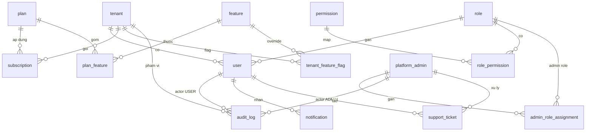

# NomoGreen — Database Design: Platform User & Auth

> Thiết kế DB cho **người dùng nền tảng**: (1) Platform Admin / Saler vận hành SaaS, (2) User cửa hàng (tenant).  
> Bám `base_spec.md` §3.4, §3.7, §3.8, §19 · `architecture.md` §6 · `database-design.md` (core SaaS).  
> **Chưa** gồm retail (product, sales, inventory…).

Version: 1.0  
Phase: 1 (MVP)

---

# 1. Phạm vi & ranh giới

| Nhóm | Ai | Bảng chính |
|---|---|---|
| **A. Platform operators** | SUPER_ADMIN, SALER, SUPPORT, BILLING | `platform_admin`, admin role assignment, (dùng chung `role`/`permission` phía admin) |
| **B. Tenant users** | OWNER, MANAGER, STAFF trong 1 cửa hàng | `user`, `role`, `role_permission`, `permission` |
| **C. Auth session** | JWT access + refresh | Redis (Phase 1) — không bắt buộc bảng SQL refresh |
| **D. Seat / gói** | Giới hạn số TK | `plan.max_users` + `tenant.seat_bonus` + đếm `user` |

**Ranh giới cứng:** `platform_admin` **không** join `user`. Hai realm login riêng (Admin Portal vs App cửa hàng).

---

# 2. Nguyên tắc

1. **Shared DB, shared schema** — user tenant luôn có `tenant_id`; query mặc định filter tenant.
2. **UUID** PK; tiền/seat = số nguyên; soft delete user qua `deleted_at` + `status`.
3. **Login multi-identifier** — `username | phone | email` + password (không OTP Phase 1).
4. **RBAC** — permission `resource:action`; role system (`tenant_id = null`) seed sẵn; không custom role builder Phase 1.
5. **Seat** — `effective_max_users = plan.max_users + tenant.seat_bonus`; chỉ đếm `ACTIVE` + `INVITED`.
6. **Audit** — tạo user, đổi role, reset MK, đổi seat → `audit_log`.
7. **Refresh token** — Redis + rotation (đã có `RefreshTokenStore`); SQL chỉ nếu cần audit session dài hạn (sau).

---

# 3. ERD (user & auth)



**Ngoài SQL (Phase 1):**

```
Redis keys (minh họa):
  refresh:{jti} → { userId | adminId, realm, tenantId?, exp }
  blacklist:access:{jti} → 1
  admin:refresh:index:{adminId} → set jti
```

---

# 4. Nhóm A — Platform operators

## 4.1 `platform_admin`

Nhân sự vận hành SaaS (Admin Portal). **Tách** khỏi `user`.

| Cột | Kiểu | Ràng buộc | Ghi chú |
|---|---|---|---|
| id | uuid | PK | |
| email | string | unique, not null | Login Admin Portal (Phase 1: email + password) |
| password_hash | string | not null | Argon2id |
| full_name | string | not null | |
| status | enum `PlatformAdminStatus` | ACTIVE / DISABLED | |
| must_change_password | bool | default false | Tùy chọn |
| last_login_at | datetime? | | |
| created_at / updated_at | datetime | | |

**Vai trò admin — 2 lớp (tương thích code hiện tại + spec):**

| Cách | Mô tả | Phase 1 |
|---|---|---|
| **A (legacy / simple)** | Cột `role` enum `PlatformAdminRole` | Còn trong schema cũ |
| **B (mục tiêu)** | M:N `admin_role_assignment` → `role` (`is_admin=true`) | Ưu tiên; nhiều role/admin |

Enum `PlatformAdminRole` (seed / fallback):

| Value | Việc |
|---|---|
| SUPER_ADMIN | Toàn quyền portal |
| SALER | Tạo tenant, user, seat_bonus, set MK giúp khách, gán plan |
| SUPPORT | Ticket, reset MK, xem tenant |
| BILLING | Gói, invoice, payment, seat theo HĐ |

> Spec `base_spec` §19 yêu cầu **SALER**. Enum Prisma hiện thiếu SALER → bổ sung khi migrate.

Index: `status`, `email`.

## 4.2 `admin_role_assignment`

| Cột | Kiểu | Ghi chú |
|---|---|---|
| id | uuid PK | |
| admin_id | FK → platform_admin | Cascade |
| role_id | FK → role | Restrict; role phải `is_admin = true`, `tenant_id = null` |
| assigned_at | datetime | |
| assigned_by | string? | admin id người gán |

Unique: `(admin_id, role_id)`.

## 4.3 Permission phía admin

Cùng bảng `permission` / `role_permission`. Convention:

- Prefix code: `admin.*` (vd `admin.tenant:create`, `admin.user:reset_password`, `admin.seat:grant`).
- Role admin seed: `SUPER_ADMIN`, `SALER`, `SUPPORT`, `BILLING` với `role.is_admin = true`.

---

# 5. Nhóm B — Tenant users (cửa hàng)

## 5.1 `user`

| Cột | Kiểu | Ràng buộc | Ghi chú |
|---|---|---|---|
| id | uuid | PK | |
| tenant_id | FK → tenant | Cascade, not null | |
| username | string | not null | Login id chính; unique trong tenant |
| email | string? | | Login id phụ |
| phone | string? | | Login id phụ (nông thôn) |
| password_hash | string | not null | Argon2id |
| must_change_password | bool | default false | true = chặn app đến khi đổi MK |
| full_name | string | not null | |
| role_id | FK → role | not null | OWNER / MANAGER / STAFF |
| status | enum `UserStatus` | ACTIVE / INVITED / DISABLED | |
| created_by_type | enum `CreatedByType`? | PLATFORM_ADMIN / USER | Ai tạo |
| created_by_id | string? | | id admin hoặc user (không FK cứng — polymorphic) |
| last_login_at | datetime? | | |
| created_at / updated_at | datetime | | |
| deleted_at | datetime? | | soft delete (Trash) |

**Unique / index**

| Constraint | Ý |
|---|---|
| `UNIQUE (tenant_id, username)` | Bắt buộc |
| `UNIQUE (tenant_id, email)` WHERE email IS NOT NULL | Partial unique |
| `UNIQUE (tenant_id, phone)` WHERE phone IS NOT NULL | Partial unique |
| Index `(tenant_id, status)` | Đếm seat, list NV |
| Index `username`, `phone`, `email` | Resolve login (kèm tenant slug) |

**Login resolve (app cửa hàng)**

```
input: tenant_slug + identifier + password
1. tenant = find by slug (ACTIVE)
2. user = find where tenant_id = tenant.id
        AND (username = id OR phone = id OR email = id)
        AND status = ACTIVE AND deleted_at IS NULL
3. verify password_hash
4. if must_change_password → response yêu cầu đổi MK (token hạn chế hoặc flow riêng)
5. issue JWT access + refresh (claim: sub=userId, tenantId, roleCode, permissions[])
```

**Seat**

```
active_count = COUNT user
  WHERE tenant_id = ? AND status IN (ACTIVE, INVITED) AND deleted_at IS NULL

effective_max = plan.max_users + COALESCE(tenant.seat_bonus, 0)
  -- plan.max_users NULL = unlimited

ALLOW create user ⇔ active_count < effective_max
  AND (active_count = 0 OR feature multi_user OR effective_max > 1)
```

DISABLED / soft-delete **trả seat**.

## 5.2 `role`

| Cột | Kiểu | Ghi chú |
|---|---|---|
| id | uuid PK | |
| tenant_id | FK → tenant? | **null = system role** dùng chung |
| code | string | OWNER / MANAGER / STAFF / (admin codes) / Advanced… |
| name | string | |
| is_system | bool | true = không xóa |
| is_admin | bool | true = role Admin Portal (không gán cho `user` tenant) |
| rank | int? | 1 Owner, 2 Manager, 3 Staff — chặn Manager nâng mình / đụng Owner |
| created_at / updated_at | datetime | |

Unique: `(tenant_id, code)` — lưu ý Postgres NULL unique: seed system role bằng findFirst+create.

**Seed tenant (Phase 1)**

| code | rank | is_admin | Ý |
|---|---|---|---|
| OWNER | 1 | false | Toàn quyền tenant |
| MANAGER | 2 | false | Vận hành + `users:manage` (không Owner) |
| STAFF | 3 | false | Bán / nhập / xem |

**Seed admin (is_admin=true):** SUPER_ADMIN, SALER, SUPPORT, BILLING.

## 5.3 `permission`

| Cột | Kiểu | Ghi chú |
|---|---|---|
| id | uuid PK | |
| code | string unique | `resource:action` |
| resource | string | users, sales, product, report, settings, admin.tenant… |
| action | string | view / create / edit / delete / manage / export / approve… |
| created_at | datetime | |

## 5.4 `role_permission`

| Cột | Kiểu | Ghi chú |
|---|---|---|
| id | uuid PK | |
| role_id | FK → role | Cascade |
| permission_id | FK → permission | Cascade |

Unique: `(role_id, permission_id)`.

### Ma trận seed tối thiểu (tenant)

| permission code | OWNER | MANAGER | STAFF |
|---|---|---|---|
| `sales:create` / `sales:view` | ✓ | ✓ | ✓ |
| `purchase:create` | ✓ | ✓ | ✓* |
| `product:view` | ✓ | ✓ | ✓ |
| `product:edit` | ✓ | ✓ | — |
| `customer:view` / `debt:view` | ✓ | ✓ | ✓ |
| `debt:collect` | ✓ | ✓ | * |
| `report:view` | ✓ | ✓ | * |
| `report:profit` | ✓ | * | — |
| `handbook:view` | ✓ | ✓ | ✓ |
| `handbook:edit` | ✓ | ✓ | — |
| `users:manage` | ✓ | ✓ | — |
| `settings:manage` | ✓ | — | — |
| `users:assign_owner` | ✓ (hoặc chỉ platform) | — | — |

\* = toggle Owner nới sau (Phase 1 có thể hard seed OFF).

### Permission admin (mẫu)

| code | SALER | SUPPORT | BILLING | SUPER |
|---|---|---|---|---|
| `admin.tenant:create` | ✓ | — | — | ✓ |
| `admin.user:create` | ✓ | — | — | ✓ |
| `admin.user:reset_password` | ✓ | ✓ | — | ✓ |
| `admin.seat:grant` | ✓ | — | ✓ | ✓ |
| `admin.plan:assign` | ✓ | — | ✓ | ✓ |
| `admin.ticket:*` | — | ✓ | — | ✓ |
| `admin.billing:*` | — | — | ✓ | ✓ |

---

# 6. Nhóm D — Seat & gói (liên quan user)

## 6.1 `tenant` (cột liên quan user)

| Cột | Kiểu | Ghi chú |
|---|---|---|
| seat_bonus | int default 0 | Admin/Saler cấp thêm seat |
| status | ACTIVE / SUSPENDED / LOCKED | LOCKED → chặn login user tenant |
| mode | SIMPLE / ADVANCED | |

## 6.2 `plan` (cột liên quan user)

| Cột | Kiểu | Ghi chú |
|---|---|---|
| max_users | int? | null = unlimited |
| … | | các quota khác không thuộc doc này |

## 6.3 Features liên quan user

| feature.code | Enforce |
|---|---|
| `multi_user` | Cho phép active_count > 1 |
| `roles_manager` | Cho phép gán role MANAGER |

`tenant_feature_flag` override plan (tặng / khóa).

---

# 7. Auth runtime (không / ít SQL)

## 7.1 JWT claims (tenant user)

```json
{
  "sub": "<userId>",
  "realm": "tenant",
  "tenantId": "<uuid>",
  "roleCode": "OWNER|MANAGER|STAFF",
  "permissions": ["sales:create", "..."],
  "mcp": false,
  "typ": "access"
}
```

`mcp` = must_change_password snapshot (hoặc endpoint `/me` check DB mỗi request nhạy cảm).

## 7.2 JWT claims (platform admin)

```json
{
  "sub": "<adminId>",
  "realm": "admin",
  "roleCodes": ["SALER"],
  "permissions": ["admin.tenant:create", "..."],
  "typ": "access"
}
```

## 7.3 Refresh

- TTL ~30 ngày; access ~15 phút.
- Rotation + blacklist JTI trong Redis.
- Logout / disable user → revoke toàn bộ refresh của subject.

## 7.4 Bảng SQL tùy chọn (Phase 1.1 — không bắt buộc)

`auth_session` — chỉ khi cần “danh sách thiết bị đăng nhập” trên UI:

| Cột | Ghi chú |
|---|---|
| id, subject_type, subject_id | USER / PLATFORM_ADMIN |
| tenant_id? | |
| refresh_jti | |
| user_agent, ip | |
| created_at, expires_at, revoked_at | |

Phase 1: **Redis đủ**.

---

# 8. Audit gắn user

`audit_log` (đã có ở core):

| Sự kiện | actor_type | resource |
|---|---|---|
| Admin/Saler tạo tenant+owner | PLATFORM_ADMIN | tenant / user |
| Admin cấp seat_bonus | PLATFORM_ADMIN | tenant |
| Owner/Manager tạo NV | USER | user |
| Đổi role / reset MK / disable | USER hoặc PLATFORM_ADMIN | user |
| Login / logout / login fail | USER / PLATFORM_ADMIN | auth |

Nên có `actor_role_code` (denormalized) như schema hiện tại.

---

# 9. Quy tắc toàn vẹn (application + DB)

| # | Rule |
|---|---|
| R1 | Không disable/delete Owner active **cuối cùng** của tenant |
| R2 | Manager không gán role OWNER; không disable Owner |
| R3 | Role gán cho `user` phải `is_admin = false` |
| R4 | Role gán admin assignment phải `is_admin = true` |
| R5 | Tạo user: `QuotaGuard` seat + feature `multi_user` / `roles_manager` |
| R6 | Login bị chặn nếu tenant SUSPENDED/LOCKED hoặc user DISABLED |
| R7 | Password không log; reset MK chỉ hash mới |
| R8 | Mọi đổi MK (self / giúp) → audit |
| R9 | Partial unique email/phone — cho phép nhiều user null email |

---

# 10. So với `schema.prisma` hiện tại (gap)

| Hạng mục | Spec / doc này | Prisma hiện tại | Việc cần |
|---|---|---|---|
| `user.username` | Có | Chưa | Thêm cột + unique |
| `user.email` nullable | Có | not null + unique | Nới nullable + partial unique |
| `user.must_change_password` | Có | Chưa | Thêm |
| `user.created_by_*` | Có | Chưa | Thêm |
| Role MANAGER + rank | Có | Comment OWNER/STAFF | Seed MANAGER, cột rank |
| `role.is_admin` | Có | Có | Giữ |
| `admin_role_assignment` | Có | Có | Giữ |
| `PlatformAdminRole.SALER` | Có | Thiếu | Thêm enum value |
| `platform_admin.must_change_password` | Tùy | Chưa | Optional |
| `tenant.seat_bonus` | Có | Chưa | Thêm |
| `plan.max_users` nullable | Optional unlimited | Int bắt buộc | Nới nếu cần |
| Feature catalog multi_user / roles_manager | Có | Catalog cũ ngắn | Seed lại |
| Refresh SQL | Không Phase 1 | Redis | OK |

Doc này = **target schema** cho platform user. Migrate theo gap khi implement.

---

# 11. Seed checklist (platform user)

1. Permissions tenant + `admin.*`
2. Roles: OWNER, MANAGER, STAFF (`is_admin=false`) + SUPER_ADMIN, SALER, SUPPORT, BILLING (`is_admin=true`)
3. `role_permission` map ma trận §5.4
4. Features: `multi_user`, `roles_manager` (+ core khác)
5. Plans: Starter max_users=1; Pro=5 + multi_user + roles_manager; Ent cao
6. (Dev) 1 platform_admin SUPER_ADMIN; 1 tenant demo + 1 Owner

---

# 12. API surface gợi ý (không phải DB nhưng khóa enforce)

| Realm | Endpoint (ví dụ) | Guard |
|---|---|---|
| Admin | `POST /auth/admin/login` | public |
| Admin | `POST /admin/tenants` + owner | admin + seat |
| Admin | `POST /admin/tenants/:id/seats` | `admin.seat:grant` |
| Admin | `POST /admin/tenants/:id/users` | create + quota |
| Admin | `POST /admin/users/:id/reset-password` | |
| Tenant | `POST /auth/login` | tenant slug + identifier |
| Tenant | `POST /auth/change-password` | mcp flow |
| Tenant | `CRUD /users` | `users:manage` + QuotaGuard |

---

# 13. Ngoài phạm vi doc này

- Bảng retail, handbook, sales…
- OAuth Google/Apple, SMS OTP
- Self-registration public
- RLS Postgres (khuyến nghị sau — `architecture.md` §5)
- Device session UI

---

# 14. Quyết định chốt

| Quyết định | Lý do |
|---|---|
| Tách `platform_admin` / `user` | Bảo mật + 2 portal |
| 3 role tenant Phase 1 | Đủ size cửa hàng nhỏ; Advanced thêm sau |
| Seat = plan + bonus | Bán gói + Admin cấp lẻ |
| Login 3 identifier | Phù hợp nông thôn (SĐT) |
| Refresh Redis | Đã có; YAGNI bảng session |
| Permission `resource:action` | Upsell / Advanced không viết lại |
| Partial unique email/phone | Username bắt buộc; email/phone optional |

---

**Liên kết**

- Tổng quan SaaS tables: `docs/database-design.md`
- Nghiệp vụ: `docs/base_spec.md` §3.7–3.8, §19
- Kỹ thuật auth: `docs/architecture.md` §6
- Nguồn schema runtime: `backend/prisma/schema.prisma` (cần migrate theo §10)
