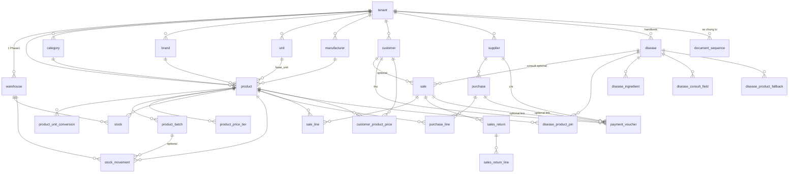

# NomoGreen — Database Design: Retail (App cửa hàng)

> Schema **phía user cửa hàng** — bán vật tư nông nghiệp (không phải Admin Portal).  
> Nguồn nghiệp vụ: `base_spec.md`, `sales.md`, `handbook.md`.  
> Mục tiêu thiết kế: **module hóa theo feature code** để sau chia gói / upsell mà không viết lại schema.

Version: 1.2  
Phase: 1 (MVP Simple Mode) · chừa Advanced  
> v1.2: khớp luồng B (bệnh trên Bán nhanh); consult Phase 1; search/pin/balance/payment.

---

# 1. Phạm vi

| Trong scope | Ngoài scope |
|---|---|
| Product, Unit, Purchase, Inventory, Sales, Customer, Supplier, Debt, Handbook, Pricing, Reports (view), Settings tenant, Users tenant (tham chiếu) | Platform Admin, Plan/Billing chi tiết (`database-design.md`), AI, CRM, POS full, đa kho runtime |

Mọi bảng retail: **`tenant_id` bắt buộc**, cascade theo tenant, soft delete nơi có Trash.

---

# 2. Nguyên tắc chia module / gói

## 2.1 Ánh xạ Feature → bảng

| feature.code | Bảng / nhóm chính | Gói gợi ý |
|---|---|---|
| `product_basic` | product, category, brand, unit, manufacturer | Core |
| `unit_conversion` | product_unit_conversion | Core |
| `inventory_single` | warehouse (1), stock, stock_movement, stock_adjustment | Core |
| `batch_expiry` | product_batch (+ cột HSD trên movement) | Dealer pilot core |
| `recall` | product_batch.is_recalled / product.is_recalled | Dealer pilot core |
| `purchase_simple` | purchase, purchase_line | Core |
| `sales_quick` | sale, sale_line | Core |
| `sales_return` | sales_return, sales_return_line | Add-on |
| `sales_order_draft` | (cùng sale + status DRAFT) | Advanced |
| `customer_basic` | customer | Core |
| `supplier_basic` | supplier | Core |
| `debt` | customer_debt_ledger, supplier_debt_ledger, payment_voucher | Dealer pilot core |
| `pricing_tier` | product_price_tier | Add-on |
| `pricing_customer` | customer_product_price | Add-on |
| `tax` | cột tax trên chứng từ | Add-on (default OFF) |
| `barcode` | product.barcode + search | Add-on |
| `handbook` | disease, disease_product_pin, disease_ingredient, sale.disease_* | Dealer pilot core |
| `handbook_consult` | disease_consult_field, disease.formula_expr, sale.consult_context | **Phase 1** (optional per field; Owner tắt = 0 câu) |
| `handbook_fallback` | disease_product_fallback | Phase 1.1 |
| `print_receipt` | (không bảng riêng — template settings) | Add-on |
| `import_export` | (job, không bảng domain) | Add-on |
| `report_basic` / `report_profit` / `report_debt` | đọc aggregate — không bảng riêng | theo gói |
| `multi_user` / `roles_manager` | user, role (doc platform-user) | theo gói |
| `multi_warehouse` | warehouse N + transfer | Advanced |
| `warehouse_transfer` | stock_transfer | Advanced |
| `purchase_workflow` | purchase status mở rộng + PO | Advanced |

**Quy tắc code:** service gắn `@RequiresFeature('debt')` — **không** `if (plan === 'pro')`.  
Bảng add-on **vẫn tạo trong schema Phase 1** (nullable / empty OK); chỉ **chặn API/UI** khi flag tắt. Tránh migration “nổ” mỗi lần bán add-on.

## 2.2 Shared vs optional columns

- **Core path** chạy được khi `batch_expiry` OFF: stock chỉ theo product + warehouse, không bắt batch_id.
- Khi `batch_expiry` ON: sale/purchase line **có thể** gắn `batch_id`; FIFO HSD enforce.
- `tax_*` cột luôn có, chỉ tính khi feature `tax` ON.

---

# 3. ERD tổng (retail)



---

# 4. Nền tảng tenant-scoped (dùng chung retail)

## 4.1 `document_sequence`

Số chứng từ duy nhất theo tenant + loại.

| Cột | Kiểu | Ghi chú |
|---|---|---|
| id | uuid PK | |
| tenant_id | FK | unique với `doc_type` |
| doc_type | string | SALE / PURCHASE / SALE_RETURN / PURCHASE_RETURN / RECEIPT / PAYMENT / ADJUSTMENT |
| prefix | string? | vd `BH`, `NH` |
| next_value | int | atomic increment trong transaction |
| updated_at | datetime | |

## 4.2 `warehouse`

Phase 1: **đúng 1** warehouse / tenant (tạo lúc onboard).

| Cột | Kiểu | Ghi chú |
|---|---|---|
| id | uuid PK | |
| tenant_id | FK | |
| code | string | DEFAULT |
| name | string | Kho chính |
| is_default | bool | true |
| deleted_at | datetime? | |

Unique: `(tenant_id, code)`. Feature `multi_warehouse` sau mới cho >1.

---

# 5. Module Product — `product_basic` + `unit_conversion` + `barcode`

## 5.1 `category`

| Cột | Kiểu | Ghi chú |
|---|---|---|
| id | uuid PK | |
| tenant_id | FK | |
| name | string | |
| domain | enum `AgriDomain`? | CROP / LIVESTOCK / AQUACULTURE / GENERAL |
| parent_id | FK self? | optional tree |
| sort_order | int | |
| deleted_at | datetime? | |

## 5.2 `brand` / `manufacturer`

| Cột | Kiểu |
|---|---|
| id, tenant_id, name, deleted_at | |

## 5.3 `unit`

| Cột | Kiểu | Ghi chú |
|---|---|---|
| id | uuid PK | |
| tenant_id | FK | |
| code | string | CHAI, THUNG, KG, BAO |
| name | string | |
| deleted_at | datetime? | |

Unique: `(tenant_id, code)`.

## 5.4 `product`

### Core (mọi loại vật tư)

| Cột | Kiểu | Ghi chú |
|---|---|---|
| id | uuid PK | |
| tenant_id | FK | |
| sku | string | unique per tenant |
| barcode | string? | unique partial; feature `barcode` |
| name | string | |
| name_search | string? | normalized bỏ dấu — search nông thôn |
| category_id | FK? | |
| brand_id | FK? | |
| manufacturer_id | FK? | |
| default_supplier_id | FK → supplier? | optional |
| base_unit_id | FK → unit | tồn kho luôn base |
| domain | enum AgriDomain? | CROP / LIVESTOCK / AQUACULTURE / GENERAL |
| **product_kind** | enum `ProductKind` | **loại vật tư — quyết định form UI + validate attrs** |
| pack_size | string? | quy cách: "500ml", "1kg", "25kg/bao" |
| net_content | decimal? | định lượng số (nếu parse được) |
| net_content_unit | string? | ml / g / kg / viên… |
| registration_no | string? | số ĐK / GCN (BVTV, phân bón, thú y — VN) |
| short_desc | string? | |
| cost_price | BigInt | moving average |
| sale_price | BigInt | giá lẻ |
| wholesale_price | BigInt? | |
| is_pinned | bool | ghim Bán nhanh |
| is_locked | bool | chặn bán |
| is_recalled | bool | feature recall |
| status | enum | ACTIVE / INACTIVE |
| deleted_at | datetime? | |
| created_at / updated_at | | |

### `ProductKind` (Phase 1)

| kind | Tên | Nhóm |
|---|---|---|
| `PESTICIDE` | Thuốc BVTV | Trồng trọt |
| `FERTILIZER` | Phân bón | Trồng trọt |
| `AGRI_MATERIAL` | Vật tư khác (màng, dây…) | Trồng trọt |
| `CROP_SEED` | Giống cây trồng | Trồng trọt |
| `VET_DRUG` | Thuốc thú y | Chăn nuôi |
| `ANIMAL_FEED` | Thức ăn chăn nuôi | Chăn nuôi |
| `LIVESTOCK_SEED` | Con giống | Chăn nuôi |
| `AQUA_DRUG` | Thuốc / chế phẩm thủy sản | Thủy sản |
| `AQUA_FEED` | Thức ăn thủy sản | Thủy sản |
| `AQUA_SEED` | Giống thủy sản | Thủy sản |
| `OTHER` | Khác | |

### Thuộc tính chuyên ngành — `product_attrs` (Jsonb)

**Không** nhét hết cột PHI/NPK/protein lên root (tránh null-spam).  
Root chỉ giữ field **dùng search/match handbook** + common.

| Cột root (search / handbook) | Dùng cho |
|---|---|
| `active_ingredient` string? | BVTV, thú y, thuốc TS — khớp Sổ tay |
| `concentration` string? | "75% WP", "20%" |
| `apply_targets` string[] / Json | đối tượng: lúa, lợn, tôm… |
| `pest_tags` string[] / Json | bệnh/sâu — match handbook |
| `attrs` **Jsonb** | schema theo `product_kind` (bảng dưới) |

Unique: `(tenant_id, sku)`. Index: name, barcode, active_ingredient, product_kind, GIN(attrs) nếu cần.

### Schema `attrs` theo kind (Phase 1 — quầy, không phải hồ sơ pháp lý full)

#### A. `PESTICIDE` (thuốc BVTV)

| key | Kiểu | Ý |
|---|---|---|
| formulation | string? | EC, WP, SC, GR, SL… |
| toxicity_class | string? | nhóm độc (I–IV / nhãn màu) — optional |
| phi_days | int? | thời gian cách ly thu hoạch |
| rei_hours | int? | thời gian cách ly vào ruộng |
| dosage_note | string? | liều gợi ý (text; chi tiết ở Sổ tay) |
| crops | string[]? | cây trồng chính (trùng/bổ sung apply_targets) |

> PHI/REI **chỉ meaningful cho BVTV** — không dùng cho phân bón/thức ăn.

#### B. `FERTILIZER` (phân bón)

| key | Kiểu | Ý |
|---|---|---|
| fertilizer_type | string? | NPK / Đạm / Lân / Kali / Hữu cơ / Vi sinh / Trung–vi lượng |
| n_percent | decimal? | %N |
| p_percent | decimal? | %P₂O₅ |
| k_percent | decimal? | %K₂O |
| secondary_nutrients | string? | Ca, Mg, S… text hoặc Json |
| micronutrients | string? | Fe, Zn, B… |
| organic_matter_percent | decimal? | hữu cơ |
| form | string? | hạt, bột, nước, viên |
| application_method | string? | bón gốc / phun / tưới |

> **Không** ép active_ingredient; NPK nằm trong attrs. Search có thể index `n_percent` hoặc text "NPK 16-16-8" trong name.

#### C. `VET_DRUG` (thuốc thú y)

| key | Kiểu | Ý |
|---|---|---|
| dosage_form | string? | tiêm / uống / trộn thức ăn / bôi |
| active_ingredient | (root) | hoạt chất |
| concentration | (root) | |
| target_species | string[]? | lợn, gà, bò… |
| withdrawal_days | int? | **thời gian ngưng thuốc** trước giết mổ / lấy sữa (≠ PHI cây) |
| dosage_note | string? | liều / kg thể trọng |
| indications | string? | chỉ định ngắn |

#### D. `ANIMAL_FEED` (thức ăn chăn nuôi)

| key | Kiểu | Ý |
|---|---|---|
| feed_type | string? | hỗn hợp hoàn chỉnh / đậm đặc / premix / thô |
| target_species | string[]? | lợn, gà… |
| growth_stage | string? | cai sữa, vỗ béo, đẻ trứng… |
| form | string? | viên (pellet), bột, mảnh |
| crude_protein_percent | decimal? | đạm thô % |
| me_energy | string? | năng lượng (kcal/kg) text hoặc số |
| moisture_percent | decimal? | ẩm |
| fiber_percent | decimal? | xơ |
| composition_note | string? | ghi chú thành phần |

> **Không** PHI/REI. Handbook ít match hoạt chất — ghim theo bệnh/loài nếu cần.

#### E. `AQUA_DRUG` / `AQUA_FEED` / seeds

| kind | attrs chính |
|---|---|
| `AQUA_DRUG` | active_ingredient (root), target_species (tôm/cá), dosage_note, water_params_note |
| `AQUA_FEED` | giống animal_feed + salinity_range? |
| `CROP_SEED` | variety, purity_percent?, germination_percent?, crop_name |
| `LIVESTOCK_SEED` / `AQUA_SEED` | species, breed, age_or_size_note |
| `AGRI_MATERIAL` / `OTHER` | attrs tự do / để trống |

### UI form rule

```
chọn product_kind
  → hiện block attrs tương ứng
  → ẩn PHI/REI nếu không phải PESTICIDE
  → ẩn NPK nếu không phải FERTILIZER
  → ẩn protein/ME nếu không phải *FEED
  → ẩn withdrawal_days nếu không phải VET_DRUG
```

Mọi field attrs **optional** Phase 1 — cửa hàng nhỏ chỉ cần Name + giá + đơn vị vẫn bán được.

## 5.5 `product_unit_conversion` — `unit_conversion`

| Cột | Kiểu | Ghi chú |
|---|---|---|
| id | uuid PK | |
| tenant_id | FK | |
| product_id | FK | |
| unit_id | FK | Thùng, Bao… |
| factor_to_base | decimal | 1 Thùng = 12 → factor 12 |
| kind | enum | PURCHASE / SALE / BOTH |

Unique: `(product_id, unit_id, kind)`.

## 5.6 `product_price_tier` — `pricing_tier`

| Cột | Kiểu | Ghi chú |
|---|---|---|
| id | uuid PK | |
| tenant_id | FK | |
| product_id | FK | |
| min_qty | decimal | theo base unit hoặc sale unit (chốt: **base**) |
| max_qty | decimal? | null = ∞ |
| price | BigInt | |

## 5.7 `customer_product_price` — `pricing_customer`

| Cột | Kiểu |
|---|---|
| id, tenant_id, customer_id, product_id, price BigInt | |

Unique: `(customer_id, product_id)`.

---

# 6. Module Inventory — `inventory_single` + `batch_expiry` + `recall`

## 6.1 `product_batch` — `batch_expiry`

| Cột | Kiểu | Ghi chú |
|---|---|---|
| id | uuid PK | |
| tenant_id | FK | |
| product_id | FK | |
| warehouse_id | FK | Phase 1 = default WH |
| batch_code | string | số lô |
| manufactured_at | date? | |
| expires_at | date? | |
| is_recalled | bool | feature `recall` |
| qty_on_hand | decimal | base unit (denormalized) |
| created_at | | |

Unique: `(tenant_id, product_id, warehouse_id, batch_code)`.  
Index: `(expires_at)`, `(is_recalled)`.

## 6.2 `stock`

Tồn tổng (và/hoặc aggregate). Phase 1:

| Cột | Kiểu | Ghi chú |
|---|---|---|
| id | uuid PK | |
| tenant_id | FK | |
| warehouse_id | FK | |
| product_id | FK | |
| qty | decimal | base unit ≥ 0 |
| avg_cost | BigInt | moving average |

Unique: `(warehouse_id, product_id)`.

**Invariant kho (bắt buộc implement):**

```
stock.qty = SUM(product_batch.qty_on_hand)  khi batch_expiry ON
          = stock.qty only                    khi batch OFF
Mọi IN/OUT chỉ qua stock_movement trong 1 transaction.
```

## 6.3 `stock_movement`

Sổ kho bất biến (append-only).

| Cột | Kiểu | Ghi chú |
|---|---|---|
| id | uuid PK | |
| tenant_id | FK | |
| warehouse_id | FK | |
| product_id | FK | |
| batch_id | FK? | null nếu batch OFF |
| direction | enum | IN / OUT |
| qty | decimal | base, luôn > 0 |
| unit_cost | BigInt? | lúc nhập |
| reason | enum `StockReason` | PURCHASE / SALE / SALE_RETURN / PURCHASE_RETURN / ADJUSTMENT / TRANSFER… |
| ref_type | string | purchase / sale / … |
| ref_id | uuid | |
| ref_line_id | uuid? | |
| occurred_at | datetime | |
| created_by | uuid? | user id |
| note | string? | |

Index: `(tenant_id, product_id, occurred_at)`, `(ref_type, ref_id)`.

## 6.4 `stock_adjustment`

| Cột | Kiểu | Ghi chú |
|---|---|---|
| id | uuid PK | |
| tenant_id | FK | |
| doc_no | string | sequence |
| warehouse_id | FK | |
| status | COMPLETED | Phase 1 1 bước |
| note | string? | |
| lines | Json hoặc bảng con | product_id, batch_id?, qty_before, qty_after, delta |
| created_by, created_at | | |

Khuyến nghị bảng `stock_adjustment_line` nếu cần report.

**Advanced (chưa Phase 1):** `stock_transfer`, `stock_transfer_line`.

---

# 7. Module Purchase — `purchase_simple`

## 7.1 `purchase`

| Cột | Kiểu | Ghi chú |
|---|---|---|
| id | uuid PK | |
| tenant_id | FK | |
| doc_no | string | unique per tenant |
| supplier_id | FK | |
| warehouse_id | FK | default |
| status | enum | DRAFT / COMPLETED / CANCELLED |
| purchased_at | datetime | |
| subtotal | BigInt | |
| discount_amount | BigInt | default 0 |
| tax_amount | BigInt | 0 nếu tax OFF |
| shipping_fee | BigInt | default 0 |
| total | BigInt | |
| amount_paid | BigInt | |
| debt_amount | BigInt | total - paid → công nợ NCC nếu debt ON |
| note | string? | |
| created_by | uuid? | |
| completed_at | datetime? | |
| deleted_at | datetime? | |
| created_at / updated_at | | |

Unique: `(tenant_id, doc_no)`.  
COMPLETED → stock IN + (optional) supplier debt; **không sửa/xóa**.

## 7.2 `purchase_line`

| Cột | Kiểu | Ghi chú |
|---|---|---|
| id | uuid PK | |
| tenant_id | FK | |
| purchase_id | FK | Cascade |
| product_id | FK | |
| unit_id | FK | đơn vị nhập |
| qty | decimal | theo unit_id |
| qty_base | decimal | sau quy đổi |
| unit_price | BigInt | theo unit nhập |
| line_discount | BigInt | |
| line_total | BigInt | |
| batch_code | string? | tạo/gắn batch khi complete |
| expires_at | date? | |
| batch_id | FK? | sau complete |

## 7.3 `purchase_return` + lines

Tương tự purchase, direction stock OUT, giảm công nợ NCC. Feature có thể gộp `purchase_simple` Phase 1 hoặc flag riêng sau.

**Advanced:** `purchase_order`, multi-receive — không tạo Phase 1.

---

# 8. Module Sales — `sales_quick` + `sales_return`

## 8.1 `sale`

| Cột | Kiểu | Ghi chú |
|---|---|---|
| id | uuid PK | |
| tenant_id | FK | |
| doc_no | string | |
| channel | enum | QUICK_SALE / ORDER | Phase 1 chủ yếu QUICK_SALE |
| status | enum | DRAFT / COMPLETED / CANCELLED | Quick: thẳng COMPLETED |
| customer_id | FK? | null = vãng lai |
| customer_name_snapshot | string? | |
| customer_phone_snapshot | string? | |
| warehouse_id | FK | |
| subtotal / discount_amount / tax_amount / total | BigInt | |
| amount_paid | BigInt | |
| change_amount | BigInt | thối lại |
| debt_amount | BigInt | ghi nợ |
| payment_method | enum? | CASH / BANK_TRANSFER / QR / MIXED |
| sold_at | datetime | |
| /** Handbook context — snapshot */ | | |
| disease_id | FK? | 1 bệnh tư vấn / đơn (Phase 1) |
| disease_name_snapshot | string? | |
| consult_context | Json? | `{ field_key: value }` — luồng B |
| suggested_qty_meta | Json? | optional: công thức + input → SL gợi ý (audit) |
| idempotency_key | string? | chống double-submit mạng yếu; unique partial (tenant_id, key) |
| created_by | uuid? | |
| completed_at | datetime? | |
| deleted_at | datetime? | |
| created_at / updated_at | | |

Unique: `(tenant_id, doc_no)`.  
COMPLETED: stock OUT FIFO batch (nếu ON), debt AR, audit. **Không sửa context / lines sau complete.**

## 8.2 `sale_line`

| Cột | Kiểu | Ghi chú |
|---|---|---|
| id | uuid PK | |
| tenant_id | FK | |
| sale_id | FK | Cascade |
| product_id | FK | |
| product_name_snapshot | string | |
| unit_id | FK | đơn vị bán |
| qty | decimal | |
| qty_base | decimal | |
| unit_price | BigInt | đã áp custom/tier/retail |
| price_source | enum? | CUSTOM / TIER / RETAIL / MANUAL |
| line_discount | BigInt | |
| line_total | BigInt | |
| unit_cost | BigInt | avg lúc bán — report profit |
| batch_id | FK? | batch xuất chính (hoặc bảng phân bổ) |

### 8.2.1 `sale_line_batch` (khi 1 dòng trừ nhiều lô)

| Cột | Kiểu |
|---|---|
| id, sale_line_id, batch_id, qty_base | |

## 8.3 `sales_return` + `sales_return_line` — `sales_return`

| Header | Ghi chú |
|---|---|
| doc_no, original_sale_id?, customer_id?, status, total, debt_adjust | stock IN |

---

# 9. Module Customer / Supplier

## 9.1 `customer` — `customer_basic`

| Cột | Kiểu | Ghi chú |
|---|---|---|
| id | uuid PK | |
| tenant_id | FK | |
| code | string? | optional auto |
| name | string | |
| phone | string? | định danh ghi nợ; index |
| address | string? | |
| type | enum? | RETAIL / FARMER / FARM / AGENT |
| /** Hồ sơ SX — optional Json */ | | |
| production_profile | Json? | cây/diện tích, đàn, ao… |
| debt_limit | BigInt? | hạn mức công nợ tùy chọn |
| payment_due_date | date? | hạn thu mặc định của hộ dân; dùng tạo lịch nhắc |
| opening_balance | BigInt | default 0 — khi bật debt |
| balance | BigInt | **cache dư nợ hiện tại** — cập nhật trong cùng TX với debt_ledger |
| name_search | string? | bỏ dấu |
| note | string? | |
| deleted_at | datetime? | |
| created_at / updated_at | | |

Index: `(tenant_id, phone)`, name_search.  
`balance` = source of truth vận hành quầy; `debt_ledger` = lịch sử; định kỳ reconcile.

## 9.2 `supplier` — `supplier_basic`

| Cột | Kiểu | Ghi chú |
|---|---|---|
| id | uuid PK | |
| tenant_id | FK | |
| code | string | |
| name | string | |
| supplier_type | string? | |
| contact_name / contact_title | string? | |
| phone / email / address | string? | |
| tax_code | string? | |
| discount_percent | decimal? | |
| debt_limit | BigInt? | |
| payment_terms | string? | |
| opening_balance | BigInt | |
| balance | BigInt | cache dư nợ NCC — cùng rule customer.balance |
| status | ACTIVE / INACTIVE | |
| deleted_at | datetime? | |

Unique: `(tenant_id, code)`.

---

# 10. Module Debt — `debt` + `report_debt`

## 10.1 `ar_ledger` / `ap_ledger` (hoặc 1 bảng `debt_ledger`)

**Khuyến nghị 1 bảng:**

### `debt_ledger`

| Cột | Kiểu | Ghi chú |
|---|---|---|
| id | uuid PK | |
| tenant_id | FK | |
| party_type | enum | CUSTOMER / SUPPLIER |
| party_id | uuid | customer_id hoặc supplier_id |
| entry_type | enum | OPENING / SALE / PURCHASE / RECEIPT / PAYMENT / ADJUST |
| direction | enum | INCREASE / DECREASE | tăng/giảm dư nợ party |
| amount | BigInt | |
| balance_after | BigInt? | optional running |
| ref_type / ref_id | | sale, purchase, payment_voucher |
| occurred_at | datetime | |
| note | string? | |
| created_by | uuid? | |

Index: `(tenant_id, party_type, party_id, occurred_at)`.

**Outstanding** = SUM signed theo convention (hoặc cột cache `customer.balance` cập nhật transaction).

## 10.2 `payment_voucher` — phiếu thu/chi

| Cột | Kiểu | Ghi chú |
|---|---|---|
| id | uuid PK | |
| tenant_id | FK | |
| doc_no | string | |
| voucher_type | enum | RECEIPT (thu KH) / PAYMENT (chi NCC) |
| party_type / party_id | | |
| amount | BigInt | tổng phiếu |
| method | CASH / BANK_TRANSFER / QR / MIXED | |
| ref_sale_id / ref_purchase_id | optional | gán chứng từ |
| occurred_at | datetime | |
| note | string? | |
| created_by | uuid? | |
| status | COMPLETED | |

### 10.3 `payment_voucher_line` (khi MIXED / nhiều lần gán)

| Cột | Kiểu | Ghi chú |
|---|---|---|
| id | uuid PK | |
| voucher_id | FK | Cascade |
| method | CASH / BANK_TRANSFER / QR | |
| amount | BigInt | |
| ref_sale_id? / ref_purchase_id? | optional | phân bổ |

Phase 1: 1 dòng đủ nếu method ≠ MIXED. COMPLETED → debt_ledger + cập nhật `customer.balance` / `sale.amount_paid` trong cùng TX.

---

# 11. Module Handbook — `handbook` (+ consult / fallback)

## 11.1 `disease`

| Cột | Kiểu | Ghi chú |
|---|---|---|
| id | uuid PK | |
| tenant_id | FK | |
| name | string | |
| name_search | string? | bỏ dấu |
| aliases | string[] / Json | "dao on", "cháy lá"… |
| aliases_search | string? | aliases đã normalize (hoặc GIN) |
| domain | AgriDomain | |
| target | string? | Lúa, Lợn… |
| type | enum? | DISEASE / PEST / WEED / … |
| symptom | string? | |
| note | string? | kinh nghiệm chủ |
| formula_expr | string? | gợi ý SL Phase 1 (số học đơn giản) |
| is_pinned | bool | **Bệnh hay gặp** trên Bán nhanh |
| sort_order | int | |
| is_active | bool | |
| deleted_at | datetime? | |

Index: `(tenant_id, is_pinned)`, name_search, (optional) `pg_trgm` trên name/aliases.

## 11.2 `disease_ingredient`

| Cột | Kiểu |
|---|---|
| id, tenant_id, disease_id, active_ingredient string, sort_order | |

## 11.3 `disease_product_pin` — ghim thuốc

| Cột | Kiểu | Ghi chú |
|---|---|---|
| id | uuid PK | |
| tenant_id | FK | |
| disease_id | FK | |
| product_id | FK | |
| sort_order | int | |
| is_excluded | bool | ẩn khỏi auto match |

Unique: `(disease_id, product_id)`.

## 11.4 `disease_consult_field` — `handbook_consult`

| Cột | Kiểu | Ghi chú |
|---|---|---|
| id | uuid PK | |
| tenant_id | FK | |
| disease_id | FK | null = preset domain-level |
| field_key | string | area_sao, animal_count… |
| label | string | |
| field_type | enum | NUMBER / TEXT / SELECT / MULTI / DATE |
| unit | string? | |
| options | Json? | |
| required | bool | |
| sort_order | int | |
| is_enabled | bool | |

## 11.5 `disease_product_fallback` — `handbook_fallback`

| Cột | Kiểu | Ghi chú |
|---|---|---|
| id | uuid PK | |
| tenant_id | FK | |
| disease_id | FK | |
| primary_product_id | FK | thuốc chính |
| fallback_product_id | FK | |
| sort_order | int | |

---

# 12. Settings cửa hàng

## 12.1 `tenant_settings`

| Cột | Kiểu | Ghi chú |
|---|---|---|
| tenant_id | PK/FK | 1-1 |
| company_name / address / phone / email / logo_file_id | | |
| currency | string | VND |
| timezone | string | Asia/Ho_Chi_Minh |
| language | string | vi |
| /** mirrors feature defaults — source of truth vẫn plan+flag */ | | |
| default_payment_method | enum? | |
| receipt_footer | string? | print_receipt |
| low_stock_threshold_default | decimal? | |

Feature flags **không** nhét hết vào đây — dùng `tenant_feature_flag` (platform). Settings chỉ UX/company.

---

# 13. Enums retail (tóm tắt)

| Enum | Values |
|---|---|
| AgriDomain | CROP, LIVESTOCK, AQUACULTURE, GENERAL |
| ProductKind | PESTICIDE, FERTILIZER, AGRI_MATERIAL, CROP_SEED, VET_DRUG, ANIMAL_FEED, LIVESTOCK_SEED, AQUA_DRUG, AQUA_FEED, AQUA_SEED, OTHER |
| ProductStatus | ACTIVE, INACTIVE |
| PurchaseStatus / SaleStatus | DRAFT, COMPLETED, CANCELLED |
| SaleChannel | QUICK_SALE, ORDER |
| StockReason | PURCHASE, SALE, SALE_RETURN, PURCHASE_RETURN, ADJUSTMENT, TRANSFER_IN, TRANSFER_OUT |
| StockDirection | IN, OUT |
| PaymentMethod | CASH, BANK_TRANSFER, QR, MIXED |
| DebtPartyType | CUSTOMER, SUPPLIER |
| VoucherType | RECEIPT, PAYMENT |
| PriceSource | CUSTOM, TIER, RETAIL, MANUAL |
| ConversionKind | PURCHASE, SALE, BOTH |

Tiền: **BigInt VND**. SL: `Decimal` (base unit).

---

# 14. Giao dịch bắt buộc (transaction boundary)

| Sự kiện | Trong 1 `$transaction` |
|---|---|
| Complete Purchase | purchase status + lines batch + stock + stock_movement + avg_cost + AP debt_ledger + sequence |
| Complete Sale (Quick) | sale + lines + batch FIFO alloc + stock OUT + movements + cost snapshot + AR debt nếu có + sequence |
| Sales Return | return docs + stock IN + reverse/adjust debt |
| Payment voucher | voucher + debt_ledger + optional update sale.amount_paid |
| Stock adjustment | adjustment + stock + movement |
| Disable feature | **không** xóa row; chỉ chặn write API |

Chống tồn âm: `UPDATE stock SET qty = qty - $q WHERE qty >= $q` (hoặc SELECT FOR UPDATE).

---

# 15. Index & performance quầy

| Use case | Index |
|---|---|
| Tìm SP bán | `(tenant_id, name)`, barcode, active_ingredient |
| Ghim / top | `(tenant_id, is_pinned)`, materialize top_sellers sau |
| KH theo SĐT | `(tenant_id, phone)` |
| HSD | `product_batch(expires_at) WHERE qty_on_hand > 0` |
| Sổ tay | disease aliases GIN/trgm (Postgres `pg_trgm`) |
| Báo cáo ngày | `(tenant_id, sold_at)` trên sale |

Search bỏ dấu: app normalize + cột `name_search` optional (unaccent).

---

# 16. Soft delete & chứng từ

| Entity | Soft delete | Sau COMPLETED |
|---|---|---|
| product, customer, supplier, disease | `deleted_at` | — |
| sale, purchase, vouchers | không xóa; CANCELLED nếu chưa impact | **immutable** |
| stock_movement | append-only | không xóa |

---

# 17. Seed / empty tenant

Khi Saler tạo tenant:

1. 1 `warehouse` default  
2. Units phổ biến (Chai, Thùng, Kg, Bao, Gói, Lít)  
3. (Optional) category 3 domain + disease seed theo vùng  
4. `document_sequence` cho mọi doc_type  
5. `tenant_settings`  
6. Owner user (doc platform-user)

---

# 18. Ma trận gói ↔ module (nhắc lại cho implement)

| Module DB | Starter | Pro | Ent |
|---|---|---|---|
| product + unit + conversion + stock + purchase + sale quick + customer + supplier | ✓ | ✓ | ✓ |
| batch_expiry + debt | ✓ | ✓ | ✓ |
| handbook pins | ✓ trong dealer pilot | ✓ | ✓ |
| pricing_tier, report_profit | — | ✓ | ✓ |
| handbook_consult | ✓ trong dealer pilot | ✓ | ✓ |
| handbook_fallback | — | add-on | ✓ |
| multi_warehouse, transfer, PO workflow | — | — | ✓ |

---

# 19. Thứ tự implement schema (gợi ý)

1. warehouse, unit, category, brand, manufacturer, product, conversion  
2. stock, stock_movement, document_sequence  
3. supplier, purchase, purchase_line  
4. customer, sale, sale_line (+ sale_line_batch)  
5. product_batch (nếu ship cùng batch)  
6. debt_ledger, payment_voucher  
7. sales_return  
8. disease + pin (+ consult/fallback cột/bảng, flag OFF)  
9. price_tier, customer_product_price  
10. stock_adjustment  

---

# 20. Quyết định chốt

| Quyết định | Lý do |
|---|---|
| Mọi retail table có `tenant_id` | Multi-tenant an toàn |
| Feature = capability, bảng tạo sẵn | Chia gói sau không migrate lớn |
| Stock + movement append-only | Audit, chống âm, report |
| Sale snapshot (tên SP, giá, cost, consult) | Đổi master không làm hỏng lịch sử |
| 1 warehouse row Phase 1 | Simple; Ent thêm row + feature |
| BigInt tiền / Decimal SL | Đúng ngành |
| Debt ledger thống nhất | AR/AP một pattern |
| Handbook tách bảng | Upsell `handbook*` độc lập sales |
| `product_kind` + Json `attrs` | BVTV/phân bón/TACN/thú y khác schema |
| withdrawal_days ≠ phi_days | Thú y vs BVTV |
| `name_search` + disease.aliases | Quầy gõ telex/không dấu (luồng B) |
| `disease.is_pinned` | Bệnh hay gặp 1 chạm |
| `customer.balance` cache | Hiện dư nợ quầy không SUM ledger mỗi lần |
| `sale.idempotency_key` | Mạng yếu / double tap |
| `payment_voucher_line` | MIXED / nhiều lần gán |

---

# 21. Liên kết

| Doc | Nội dung |
|---|---|
| `base_spec.md` | Nghiệp vụ + feature catalog §3.4 |
| `sales.md` | Bán nhanh UX |
| `handbook.md` | Sổ tay |
| `database-design.md` | SaaS core (tenant, plan, flag) |
| `database-design-platform-user.md` | Admin + user/seat (không nhầm doc này) |
| `architecture.md` | Transaction, BigInt, guards |

**Prisma:** retail models **chưa** có trong `schema.prisma` — doc này là blueprint migrate đợt retail.
