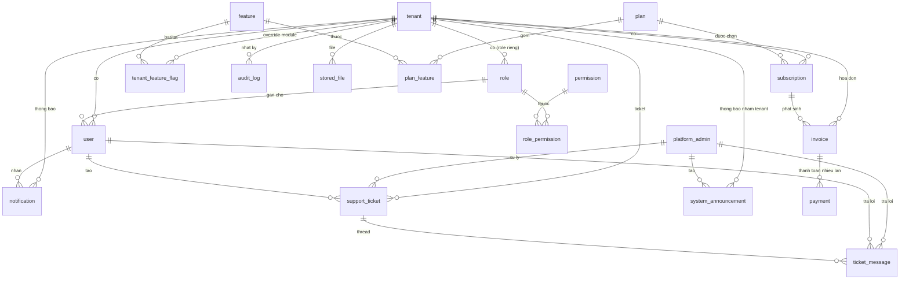

# NomoGreen — Thiết kế Database (Core SaaS / Admin)

> Phase 1 (MVP). Bám theo `docs/base_spec.md` (mục 3 + 19) và `docs/architecture.md`.
> Nguồn sự thật của schema: `backend/prisma/schema.prisma`.

Version: 1.0

---

# 1. Phạm vi

Tài liệu này mô tả phần **nền tảng SaaS / quản trị admin** — chưa gồm các module retail
(product, purchase, inventory, sales, customer, supplier, debt, report). Các bảng nghiệp vụ
retail sẽ bổ sung ở đợt thiết kế sau, tham chiếu `tenant_id` như các bảng tenant-scoped ở đây.

Gồm **19 bảng** chia 2 nhóm:

- **Platform** (không lọc theo tenant): tenant, plan, feature, plan_feature, subscription, invoice, payment, platform_admin, system_announcement, support_ticket, ticket_message.
- **Tenant-scoped** (có cột `tenant_id`): user, role, permission, role_permission, tenant_feature_flag, audit_log, notification, stored_file.

---

# 2. Nguyên tắc thiết kế

Bám `docs/architecture.md`:

- **Multi-tenant shared DB, shared schema**: mọi bảng nghiệp vụ có `tenant_id`. Không tenant nào đọc dữ liệu tenant khác.
- **ORM**: Prisma 7 + PostgreSQL 16. Connection URL ở `backend/prisma.config.ts` (Prisma 7 bỏ `url` khỏi schema); runtime `PrismaClient` dùng driver adapter `@prisma/adapter-pg`.
- **Khóa chính**: `String @id @default(uuid())` — không đoán được, an toàn cho multi-tenant.
- **Tiền tệ**: kiểu `BigInt`, lưu VND đơn vị nhỏ nhất (không phần lẻ, không float).
- **Soft delete**: cột `deleted_at` (nullable) trên các bảng có Trash/Restore: `tenant`, `user`, `stored_file`.
- **Enum**: dùng native Postgres enum.
- **Mốc thời gian**: `created_at` (`@default(now())`) + `updated_at` (`@updatedAt`) trên các bảng có vòng đời.
- **Đặt tên bảng**: `snake_case` số ít qua `@@map` (vd model `PlatformAdmin` → bảng `platform_admin`).

---

# 3. Sơ đồ quan hệ (ERD)

---

# 4. Nhóm Platform

## 4.1 `tenant` — Khách hàng SaaS (3.1, 3.2)

Mỗi khách hàng đăng ký tạo ra một tenant với workspace riêng.

| Cột | Kiểu | Ghi chú |
|---|---|---|
| id | uuid PK | |
| slug | string, unique | định danh workspace (`app.argonext.vn/<slug>`) |
| name | string | tên hiển thị |
| tenant_type | enum `TenantType` | HOUSEHOLD / RETAIL_DEALER / COOPERATIVE / DISTRIBUTOR / FARM |
| mode | enum `TenantMode` | SIMPLE (Phase 1) / ADVANCED |
| status | enum `TenantStatus` | ACTIVE / SUSPENDED / LOCKED |
| logo_url | string? | logo riêng |
| created_at / updated_at | datetime | |
| deleted_at | datetime? | soft delete |

Index: `status`, `deleted_at`.

## 4.2 `plan` — Gói dịch vụ (3.4)

| Cột | Kiểu | Ghi chú |
|---|---|---|
| id | uuid PK | |
| code | string, unique | starter / professional / enterprise |
| name | string | |
| description | string? | |
| price | BigInt | VND theo chu kỳ |
| billing_cycle | enum `BillingCycle` | MONTHLY / QUARTERLY / YEARLY |
| max_users | int | giới hạn user |
| max_warehouses | int (mặc định 1) | Phase 1: 1 kho |
| max_storage_bytes | BigInt | giới hạn storage (đối chiếu `stored_file.size_bytes`) |
| is_active | bool | |

## 4.3 `feature` — Catalog module (3.9, 15)

Danh mục các module bật/tắt được: `inventory`, `debt`, `batch`, `tax`, `barcode`, `quantity_tier_pricing`, `advanced_mode`.

| Cột | Kiểu | Ghi chú |
|---|---|---|
| id | uuid PK | |
| code | string, unique | mã feature |
| name | string | |
| description | string? | |

## 4.4 `plan_feature` — Gói ↔ Feature

Bảng nối: một gói gồm những feature nào.

| Cột | Kiểu | Ghi chú |
|---|---|---|
| id | uuid PK | |
| plan_id | FK → plan | Cascade |
| feature_id | FK → feature | Cascade |

Unique: `(plan_id, feature_id)`.

## 4.5 `subscription` — Tenant ↔ Plan (3.4, 3.5)

Trial được mô hình hóa bằng `status = TRIALING` + `trial_ends_at` (không tạo bảng Trial riêng).

| Cột | Kiểu | Ghi chú |
|---|---|---|
| id | uuid PK | |
| tenant_id | FK → tenant | Cascade |
| plan_id | FK → plan | |
| status | enum `SubscriptionStatus` | TRIALING / ACTIVE / PAST_DUE / CANCELLED / EXPIRED |
| billing_cycle | enum `BillingCycle` | |
| start_date | datetime | |
| end_date | datetime? | mốc hết hạn chu kỳ hiện tại |
| trial_ends_at | datetime? | 7/15/30 ngày (3.5) |
| cancelled_at | datetime? | |

Index: `tenant_id`, `plan_id`, `status`.

## 4.6 `invoice` — Lịch sử billing (3.6)

Không phải kế toán, chỉ theo dõi hóa đơn gói dịch vụ.

| Cột | Kiểu | Ghi chú |
|---|---|---|
| id | uuid PK | |
| tenant_id | FK → tenant | Cascade |
| subscription_id | FK → subscription? | SetNull mặc định |
| invoice_number | string, unique | số chứng từ duy nhất |
| amount | BigInt | VND |
| status | enum `InvoiceStatus` | DRAFT / ISSUED / PAID / OVERDUE / VOID |
| period_start / period_end | datetime? | kỳ tính |
| issued_at / due_at / paid_at | datetime? | |

Index: `tenant_id`, `status`.

## 4.7 `payment` — Thanh toán hóa đơn (12)

Hỗ trợ thanh toán nhiều lần cho một hóa đơn.

| Cột | Kiểu | Ghi chú |
|---|---|---|
| id | uuid PK | |
| invoice_id | FK → invoice | Cascade |
| amount | BigInt | VND |
| method | enum `PaymentMethod` | CASH / BANK_TRANSFER / QR |
| status | enum `PaymentStatus` | PENDING / SUCCEEDED / FAILED / REFUNDED |
| reference | string? | mã giao dịch / nội dung chuyển khoản |
| paid_at | datetime? | |

Index: `invoice_id`, `status`.

## 4.8 `platform_admin` — Nhân sự vận hành SaaS (19)

Tách hoàn toàn khỏi `user` (người dùng tenant) để ranh giới bảo mật rõ ràng.

| Cột | Kiểu | Ghi chú |
|---|---|---|
| id | uuid PK | |
| email | string, unique | |
| password_hash | string | |
| full_name | string | |
| role | enum `PlatformAdminRole` | SUPER_ADMIN / SUPPORT / BILLING |
| status | enum `PlatformAdminStatus` | ACTIVE / DISABLED |
| last_login_at | datetime? | |

## 4.9 `system_announcement` — Thông báo hệ thống (19)

| Cột | Kiểu | Ghi chú |
|---|---|---|
| id | uuid PK | |
| title / body | string | |
| severity | enum `AnnouncementSeverity` | INFO / WARNING / CRITICAL |
| audience | enum `AnnouncementAudience` | ALL_TENANTS / SPECIFIC_TENANT |
| target_tenant_id | FK → tenant? | SetNull; dùng khi audience = SPECIFIC_TENANT |
| created_by_id | FK → platform_admin | |
| published_at / expires_at | datetime? | |

Index: `audience`, `target_tenant_id`.

## 4.10 `support_ticket` — Ticket hỗ trợ (19)

Người tạo là user của tenant; người xử lý là platform admin.

| Cột | Kiểu | Ghi chú |
|---|---|---|
| id | uuid PK | |
| tenant_id | FK → tenant | Cascade |
| subject | string | |
| status | enum `TicketStatus` | OPEN / IN_PROGRESS / RESOLVED / CLOSED |
| priority | enum `TicketPriority` | LOW / NORMAL / HIGH / URGENT |
| created_by_id | FK → user? | SetNull |
| assigned_to_id | FK → platform_admin? | SetNull |
| resolved_at | datetime? | |

Index: `tenant_id`, `status`.

## 4.11 `ticket_message` — Thread trả lời ticket

Author có thể là admin hoặc user (phân biệt qua `author_type`).

| Cột | Kiểu | Ghi chú |
|---|---|---|
| id | uuid PK | |
| ticket_id | FK → support_ticket | Cascade |
| author_type | enum `AuthorType` | PLATFORM_ADMIN / USER |
| author_admin_id | FK → platform_admin? | SetNull |
| author_user_id | FK → user? | SetNull |
| body | string | |

Index: `ticket_id`.

---

# 5. Nhóm Tenant-scoped

## 5.1 `user` — Người dùng tenant (3.7, 3.8)

| Cột | Kiểu | Ghi chú |
|---|---|---|
| id | uuid PK | |
| tenant_id | FK → tenant | Cascade |
| email | string | |
| phone | string? | |
| password_hash | string | |
| full_name | string | |
| role_id | FK → role | |
| status | enum `UserStatus` | ACTIVE / INVITED / DISABLED |
| last_login_at | datetime? | |
| deleted_at | datetime? | soft delete |

Unique: `(tenant_id, email)`. Index: `tenant_id`, `phone`.

## 5.2 `role` — Vai trò (3.8)

`tenant_id` null = role hệ thống dùng chung (OWNER / STAFF). Thiết kế RBAC sớm
(`architecture.md §6.2`) để lên Advanced Mode không phải viết lại — chỉ thêm role → permission.

| Cột | Kiểu | Ghi chú |
|---|---|---|
| id | uuid PK | |
| tenant_id | FK → tenant? | null = system role; Cascade khi có tenant |
| code | string | OWNER / STAFF (Advanced: MANAGER/WAREHOUSE/SALES/CASHIER/VIEWER) |
| name | string | |
| is_system | bool | |

Unique: `(tenant_id, code)`.

> Lưu ý runtime: Postgres không dedupe NULL trong unique constraint, nên với system role
> (`tenant_id = null`) seed dùng `findFirst + create` thay vì `upsert` trên `(tenant_id, code)`.

## 5.3 `permission` — Quyền dạng `resource:action`

| Cột | Kiểu | Ghi chú |
|---|---|---|
| id | uuid PK | |
| code | string, unique | `resource:action`, vd `sales:create` |
| resource | string | sales, product, inventory, report... |
| action | string | view / create / edit / delete / approve / export |

Index: `resource`.

## 5.4 `role_permission` — Role ↔ Permission

| Cột | Kiểu | Ghi chú |
|---|---|---|
| id | uuid PK | |
| role_id | FK → role | Cascade |
| permission_id | FK → permission | Cascade |

Unique: `(role_id, permission_id)`.

## 5.5 `tenant_feature_flag` — Override module theo tenant (3.9)

Feature flag 2 tầng: `plan_feature` (gói cho phép gì) + bảng này (override thủ công per tenant).

| Cột | Kiểu | Ghi chú |
|---|---|---|
| id | uuid PK | |
| tenant_id | FK → tenant | Cascade |
| feature_id | FK → feature | Cascade |
| enabled | bool | |

Unique: `(tenant_id, feature_id)`. Index: `tenant_id`.

## 5.6 `audit_log` — Nhật ký (3.12, 18)

| Cột | Kiểu | Ghi chú |
|---|---|---|
| id | uuid PK | |
| tenant_id | FK → tenant? | SetNull; null cho hành động cấp platform |
| actor_type | enum `AuditActorType` | PLATFORM_ADMIN / USER / SYSTEM |
| actor_id | string? | id của admin/user |
| action | string | LOGIN / LOGOUT / CREATE / UPDATE / DELETE / APPROVAL |
| resource / resource_id | string? | đối tượng bị tác động |
| before / after | Json? | ảnh chụp trước/sau |
| ip_address / user_agent | string? | |

Index: `(tenant_id, created_at)`, `(actor_type, actor_id)`.

## 5.7 `notification` — Thông báo (3.11)

| Cột | Kiểu | Ghi chú |
|---|---|---|
| id | uuid PK | |
| tenant_id | FK → tenant | Cascade |
| user_id | FK → user? | null = gửi toàn tenant |
| type | enum `NotificationType` | DEBT_DUE / LOW_STOCK / NEAR_EXPIRED / SYSTEM |
| title | string | |
| body | string? | |
| read_at | datetime? | |

Index: `(tenant_id, user_id, read_at)`.

## 5.8 `stored_file` — Metadata file (3.10)

BE chỉ lưu metadata; file thật ở R2/MinIO. `size_bytes` phục vụ quota `plan.max_storage_bytes`.

| Cột | Kiểu | Ghi chú |
|---|---|---|
| id | uuid PK | |
| tenant_id | FK → tenant | Cascade |
| key | string, unique | object key trên storage |
| purpose | enum `StoredFilePurpose` | LOGO / PRODUCT_IMAGE / ATTACHMENT |
| file_name / mime_type | string | |
| size_bytes | BigInt | |
| uploaded_by | string? | user id |
| deleted_at | datetime? | soft delete |

Index: `(tenant_id, purpose)`.

---

# 6. Danh mục Enum

| Enum | Giá trị |
|---|---|
| TenantType | HOUSEHOLD, RETAIL_DEALER, COOPERATIVE, DISTRIBUTOR, FARM |
| TenantMode | SIMPLE, ADVANCED |
| TenantStatus | ACTIVE, SUSPENDED, LOCKED |
| BillingCycle | MONTHLY, QUARTERLY, YEARLY |
| SubscriptionStatus | TRIALING, ACTIVE, PAST_DUE, CANCELLED, EXPIRED |
| InvoiceStatus | DRAFT, ISSUED, PAID, OVERDUE, VOID |
| PaymentMethod | CASH, BANK_TRANSFER, QR |
| PaymentStatus | PENDING, SUCCEEDED, FAILED, REFUNDED |
| PlatformAdminRole | SUPER_ADMIN, SUPPORT, BILLING |
| PlatformAdminStatus | ACTIVE, DISABLED |
| UserStatus | ACTIVE, INVITED, DISABLED |
| AnnouncementSeverity | INFO, WARNING, CRITICAL |
| AnnouncementAudience | ALL_TENANTS, SPECIFIC_TENANT |
| TicketStatus | OPEN, IN_PROGRESS, RESOLVED, CLOSED |
| TicketPriority | LOW, NORMAL, HIGH, URGENT |
| AuditActorType | PLATFORM_ADMIN, USER, SYSTEM |
| NotificationType | DEBT_DUE, LOW_STOCK, NEAR_EXPIRED, SYSTEM |
| StoredFilePurpose | LOGO, PRODUCT_IMAGE, ATTACHMENT |
| AuthorType | PLATFORM_ADMIN, USER |

---

# 7. Seed dữ liệu nền tảng

Script `backend/prisma/seed.ts` khởi tạo:

- **7 feature**: inventory, debt, batch, tax, barcode, quantity_tier_pricing, advanced_mode.
- **3 plan** + mapping feature:
  - Starter (0đ, 2 user, 1GB): inventory, debt, quantity_tier_pricing.
  - Professional (199.000đ, 5 user, 5GB): + batch, tax, barcode.
  - Enterprise (499.000đ, 20 user, 20GB): full (gồm advanced_mode).
- **60 permission**: 10 resource × 6 action (`resource:action`).
- **2 system role**:
  - OWNER — toàn quyền (đủ 60 permission).
  - STAFF — bán/nhập/xem sản phẩm-kho (view/create/edit) + xem khách/NCC/công nợ/dashboard; không sửa setting, không xóa, không xem report.

---

# 8. Quyết định thiết kế & lý do

| Quyết định | Lý do |
|---|---|
| Tách `platform_admin` khỏi `user` | Ranh giới bảo mật rõ; tránh nhầm quyền hệ thống với quyền tenant. |
| RBAC (`role`/`permission`/`role_permission`) ngay Phase 1 | `architecture.md §6.2`: thiết kế `resource:action` sớm để lên Advanced Mode không viết lại. Phase 1 chỉ seed OWNER/STAFF. |
| Trial gộp vào `subscription` | YAGNI — `status = TRIALING` + `trial_ends_at` đủ dùng, không cần bảng riêng. |
| Feature flag 2 tầng | `plan_feature` quyết định gói cho phép gì; `tenant_feature_flag` cho phép override thủ công từng tenant. |
| Tiền `BigInt` (VND) | Chính xác tuyệt đối, tránh sai số float. |
| `stored_file.size_bytes` | Cộng dồn để enforce quota `plan.max_storage_bytes`. |
| `audit_log.tenant_id` nullable | Ghi được cả hành động cấp platform (không thuộc tenant nào). |

---

# 9. Chưa thuộc phạm vi (đợt sau)

- Bảng nghiệp vụ retail: product, category, brand, unit, unit_conversion, purchase, inventory/stock, batch, sales_order, sales_return, customer, supplier, debt...
- Bảng counter sinh số chứng từ theo tenant (`architecture.md §7`).
- Row-Level Security (RLS) theo `tenant_id` — bảo vệ tầng 2 (khuyến nghị `architecture.md §5`).
- Migration đầu tiên (`prisma migrate dev --name init_core_saas`) — chạy khi có Postgres.
