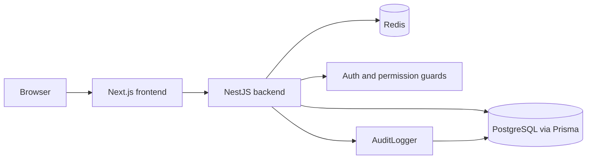
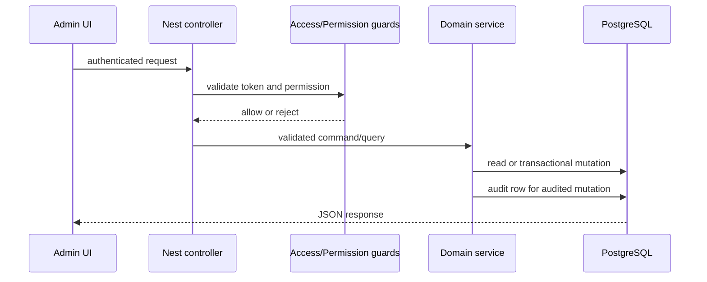

# System Architecture

## Context

NomoGreen consists of a Next.js web frontend and a NestJS backend. PostgreSQL is the durable system of record; Redis stores ephemeral refresh-token state and access-token/session controls. The Platform Admin portal is separate from tenant user workflows.

## Container view

## Backend boundaries

- `AppModule` composes platform modules.
- Auth guards authenticate the bearer token and enforce route permissions.
- Domain services own mutations and call `AuditLogger` for mutation history.
- `AuditModule` exports `AuditLogger` to consuming modules.
- Prisma models and migrations define persistence contracts.

## Admin request flow

## Data contracts

`AuditLog` is mapped to `audit_log` and contains nullable `tenantId`, actor metadata, enum `action`, optional resource identity, JSON before/after snapshots, request IP/User-Agent, and `createdAt`. Current indexes are `(tenantId, createdAt)` and `(actorType, actorId)`.

The admin read boundary is `GET /admin/audit-logs` for bounded, stable newest-first lists and `GET /admin/audit-logs/:id` for one event. Both routes require `AccessTokenGuard`, `PermissionGuard`, and `admin.audit:view`. Detail responses sanitize `before` and `after` recursively: sensitive key names (password, token, secret, hash, cookie, authorization, credential, API/private key, and related variants) become `[REDACTED]`, including values nested in arrays and objects. Missing records return not found; database failures are converted to generic server errors.

## Known current-state limitations

- Audit query and detail boundaries are available; there is no audit retention policy or audit export endpoint.
- No global audit interceptor was found; coverage is service-owned and therefore must be reviewed when new mutation modules are added.
- The admin navigation contains an audit-log link, but the matching route is not present in the current frontend tree.

## Deployment evidence gap

The repository contains local runtime/package configuration and migrations, but no verified production CI/deployment manifest was found during baseline initialization.
