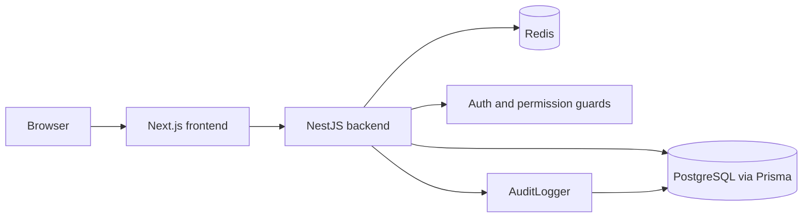
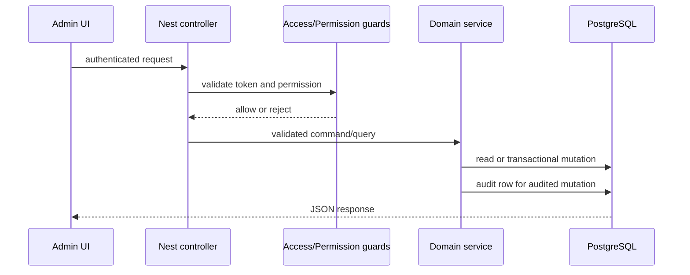

# System Architecture

## Context

NomoGreen consists of a Next.js web frontend and a NestJS backend. PostgreSQL is the durable system of record; Redis stores ephemeral refresh-token state and access-token/session controls. The Platform Admin portal is separate from tenant user workflows. Tenant authentication uses the same NestJS auth module with distinct JWT claims, cookie names, and Redis namespaces.

## Container view

## Backend boundaries

- `AppModule` composes platform modules.
- Auth guards authenticate the bearer token and enforce route permissions.
- Domain services own mutations and call `AuditLogger` for mutation history.
- `AuditModule` exports `AuditLogger` to consuming modules.
- Prisma models and migrations define persistence contracts.
- Tenant auth owns registration, identifier login, rotating `nomo_user_rt` sessions, `/auth/me`, `/auth/profile`, logout, password change, and tenant permission resolution; `/auth/profile` updates user contact fields plus `TenantSettings.address` in one audited transaction. It must not mutate admin `nomo_admin_rt` or `admin:*` session state.
- `POST /auth/register` delegates tenant/owner/role creation to the provisioning service's single Prisma transaction, then opens a user-namespaced refresh family and returns only public identity fields.
- `POST /auth/login` resolves username/email/phone across active tenants, reloads role permissions, records `lastLoginAt` with a tenant `LOGIN` audit row, and returns the same public identity/session contract. The current model assigns each user to exactly one tenant, so the client does not provide a tenant/store code. Ambiguous duplicate credentials fail generically; multi-tenant membership and tenant selection are deferred. Login and public register count failures per `(IP, identifier|slug)` via Redis (`USER_LOGIN_MAX_ATTEMPTS`, default 10) and respond `429` when exceeded; Redis throttle failures are fail-open so auth still works if the attempt store is down.
- `POST /auth/refresh?realm=user|admin` dispatches the requested cookie realm when both admin and tenant sessions coexist on one device; unqualified refresh remains valid only when exactly one realm cookie is present. User rotation uses `user:rt:*` keys and revokes the family on reuse. `POST /auth/logout` accepts a still-valid or idle-expired access token (`verifyAccess` then `decodeExpiredAccess`), blacklists the bearer in the user namespace, revokes its family, clears the user cookie, and writes USER `LOGOUT`; Redis failures fail closed with 503.
- `GET /auth/me` checks the realm-specific access blacklist and reloads the current active tenant user, tenant metadata, role, and permissions, so revoked or cross-tenant identities cannot be used as current state.
- Tenant business routes use `TenantAccessTokenGuard` plus server-side `TenantPermissionGuard`; both derive scope from the verified bearer identity and current DB role grants. `mustChangePassword` blocks business routes while leaving `/auth/me`, session maintenance, logout, and `/auth/change-password` available.
- `POST /auth/change-password` verifies the current password, updates the hash and clears `mustChangePassword` in an audited transaction, then revokes other user refresh families without returning credential material.
- The frontend user session is separate from admin state: `user-auth-store` keeps only the short-lived access token in memory, hydrates through the HttpOnly refresh cookie plus `/auth/me`, and `user-fetch` single-flights one refresh and retries a request at most once.
- Authenticated frontend profile/data requests use the shared user API/fetch boundary; network failures are translated to an actionable Vietnamese message instead of exposing the browser's raw `Failed to fetch` error.
- User auth routes are `/dang-nhap`, `/dang-ky`, and `/doi-mat-khau`; they use typed user API/store contracts and `UserAuthGuard`, with Vietnamese validation/status messages and no admin store dependency.
- Tenant product routes are `/tenant/products` plus `/lookups` and `/:id` detail/update/delete. The controller composes `TenantAccessTokenGuard`, live `TenantPermissionGuard`, and `EntitlementsGuard`; `ProductsService` validates all related catalog IDs against the JWT tenant, reserves `maxProducts` only during create, and soft-deletes products without mutating stock.
- Tenant supplier routes are `/tenant/suppliers` for tenant-scoped list/detail/create/update/soft-delete. Reads require `supplier:view`; writes require the matching supplier mutation permission plus the `inventory` entitlement. `SuppliersService` filters active records (`deletedAt IS NULL` and `status = ACTIVE`), derives read-only payable balance as a JSON number, and maps duplicate tenant codes to `409 DUPLICATE_SUPPLIER_CODE`.
- The user app supplier routes (`/nha-cung-cap`, detail, create, edit) consume `frontend/lib/tenant-suppliers-api.ts` for list/search/pagination, detail, create/update, and soft-delete. Payable is displayed only from the server `balance`; purchase history, debt mutation, and cooperation-policy editing remain outside this slice.
- The user app customer routes (`/khach-hang`, detail, create, edit) consume `frontend/lib/tenant-customers-api.ts` for tenant-scoped list/search/pagination, detail, create/update, and soft-delete. Customer balance is displayed only from the server; transaction history and debt mutation remain outside this slice.
- Tenant debt routes are `GET /tenant/debts`, `GET /tenant/debts/:partyType/:partyId`, and `POST /tenant/debts/vouchers`. Reads require `debt:view`; voucher creation requires `debt:collect`. Customer receipts use a caller-supplied idempotency key, conditionally decrement the current balance, and create the voucher plus debt-ledger entry atomically.
- The user app `/cong-no` routes consume `frontend/lib/tenant-debts-api.ts` for real debt list/detail data. Customer receipt creation refreshes the affected debt detail; supplier receipt creation is currently rejected as unsupported.
- Tenant sales order routes are canonical under `/tenant/sales/orders`: `GET /` supports tenant-scoped search/status pagination, `GET /:id` returns order detail, `POST /` creates a `DRAFT` or directly `COMPLETED` order, `POST /:id/complete` completes a draft with settlement, and `POST /:id/cancel` returns the order in `CANCELLED` state. All routes require tenant access/permission guards and the `advanced_mode` entitlement. Order creation uses a tenant-scoped idempotency key with Serializable retry; completion and cancellation also retry Serializable conflicts and re-read terminal state for safe replay. Draft cancellation changes only status. Eligible completed cancellation preserves the original sale and appends `IN/SALE_CANCEL` stock movements plus conditional `ADJUST/DECREASE` debt compensation in the same transaction; returned sales, unsafe debt balances, cross-tenant IDs, and unsupported states are rejected without a committed partial effect.

- The frontend sales boundary in `frontend/lib/tenant-sales-api.ts` consumes canonical tenant order list/detail/create/complete/cancel operations and keeps `/tenant/sales/quick` separate. `CustomerPicker` (`frontend/components/app/sales/customer-picker.tsx`) resolves tenant customers through `tenant-customers-api`, with debounced search, loading/error/retry states, and an explicit walk-in option. R5/R6 now wire list/detail/cancel and create/direct-complete flows; OrderForm keeps a stable idempotency key across retries, maps real base-unit IDs, and uses PaymentSheet settlement mapping. No new seed fallback is introduced.

## Admin request flow

## Data contracts

`AuditLog` is mapped to `audit_log` and contains nullable `tenantId`, actor metadata, enum `action`, optional resource identity, JSON before/after snapshots, request IP/User-Agent, and `createdAt`. Current indexes are `(tenantId, createdAt)` and `(actorType, actorId)`.

The admin read boundary is `GET /admin/audit-logs` for bounded, stable newest-first lists and `GET /admin/audit-logs/:id` for one event. Both routes require `AccessTokenGuard`, `PermissionGuard`, and `admin.audit:view`. Detail responses sanitize `before` and `after` recursively: sensitive key names (password, token, secret, hash, cookie, authorization, credential, API/private key, and related variants) become `[REDACTED]`, including values nested in arrays and objects. Missing records return not found; database failures are converted to generic server errors.

The admin permission catalog is exposed at `/admin/settings/permissions` and gated by `admin.permission:view`. It is read-only and presents only `admin.*` permissions; permission assignment remains role-based.

## Known current-state limitations

- Audit query and detail boundaries are available; there is no audit retention policy or audit export endpoint.
- No global audit interceptor was found; coverage is service-owned and therefore must be reviewed when new mutation modules are added.
- The admin navigation contains the permission-gated `/admin/audit-log` route, and dashboard recent activity reads a bounded newest-audit query.
- Tenant user auth (`specs/user-registration-authentication`) is implementation-complete including idle-logout and login throttle; formal status is `ready_for_review` pending optional re-run of e2e with full JWT env.
- Product conversions, price tiers, and dashboard aggregation remain separate follow-up slices; the product API exposes core catalog fields and read-only stock quantity. The advanced sales-order lifecycle is now available under `/tenant/sales/orders`; `POST /tenant/sales/quick` remains the separate inventory-only quick-sale shortcut and does not provide order list/detail or cancellation semantics.
- Inventory reads are available; stock writes currently flow through purchase complete / quick sale, not a dedicated adjust API.

- The frontend tenant sales client and customer picker are available. R5 migrates `/don-ban-hang` and `/don-ban-hang/:id` to canonical list/detail/cancel operations with debounced server queries, desktop replacement paging, mobile deduplicated incremental loading, conflict refetch, inline retry, and responsive loading/error states. Order creation/complete orchestration remains R6; no new seed fallback is part of this slice.

## Deployment evidence gap

The repository contains local runtime/package configuration and migrations, but no verified production CI/deployment manifest was found during baseline initialization.

## Stock adjustments (tenant)

- Module: `backend/src/platform/stock-adjustments/`
- Routes: `/tenant/stock-adjustments` (list/detail/create/complete)
- Complete: Serializable dual-write Stock + optional ProductBatch + StockMovement reason `ADJUSTMENT`
- Reason codes: closed map by `ProductKind` (`adjustment-reason-policy.ts`)

## Product contract (crop-input kinds)

- Six BA crop-input types map to `CROP_INPUTS`: `PESTICIDE`, `FERTILIZER`, `BIOLOGICAL_PRODUCT`, `GROWTH_REGULATOR`, `SOIL_AMENDMENT`, `AGRI_MATERIAL`.
- `category` is store-only label; specialized fields live in `attrs` / product contract validation.
