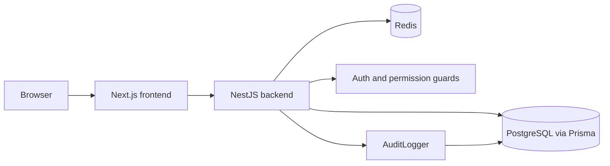
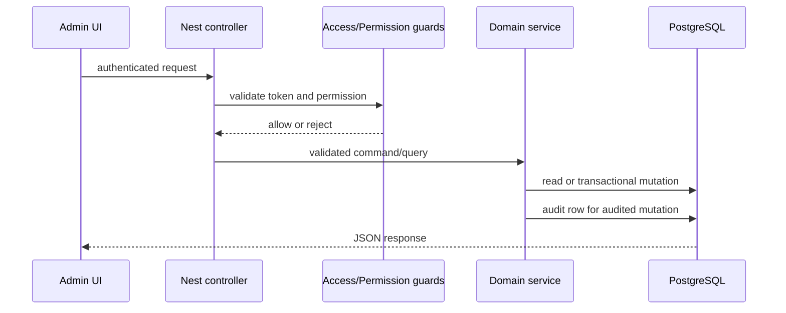

# System Architecture

## Context

NomoGreen consists of a Next.js web frontend and a NestJS backend. PostgreSQL is the durable system of record; Redis stores ephemeral refresh-token state and access-token/session controls. The Platform Admin portal is separate from tenant user workflows. Tenant authentication uses the same NestJS auth module with distinct JWT claims, cookie names, and Redis namespaces.

## Container view

```mermaid
flowchart LR
  Browser[Browser] --> Next[Next.js frontend]
  Next --> API[NestJS backend]
  API --> DB[(PostgreSQL via Prisma)]
  API --> Redis[(Redis)]
  API --> Auth[Auth and permission guards]
  API --> Audit[AuditLogger]
  Audit --> DB
```

## Backend boundaries

- `AppModule` composes platform modules.
- Auth guards authenticate the bearer token and enforce route permissions.
- Plan entitlements expose the full feature catalog to every plan; plan differences are
  enforced through numeric quotas (`maxUsers`, `maxWarehouses`, `maxProducts`,
  `maxCustomers`, `maxOrdersPerMonth`, and storage), while tenant feature flags remain an
  explicit operational override.
- Domain services own mutations and call `AuditLogger` for mutation history.
- `AuditModule` exports `AuditLogger` to consuming modules.
- Prisma models and migrations define persistence contracts.
- Tenant auth owns registration, identifier login, rotating `nomo_user_rt` sessions, `/auth/me`, `/auth/profile`, logout, password change, and tenant permission resolution; `/auth/profile` updates user contact fields plus `TenantSettings.address` in one audited transaction. It must not mutate admin `nomo_admin_rt` or `admin:*` session state.
- `POST /auth/register` delegates tenant/owner/role creation to the provisioning service's single Prisma transaction, then opens a user-namespaced refresh family and returns only public identity fields.
- `POST /auth/login` resolves username/email/phone across active tenants, reloads role permissions, records `lastLoginAt` with a tenant `LOGIN` audit row, and returns the same public identity/session contract. The current model assigns each user to exactly one tenant, so the client does not provide a tenant/store code. Ambiguous duplicate credentials fail generically; multi-tenant membership and tenant selection are deferred. Login and public register count failures per `(IP, identifier|slug)` via Redis (`USER_LOGIN_MAX_ATTEMPTS`, default 10) and respond `429` when exceeded; Redis throttle failures are fail-open so auth still works if the attempt store is down.
- `POST /auth/refresh?realm=user|admin` dispatches the requested cookie realm when both admin and tenant sessions coexist on one device; unqualified refresh remains valid only when exactly one realm cookie is present. User rotation uses `user:rt:*` keys and revokes the family on reuse. `POST /auth/logout` accepts a still-valid or idle-expired access token (`verifyAccess` then `decodeExpiredAccess`), blacklists the bearer in the user namespace, revokes its family, clears the user cookie, and writes USER `LOGOUT`; Redis failures fail closed with 503.
- `GET /auth/me` checks the realm-specific access blacklist and reloads the current active tenant user, tenant metadata, role, and permissions, so revoked or cross-tenant identities cannot be used as current state.
- Tenant business routes use `TenantAccessTokenGuard` plus server-side `TenantPermissionGuard`; both derive scope from the verified bearer identity and current DB role grants. The `mustChangePassword` flag remains available for account-management flows but does not block business routes.
- `POST /auth/change-password` verifies the current password, updates the hash and clears `mustChangePassword` in an audited transaction, then revokes other user refresh families without returning credential material.
- The frontend user session is separate from admin state: `user-auth-store` keeps only the short-lived access token in memory, hydrates through the HttpOnly refresh cookie plus `/auth/me`, and `user-fetch` single-flights one refresh and retries a request at most once.
- `AppShell` owns the tenant mobile bottom navigation as a five-column layout: four route/sheet items (`Trang chủ`, `Đơn hàng`, `Sổ tay`, `Khác`) plus the center `+` shortcut to `/ban-nhanh`. Mobile page content reserves the bottom-nav safe-area height; long forms add the height of any fixed submit bar so the final fields remain reachable and are not covered by navigation.
- Product creation keeps category selection tenant-scoped: the product form derives available industry groups from the tenant's purchased catalog; when exactly one group is available it renders as a fixed value, while multiple groups retain the selector. Product-specific mandatory-information guidance is hidden during creation and is available in the post-create edit flow.
- Authenticated frontend profile/data requests use the shared user API/fetch boundary; network failures are translated to an actionable Vietnamese message instead of exposing the browser's raw `Failed to fetch` error.
- User auth routes are `/dang-nhap`, `/dang-ky`, and `/doi-mat-khau`; they use typed user API/store contracts and `UserAuthGuard`, with Vietnamese validation/status messages and no admin store dependency.
- Tenant product routes are `/tenant/products` plus `/lookups` and `/:id` detail/update/delete. The controller composes `TenantAccessTokenGuard`, live `TenantPermissionGuard`, and `EntitlementsGuard`; `ProductsService` validates all related catalog IDs against the JWT tenant, reserves `maxProducts` only during create, and soft-deletes products without mutating stock.
- Tenant supplier routes are `/tenant/suppliers` for tenant-scoped list/detail/create/update/soft-delete. Reads require `supplier:view`; writes require the matching supplier mutation permission plus the `inventory` entitlement. `SuppliersService` filters active records (`deletedAt IS NULL` and `status = ACTIVE`), derives read-only payable balance as a JSON number, and maps duplicate tenant codes to `409 DUPLICATE_SUPPLIER_CODE`.
- The user app supplier routes (`/nha-cung-cap`, detail, create, edit) consume `frontend/lib/tenant-suppliers-api.ts` for list/search/pagination, detail, create/update, and soft-delete. Payable is displayed only from the server `balance`; purchase history, debt mutation, and cooperation-policy editing remain outside this slice.
- The user app customer routes (`/khach-hang`, detail, create, edit) consume `frontend/lib/tenant-customers-api.ts` for tenant-scoped list/search/pagination, detail, create/update, and soft-delete. Customer balance is displayed only from the server; transaction history and debt mutation remain outside this slice.
- Tenant debt routes are `GET /tenant/debts`, `GET /tenant/debts/:partyType/:partyId`, and `POST /tenant/debts/vouchers`. Reads require `debt:view`; voucher creation requires `debt:collect`. Customer receipts use a caller-supplied idempotency key, conditionally decrement the current balance, and create the voucher plus debt-ledger entry atomically.
- The user app `/cong-no` routes consume `frontend/lib/tenant-debts-api.ts` for real debt list/detail data. Customer receipt creation refreshes the affected debt detail; supplier receipt creation is currently rejected as unsupported.
- Tenant sales order routes are canonical under `/tenant/sales/orders`: `GET /` supports tenant-scoped search/status pagination, `GET /:id` returns order detail, `POST /` creates a `DRAFT` or directly `COMPLETED` order, `POST /:id/complete` completes a draft with settlement, and `POST /:id/cancel` returns the order in `CANCELLED` state. All routes require tenant access/permission guards and the `advanced_mode` entitlement. Order creation uses a tenant-scoped idempotency key with Serializable retry; completion and cancellation also retry Serializable conflicts and re-read terminal state for safe replay. Draft cancellation changes only status. Eligible completed cancellation preserves the original sale and appends `IN/SALE_CANCEL` stock movements plus conditional `ADJUST/DECREASE` debt compensation in the same transaction; returned sales, unsafe debt balances, cross-tenant IDs, and unsupported states are rejected without a committed partial effect.

- The frontend sales boundary in `frontend/lib/tenant-sales-api.ts` consumes canonical tenant order list/detail/create/complete/cancel operations and keeps `/tenant/sales/quick` separate. QuickSale giữ draft `lines`, khách hàng, handbook context và idempotency key trong `frontend/stores/quick-sale-store.ts` để không mất giỏ khi điều hướng; draft chỉ bị xóa sau thanh toán thành công hoặc nút Xóa giỏ hàng. Mutation draft tự invalidates idempotency key; auth logout/clear, session 401 và login tài khoản mới đều dọn draft để không rò dữ liệu giữa phiên. `CustomerPicker` (`frontend/components/app/sales/customer-picker.tsx`) resolves tenant customers through `tenant-customers-api`, with debounced search, loading/error/retry states, and an explicit walk-in option. The quick-sale form presents a desktop two-column POS workspace: product search and quick-add tiles stay on the left while customer, order summary, and payment actions remain sticky on the right; mobile keeps the original customer search + drawer picker and bottom-fixed actions. The picker supports no-match creation through the existing `POST /tenant/customers` contract; selected customer balance and the existing free-form note are shown in the counter. Customer order history is not rendered because no customerId-filtered history response is currently exposed by the sales API; the UI does not infer history by customer name. R5/R6 now wire list/detail/cancel and create/direct-complete flows; OrderForm keeps a stable idempotency key across retries, maps real base-unit IDs, and uses PaymentSheet settlement mapping. No new seed fallback is introduced. Sales barcode scanning uses the sales-only ScanSheet keepOpen option: valid scans add/increment products while the same MediaStream remains active; a 750ms frame cooldown prevents duplicates, while invalid and out-of-stock codes re-arm immediately. The shared product-form BarcodeScannerSheet remains one-shot.

## Admin request flow

```mermaid
sequenceDiagram
  participant UI as Admin UI
  participant API as Nest controller
  participant Guard as Access/Permission guards
  participant Svc as Domain service
  participant DB as PostgreSQL

  UI->>API: authenticated request
  API->>Guard: validate token and permission
  Guard-->>API: allow or reject
  API->>Svc: validated command/query
  Svc->>DB: read or transactional mutation
  Svc->>DB: audit row for audited mutation
  DB-->>UI: JSON response
```

## Data contracts

`AuditLog` is mapped to `audit_log` and contains nullable `tenantId`, actor metadata, enum `action`, optional resource identity, JSON before/after snapshots, request IP/User-Agent, and `createdAt`. Current indexes are `(tenantId, createdAt)` and `(actorType, actorId)`.

The admin read boundary is `GET /admin/audit-logs` for bounded, stable newest-first lists and `GET /admin/audit-logs/:id` for one event. Both routes require `AccessTokenGuard`, `PermissionGuard`, and `admin.audit:view`. Detail responses sanitize `before` and `after` recursively: sensitive key names (password, token, secret, hash, cookie, authorization, credential, API/private key, and related variants) become `[REDACTED]`, including values nested in arrays and objects. Missing records return not found; database failures are converted to generic server errors.

The admin permission catalog is exposed at `/admin/settings/permissions` and gated by `admin.permission:view`. It is read-only and presents only `admin.*` permissions; permission assignment remains role-based.

## Known current-state limitations

- Audit query and detail boundaries are available; there is no audit retention policy or audit export endpoint.
- No global audit interceptor was found; coverage is service-owned and therefore must be reviewed when new mutation modules are added.
- The admin navigation contains the permission-gated `/admin/audit-log` route, and dashboard recent activity reads a bounded newest-audit query.
- Tenant user auth (`specs/user-registration-authentication`) is implementation-complete including idle-logout and login throttle; formal status is `ready_for_review` pending optional re-run of e2e with full JWT env.
- Product conversions and price tiers remain separate follow-up slices; the product API exposes core catalog fields and read-only stock quantity. The advanced sales-order lifecycle is now available under `/tenant/sales/orders`; `POST /tenant/sales/quick` remains the separate inventory-only quick-sale shortcut and does not provide order list/detail or cancellation semantics.
- Tenant home dashboard reads `GET /tenant/reports/home-summary` (`dashboard:view`, no advanced_mode gate): completed-sale KPIs for today/month with previous-period totals, customer receivable balance/count, low-stock (threshold from `TenantSettings.lowStockThresholdDefault` or 10), near-expiry item counts (EXPIRED/CRITICAL/WARNING), last-7-day revenue series (Asia/Ho_Chi_Minh day bounds), and month top products. Frontend `HomeDashboard` is a client child of the server page so bearer auth stays in the user store.
- Tenant in-app notifications use the existing `notification` table (`NotificationType`: DEBT_DUE / LOW_STOCK / NEAR_EXPIRED / SYSTEM, optional `dedupeKey`) plus per-user `notification_read` (`NotificationRead`: unique `(notificationId, userId)`). Module `backend/src/platform/notifications/` exposes authenticated routes under `/tenant/notifications`: list (`?limit&unreadOnly`), `GET unread-count`, `GET stream` (SSE), `POST sync`, `POST :id/read`, `POST read-all`. Visibility is tenant-scoped and limited to rows where `userId IS NULL` (tenant-wide audience) or `userId = current user`; **read/unread is always per viewer** so marking a tenant-wide row does not clear unread for other users. No extra permission code and no entitlement gate. **List + unread-count remain the source of truth**; SSE only hints clients to re-fetch.
- Runtime producers (`NotificationProducerService`) build daily tenant digests from live data: customer receivable (`DEBT_DUE:digest:YYYY-MM-DD`), low stock vs `TenantSettings.lowStockThresholdDefault` (`LOW_STOCK:digest:…`), near/expired batches via `classifyExpiry` WARNING/CRITICAL/EXPIRED (`NEAR_EXPIRED:digest:…`). Same-day re-sync updates title/body or skips — no duplicate spam. After create/update, producers publish via `NotificationEventsService` (in-process subscribers + Redis pub/sub channel `nomo:tenant-notifications` for multi-instance; local-only if Redis bridge fails). `POST /tenant/notifications/sync` is the current trigger (FE bell/page calls it before list); BullMQ/cron not wired yet. Seed fixtures remain for empty-demo bootstrap.
- SSE contract: `GET /tenant/notifications/stream` (`text/event-stream`, Bearer access token — **not** token-in-query; EventSource cannot set Authorization so FE uses `fetch` streaming). Events: `connected`, `heartbeat` (~25s), `notification.changed` (`action`, `notificationId`, `audience`). Tenant/user isolation on fan-out; disconnect unsubscribes. Reconnect-safe (no backlog) — client re-fetches list/unread on open.
- Frontend header `NotificationBell` and `/thong-bao` subscribe to the stream, refresh unread/list on change/reconnect, keep polling fallback while stream is down, and clean up on unmount. API `readAt` on each item is the **current viewer's** receipt timestamp only.
- Inventory reads are available; batch responses expose `healthState` and optimistic `version`.
  Livestock transitions use `PATCH /tenant/inventory/batches/:batchId/health-state` with
  transactional audit; stock writes otherwise flow through purchase complete / quick sale.

- Livestock batch mutations use an explicit state policy: `HEALTHY` can move to
  `QUARANTINED`, `SICK`, `DEAD`, or `REJECTED`; only `QUARANTINED`/`SICK` can recover to
  `HEALTHY` with `approveRecovery=true`. Adjustment and return batch writes use
  `ProductBatch.version` compare-and-set inside Serializable transactions; insufficient
  stock is reported separately from stale-version conflicts.

- Partial sales and purchase returns are tenant-scoped Serializable mutations with
  line/batch returnability caps, idempotency keys, batch CAS, stock movements, audit rows,
  and proportional debt adjustment. `REFUND_VOUCHER` currently fails closed until a
  PaymentVoucher contract is approved. Original sale/purchase documents remain immutable.

- Operational reports expose tenant-scoped stock and completed-sales summaries with
  optional Phase-1 `BusinessGroup` filtering and breakdowns, plus home-summary for the
  tenant dashboard. The `/bao-cao` frontend uses the shared tenant error mapper and keeps
  chart/export/profit accounting outside the reports page (home chart is separate).

- The frontend tenant sales client and customer picker are available. R5 migrates `/don-ban-hang` and `/don-ban-hang/:id` to canonical list/detail/cancel operations with debounced server queries, desktop replacement paging, mobile deduplicated incremental loading, conflict refetch, inline retry, and responsive loading/error states. Order creation/complete orchestration remains R6; no new seed fallback is part of this slice.

## Deployment evidence gap

The repository contains local runtime/package configuration and migrations, but no verified production CI/deployment manifest was found during baseline initialization.

## Stock adjustments (tenant)

- Module: `backend/src/platform/stock-adjustments/`
- Routes: `/tenant/stock-adjustments` (list/detail/create/complete)
- Complete: Serializable dual-write Stock + optional ProductBatch + StockMovement reason `ADJUSTMENT`
- Reason codes: closed map by `ProductKind` (`adjustment-reason-policy.ts`)

## Product contract (crop-input kinds)

- Six BA crop-input types map to `CROP_INPUTS`: `PESTICIDE`, `FERTILIZER`, `BIOLOGICAL_PRODUCT`, `GROWTH_REGULATOR`, `SOIL_AMENDMENT`, `AGRI_MATERIAL`.
- `category` is store-only label; specialized fields live in `attrs` / product contract validation.

## ProductKind-aware product UI

- `frontend/components/app/product/product-form.tsx` loads tenant-enabled business groups and
  renders the compatible `ProductKind` contract before showing specialist attributes.
- `frontend/lib/product-kind-form.ts` is the shared frontend contract for kind/group compatibility,
  required-attribute validation, payload normalization, and edit hydration. The backend remains the
  authoritative validator for `businessGroup`, `productKind`, and `attrs`.
- Product kind changes in edit mode require explicit confirmation when specialist attributes would
  be discarded; the mobile sticky save action remains part of the same form boundary.

- Package entitlements determine enabled business groups and are consumed by ProductForm; tenant users cannot toggle package access from settings.

## Supplier and purchase batch metadata

- Supplier records keep `province` separate from free-form `address`; `supplierType` uses the
  `SupplierType` vocabulary (`CROP_PROTECTION`, `FERTILIZER`, `BOTH`) in the application contract.
- Purchase completion carries `PurchaseLine.manufacturedAt` into `ProductBatch.manufacturedAt`; the
  purchase form displays manufacture date beside expiry date.

## Stock batch lifecycle

- Purchase completion creates or reuses tenant/product/warehouse batches, increments `qtyOnHand`,
  and records the inbound movement with its batch reference.
- Sale allocation uses backend FEFO logic from
  `backend/src/platform/inventory/fefo-allocator.ts`, skips expired/recalled batches, and writes
  `SaleLineBatch` allocation before stock mutation.
- Sales also apply the shared `sale-eligibility-policy` on order create, order complete, and quick
  sale. `LIVESTOCK_SEED` products with `attrs.livestockStatus`/`status` of `QUARANTINED`, `SICK`,
  `DEAD`, or `REJECTED` are rejected before FEFO or stock mutation; persistent livestock lifecycle
  entities remain a future slice.
- Regulatory attributes are enforced when the sale supplies dates: `phiDays`/`phi_days` blocks a
  harvest date before clearance, and positive meat/milk/egg withdrawal attributes block an active
  `withdrawalEndDate`. Dates are snapshotted on `SaleLine`, so draft completion re-checks the same
  context; missing dates remain backward compatible.
- The lifecycle is verified across purchase complete, quick sale, and order completion.
- Full sales returns are exposed at `POST /tenant/sales/orders/:id/return` for completed sales;
  the return keeps the original sale immutable, restores Stock and SaleLineBatch allocations,
  compensates customer debt atomically, and writes `SALE_RETURN` movements/audit. Partial returns,
  payment refunds, and purchase returns remain separate slices.
- Full purchase returns are exposed at `POST /tenant/purchases/:id/return` for completed purchases;
  the return keeps the original purchase immutable, decrements Stock/ProductBatch quantities,
  compensates supplier debt atomically, and writes `PURCHASE_RETURN` movements/audit. Partial returns,
  payment refunds, and frontend return UI remain separate slices.
- Read-only operational reports are exposed at `/tenant/reports/stock-summary` and
  `/tenant/reports/sales-summary`; both are tenant-scoped and guarded by existing inventory/sales
  permissions and entitlements. The first slice returns stock/batch expiry data and bounded completed
  sales totals/top products; money and decimal quantities are serialized as JSON-safe strings.
  Charts, exports, and financial accounting remain separate.
- Inventory expiry warnings are calculated server-side from the batch expiry date at 180, 90, and
  30-day thresholds; the frontend renders the returned tier rather than deriving it from browser time.
- Sales order creation can optionally resolve a tenant Handbook `diseaseId` and persist
  `diseaseNameSnapshot`, `consultContext`, and `suggestedQtyMeta` on the Sale. These fields are
  historical snapshots; completed orders do not depend on later Handbook edits.

## Fixed product catalog and package access

- Product categories are no longer part of tenant product create/update/lookups or product-list filters; the legacy database columns remain only for backward-compatible records.
- `BusinessGroup` is the fixed product catalog. Default access is `CROP_INPUTS` (thuốc bảo vệ thực vật + phân bón) and `CROP_SEEDLINGS` (cây trồng).
- `HUMAN_DRUGS`, `VETERINARY_DRUGS`, and `ANIMAL_FEED` require package features `product_group:human_drugs`, `product_group:veterinary_drugs`, and `product_group:animal_feed`; backend checks these entitlements on create/update.
- Starter seeds the default groups, Professional adds veterinary drugs and animal feed, and Enterprise adds human drugs.
## Go-live runtime wiring

- `GET /health/ready` kiểm tra `SELECT 1` qua Prisma/Postgres và `PING` Redis. Postgres lỗi trả HTTP 503/status `down`; Redis lỗi giữ HTTP 200 nhưng status `degraded` để single-instance vẫn phục vụ SSE local.
- Backend ghi JSON request/error logs (không ghi token, mật khẩu hoặc PII), đếm `http_requests_total`/`http_errors_total`, và xuất Prometheus text tại `GET /metrics`. Endpoint yêu cầu `X-Metrics-Token` hoặc `Authorization: Bearer ...` khớp `METRICS_TOKEN`; production thiếu token cấu hình sẽ fail closed. Prometheus scrape trực tiếp service nội bộ `backend:3001/metrics` với header token từ secret store; Nginx public gateway trả 404 cho `/metrics`. Alert khi error rate, readiness `down`, hoặc readiness `degraded` kéo dài.
- Nginx production gateway tại `deploy/nginx/nginx.conf` áp `limit_req` cho `POST /auth/login` và `/auth/refresh`, forward `Host`, `X-Real-IP`, `X-Forwarded-For`, `X-Forwarded-Proto`, và route API tới backend. App guard Redis vẫn là defense-in-depth. `TRUST_PROXY` mặc định `false`; production qua một gateway đặt `TRUST_PROXY=1` (hoặc CIDR/network tin cậy) để `request.ip` là client IP, không phải IP gateway.
- SSE notification dùng Redis pub/sub khi sẵn sàng, fallback fan-out trong process khi Redis lỗi. Fallback chỉ an toàn cho một instance; nhiều instance có thể không nhận được event chéo instance trong thời gian degraded, nên production multi-instance phải giữ Redis healthy và alert degraded.
- Frontend fetch boundary ghi nhận lỗi dạng tối thiểu qua console ở development và POST tới `NEXT_PUBLIC_ERROR_REPORTING_URL` khi được cấu hình production. Wiring aggregation/error tracking cụ thể do deployment cung cấp, không nhúng secrets vào frontend.

## Passkey/WebAuthn cho tenant PWA

- Authenticated tenant users có thể gọi GET/POST /auth/passkeys/registration/options|verify để đăng ký nhiều passkey sau password login; public unauthenticated flow dùng POST /auth/passkeys/authentication/options|verify. GET/DELETE /auth/passkeys chỉ đọc/thu hồi credential của chính user qua TenantAccessTokenGuard. Mỗi credential nhận nhãn nền tảng do client gửi (Face ID/Touch ID/sinh trắc học) và danh sách trả về metadata đăng ký/sử dụng.
- Redis giữ challenge key webauthn:challenge:{id}, TTL 300 giây; verify dùng Lua GET+DEL atomic nên challenge one-time, bound user/tenant khi registration và bound origin/RP ID qua WEBAUTHN_ORIGIN/WEBAUTHN_RP_ID.
- PostgreSQL bảng passkey chỉ lưu credentialId, publicKey, signCount, transports và metadata/revokedAt; không lưu private key, ảnh hay face template. Counter phải monotonic để chặn replay.
- Assertion thành công gọi TenantAuthService.createSessionForUser, tạo tenant access JWT memory-only và refresh family mới trong Redis; cookie nomo_user_rt vẫn HttpOnly. Logout/revoke giữ nguyên blacklist/family revocation hiện có.
- Feature bật bằng WEBAUTHN_ENABLED=true và fail closed nếu thiếu RP ID/origin. Localhost là secure-context dev; production yêu cầu HTTPS. iOS standalone PWA/Android Chrome chưa được tuyên bố hỗ trợ nếu chưa có browser/device proof.
