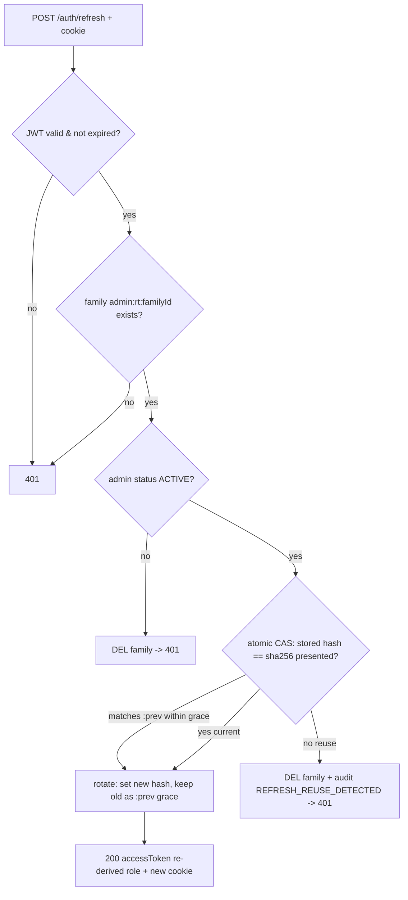

# Design Document — Admin Authentication

## Overview

**Purpose**: Deliver secure, admin-only authentication for the NomoGreen SaaS operations portal. Platform operators (`PlatformAdmin`) log in with email + password and receive a short-lived access token (JSON body) plus a rotating long-lived refresh token (HttpOnly cookie). Redis holds refresh-rotation families and access-token revocation state.

**Users**: NomoGreen platform operators (roles SUPER_ADMIN / SUPPORT / BILLING). Tenant users are explicitly excluded.

**Impact**: Introduces the first authentication subsystem to a greenfield backend (`src/` currently only has the default App files). Adds foundation infrastructure (PrismaService, ConfigModule, Redis provider, cookie parsing, env vars, docker-compose redis) and wires the already-scaffolded frontend admin login form to a real API.

### Goals
- Authenticate `PlatformAdmin` accounts per `docs/architecture.md` §6.1 (JWT access + refresh, rotation, Redis blacklist).
- Enforce access on guarded endpoints via a Passport JWT access guard with Redis revocation check.
- Rotate refresh tokens on every use with reuse detection (family revocation).
- Wire the existing admin login UI end-to-end.

### Non-Goals
- Tenant `User` login, phone/OTP, OAuth (Google/Apple).
- Password reset / forgot password, MFA.
- Full `resource:action` RBAC enforcement (only "active PlatformAdmin" is checked here).
- Tenant/Feature guards from the §6.2 chain (added when tenant modules land).

## Architecture

### Existing Architecture Analysis
- **Current state**: NestJS 11 + Prisma 7 (`@prisma/adapter-pg`). `src/app.module.ts` has empty imports; no PrismaService, no auth, no config. `PlatformAdmin` model already exists in `prisma/schema.prisma`.
- **Patterns to respect**: module-per-domain (`src/platform/*`, `src/retail/*` per architecture §4); Prisma 7 runtime uses the pg driver adapter; Biome lint/format; Jest (unit + supertest e2e).
- **Integration points maintained**: `AppModule` composition root; `main.ts` bootstrap; Prisma datasource via `DATABASE_URL`.
- **Debt worked around**: Redis is documented but not present — this feature introduces it.

### Architecture Pattern & Boundary Map

```mermaid
flowchart TD
    FE["Admin Login Form (Next.js)\nfrontend/components/auth/admin-login-form.tsx"] -->|POST /auth/admin/login| C["AuthController\nsrc/platform/auth"]
    FE -->|POST /auth/refresh (cookie)| C
    FE -->|POST /auth/logout (Bearer)| C
    C --> S["AuthService"]
    S --> PW["PasswordService (Argon2id)"]
    S --> TS["TokenService (@nestjs/jwt)"]
    S --> RTS["RefreshTokenStore (Redis families)"]
    S --> P["PrismaService -> platform_admin"]
    S --> AL["AuditLog write"]
    G["AccessTokenGuard\n(jwt strategy + Redis blacklist)"] --> RTS
    G --> RB["Redis blacklist keys"]
    RTS --> RB
```

**Architecture Integration**:
- Selected pattern: NestJS feature module `AuthModule` under `src/platform/auth/`, plus shared providers (`PrismaModule`, `RedisModule`, global `ConfigModule`).
- Domain boundaries: password hashing, token signing, and refresh-state storage are separate injectable services so each is unit-testable in isolation.
- Existing patterns preserved: module-per-domain; env-driven config; Prisma pg adapter.
- New components rationale: no auth exists — every piece is net-new but minimal (YAGNI: no tenant guard, no OAuth strategy stubs).
- Steering compliance: matches architecture §6.1/§6.2 contract wording verbatim.

### Technology Stack

| Layer | Choice / Version | Role in Feature | Notes |
|-------|------------------|-----------------|-------|
| Frontend / CLI | Next.js 16 + React 19 | Admin login form wiring | Existing form; add API call |
| Backend / Services | NestJS 11, `@nestjs/jwt`, `@nestjs/passport`, `passport-jwt` | Login, guards, token issuance | New `AuthModule` |
| Auth crypto | `argon2` (Argon2id) | Password hashing/verify | OWASP 2024+ default |
| Data / Storage | Prisma 7 + PostgreSQL (`platform_admin`, `audit_log`) | Admin identity + audit | Model already exists |
| Session state | Redis 7 (`ioredis`, AOF persistence) | Refresh families (+prev grace) + access blacklist (TTL) | New infra (docker-compose, volume) |
| Infrastructure / Runtime | Docker Compose (add `redis` + volume), `cookie-parser`, `@nestjs/config`, `enableCors` | Bootstrap wiring | main.ts + env + Prisma migration |

## Canonical Contracts & Invariants

| Contract Area | Canonical Decision | Applies To | Must Stay Consistent In |
|---------------|--------------------|------------|-------------------------|
| Auth / session | JWT access ~15m (secret `JWT_ACCESS_SECRET`) + refresh ~30d (secret `JWT_REFRESH_SECRET`, separate). Access payload: `sub`, `email`, `role`, `type:'access'`, `familyId` (so logout revokes the family from the access token). Refresh payload: `sub`, `familyId`, `type:'refresh'`. Password = Argon2id (`m=65536,t=3,p=2`). Login only for `PlatformAdmin` with `status=ACTIVE`; refresh re-loads the admin and re-checks `status=ACTIVE` + re-derives `role` from the DB. | AuthService, TokenService, guards, strategies | `design.md`, all auth task files |
| Transport / entrypoints | Access token → JSON body field `accessToken`. Refresh token → `Set-Cookie` `nomo_admin_rt` HttpOnly+Secure(default true; prod-enforced)+SameSite=Strict, `Path=/auth` (sent to both `/auth/refresh` and `/auth/logout`). Endpoints: `POST /auth/admin/login`, `POST /auth/refresh`, `POST /auth/logout`, `GET /auth/me`. CORS enabled with `origin=<CORS_ORIGIN>` + `credentials:true`. Backend `PORT` pinned (e.g. 3001) to avoid the Next.js dev :3000 clash. | AuthController, main.ts, frontend | `design.md`, task R0/R1/R3/R6 |
| Data / persistence | Redis keys: `admin:rt:{familyId}` = sha256(current refresh) with TTL=refresh lifetime; `admin:rt:{familyId}:prev` = sha256(previous refresh) with a short grace TTL (few seconds); `admin:bl:{sha256(accessToken)}` = "1" with TTL=`max(1, exp-now)`. Rotation is an atomic Lua compare-and-swap. Postgres: schema materialized by Prisma migration; read/update `platform_admin`; insert `audit_log`. Refresh stored as hash only. Redis configured with AOF persistence + volume. | RefreshTokenStore, AccessTokenGuard, PrismaService | `design.md`, task R0/R2/R3 |
| Deletion / retention policy | Logout deletes `admin:rt:{familyId}` (+`:prev`) using `familyId` from the access claim, and blacklists the access token until its natural expiry. No raw token persisted anywhere. Reuse of a rotated refresh token (outside the grace window) deletes the whole family and writes a `REFRESH_REUSE_DETECTED` audit row. | AuthService, RefreshTokenStore | `design.md`, task R3/R4 |
| Generated artifacts / runtime outputs | New env vars in `.env.example` (backend) + `NEXT_PUBLIC_API_BASE_URL` (frontend); `AuthModule` imported by `AppModule`; `cookie-parser` + `ValidationPipe` + `enableCors` registered in `main.ts`; Prisma migration committed under `prisma/migrations/`; redis service with persistence in docker-compose. | AppModule, main.ts, .env.example, migrations, docker-compose | `design.md`, task R0/R6 |

### Machine-checkable contracts

<!-- contract:AdminLoginResponse -->
```json
{ "accessToken": "string", "admin": { "id": "string", "email": "string", "fullName": "string", "role": "string" } }
```

The login (`POST /auth/admin/login`) and refresh (`POST /auth/refresh`) success bodies both return this shape (refresh may omit `admin` — see note). The frontend consumes `accessToken` and `admin`. Any task producing or consuming this shape copies the block verbatim and adds a `Contracts: AdminLoginResponse` line.

> Refresh response returns `{ "accessToken": "string" }` (subset); the named contract governs the login body and the shared `admin` object shape used by `GET /auth/me`.

## System Flows

### Login
```mermaid
sequenceDiagram
    participant FE as Admin Form
    participant API as AuthController
    participant SVC as AuthService
    participant DB as Postgres
    participant R as Redis
    FE->>API: POST /auth/admin/login {email,password}
    API->>SVC: login(dto, ip, ua)
    SVC->>DB: findUnique platform_admin by email
    alt not found
        SVC->>SVC: Argon2id verify vs fixed decoy hash (constant time)
        SVC-->>API: 401 invalid credentials
    else wrong password
        SVC-->>API: 401 invalid credentials
    else disabled
        SVC-->>API: 403 account disabled
    else ok
        SVC->>DB: update lastLoginAt + insert audit_log LOGIN (durable first)
        SVC->>SVC: sign access(+familyId) + refresh (new familyId)
        SVC->>R: SET admin:rt:{familyId}=hash TTL=30d (last; failure needs no DB cleanup)
        SVC-->>API: {accessToken, admin} + Set-Cookie refresh
    end
```
> Ordering is durable DB writes first, Redis `open` last, so a Redis failure aborts before any cross-store inconsistency (no orphaned family). Audit-write failure fails the login (500) rather than silently returning 200.

### Refresh with reuse detection

> Rotation is a single atomic Lua CAS. The immediately-previous hash is accepted for a few seconds (`:prev` grace key) so concurrent legitimate refreshes converge; a mismatch outside the grace window is treated as reuse and deletes the family.

## Requirements Traceability

| Requirement | Summary | Components | Interfaces | Flows |
|-------------|---------|------------|------------|-------|
| 1.1–1.6 | PlatformAdmin login | AuthController, AuthService, PasswordService | `POST /auth/admin/login` | Login |
| 2.1–2.5 | Access issuance & verify | TokenService, AccessTokenStrategy, AccessTokenGuard | `GET /auth/me`, Bearer guard | Login |
| 3.1–3.5 | Refresh rotation & reuse | TokenService, RefreshTokenStore, AuthService | `POST /auth/refresh` | Refresh |
| 4.1–4.3 | Logout & revocation | AuthService, RefreshTokenStore, AccessTokenGuard | `POST /auth/logout` | Refresh/Login |
| 5.1–5.3 | Bootstrap seed | seed.ts, PasswordService | `db:seed` | — |
| 6.1–6.3 | FE login wiring | AdminLoginForm, api client | fetch to `/auth/admin/login` | Login |
| 7.1 | Performance (qualitative) | PasswordService (p=2) | — | — |
| 8.1–8.5 | Security (secrets, no-log, hash-only, cookie Secure, env docs) | ConfigModule, TokenService, decoy verify | — | — |
| 9.1–9.4 | Reliability, audit+reuse alert, schema migration, Redis persistence | RedisModule, AuditLog writer, Prisma migration | `POST /auth/refresh` | Login/Refresh |

## Components and Interfaces

| Component | Domain/Layer | Intent | Req Coverage | Key Dependencies (P0/P1) | Contracts |
|-----------|--------------|--------|--------------|--------------------------|-----------|
| PrismaService | Data | Runtime Prisma client (pg adapter) | 1,5,9 | Prisma (P0) | Service |
| RedisModule/RedisService | Data | ioredis client + helpers | 2,3,4,9 | ioredis (P0) | Service |
| PasswordService | Auth | Argon2id hash/verify | 1,5,7 | argon2 (P0) | Service |
| TokenService | Auth | Sign/verify access+refresh JWT | 2,3,8 | @nestjs/jwt (P0) | Service |
| RefreshTokenStore | Auth | Redis family store + rotation/reuse | 3,4 | RedisService (P0) | Service |
| AccessTokenStrategy + Guard | Auth | Verify bearer + blacklist check | 2,4 | passport-jwt, RedisService (P0) | Service |
| AuthService | Auth | Orchestrate login/refresh/logout | 1–4,9 | all above, PrismaService (P0) | Service |
| AuthController | Auth (API) | HTTP endpoints + cookie handling | 1–4 | AuthService (P0) | API |
| Seed bootstrap | Data | Create initial SUPER_ADMIN | 5 | PasswordService (P1) | Batch |
| AdminLoginForm wiring | Frontend | Call login API, store token, redirect | 6 | fetch (P0) | State |

### Auth Layer

#### AuthService
| Field | Detail |
|-------|--------|
| Intent | Orchestrate login, refresh, logout, and current-admin lookup |
| Requirements | 1.1–1.6, 2.5, 3.2–3.4, 4.1–4.3, 9.2 |

**Responsibilities & Constraints**
- Verify credentials, enforce `status=ACTIVE`, update `lastLoginAt`, emit audit logs.
- Never leak which field failed (generic 401); never log secrets/hashes (R8.2).
- Fail closed if Redis is unavailable (R9.1).

**Dependencies**
- Outbound: PasswordService (verify), TokenService (sign/verify), RefreshTokenStore (family CRUD), PrismaService (admin + audit) — all Critical.

**Contracts**: Service [x] / API [ ]

##### Service Interface
```typescript
interface AuthResult { accessToken: string; refreshToken: string; refreshFamilyId: string; admin: AdminIdentity; }
interface AuthService {
  login(dto: AdminLoginDto, ctx: RequestCtx): Promise<AuthResult>;       // R1
  refresh(rawRefreshToken: string): Promise<{ accessToken: string; refreshToken: string }>; // R3
  logout(accessToken: string, refreshFamilyId?: string): Promise<void>;  // R4
  me(adminId: string): Promise<AdminIdentity>;                           // R2.5
}
```
- Preconditions: env secrets loaded; Redis reachable.
- Postconditions: on login, family created in Redis + audit row inserted.
- Invariants: only one valid refresh hash per family at a time.

#### TokenService
**Contracts**: Service [x]
```typescript
interface TokenService {
  signAccess(admin: AdminIdentity): string;                  // 15m, type=access
  signRefresh(adminId: string, familyId: string): string;    // 30d, type=refresh
  verifyAccess(token: string): AccessClaims;                 // throws on invalid
  verifyRefresh(token: string): RefreshClaims;               // throws on invalid
}
```
- Invariants: distinct secrets per token type (R8.1); `type` claim asserted on verify.

#### RefreshTokenStore
**Contracts**: Service [x]
```typescript
interface RefreshTokenStore {
  open(familyId: string, refreshToken: string, ttlSec: number): Promise<void>;
  rotate(familyId: string, oldToken: string, newToken: string, ttlSec: number, graceSec: number): Promise<'ok'|'reuse'|'missing'>;
  revokeFamily(familyId: string): Promise<void>;
  blacklistAccess(token: string, ttlSec: number): Promise<void>;
  isAccessBlacklisted(token: string): Promise<boolean>;
}
```
- Invariants: store sha256(token) only (R8.4); TTL always set (auto-cleanup).

##### API Contract
| Method | Endpoint | Request | Response | Errors |
|--------|----------|---------|----------|--------|
| POST | /auth/admin/login | `{email,password}` | `AdminLoginResponse` + Set-Cookie | 400, 401, 403, 503 |
| POST | /auth/refresh | cookie `nomo_admin_rt` | `{accessToken}` + Set-Cookie | 401, 503 |
| POST | /auth/logout | Bearer access (cookie `Path=/auth`) | `204` + clear cookie | 401 |
| GET | /auth/me | Bearer access | `{id,email,fullName,role}` | 401 |

## Data Models

### Logical Data Model
- Reuses existing `platform_admin` (id, email unique, passwordHash, fullName, role, status, lastLoginAt). **No new columns**, but the schema must be **materialized via a Prisma migration** (`prisma/migrations/` does not yet exist) before seed/serve — the model existing in `schema.prisma` does not imply the table exists on a fresh DB.
- `audit_log` reused for LOGIN/LOGOUT/REFRESH_REUSE_DETECTED rows (actorType `PLATFORM_ADMIN`); also materialized by the same migration.
- Redis (with AOF persistence): `admin:rt:{familyId}` → sha256(current refresh) TTL 30d; `admin:rt:{familyId}:prev` → sha256(previous refresh) short grace TTL; `admin:bl:{sha256(access)}` → "1" TTL `max(1, exp-now)` ≤15m.

### Data Contracts & Integration
- Access claims: `{ sub, email, role, type:'access', familyId, iat, exp }`.
- Refresh claims: `{ sub, familyId, type:'refresh', iat, exp }`.
- Login/refresh JSON per `AdminLoginResponse` contract block above.

## Error Handling

### Error Strategy
- 400: DTO validation (class-validator) before credential logic.
- 401: invalid credentials (R1.2, constant-time via decoy verify), invalid/expired/revoked token (R2.3/R2.4/R3.3/R3.4), refresh from a disabled admin (R3.2 → family revoked).
- 403: disabled admin at login (R1.3).
- 503: Redis unreachable (R9.1) — fail closed.

### Monitoring
- Audit rows for LOGIN/LOGOUT and REFRESH_REUSE_DETECTED (R9.2); the reuse event is a theft signal worth alerting on. Structured logs exclude secrets/hashes (R8.2).

## Testing Strategy

### Unit Tests
- PasswordService: hash produces Argon2id format; verify true/false.
- TokenService: access/refresh signed with separate secrets; verify rejects wrong-type/expired.
- RefreshTokenStore: rotate returns `ok`/`reuse`/`missing`; blacklist round-trip.
- AuthService.login: 401 wrong password, 403 disabled, 200 happy path updates lastLoginAt.

### Integration / E2E (supertest)
- `POST /auth/admin/login` happy path returns accessToken + Set-Cookie.
- `POST /auth/refresh` rotates; reused old cookie → 401 + family gone.
- `GET /auth/me` guarded: valid token 200, missing/blacklisted 401.
- `POST /auth/logout` → subsequent `/auth/me` with same token 401.

### Performance
- Login p95 < 500ms incl. Argon2id (R7.1); guard blacklist check < 5ms p95 (R7.2).

## Security Considerations
- **Threats**: credential stuffing (generic 401 + constant-time decoy verify to close the Argon2id timing oracle; infra-layer rate limiting per architecture §8), token theft (short access + rotation + family reuse detection with audit alert), session persistence after deprovision (refresh re-checks `status=ACTIVE` and re-derives `role`), XSS on refresh (HttpOnly cookie), CSRF (SameSite=Strict + `Path=/auth`; double-submit deferred), cookie downgrade (`Secure` default true, prod-enforced), secret leakage (env-only, never logged), CORS (explicit allowed origin + credentials, not wildcard).
- **AuthN/Z**: only `PlatformAdmin` `status=ACTIVE` may authenticate or refresh; role re-derived from DB on refresh so demotion takes effect within one access-token lifetime. Tenant guard chain out of scope.
- **Data protection**: refresh stored as hash; Redis TTL auto-expiry with AOF persistence (restart does not un-revoke); no plaintext password persistence or logging.
- **Deferred (validation 2026-07-17)**: brute-force 429 lockout — handled at infra layer, not this feature.

## Performance & Scalability
- Argon2id params (`m=65536,t=3,p=2`) tuned so `parallelism` matches the minimum target vCPU (2), keeping login within interactive latency on a 2–4 vCPU VPS; admin login is low-QPS, so no CI-gated latency budget is imposed (former R7.2 deferred).
- Redis lookups are O(1) sub-ms; single instance with AOF persistence sufficient for Phase 1 (restart blast radius documented: active sessions re-login).

## Migration Strategy
- **DB**: `platform_admin` + `audit_log` are materialized by a committed Prisma migration (`prisma migrate deploy` / `db push`) run before seed/serve — `prisma/migrations/` does not yet exist, so R0-01 generates and applies the initial migration.
- **Infra**: add Redis (with AOF + volume) to docker-compose; add backend JWT/Redis/cookie/CORS env vars + frontend `NEXT_PUBLIC_API_BASE_URL`. Rollback = disable `AuthModule` import and revert env; no destructive data change.
