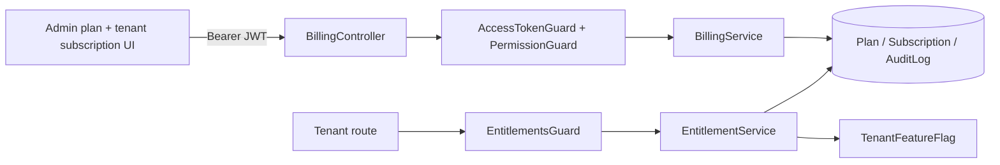
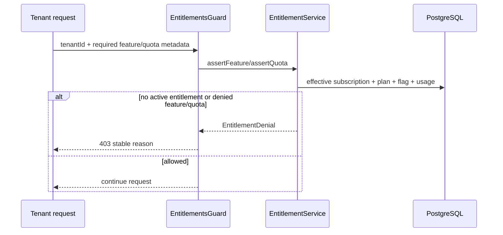
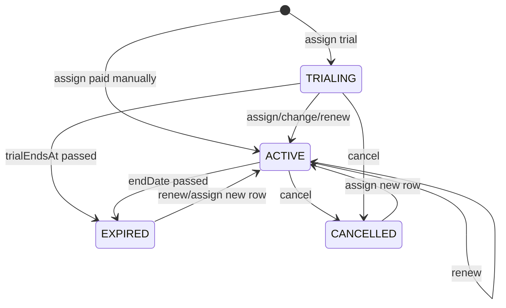

# Design Document — Admin Plan and Manual Subscription Management

## Overview

Deliver a platform-admin billing control plane with two backend boundaries: `BillingModule` owns plan catalog and manual subscription lifecycle; `EntitlementsModule` owns effective-state evaluation and backend feature/quota enforcement. The admin frontend adds plan management and subscription controls to the existing tenant admin surface. Payment collection, invoices, and Stripe remain deferred.

## Goals

- Manage active/inactive plans, feature membership, and finite/unlimited quotas.
- Make manual subscription assignment/change/renew/cancel explicit and history-preserving.
- Provide one authoritative effective-entitlement evaluator used by backend tenant routes.
- Enforce feature and quota checks server-side with stable denial reasons.
- Preserve data on downgrade and audit every successful mutation transactionally.

## Non-Goals

- Stripe, payment provider calls, automatic invoice/payment state, refunds, or reconciliation.
- Tenant self-service billing.
- Bulk/scheduled changes.
- Deleting tenant data, plan rows, or subscription history during downgrade/cancellation.
- Audit log viewer.

## Architecture



### Module boundaries

| Component | Responsibility | Must not own |
|---|---|---|
| `BillingModule` | Plan CRUD, subscription lifecycle, admin DTOs/controllers, audit events | Tenant business write authorization |
| `EntitlementsModule` | Effective subscription, feature evaluation, quota usage/evaluation, reusable guard/decorator | Admin catalog UI or payment collection |
| `AuditModule` | Existing transaction-scoped audit persistence | Billing state rules |
| Existing tenant modules | Call the entitlement contract at protected request/write entrypoints | Reimplement plan/status/quota semantics |

## Canonical Contracts & Invariants

Every implementation task consuming a contract below must copy it verbatim.

<!-- contract:BillingPermissions -->
```text
admin.plan:view       list/detail plans and feature catalog
admin.plan:edit       create/update plans and feature/quota membership
admin.plan:activate   activate/deactivate plans
admin.subscription:view   view tenant subscription and history
admin.subscription:edit   assign/change/renew/cancel subscriptions
```

<!-- contract:EffectiveEntitlement -->
```json
{
  "tenantId": "string",
  "subscriptionId": "string|null",
  "planId": "string|null",
  "status": "TRIALING|ACTIVE|PAST_DUE|CANCELLED|EXPIRED|NONE",
  "isActive": "boolean",
  "effectiveAt": "string",
  "expiresAt": "string|null",
  "featureCodes": ["string"],
  "quotas": {
    "maxUsers": "number|null",
    "maxWarehouses": "number|null",
    "maxProducts": "number|null",
    "maxCustomers": "number|null",
    "maxOrdersPerMonth": "number|null",
    "maxStorageBytes": "number|string|null"
  }
}
```

<!-- contract:EntitlementDenial -->
```json
{
  "reason": "NO_SUBSCRIPTION|SUBSCRIPTION_EXPIRED|SUBSCRIPTION_CANCELLED|FEATURE_NOT_INCLUDED|FEATURE_DISABLED|QUOTA_EXCEEDED|ENTITLEMENT_UNAVAILABLE",
  "featureCode": "string|null",
  "quota": "string|null",
  "current": "number|null",
  "requested": "number|null",
  "limit": "number|null"
}
```

<!-- contract:SubscriptionMutation -->
```json
{
  "planId": "string",
  "status": "ACTIVE|TRIALING",
  "billingCycle": "MONTHLY|QUARTERLY|YEARLY",
  "startDate": "string",
  "endDate": "string|null",
  "trialEndsAt": "string|null",
  "manualReference": "string|null",
  "reason": "string|null",
  "expectedUpdatedAt": "string|null"
}
```

Invariants:

1. Plan code is immutable after creation; deactivation is a boolean catalog state.
2. A plan change creates a new subscription row and closes the previous effective row; history is never deleted.
3. An effective subscription is the most recently updated non-cancelled row whose start/end/trial dates include `now`; expired rows produce no entitlement.
4. `TenantFeatureFlag.enabled=true` grants a feature, `false` denies it, absent falls back to the effective plan; only `ACTIVE` and `TRIALING` are entitlement-granting statuses. `PAST_DUE`, missing, expired, and cancelled subscriptions never grant access and neither override bypasses that rule.
5. Quota `null` means unlimited only for fields whose schema already permits null; all finite quotas are non-negative and enforced on growth operations.
6. Downgrade never deletes or rewrites tenant business rows; overage blocks only new writes that increase the affected dimension.
7. All admin mutations use `AuditLogger.run`; failed state changes produce no paired success audit event. Plan feature/quota edits take effect immediately for current subscribers and include before/after snapshots; no plan versioning is introduced in this scope.

8. Tenant identity used by `EntitlementsGuard` is server-derived from the authenticated tenant context. A route/body tenant ID must match that context and is never trusted as the sole identity selector.

9. Manual `reason` is trimmed and capped at 500 characters; `manualReference` is trimmed and capped at 200 characters; CR/LF is rejected or stripped; payment credentials/secrets are never stored or logged.

## Persistence and migration

- Reuse `Plan`, `Feature`, `PlanFeature`, `Subscription`, and `TenantFeatureFlag`.
- Add only manual-operation metadata needed to `Subscription` (manual reference/reason and a concurrency-safe lifecycle marker if required by the implementation) and add billing audit enum values via a Prisma migration.
- Add indexes for effective subscription lookup (`tenantId`, `status`, `updatedAt`, dates) without changing existing tenant business rows.
- Before applying a uniqueness constraint, produce a deterministic pre-migration duplicate report, retain rows, select the latest row by `updatedAt DESC, id DESC` for effective reads, and document an operator resolution path. Never delete duplicate history as migration cleanup.
- Rollback: deploy migration down/forward-compatible schema first, deploy app code second; if the app is rolled back, existing subscription columns and old admin APIs remain readable.

## Backend API

| Method | Endpoint | Permission | Purpose |
|---|---|---|---|
| GET | `/admin/plans` | `admin.plan:view` | List plans with features/quotas |
| POST | `/admin/plans` | `admin.plan:edit` | Create plan |
| PATCH | `/admin/plans/:id` | `admin.plan:edit` | Edit plan definition |
| POST | `/admin/plans/:id/activation` | `admin.plan:activate` | Activate/deactivate |
| GET | `/admin/tenants/:tenantId/subscription` | `admin.subscription:view` | Current + history |
| POST | `/admin/tenants/:tenantId/subscription` | `admin.subscription:edit` | Assign/change |
| POST | `/admin/tenants/:tenantId/subscription/renew` | `admin.subscription:edit` | Renew |
| POST | `/admin/tenants/:tenantId/subscription/cancel` | `admin.subscription:edit` | Cancel |

All routes use `AccessTokenGuard` and `PermissionGuard`. UUID/date/enum/number validation occurs in DTOs. Object routes return 404 for missing/soft-deleted tenants/plans; permission denial is 403.

## Effective entitlement flow



Quota usage is computed from existing tenant counts/aggregates at the protected write boundary. The implementation must lock/conditionally update a tenant or period-scoped quota counter in the same transaction as the final create mutation; monthly orders use a period-scoped counter/conditional operation. A check-only helper is insufficient.

### R1-03 production enforcement slice

The first real tenant business write surface is the product catalog:

| Method | Endpoint | Contract |
|---|---|---|
| GET | `/tenant/products` | Authenticated tenant context; reads remain available after downgrade |
| POST | `/tenant/products` | `AccessTokenGuard`, tenant context, `EntitlementsGuard`, `@RequireFeature('inventory')`, `@RequireQuota('maxProducts')` |

This slice introduces `TenantQuotaCounter` with `(tenantId, dimension, periodKey)` uniqueness and a `BigInt used` value. `maxProducts` uses `periodKey = "lifetime"`; the model is shaped for future monthly dimensions but only `maxProducts` is authoritative in R1-03. Existing non-deleted products are backfilled into the counter. The counter increment and `Product.create` execute in one Prisma transaction using a conditional update; the transaction re-checks the shared `EntitlementService` after the guard preflight. No entitlement algorithm is copied into `ProductService`.

User, warehouse, customer, storage, and monthly-order writers remain deferred until their real tenant modules exist. Product reads are not entitlement-protected, so downgrade preserves access to existing data while blocking growth beyond a finite limit.

### Default permission grant matrix

| Role | Default grants |
|---|---|
| SUPER_ADMIN | Guard bypass, no grant rows required |
| SUPPORT | `admin.subscription:view` only |
| BILLING | `admin.plan:view`, `admin.plan:edit`, `admin.plan:activate`, `admin.subscription:view`, `admin.subscription:edit` |
| Custom roles | No automatic billing grants |

## Subscription state flow



`EXPIRED` is derived at read/check time from dates; it need not be persisted by a scheduler.

## Requirements Traceability

| Requirement | Design component | Verification |
|---|---|---|
| 1.x | BillingService plan catalog + plan UI | plan service/controller/unit/e2e |
| 2.x | subscription read contract + tenant detail | service/e2e/UI |
| 3.x | lifecycle state machine + manual DTOs | lifecycle unit/e2e |
| 4.x | AuditLogger.run and billing audit enum | audit transaction tests |
| 5.x | EntitlementService/Guard | expired/feature/override tests |
| 6.x | Quota evaluator + atomic protected write | overflow/concurrency/downgrade tests |
| 7.x | admin plan/subscription UI and API clients | frontend lint/build/manual flow |
| 8.x | indexes, bounded queries, page caps | integration/performance evidence |
| 9.x | guards, DTO validation, migration rollback | permission/security/migration tests |

## Security and reliability

- Least privilege is encoded in the canonical permission block; no controller relies on frontend hiding alone.
- Audit payloads contain plan/subscription metadata and operator reason/reference, never tokens, passwords, bank credentials, or payment secrets.
- Date boundaries use UTC `Date` values and an injected clock in pure service tests.
- Entitlement lookup errors return `ENTITLEMENT_UNAVAILABLE`/403; logs may include correlation context but not secret payloads.
- Every major schema/service change has a migration rollback or forward-compatible deployment order.

## UI design constraints

- Follow `DESIGN.md`: mobile-first admin controls, minimum 48 px touch targets, Vietnamese labels, clear status colors, confirmation before cancel/deactivate, and no optimistic mutation that can misrepresent billing state.
- Reuse `AdminShell`, `Can`, `useHasPermission`, `adminFetch`, and existing tenant detail visual patterns.

## Test strategy

- **Unit**: date/status evaluator, feature overrides, quota arithmetic, DTO validation, service transaction/audit calls.
- **Integration/e2e**: guarded admin endpoints, plan change history, expiry denial, quota overflow, stale mutation, unauthorized access, migration/seed compatibility.
- **Frontend**: TypeScript/build/lint plus manual responsive smoke for plan and tenant subscription workflows; no new frontend test runner is introduced in this spec.
