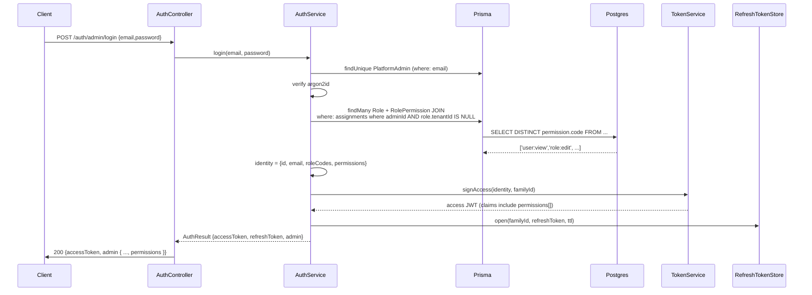
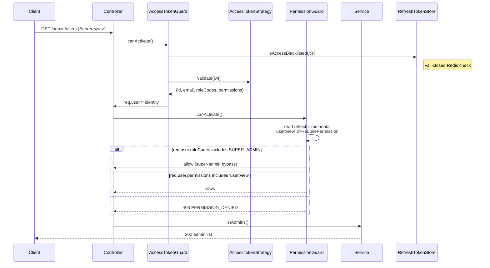

# Design — Admin RBAC & User Management

## 1. Context & Overview

This feature replaces the current single-enum `PlatformAdmin.role` (SUPER_ADMIN / SUPPORT / BILLING) with a **proper multi-role RBAC system** backed by the existing `role` / `permission` / `role_permission` schema (already provisioned for tenant `User`). It adds:

1. Full CRUD UI for `PlatformAdmin` (admin user management)
2. Full CRUD UI for `role` with permission editor (admin side; tenant `User` uses same table independently)
3. Read-only `permission` catalog view
4. New `PermissionGuard` enforcing `resource:action` codes via `@RequirePermission` decorator
5. JWT access token now carries `permissions: string[]` (front-end gating)
6. Phased migration: enum column retained as back-fill only; cutover → drop enum in follow-up spec

**Why**: The single-enum approach is not maintainable as operations grow beyond 3 roles, and the existing schema already encodes a permission taxonomy that needs to be wired into admin endpoints.

## 2. High-Level Architecture

```
┌──────────────────────────────────────────────────────────────────────┐
│                    Frontend (Next.js — admin zone)                    │
│  /admin/nguoi-dung-quan-tri  /admin/vai-tro  /admin/quyen-han         │
│         │                                                            │
│         ├── adminShell filters nav by permissions[]                   │
│         └── <Can permission="..."> / useHasPermission()               │
└─────────────────────────────────┬────────────────────────────────────┘
                                  │ fetch (Authorization: Bearer <jwt>)
                                  ▼
┌──────────────────────────────────────────────────────────────────────┐
│                    Backend (NestJS — /admin)                          │
│  controller  ── @UseGuards(AccessTokenGuard, PermissionGuard)         │
│                       │                                              │
│                       └── @RequirePermission('user:view')             │
│  service ── PrismaService.platformAdmin/role/permission/role_permission│
│            ── AuditLog (Prisma audit_log in same tx)                  │
│  guards  ── AccessTokenStrategy.validate()  → returns permission codes│
│           ── PermissionGuard (reflector + req.user.permissions)      │
└──────────────────────────────────────────────────────────────────────┘
                                  │
                                  ▼
┌──────────────────────────────────────────────────────────────────────┐
│                     PostgreSQL + Prisma 7                              │
│  Tables:                                                               │
│   platform_admin(id, email, password_hash, full_name, status,           │
│                  last_login_at, created_at, updated_at)                │
│                  -- role (enum) deprecated, retained read-only         │
│   admin_role_assignment(id, admin_id, role_id, assigned_at,            │
│                         assigned_by)                                  │
│   role(id, tenant_id NULL, code, name, is_admin BOOL, is_system, ...)       │
│   permission(id, code, resource, action, created_at)                        │
│   role_permission(role_id, permission_id) -- M:N                             │
│   audit_log(id, actor_type, actor_id, actor_role_code, action, resource,     │
│             resource_id, before, after, ip, user_agent, created_at)          │
│   -- action column: enum AuditAction (12 RBAC codes + LOGIN/LOGOUT/         │
│      REFRESH_REUSE_DETECTED — see §12 Decision 4)                            │
└──────────────────────────────────────────────────────────────────────┘
```

## 3. Data Flow — Login (updated to fetch permissions)



## 4. Data Flow — RBAC-protected request



## 5. Canonical Contracts & Invariants

### Contract: ADMIN — platform_admin public shape

<!-- contract:ADMIN_PUBLIC_SHAPE -->
```ts
type AdminPublicShape = {
  id: string;            // uuid
  email: string;         // unique
  fullName: string;
  status: "ACTIVE" | "DISABLED";
  roles: string[];       // role codes (e.g. ["SUPER_ADMIN", "BILLING"])
  permissions: string[]; // permission codes (e.g. ["user:view", "billing:edit"])
  lastLoginAt: string | null; // ISO8601, null if never
  createdAt: string;     // ISO8601
  updatedAt: string;     // ISO8601
};
```

### Contract: ROLE — platform role public shape

<!-- contract:ROLE_PUBLIC_SHAPE -->
```ts
type RolePublicShape = {
  id: string;
  code: string;            // unique within tenantId IS NULL
  name: string;
  isSystem: boolean;       // true = cannot delete, cannot change code
  permissions: string[];   // permission codes currently granted
  createdAt: string;
  updatedAt: string;
};
```

### Contract: PERMISSION — permission catalog row

<!-- contract:PERMISSION_PUBLIC_SHAPE -->
```ts
type PermissionPublicShape = {
  id: string;
  code: string;       // "admin.resource:action" (admin prefix — see INV-2)
  resource: string;   // "user", "role", "permission", "tenant", "billing", "report", "support"
  action: string;     // "view", "create", "edit", "delete", "approve", "export",
                      // "deactivate", "reactivate", "reset_password", "reply"
};
```

### Contract: ADMIN_IDENTITY — JWT strategy output (also returned on /auth/me)

<!-- contract:ADMIN_IDENTITY -->
```ts
type AdminIdentity = {
  id: string;
  email: string;
  roleCodes: string[];   // NEW: replaces single `role: string`
  permissions: string[]; // NEW: flat list of permission codes
};
```

### Contract: ACCESS_CLAIMS — JWT payload (backward additive)

<!-- contract:ACCESS_CLAIMS -->
```ts
type AccessClaims = {
  sub: string;
  email: string;
  role: string;            // BACKWARD: CSV-joined roleCodes (e.g. "SUPER_ADMIN,BILLING").
                           // signAccess joins `roleCodes` with `,`. Old consumers reading
                           // `payload.role` see CSV. New consumers should use `roleCodes`.
  roleCodes: string[];     // NEW: canonical source-of-truth for role list
  permissions: string[];   // NEW: flat list of permission codes (admin.*)
  type: "access";
  familyId: string;
  jti?: string;
  iat?: number;
  exp?: number;
};
// On validate(): read `payload.roleCodes ?? payload.role.split(',')` so old tokens
// (signed before this spec) still resolve correctly. Both branches covered by unit
// test in task-R0-01.
```

### Invariants

| # | Invariant |
|---|---|
| INV-1 | Admin roles MUST have `Role.isAdmin = true` (companion column added in migration). The `Role.tenantId IS NULL` predicate alone is insufficient — tenant system roles (`OWNER`, `STAFF`) also have `tenantId IS NULL`. Migration enforces via CHECK constraint: `(is_admin = false) OR (tenant_id IS NULL)`. |
| INV-2 | `permission.code` is unique across ALL rows (DB unique index). Admin codes use prefix `admin.` to avoid collision with the 10 existing tenant resources (dashboard, product, purchase, inventory, sales, customer, supplier, debt, report, setting). Re-seed is idempotent (skip-existing). |
| INV-3 | Any role with `isSystem=true` is undeletable and its `code` is unchangeable. |
| INV-4 | `permissions[]` on JWT is computed at login/refresh — authoritative for the 15-min window. Re-logout invalidates (refresh family revoked). |
| INV-5 | SUPER_ADMIN role grants ALL permissions. Enforced by: seed grants all permissions to SUPER_ADMIN role + super-admin shortcut in guard (R4.2). |
| INV-6 | `admin_role_assignment` is append-only on insert; deletion only via `PATCH /admin/users/:id` (replace assignment) or `DELETE /admin/roles/:id` (cascade via role deletion). No standalone revoke endpoint. |
| INV-7 | `permission.code` follows `^admin\.[a-z_]+:[a-z_]+$` (admin prefix, lowercase, colon separator). Validated at seed time. |
| INV-8 | Admin endpoints MUST filter `Role.isAdmin = true` when listing/loading admin-side roles; tenant endpoints MUST filter `Role.isAdmin = false`. Cross-namespace reads are forbidden. |

## 6. Migration Plan (phased)

### Phase A — Additive (deploy with this spec)
1. Add tables: `admin_role_assignment`, seed `permission` rows, seed system roles (SUPER_ADMIN, SUPPORT, BILLING) with proper permission grants.
2. Back-fill column `PlatformAdmin.role` retained, readable. 
3. AuthService reads role assignments from new M:N.
4. JWT claim ADDS `roleCodes`, `permissions`; KEEPS `role` for backward compat.
5. Bootstrap seed creates initial `SUPER_ADMIN` with assignment.

### Phase B — Cutover (follow-up spec, NOT in this scope)
1. Drop `PlatformAdmin.role` enum column.
2. Old refresh tokens under phase A invalidate on rotation; users re-login.

### Reversibility
- Migration `down` drops new tables and reassigns `PlatformAdmin.role` from role assignments back to enum (using SUPER_ADMIN if any role assigned, else SUPPORT).

## 7. Permission Taxonomy (Seed)

All admin permission codes use the `admin.` prefix to avoid collision with the 10 existing tenant permission codes (`dashboard`, `product`, `purchase`, `inventory`, `sales`, `customer`, `supplier`, `debt`, `report`, `setting`).

| Resource (admin.) | Actions | Notes |
|---|---|---|
| `admin.user` | view, create, edit, delete, deactivate, reactivate, reset_password | PlatformAdmin CRUD |
| `admin.role` | view, create, edit, delete | Role CRUD |
| `admin.permission` | view | Read-only catalog |
| `admin.tenant` | view, edit, approve, export | Out of scope endpoints, but permissions reserved |
| `admin.billing` | view, edit, approve, export | |
| `admin.report` | view, export | |
| `admin.support` | view, edit, reply | |

**Action set**: `view, create, edit, delete, approve, export, deactivate, reactivate, reset_password, reply`. Each resource × applicable actions = a `code`. `admin.permission` only has `view`. `admin.report` has `view, export`. Etc.

**Expected seed count**: variable per resource; documented in task-R0-04 step 1. The combined unique count covers admin-only RBAC; tenant codes (`sales:view`, etc.) remain unchanged in the same `permission` table.

System role default grants:
- `SUPER_ADMIN` → all admin codes (wildcard via `roleCodes.includes('SUPER_ADMIN')` shortcut)
- `SUPPORT` → `admin.*:view, admin.user:edit, admin.support:reply, admin.support:edit`
- `BILLING` → `admin.billing:*, admin.user:view, admin.report:view`

## 8. Endpoint Matrix

Every row MUST be guarded with `@UseGuards(AccessTokenGuard, PermissionGuard)` (R0-03 step 1) in addition to the listed `@RequirePermission`. The Guards column is leftmost to make this unmissable.

| Guards | Endpoint | Method | Permission | Self-check | Audit action |
|---|---|---|---|---|---|
| `AccessTokenGuard, PermissionGuard` | `/admin/permissions` | GET | `admin.permission:view` | none | none |
| `AccessTokenGuard, PermissionGuard` | `/admin/roles` | GET | `admin.role:view` | none | none |
| `AccessTokenGuard, PermissionGuard` | `/admin/roles` | POST | `admin.role:create` | code+name validated; `tenantId` DTO-stripped to null | `ROLE_CREATE` |
| `AccessTokenGuard, PermissionGuard` | `/admin/roles/:id` | PATCH | `admin.role:edit` | deny if `isSystem` code change | `ROLE_UPDATE` (one row) **+ N × `ROLE_PERMISSION_GRANT`** (one per addPermissionIds entry) **+ N × `ROLE_PERMISSION_REVOKE`** (one per removePermissionIds entry) |
| `AccessTokenGuard, PermissionGuard` | `/admin/roles/:id` | DELETE | `admin.role:delete` | deny if `isSystem` or in-use | `ROLE_DELETE` |
| `AccessTokenGuard, PermissionGuard` | `/admin/users` | GET | `admin.user:view` | none | none |
| `AccessTokenGuard, PermissionGuard` | `/admin/users` | POST | `admin.user:create` | email unique, roleIds valid | `ADMIN_CREATE` |
| `AccessTokenGuard, PermissionGuard` | `/admin/users/:id` | GET | `admin.user:view` | none | none |
| `AccessTokenGuard, PermissionGuard` | `/admin/users/:id` | PATCH | `admin.user:edit` | email/status immutable here (DTO forbid) | `ADMIN_UPDATE` (+ `ADMIN_ROLE_ASSIGN` / `ADMIN_ROLE_REVOKE` per role delta) |
| `AccessTokenGuard, PermissionGuard` | `/admin/users/:id/deactivate` | POST | `admin.user:deactivate` | deny self (`CANNOT_DEACTIVATE_SELF` 400); deny last SUPER_ADMIN (`LAST_SUPER_ADMIN` 409) | `ADMIN_DEACTIVATE` |
| `AccessTokenGuard, PermissionGuard` | `/admin/users/:id/reactivate` | POST | `admin.user:reactivate` | none | `ADMIN_REACTIVATE` |
| `AccessTokenGuard, PermissionGuard` | `/admin/users/:id/reset-password` | POST | `admin.user:reset_password` | deny self (`CANNOT_RESET_OWN_VIA_ADMIN_API` 400) | `ADMIN_RESET_PASSWORD` |

Audit action codes are emitted as full strings (no abbreviations). PATCH `/admin/roles/:id` emits one `ROLE_UPDATE` row PLUS N `ROLE_PERMISSION_GRANT` and N `ROLE_PERMISSION_REVOKE` rows — one per add/remove (see F-12 / task-R1-01 step 4).

All admin routes under prefix `/admin/*` (mounted via NestJS `RouterModule`). Mounted in `AppModule`.

## 9. Frontend Architecture

```
frontend/
├── app/admin/
│   ├── (quan-tri)/                 # existing group, expanded
│   │   └── layout.tsx              # existing shell
│   ├── nguoi-dung-quan-tri/
│   │   └── page.tsx                # R7.1 — admin list
│   ├── vai-tro/
│   │   └── page.tsx                # R7.5 — role list/editor
│   └── quyen-han/
│       └── page.tsx                # R7.7 — permission catalog
├── components/admin/
│   ├── admin-user-table.tsx        # R7.1
│   ├── admin-user-form-modal.tsx   # R7.2 / R7.3
│   ├── role-table.tsx              # R7.5
│   ├── role-editor-modal.tsx       # R7.6
│   ├── permission-catalog.tsx      # R7.7
│   └── permission-guard.tsx        # R7.8 — <Can permission="...">
├── lib/admin-api/
│   ├── admin-users.ts              # CRUD functions
│   ├── roles.ts
│   └── permissions.ts
└── stores/admin-auth-store.ts      # extend AdminIdentity with permissions[]
```

**Localization rule (NFR-7 + F-25)**: Permission codes (`admin.user:view`), role codes (`SUPER_ADMIN`), and audit action codes (`ADMIN_DEACTIVATE`) remain **English** in code, DB, JWT, and log output. The UI maps these codes to Vietnamese labels via a static label dictionary maintained in `frontend/lib/admin-labels.ts` (resource/action translation table). Code-vs-label separation is mandatory: never display raw English codes as user-facing strings.

## 10. Guard & Decorator Implementation Sketch

```ts
// src/platform/auth/guards/permission.guard.ts
@Injectable()
export class PermissionGuard implements CanActivate {
  constructor(private readonly reflector: Reflector) {}

  canActivate(ctx: ExecutionContext): boolean {
    const required = this.reflector.getAllAndOverride<string[]>(
      'permissions',
      [ctx.getHandler(), ctx.getClass()],
    ) ?? [];
    if (required.length === 0) return true;

    const req = ctx.switchToHttp().getRequest<AuthedRequest>();
    const user = req.user;
    if (!user) throw new UnauthorizedException('No admin identity');

    // R4.2: super-admin shortcut
    if (user.roleCodes.includes('SUPER_ADMIN')) return true;

    // R4.3: AND semantics
    const missing = required.filter((p) => !user.permissions.includes(p));
    if (missing.length > 0) {
      throw new ForbiddenException({
        reason: 'PERMISSION_DENIED',
        missing,
      });
    }
    return true;
  }
}

// src/platform/auth/decorators/require-permission.decorator.ts
export const RequirePermission = (...codes: string[]) =>
  SetMetadata('permissions', codes);
```

## 11. Requirements Traceability

| Requirement | Covered by (task) |
|---|---|
| R1.* | task-R0-04-permission-seed |
| R2.* | task-R1-01-role-api, task-R1-02-role-ui |
| R3.* | task-R2-01-admin-user-api, task-R2-02-admin-user-ui |
| R4.* | task-R0-03-permission-guard |
| R5.* | task-R0-01-claim-migration, task-R0-02-token-service-update |
| R6.* | task-R0-05-audit-logger |
| R7.* | task-R3-01-fe-admin-pages (covers 7.1–7.9) |
| R8.* | task-R0-01-claim-migration (8.1–8.3) |
| NFR-2 (security) | task-R0-03-permission-guard + task-R2-01-admin-user-api |
| NFR-4 (compat) | task-R0-06-existing-tests-update |
| NFR-6 (a11y) | task-R3-01-fe-admin-pages |

## 12. Risks & Mitigations

| Risk | Severity | Mitigation |
|---|---|---|
| Migration drops auth for existing SUPER_ADMINs | HIGH | Auto-back-fill `AdminRoleAssignment` on first login (R8.2). SUPER_ADMIN bootstrap updated to use new system role. |
| JWT claims bloated (permissions array can be 30 codes × 2 logins/sec) | MED | Permissions are short strings; 30 codes × ~12 chars ≈ 360 bytes — acceptable. Role-based compression considered out-of-scope. |
| Permission drift — guard allows access but UI hides page | LOW | Frontend `useHasPermission` reads `admin.permissions` from same JWT → same source → cannot drift within 15-min window. |
| Concurrent role assignment changes during password reset | LOW | Atomic DB transaction wraps state change + audit; refresh-token revoke happens in same tx (R3.7.a). |
| Old refresh tokens under phase A continuing to work after phase B | LOW (out of scope) | Phase B scheduled as separate spec; document in migration runbook. |
| Permission denial info leaks resource existence | LOW | 403 reason exposed only to authenticated admin; no public endpoint; logs include actor+target for audit. |
| Frontend nav filter reveals existence of hidden sections | LOW | Filter removes item from DOM; redirect on direct URL access → toast (R7.9). |
| `permission.code` validation not enforced at admin endpoints | MED | NFR-2 invariant INV-7; permission codes are seeded only — admin API never creates new codes (no endpoint). |

### Decision 4 — `audit_log.action` enum (F-04)

`AuditLog.action` is converted from `String` to Postgres enum `AuditAction` so the allowlist is DB-enforced (existing string column accepts any text). Migration (task-R0-01 step 1.5):

```sql
CREATE TYPE "AuditAction" AS ENUM (
  -- 12 RBAC codes (R6.5)
  'ADMIN_CREATE', 'ADMIN_UPDATE', 'ADMIN_DEACTIVATE', 'ADMIN_REACTIVATE',
  'ADMIN_RESET_PASSWORD', 'ADMIN_ROLE_ASSIGN', 'ADMIN_ROLE_REVOKE',
  'ROLE_CREATE', 'ROLE_UPDATE', 'ROLE_DELETE',
  'ROLE_PERMISSION_GRANT', 'ROLE_PERMISSION_REVOKE',
  -- 3 pre-existing codes from admin-authentication spec
  'LOGIN', 'LOGOUT', 'REFRESH_REUSE_DETECTED'
);
ALTER TABLE audit_log ALTER COLUMN action TYPE "AuditAction" USING action::"AuditAction";
```

Application-layer allowlist (`AuditLogger.run`) keeps the same 15 codes as a TS `as const` enum to give compile-time safety.

### Decision 5 — `Role.is_admin` companion column (F-02)

A boolean column is added to `Role` so the admin namespace can be unambiguously selected:

```sql
ALTER TABLE role ADD COLUMN is_admin BOOLEAN NOT NULL DEFAULT false;
ALTER TABLE role ADD CONSTRAINT role_admin_null_tenant
  CHECK (is_admin = false OR tenant_id IS NULL);
CREATE UNIQUE INDEX role_admin_code_unique ON role (code) WHERE is_admin = true;
```

Admin queries MUST `where: { isAdmin: true }` (task-R0-02 step 1). Tenant queries MUST `where: { isAdmin: false }`. INV-1 + INV-8 codify this.

## 13. Open Questions

- **Q: Where to mount admin RBAC routes?** Decision: `AppModule` imports `AdminUsersModule`, `RolesModule`, `PermissionsModule` — controllers declare prefix `/admin`.
- **Q: Page-size for user list pagination?** Default 20, max 100, query params `page`+`pageSize` (consistent with other list APIs in project).
- **Q: Should reset-password email admin?** Out-of-scope — manual notification only; documented in NFR-2.
- **Q: Deactivate self UI behavior?** Two distinct errors: `CANNOT_DEACTIVATE_SELF` (400, R3.5) and `LAST_SUPER_ADMIN` (409, sole-SUPER_ADMIN lockout prevention). Both blocks live in R3.5 + task-R2-01 step 7. Frontend also hides the action button on the self-row (R7.1).
- **Q: NotAuthorized redirect target?** Fixed route `/admin/khong-co-quyen` always renders + shows toast `Bạn không có quyền truy cập trang này.`, regardless of route gating. Implementation lives in task-R3-01 step 6 (F-13).
