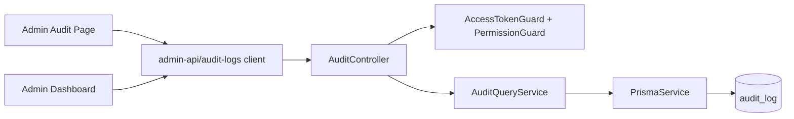
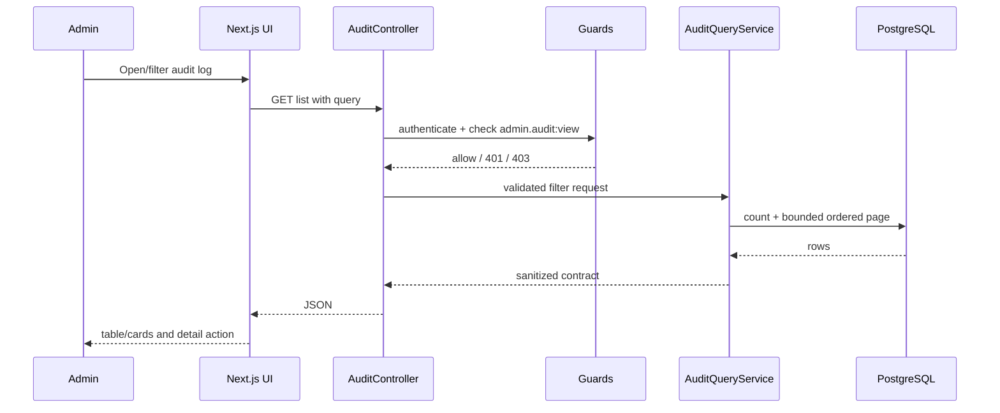

# Admin System Activity Audit Design

## Overview

The feature adds a read-only activity investigation surface to the Platform Admin portal. It queries the existing `audit_log` table, protects the endpoints with the current admin auth/RBAC guards, masks credential-like JSON values, and renders a responsive `/admin/audit-log` page plus a real dashboard activity preview.

### Goals

- Make existing audit rows searchable and inspectable.
- Preserve transactional write behavior and tenant/actor context.
- Provide a responsive, keyboard-accessible admin experience matching `DESIGN.md`.
- Keep response size and query cost bounded.

### Non-Goals

- No external SIEM, streaming, alerting, export, retention purge, or audit-row deletion.
- No global interceptor replacing existing service-owned audit writes.
- No tenant-user-facing audit screen.

## Architecture



The new query module is read-only. Existing domain modules continue to call `AuditLogger` for writes. `AppModule` imports the audit module once; the controller is mounted below the existing `/admin` API prefix convention.

### Technology Stack

| Layer | Choice | Role |
|---|---|---|
| Frontend | Next.js 16 App Router, React 19, TypeScript, Tailwind v4, lucide-react | `/admin/audit-log`, filters, table/cards, detail disclosure |
| Backend | NestJS 11, class-validator, Prisma 7 | guarded query API and masking |
| Data | PostgreSQL `audit_log` via Prisma | durable audit history; additive `createdAt` index only if required |
| Auth | Existing admin JWT + refresh retry | bearer and permission enforcement |

## Canonical Contracts & Invariants

| Contract Area | Canonical Decision | Applies To | Must Stay Consistent In |
|---|---|---|---|
| Auth/session | Both endpoints require `AccessTokenGuard`, `PermissionGuard`, and `admin.audit:view`; no tenant-user guard is accepted. | Backend API | Controller, tests, frontend error state |
| Transport/entrypoints | `GET /admin/audit-logs` lists; `GET /admin/audit-logs/:id` returns one event object; query page size is clamped to 1..100. | API/UI | DTOs, client, page, E2E |
| Data/persistence | Sort `(createdAt DESC, id DESC)`; filters execute in PostgreSQL before pagination; list/detail responses are sanitized. | DB/service/API | Query service, tests, UI |
| Retention | No retention or deletion behavior is introduced in this feature. | Data lifecycle | Requirements, tasks |
| Runtime output | Dashboard preview and full page use the same list response contract; static activity arrays are removed from the activity path. | Frontend | API client, page, dashboard |

<!-- contract:AuditLogQueryResponse -->
```json
{
  "items": [
    {
      "id": "uuid",
      "tenantId": "uuid|null",
      "actorType": "PLATFORM_ADMIN|USER|SYSTEM",
      "actorId": "string|null",
      "actorRoleCode": "string|null",
      "action": "AuditAction",
      "resource": "string|null",
      "resourceId": "string|null",
      "createdAt": "ISO-8601",
      "before": "sanitized JSON|null",
      "after": "sanitized JSON|null"
    }
  ],
  "page": 1,
  "pageSize": 20,
  "total": 0
}
```

## System Flows



## Requirements Traceability

| Requirement | Design elements | Tasks |
|---|---|---|
| 1.1–1.5 | Query service, controller, list/detail contract | R1-01, R1-02 |
| 2.1–2.4 | Guards, permission seed, sanitizer | R0-01, R1-02, R2-01 |
| 3.1–3.3 | Action catalog and coordination-only provisioning boundary | R2-01 |
| 4.1–4.5 | API client, responsive page, detail disclosure | R3-01, R4-01 |
| 5.1–5.3 | Dashboard client query and link | R3-02, R4-01 |
| 6.1–6.3 | Index/query limits and acceptance fixture | R0-01, R1-01, R2-01 |
| 7.1–7.3 | Error handling, accessibility, automated/runtime checks | R1-01, R3-01, R4-01 |

## Components and Interfaces

| Component | Layer | Intent | Requirements | Contracts |
|---|---|---|---|---|
| AuditQueryService | Backend | Query/mask audit data | 1, 2, 6, 7 | Service/API |
| AuditController + DTOs | Backend | Guarded HTTP boundary | 1, 2, 7 | API |
| Audit permission/catalog | Backend/seed | Make audit access explicit | 2, 3 | Persistence |
| Audit API client | Frontend | Typed list/detail calls | 4, 5 | API |
| AuditLogPage | Frontend | Responsive investigation UI | 4 | Runtime |
| Dashboard activity adapter | Frontend | Reuse newest audit rows | 5 | Runtime |

### Backend query contract

- Query params: `page`, `pageSize`, `from`, `to`, `actorType`, `actorId`, `tenantId`, `action`, `resource`, `resourceId`, `q`.
- `q` is bounded to 100 characters and searches only approved actor/resource identifiers; no arbitrary JSON search.
- `pageSize` is clamped to 1..100; default 20.
- Detail returns one event object with the same event fields as a list item plus sanitized before/after values; it is not wrapped in `items/page/pageSize/total`.
- Errors: 400 invalid filters, 401 missing/invalid token, 403 missing permission, 404 unknown id, standard 5xx on database failure.

### Frontend implementation notes

- Use `adminFetch` and the existing auth store; do not create a second refresh mechanism. The dashboard activity preview is a client child component so the existing dashboard server page does not need to become a whole client component solely for bearer-token fetching.
- Use URL search params or local state with explicit Apply/Reset behavior; avoid loading all rows.
- Desktop table may show columns Date, Action, Actor, Tenant, Resource, Result. Mobile cards must show Date, Action, Actor, Resource without horizontal scrolling.
- Use existing admin tile accent `#3949AB` for navigation/activity identity, white surfaces, `#E6EAE6` borders, 48px controls, and visible focus rings.
- Use an accessible drawer/detail route rather than a centered filter dialog; follow `DESIGN.md` mobile filter guidance.

## Data Model and Performance

Reuse `AuditLog`. Add only an additive `createdAt` index if the query plan/acceptance fixture proves the existing indexes insufficient for global newest-first queries. Never change existing enum values or delete audit rows. All list queries use `select` to exclude fields not needed by the contract and apply `take <= 100`.

## Security, Reliability, and Rollback

- Mask recursively by case-insensitive key patterns for password, token, secret, hash, cookie, authorization, and credential material; preserve shape with `[REDACTED]`.
- Do not expose raw Prisma errors or SQL details.
- Rollback: revert the new module/controller/page and additive migration/seed entries; existing audit writes remain compatible because no existing enum is removed.
- Verification covers denial, masking, missing id, invalid filters, DB failure, large fixture timing, keyboard navigation, and route reachability.

## Unresolved Questions

- Product has not defined audit retention/archival or export policy; these are explicitly deferred.
