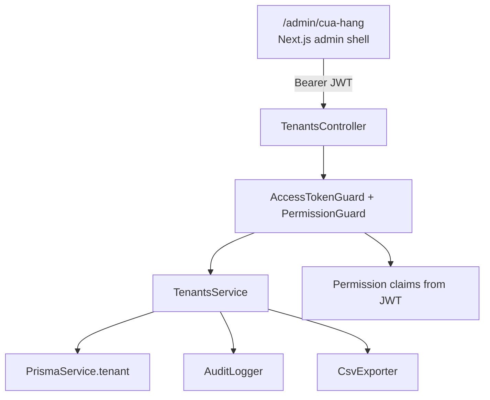
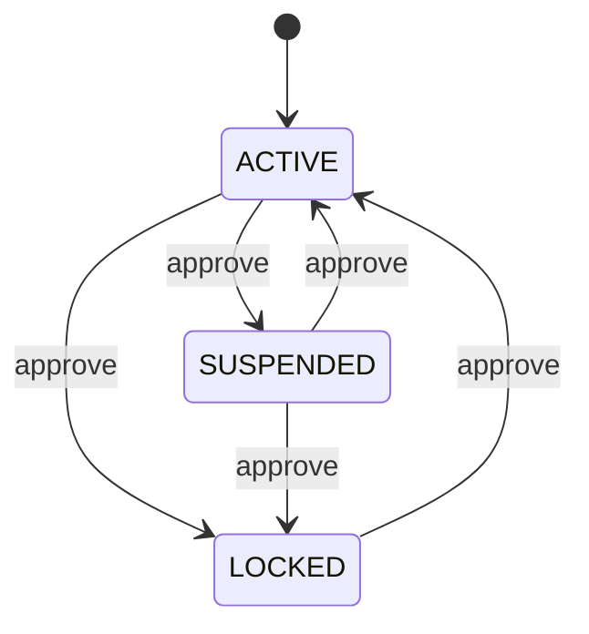
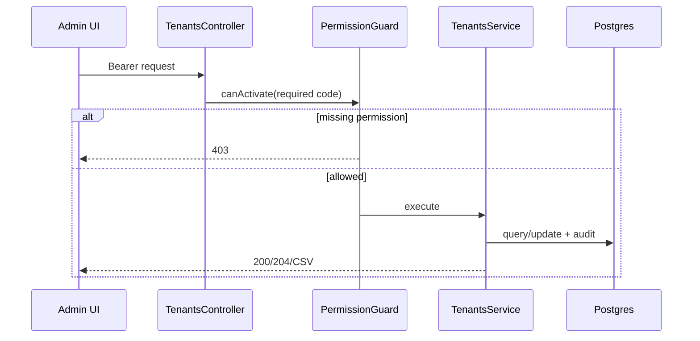

# Design Document — Admin Tenant Management

## Overview
**Purpose**: Deliver platform-admin tenant management so NomoGreen operators can list, inspect, edit, lifecycle-manage, and export stores with least-privilege authorization.
**Users**: Platform admins with role-derived permissions (`SUPER_ADMIN`, `SUPPORT`, custom roles).
**Impact**: Adds a platform `TenantModule`, permissioned REST endpoints, audit events, and the missing `/admin/cua-hang` UI already reserved in navigation.

### Goals
- Enforce `admin.tenant:*` permissions on every tenant management operation.
- Provide list, detail, profile edit, status transition, and CSV export against the existing `Tenant` model.
- Keep mutations transactionally audited and lifecycle transitions explicit.
- Wire the existing admin nav route into a real page.

### Non-Goals
- Tenant self-registration, impersonation, deletion, billing, or tenant-user RBAC.
- Custom permission builder.
- Audit log viewer UI.
- Bulk status changes.
- **Downstream status enforcement** (session invalidation, Redis flush, tenant-API deny on `SUSPENDED`/`LOCKED`). This feature is **metadata-only status**: it writes `Tenant.status` and audits the transition. Runtime enforcement is owned by a future `tenant-status-enforcement` spec.

## Architecture

### Existing Architecture Analysis
- Platform schema already includes `Tenant` with status enums and soft-delete field.
- Admin auth foundation issues JWT access tokens; RBAC foundation adds permission claims and `PermissionGuard`.
- Admin UI shell and permission-gated nav already exist; tenant page is still a stub target.
- Module-per-domain pattern under `backend/src/platform/*` is the required boundary.

### Architecture Pattern & Boundary Map



**Architecture Integration**:
- Selected pattern: NestJS feature module under `src/platform/tenants/`.
- Domain boundary: platform tenant operations only; no tenant-user data mutation.
- Existing patterns preserved: DTO validation, Prisma transactions, permission decorator, admin shell.
- New components rationale: dedicated service owns lifecycle rules and export limits.

### Technology Stack

| Layer | Choice / Version | Role in Feature | Notes |
|-------|------------------|-----------------|-------|
| Frontend | Next.js admin zone | `/admin/cua-hang` list/detail/edit/export UI | Reuse admin shell + permission helpers |
| Backend | NestJS 11 | REST endpoints + guards | Module under platform |
| Data | Prisma 7 + PostgreSQL | `Tenant` persistence | Existing model |
| AuthZ | PermissionGuard + `@RequirePermission` | Operation-level least privilege | Codes already reserved |
| Audit | AuditLogger + audit_log | Mutation/export trail | Transactional with writes |

## Canonical Contracts & Invariants

| Contract Area | Canonical Decision | Applies To | Must Stay Consistent In |
|---------------|--------------------|------------|-------------------------|
| Auth / session | Every route uses `@UseGuards(AccessTokenGuard, PermissionGuard)` and exact metadata: list/detail=`admin.tenant:view`, edit=`admin.tenant:edit`, status=`admin.tenant:approve`, export=`admin.tenant:export`. SUPER_ADMIN bypass follows RBAC foundation. **Revocation/TTL of JWT permission claims is owned by `admin-rbac-user-management`**; this feature MUST test high-impact ops (export, status) against a token issued before role removal and document the observed denial window. | Controller, FE action gating, R3 matrix | design, tasks, tests |
| Transport / entrypoints | REST under `/admin/tenants`: `GET /`, `GET /:id`, `PATCH /:id`, `POST /:id/status`, `GET /export`. FE route is `/admin/cua-hang`. Object routes return **uniform HTTP 404** for missing, soft-deleted, or (when authorized-but-not-found); unauthorized callers without the required permission receive **HTTP 403** with no tenant payload and no existence leak beyond that code. | Controller, FE pages/api clients | design, tasks |
| Data / persistence | Existing `Tenant` table only. Editable fields: `name`, `tenantType`, `mode`, `logoUrl`. **`logoUrl` MUST be HTTPS URL (or null), max 2048 chars, no `javascript:`/`data:`/private-network hosts.** Status changes only via status endpoint with **atomic conditional update** `WHERE id=? AND status=expected AND deletedAt IS NULL`. Soft-deleted tenants excluded from list/detail/export/mutation. Profile PATCH requires **`If-Match: <updatedAt ISO>`** (or body `expectedUpdatedAt`); stale → HTTP 409. List order: **`createdAt DESC, id DESC`**. Free-text `q` maxLength 100, trimmed. | Service, Prisma queries | design, tasks |
| Deletion / retention policy | No delete endpoint. Soft-deleted tenants remain inaccessible through this feature; no hard-delete and no re-registration lock introduced. Status changes are **metadata-only** — no session/Redis/API enforcement in this feature. | Service, API | design, tasks |
| Audit / transaction | Mutations (profile edit, status) MUST use `AuditLogger.run(input, stateChange)` so tenant write + audit row share one `prisma.$transaction`. Export: commit `TENANT_EXPORT` audit **before** sending the CSV body; partial client disconnect still counts as successful export for audit. `reason` maxLength 500 (strip CRLF); `userAgent` maxLength 512. | Service, AuditLogger | design, tasks, tests |
| Generated artifacts / runtime outputs | CSV export content-type `text/csv`, columns fixed to `id,slug,name,tenantType,mode,status,createdAt,updatedAt`, max 10,000 rows via **`findMany({ take: 10001 })`** (413 if 10001 returned). **Formula-safe CSV**: values starting with `=`, `+`, `-`, `@` prefixed with `'`. Bounded buffer only (no streaming choice). | Export endpoint, FE download | design, tasks |
| Permission grants | Role matrix (seed): `SUPER_ADMIN` → all four codes via guard bypass (no grant rows); `SUPPORT` → all four (`admin.tenant:view|edit|approve|export`); `BILLING` → none; custom roles → no default grants. Codes already reserved in `seed-admin-rbac.ts`. | Seed, R3 matrix | design, tasks, tests |
| Detail aggregates | `counts.users` = `_count.users`; `counts.subscriptions` = `_count.subscriptions` (all statuses); `counts.openTickets` = count of `supportTickets` where `status IN (OPEN, IN_PROGRESS)`. Relations: `Tenant.users`, `Tenant.subscriptions`, `Tenant.supportTickets`. | Service detail query | design, tasks |

### Machine-checkable contracts

<!-- contract:TenantListItem -->
```json
{
  "id": "string",
  "slug": "string",
  "name": "string",
  "tenantType": "HOUSEHOLD|RETAIL_DEALER|COOPERATIVE|DISTRIBUTOR|FARM",
  "mode": "SIMPLE|ADVANCED",
  "status": "ACTIVE|SUSPENDED|LOCKED",
  "logoUrl": "string|null",
  "createdAt": "string",
  "updatedAt": "string"
}
```

<!-- contract:TenantDetail -->
```json
{
  "id": "string",
  "slug": "string",
  "name": "string",
  "tenantType": "HOUSEHOLD|RETAIL_DEALER|COOPERATIVE|DISTRIBUTOR|FARM",
  "mode": "SIMPLE|ADVANCED",
  "status": "ACTIVE|SUSPENDED|LOCKED",
  "logoUrl": "string|null",
  "createdAt": "string",
  "updatedAt": "string",
  "counts": {
    "users": "number",
    "subscriptions": "number",
    "openTickets": "number"
  }
}
```

<!-- contract:TenantStatusTransition -->
```json
{
  "status": "ACTIVE|SUSPENDED|LOCKED",
  "reason": "string|null"
}
```

## System Flows

### Status transition


### Permissioned request


## Requirements Traceability

| Requirement | Summary | Components | Interfaces | Flows |
|-------------|---------|------------|------------|-------|
| 1.x | List/search | TenantsService.list, TenantListPage | GET /admin/tenants | Filtered pagination |
| 2.x | Detail/edit | TenantsService.get/update, TenantDetailPage | GET/PATCH /admin/tenants/:id | Profile mutation + audit |
| 3.x | Lifecycle | TenantsService.transitionStatus | POST /admin/tenants/:id/status | Status state machine |
| 4.x | Export | TenantsService.exportCsv | GET /admin/tenants/export | Bounded CSV |
| 5.x | Permission enforcement | PermissionGuard, seed check | All routes | Deny-by-default |
| 6.x | Frontend | /admin/cua-hang pages + API client | FE navigation | Permission-gated UI |
| 7.x | Performance/reliability | Indexed queries, transactions | Service | List/detail/export |
| 8.x | Security | Guards, safe errors, audit | All routes | AuthZ + privacy |

## Components and Interfaces

| Component | Domain/Layer | Intent | Req Coverage | Key Dependencies | Contracts |
|-----------|--------------|--------|--------------|------------------|-----------|
| TenantsModule | Backend platform | Own tenant management surface | 1-8 | PrismaModule, Auth guards, AuditModule | API |
| TenantsController | Backend API | HTTP entrypoints + permission metadata | 1-5,8 | AccessTokenGuard, PermissionGuard | TenantListItem, TenantDetail |
| TenantsService | Backend domain | Query, edit, transition, export rules | 1-5,7,8 | PrismaService, AuditLogger | TenantStatusTransition |
| TenantAdminPages | Frontend admin | Operator UX | 6 | admin shell, permission helpers, admin API client | TenantListItem, TenantDetail |

### Backend

#### TenantsController
| Field | Detail |
|-------|--------|
| Intent | Expose permissioned tenant management endpoints |
| Requirements | 1.1-1.4, 2.1-2.5, 3.1-3.5, 4.1-4.5, 5.2-5.5, 8.1-8.4 |

**API Contract**
| Method | Endpoint | Permission | Request | Response | Errors |
|--------|----------|------------|---------|----------|--------|
| GET | /admin/tenants | admin.tenant:view | query: q,status,page,pageSize | `{ items: TenantListItem[], page, pageSize, total }` | 400,401,403 |
| GET | /admin/tenants/:id | admin.tenant:view | path id | TenantDetail | 401,403,404 |
| PATCH | /admin/tenants/:id | admin.tenant:edit | body: name?,tenantType?,mode?,logoUrl?,expectedUpdatedAt; header If-Match optional | TenantDetail | 400,401,403,404,409 |
| POST | /admin/tenants/:id/status | admin.tenant:approve | TenantStatusTransition (+ server uses current DB status) | TenantDetail | 400,401,403,404,409 |
| GET | /admin/tenants/export | admin.tenant:export | same filters as list | text/csv (formula-safe) | 401,403,413 |

#### TenantsService
**Responsibilities & Constraints**
- Own all Prisma queries for platform tenants.
- Exclude soft-deleted tenants (`deletedAt IS NULL` on every read/write).
- Enforce transition map via **atomic conditional update** (not read-then-write).
- Write audit rows via `AuditLogger.run` so mutation + audit share one `$transaction`.
- Profile PATCH: optimistic concurrency via `expectedUpdatedAt` / `If-Match`.
- Export: `take: 10001` cap, formula-safe CSV, audit before body.

**Status transition map**
```
ACTIVE: [SUSPENDED, LOCKED]
SUSPENDED: [ACTIVE, LOCKED]
LOCKED: [ACTIVE]
```

**Atomic status update (required)**
```
UPDATE tenant
SET status = :next, updatedAt = now()
WHERE id = :id AND status = :expectedCurrent AND deletedAt IS NULL
-- if affected_rows = 0 → HTTP 409 (or 404 if row missing/soft-deleted)
```

**Detail aggregate mapping (schema-grounded)**
| Count field | Prisma relation | Filter |
|-------------|-----------------|--------|
| `counts.users` | `users` | none (all non-deleted users per schema) |
| `counts.subscriptions` | `subscriptions` | none (all statuses) |
| `counts.openTickets` | `supportTickets` | `status IN (OPEN, IN_PROGRESS)` |

### Frontend

#### /admin/cua-hang
- List page with search, status filter, pagination, export button.
- Detail drawer/page with profile form and status action menu.
- Action visibility:
  - view only => no edit/status/export controls
  - edit => profile form
  - approve => status actions
  - export => export button

## Data Models

### Domain Model
- Aggregate: `Tenant` (platform root).
- Value states: `TenantType`, `TenantMode`, `TenantStatus`.
- Lifecycle invariant: status changes only through transition map.
- Soft-delete invariant: `deletedAt IS NULL` for all feature queries.

### Physical Data Model
Reuse existing table `tenant`. No migration required for core fields. If list performance needs it, ensure indexes already present on `status` and `deletedAt` remain used by queries.

### Data Contracts & Integration
- Request/response JSON contracts defined above.
- Audit action codes used by this feature:
  - `TENANT_UPDATE`
  - `TENANT_STATUS_CHANGE`
  - `TENANT_EXPORT`
- If `AuditAction` enum lacks these values, add them through a migration task before service write paths.

## Error Handling
- 400: invalid DTO/enum/query (incl. blank name, invalid logoUrl scheme, `q` > 100 chars, `reason` > 500).
- 401: missing/invalid access token.
- 403: authenticated but missing required permission; body is non-sensitive; no tenant payload.
- 404: tenant not found or soft-deleted (after authz for object routes).
- 409: invalid status transition/no-op, concurrent status conflict, stale `expectedUpdatedAt` on PATCH.
- 413: export `take:10001` returned 10001 rows (over cap).
- 5xx: transaction failure; no partial mutation/audit.

## Testing Strategy
- Unit: transition map, filter validation, export row-cap, DTO whitelist.
- Integration: guarded routes with permission matrix, audit row creation, 403/404/409/413 paths.
- E2E: login as SUPER_ADMIN and limited-role admin; list/edit/status/export; unauthorized denial.
- Frontend smoke: route render, action visibility by permission, error toast on 403/409/413.

## Security Considerations
- Deny by default via permission metadata + guard.
- Object-level load after authorization.
- No client-side-only authorization.
- Safe denial responses without tenant payload.
- Export and mutation always audited.
- No passwords/tokens in logs.

## Performance & Scalability
- Default page size 20, max 100.
- List avoids relation joins; detail uses `_count`.
- Export hard-capped at 10,000 rows.
- Target p95 list/detail < 500ms for local verification up to 10k tenants.

## Migration Strategy
1. **Preflight:** `admin-rbac-user-management` PermissionGuard + permission-bearing claims verified (R0-01 acceptance test).
2. Add `AuditAction` values `TENANT_UPDATE`, `TENANT_STATUS_CHANGE`, `TENANT_EXPORT` via **Prisma migration artifact** (not generate-only); deploy migration before app code that references them.
3. Extend `SUPPORT_GRANTS` in `seed-admin-rbac.ts` with all four `admin.tenant:*` codes; re-seed idempotently.
4. Ship TenantModule + FE pages behind permission checks.
5. Verify negative paths + permission matrix before broader role grants.
6. Rollback: remove module routes/pages; reverse enum migration only if no audit rows reference new values; data remains valid because no destructive schema rewrite is required.

## Role → Permission Matrix (seed)

| Role | admin.tenant:view | admin.tenant:edit | admin.tenant:approve | admin.tenant:export |
|------|-------------------|-------------------|----------------------|---------------------|
| SUPER_ADMIN | yes (guard bypass) | yes (bypass) | yes (bypass) | yes (bypass) |
| SUPPORT | yes (grant row) | yes (grant row) | yes (grant row) | yes (grant row) |
| BILLING | no | no | no | no |
| custom | no default | no default | no default | no default |

## Supporting References
- `specs/admin-rbac-user-management/design.md` permission taxonomy.
- `backend/prisma/seed-admin-rbac.ts` reserved `admin.tenant` codes.
- OWASP Authorization Cheat Sheet (deny-by-default, least privilege, object-level checks).
