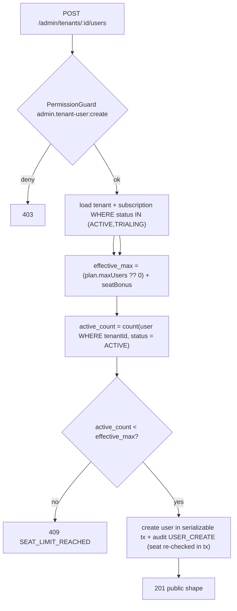

# Design — admin-tenant-provisioning

## Context & Overview

Add a transactional **tenant provisioning** capability and a **tenant-user management** module to the admin control plane. Today `TenantsController` cannot create tenants and there is no way to manage a store's users from the portal. This spec closes both gaps while deferring plan/subscription assignment to the existing `admin-plan-subscription-management` flow.

Design tier: **Deep** / discovery **full** — multi-table transaction, additive schema enum, new permissions, seat enforcement, BE↔FE contracts.

## Architecture

```
Admin Portal (Next.js)
  ├─ /admin/tenants  → "Tạo cửa hàng" → CreateTenantForm ──POST /admin/tenants──┐
  └─ /admin/tenants/[id] → TenantUsersPanel ──/admin/tenants/:id/users*──┐      │
                                                                         ▼      ▼
Backend (NestJS)                                          TenantUsersController  TenantsController.create
  ├─ TenantsController.create()  → TenantsService.create() ── prisma.$transaction ──▶ tenant + owner user + audit
  ├─ TenantUsersController (new) → TenantUsersService (new) ── seat check + user CRUD + audit
  ├─ PasswordService.hash() / generate()  (reuse + extend)
  ├─ AuditLogger  (reuse; extend to accept an injected tx client; new actions TENANT_CREATE, USER_CREATE)
  └─ Prisma: tenant, user, role(per-tenant OWNER/MANAGER/STAFF seeded in tx), subscription(read for seat)
```

## Data Flow — tenant creation (transactional)

```mermaid
sequenceDiagram
    participant UI as Admin UI
    participant C as TenantsController
    participant S as TenantsService
    participant DB as Prisma (tx)
    participant A as AuditLogger

    UI->>C: POST /admin/tenants {tenant, owner}
    C->>C: AccessTokenGuard + PermissionGuard(admin.tenant:create)
    C->>S: create(dto, actorCtx)
    S->>S: normalize slug, derive mode, validate required username
    S->>S: resolve password (provided XOR generate); hash
    S->>DB: $transaction begin
    DB->>DB: seed 3 per-tenant roles (OWNER/MANAGER/STAFF, tenantId=new)
    DB->>DB: tenant.create()  (unique slug → P2002 → 409 SLUG_TAKEN)
    DB->>DB: user.create(OWNER role=seeded, tenantId)  (unique username → P2002 → 409)
    DB->>A: audit TENANT_CREATE + USER_CREATE via tx client (same tx)
    DB-->>S: commit  (any failure → full rollback, R1.2)
    S-->>C: {tenant, owner(public), generatedPassword?}
    C-->>UI: 201
```

## Data Flow — seat enforcement on tenant-user create



## Canonical Contracts & Invariants

- **Auth/transport:** All routes under `@UseGuards(AccessTokenGuard, PermissionGuard)` with `@RequirePermission(...)`, identical to `TenantsController`/`AdminUsersController`. Actor context: `{ actorId, actorRoleCode, ipAddress?, userAgent? }`.
- **Persistence invariant (R8.2):** A Tenant never exists without ≥1 OWNER. Enforced by single `prisma.$transaction` in `TenantsService.create`.
- **Password invariant (R8.1):** `passwordHash` never leaves the service; generated plaintext returned once, never logged/audited.
- **Seat invariant:** `effective_max_users = (activeSubscription?.plan.maxUsers ?? 0) + tenant.seatBonus` where `activeSubscription` is the subscription with `status IN (ACTIVE, TRIALING)` (most-recent if several); `active_count` counts `status = ACTIVE` only. Seat check runs inside the mutating serializable transaction (no read-then-write TOCTOU). First owner is created with the tenant and is NOT subject to the seat check. `seatBonus` defaults to 10 at creation so a plan-less tenant has usable seats.
- **Role invariant:** each tenant owns three role rows `OWNER|MANAGER|STAFF` seeded (`tenantId=<tenant>`, permissions cloned from system templates) inside the creation transaction; tenant users reference their own tenant's role rows. Last active OWNER is protected under a serializable guard (R3.5).
- **Uniqueness (R8.4):** rely on DB constraints `tenant.slug @unique` and `user @@unique([tenantId, username])`; map Prisma `P2002` to 409. `phone`/`email` are not uniqueness-constrained.
- **Audit atomicity:** `AuditLogger` is extended with a method that accepts an injected `Prisma.TransactionClient` and writes N rows; provisioning calls it inside the outer `$transaction` so `TENANT_CREATE` + `USER_CREATE` commit or roll back atomically with tenant+user (never the self-transacting `run()`).

<!-- contract:CreateTenantRequest -->
```ts
// POST /admin/tenants request body
interface CreateTenantRequest {
  tenant: {
    name: string;                 // 1..200
    slug: string;                 // normalized ^[a-z0-9]+(?:-[a-z0-9]+)*$ , 3..63
    tenantType: 'HOUSEHOLD' | 'RETAIL_DEALER' | 'COOPERATIVE' | 'DISTRIBUTOR' | 'FARM';
    logoUrl?: string | null;      // HTTPS only, non-private host
    seatBonus?: number;           // 1..999, default 10
  };
  owner: {
    fullName: string;             // 1..200
    username: string;             // REQUIRED (user.username is NOT NULL), unique per tenant
    phone?: string;
    email?: string;
    mustChangePassword?: boolean; // default false
  } & ( { password: string } | { generatePassword: true } ); // exactly one
}
```
<!-- /contract:CreateTenantRequest -->

<!-- contract:TenantOwnerCreatedResponse -->
```ts
// 201 response for POST /admin/tenants
interface TenantOwnerCreatedResponse {
  tenant: {
    id: string; slug: string; name: string;
    tenantType: string; mode: string; status: string;
    logoUrl: string | null; seatBonus: number;
    createdAt: string; updatedAt: string;
  };
  owner: {                        // public shape — NEVER passwordHash
    id: string; tenantId: string; fullName: string;
    username: string; phone: string | null; email: string | null;
    roleCode: 'OWNER'; status: 'ACTIVE'; mustChangePassword: boolean;
    createdAt: string;
  };
  generatedPassword: string | null; // present once iff generatePassword was true
}
```
<!-- /contract:TenantOwnerCreatedResponse -->

<!-- contract:TenantUserPublic -->
```ts
// Tenant user public shape (list/create/edit responses) — NEVER passwordHash
interface TenantUserPublic {
  id: string; tenantId: string; fullName: string;
  username: string; phone: string | null; email: string | null;
  roleCode: 'OWNER' | 'MANAGER' | 'STAFF';
  status: 'ACTIVE' | 'DISABLED';
  mustChangePassword: boolean;
  lastLoginAt: string | null;
  createdAt: string; updatedAt: string;
}
```
<!-- /contract:TenantUserPublic -->

<!-- contract:SeatUsage -->
```ts
// Seat usage surfaced to UI (embedded in user list response)
interface SeatUsage {
  activeCount: number;        // users status = ACTIVE
  effectiveMaxUsers: number;  // (plan.maxUsers ?? 0) + seatBonus
  planCode: string | null;    // null when tenant has no ACTIVE/TRIALING subscription
  seatBonus: number;
}
```
<!-- /contract:SeatUsage -->

## Backend module design

### TenantsService.create (extend existing service)
- Normalize slug (`trim → lowercase → regex assert`), derive `mode`, require `username`.
- Password: DTO is a discriminated union — `{ password }` XOR `{ generatePassword: true }`; reject neither/both (400 `PASSWORD_MODE_INVALID`). When generating, produce a 12+ char cryptographically-random plaintext (extend `PasswordService` with `generate()`), hash it; else hash provided `password`.
- `prisma.$transaction(async (tx) => {...})`: seed 3 per-tenant roles (`OWNER/MANAGER/STAFF`, `tenantId=<new>`, permissions cloned from system templates) → create tenant → create owner user (`createdByType=PLATFORM_ADMIN`, `createdById=actorId`, `status=ACTIVE`, `roleId=<seeded OWNER>`) → write both audit rows via `AuditLogger` extended to accept the `tx` client. Any failure rolls back all of the above.
- Map `P2002` on `slug` → 409 `SLUG_TAKEN`; on `(tenantId,username)` → 409 `USERNAME_TAKEN`.
- Route-mount self-check lives in R1-01: a permission-less request returns 403, proving the new `POST /admin/tenants` route resolves.

### TenantUsersController / TenantUsersService (new module)
Routes under `@Controller('admin/tenants/:tenantId/users')`:
| Method | Path | Permission | Action |
|---|---|---|---|
| GET | `` | `admin.tenant-user:view` | list + `SeatUsage` |
| POST | `` | `admin.tenant-user:manage` | create (seat-checked in tx) |
| PATCH | `:userId` | `admin.tenant-user:manage` | edit whitelisted fields only (`fullName/username/phone/email`) |
| PATCH | `:userId/role` | `admin.tenant-user:manage` | change role (separate from field edit; last-owner guard) |
| POST | `:userId/deactivate` | `admin.tenant-user:manage` | DISABLED (last-owner guard) |
| POST | `:userId/reactivate` | `admin.tenant-user:manage` | ACTIVE (seat re-check in tx) |
| POST | `:userId/reset-password` | `admin.tenant-user:manage` | reset (one-time secret, forces `mustChangePassword=true`) |

- Every handler asserts the `:userId` belongs to `:tenantId` (else 404 — R3.7); operators with tenant-scoped portal roles acting outside their scope get 403.
- PATCH `:userId` rejects any body key outside the whitelist with 400 `FIELD_NOT_ALLOWED` (no mass assignment of `tenantId/status/roleId/roleCode/passwordHash`).
- Last-owner guard: before DISABLED / role-change-away-from-OWNER / (future delete), count active OWNERs under a serializable transaction; block if it would reach 0 (409 `LAST_OWNER`).
- Reuse `AuditLogger` (tx-client variant); actions `USER_CREATE` for create and existing generic update/deactivate/reactivate/reset actions already in the enum where semantically correct; do NOT invent new enum values beyond `TENANT_CREATE`/`USER_CREATE` unless a task proves a gap.

### Schema / seed foundation (R0)
- Migration (isolated, enum-only): `ALTER TYPE "AuditAction" ADD VALUE 'TENANT_CREATE'; ADD VALUE 'USER_CREATE';` — Postgres enum add is non-transactional and MUST NOT share a migration transaction with other DDL; deploy this migration before any code emitting the values.
- Seed extension (`seed-admin-rbac.ts`): add permission codes `admin.tenant:create`, `admin.tenant-user:view`, `admin.tenant-user:manage` + Vietnamese labels + grants to SUPER_ADMIN and SALER only (R4.2–R4.3). Idempotent upsert following existing pattern.
- Per-tenant role seeding is runtime (inside `TenantsService.create` tx), not a static seed; it clones permission grants from the system `OWNER/MANAGER/STAFF` templates.

## Frontend design

- `frontend/lib/admin-api/tenants.ts` → add `createTenant(token, CreateTenantRequest): TenantOwnerCreatedResponse`.
- `frontend/lib/admin-api/tenant-users.ts` (new) → `listTenantUsers`, `createTenantUser`, `updateTenantUser`, `deactivate/reactivate`, `resetTenantUserPassword`. Reuse `adminFetch`.
- `frontend/app/admin/(quan-tri)/tenants/tao/page.tsx` (new route) + `components/admin/create-tenant-form.tsx` — gated by `admin.tenant:create`; "Tạo cửa hàng" button added to `tenant-list.tsx` action surface.
- `components/admin/tenant-users-panel.tsx` (new) mounted inside `tenants/[id]/page.tsx` under `tenant-detail-panel.tsx`; gated by `admin.tenant-user:view`; shows `SeatUsage` + actions via `Can`.

## Requirements Traceability

| Req | Design element |
|---|---|
| R1.1–R1.6 | TenantsService.create transaction, system OWNER role, audit rows |
| R2.1–R2.7 | CreateTenantRequest contract + service validation/normalization |
| R3.1–R3.7 | TenantUsersController routes + seat/last-owner/cross-tenant guards |
| R4.1–R4.4 | R0 migration + seed-admin-rbac extension |
| R5.1–R5.4 | create-tenant-form + tenants.ts client + tenant-list button |
| R6.1–R6.4 | tenant-users-panel + tenant-users.ts client + SeatUsage |
| R7.1–R7.3 | app.module registration + reachability task |
| R8.1–R8.5 | public shapes, atomic tx, indexed count, DB uniqueness, reused hardening |

## Security Assessment (OWASP)

- **A01 Broken Access Control:** every route permission-gated + cross-tenant 404 guard + last-owner guard.
- **A02/A09 Crypto/Logging:** Argon2id hashing reused; plaintext one-time only, excluded from logs/audit.
- **A03 Injection:** Prisma parameterized; enum/DTO validation via class-validator.
- **A04 Insecure Design:** atomic provisioning prevents orphan tenant; seat rule prevents unbounded users.
- **A05 Misconfiguration:** additive migration deployed before code; no weakening of existing grants.

## Risk Assessment

| Risk | Severity | Mitigation |
|---|---|---|
| Partial creation leaves orphan tenant | Critical | Single `$transaction` (roles+tenant+owner+audit); rollback test (R1.2) |
| Audit rows survive a rolled-back creation | High | `AuditLogger` tx-client variant writes inside the outer tx (never self-transacting `run()`) |
| Postgres enum add inside app tx fails | High | Isolated enum-only migration deployed first (R4.1) |
| Plan-less tenant blocks all users | Medium | `seatBonus` default 10 at creation gives usable seats before any plan |
| Concurrent last-owner demotion / seat overrun (TOCTOU) | High | Serializable transaction wraps check+mutate (R3.5/R3.6/R3.7) |
| Mass assignment via PATCH | High | Strict field whitelist; role change is a separate endpoint |
| Generated password leakage | High | One-time reveal, never logged/stored plaintext; reset forces `mustChangePassword` |
| Cross-tenant / out-of-scope user manipulation | High | `:userId ∈ :tenantId` → 404; tenant-scope mismatch → 403 |

## Unresolved Questions

- Password minimum-length/complexity policy: assume identical to existing admin `CreateAdminDto`; confirm shared constant in R1.
- Generated-password length/charset — task R1 fixes at ≥12 chars, alphanumeric+symbol, crypto RNG.
- Whether `AuditLogger` already exposes (or must gain) a `Prisma.TransactionClient`-accepting method — R0/R1 verify and extend if absent.
