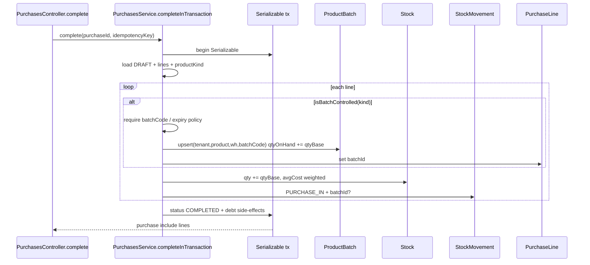
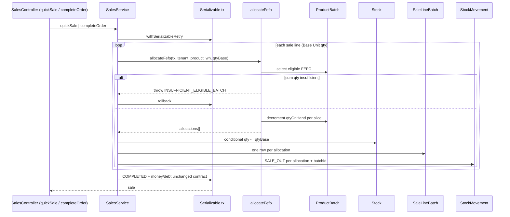

# Design: Core Stock Lifecycle

## Context

Tranche P1 sau taxonomy: nối runtime purchase/sale với `ProductBatch` + `SaleLineBatch` đã có trong Prisma. Nguồn chuẩn nghiệp vụ: `docs/core-business-catalog.md` §5–9 (batch/HSD/FEFO theo kind) và §11 (quy tắc kho chung). Code hiện tại: purchase đã upsert batch trong `completeInTransaction` (một phần R1); sale vẫn chỉ trừ `Stock.qty`.

## Scope alignment (catalog → spec)

| Catalog | Trong tranche này | Ngoài scope (expansion_policy) |
|---|---|---|
| §11.1 batch bật → tổng batch = `stock.qty` | Có — invariant cùng transaction | — |
| §11.1 movement append-only | Có — IN purchase / OUT sale gắn `batchId` | PURCHASE_RETURN / SALE_RETURN / ADJUSTMENT |
| §5.1 PESTICIDE lô+HSD+FEFO+chặn hết hạn/thu hồi | Có — batch control + FEFO | Cảnh báo 180/90/30, PHI/REI gate |
| §5.2 FERTILIZER lô/HSD tùy nhà SX | Có — policy optional/required theo kind | Reason ẩm/vón |
| §6 SEED / SEEDLING lô (HSD mềm / tuổi) | Có — batch code; expiry optional nếu policy cho | Adjustment chết/hao, gộp lô tuổi |
| §7 FEED lô+HSD+FEFO | Có | Reason mốc/bao mở |
| §8 VET_DRUG lô+HSD+FEFO+trace sale-to-lot | Có | Withdrawal display, bảo quản sai |
| §9 LIVESTOCK state machine sống | Không — chỉ batch nhận/xuất nếu kind controlled | Quarantine/dead/sellable |
| §10 AQUACULTURE | Không | Toàn bộ |
| Frontend / multi-warehouse transfer | Không | — |

## Per-kind batch policy (Phase 1)

Policy **hard-coded** trong service helper (không schema mới). Kind lấy từ `Product.productKind`.

| ProductKind | Inbound `batchCode` | Inbound `expiresAt` | Ghi chú catalog |
|---|---|---|---|
| `PESTICIDE` | **Required** | **Required** (reject null / past) | §5.1 HSD chính thức |
| `VET_DRUG` | **Required** | **Required** | §8 lô/HSD |
| `FEED` / `ANIMAL_FEED` (legacy) | **Required** | Recommended; reject past nếu có | §7 FEFO |
| `FERTILIZER` | Recommended; nếu có code thì upsert | Optional; reject past nếu có | §5.2 |
| `SEED` / `SEEDLING` / `CROP_SEED` (legacy) | **Required** | Optional (tuổi/HSD mềm) | §6 |
| `LIVESTOCK_SEED` | **Required** | Optional (không dùng HSD thuốc) | §9 batch nhận; state machine sau |
| Khác / non-controlled | Optional | Optional | Legacy tương thích |

Rules:

1. `isBatchControlled(kind)` = kind thuộc bảng Required batchCode.
2. Controlled + thiếu `batchCode` → `422 BATCH_REQUIRED` trước khi ghi stock.
3. `expiresAt` past (date < today UTC date) trên inbound controlled-required-expiry → `422 BATCH_EXPIRED_INBOUND`.
4. Không tự set `isRecalled` khi nhận; recall là path riêng (out of scope).
5. Upsert key: `@@unique([tenantId, productId, warehouseId, batchCode])` (schema sẵn).

## FEFO policy

Eligible batch:

- `tenantId`, `productId`, `warehouseId` khớp
- `isRecalled = false`
- `qtyOnHand > 0`
- `expiresAt IS NULL OR expiresAt >= startOfToday`

Sort deterministic:

1. `expiresAt ASC` (NULL last)
2. `createdAt ASC`
3. `id ASC`

Sale không đọc batch đã hết hạn / thu hồi dù `stock.qty` còn (catalog §5.1, §8, §11.3).

## Transaction invariant

- Boundary: `Prisma.TransactionIsolationLevel.Serializable` (đã dùng purchase/sales).
- Trong **cùng** transaction: đổi `Stock.qty` **và** tổng `ProductBatch.qtyOnHand` (cùng product/warehouse) theo cùng delta; movement + `SaleLineBatch` / `PurchaseLine.batchId` commit cùng lúc.
- Allocation fail → throw trước `COMPLETED`; không partial batch decrement.
- Concurrent sale: conditional update `qtyOnHand` (hoặc re-read + check) trong serializable; P2034 retry giữ pattern sales hiện có.

## FEFO allocator contract

Path: `backend/src/platform/inventory/fefo-allocator.ts` (transaction-scoped pure helper, nhận `tx`).

```ts
type FefoAllocateInput = {
  tenantId: string;
  productId: string;
  warehouseId: string;
  qtyBase: Prisma.Decimal | string | number; // > 0, Base Unit
};

type FefoAllocation = {
  batchId: string;
  batchCode: string;
  qty: Prisma.Decimal;
  expiresAt: Date | null;
};

// throws UnprocessableEntityException { reason: 'INSUFFICIENT_ELIGIBLE_BATCH' }
// when sum(eligible.qtyOnHand) < qtyBase
function allocateFefo(
  tx: Prisma.TransactionClient,
  input: FefoAllocateInput,
): Promise<FefoAllocation[]>;
```

Side effects **inside** `allocateFefo` (cùng `tx`):

1. Lock/read eligible batches FEFO order.
2. Decrement từng `ProductBatch.qtyOnHand` theo allocation.
3. Return list allocations (caller ghi `SaleLineBatch` + `StockMovement` OUT + giảm `Stock.qty`).

Caller (quick sale + order completion) **không** tự query batch ngoài helper.

Error codes:

| reason | Khi nào |
|---|---|
| `BATCH_REQUIRED` | Inbound controlled thiếu batchCode |
| `BATCH_EXPIRED_INBOUND` | Inbound HSD bắt buộc / past |
| `INSUFFICIENT_ELIGIBLE_BATCH` | Sale: đủ `stock.qty` nhưng thiếu batch hợp lệ, hoặc thiếu cả hai |
| `INSUFFICIENT_STOCK` | Giữ behavior hiện tại nếu còn path chỉ check aggregate (nên gộp vào eligible khi batch-controlled) |

## Data flow

### Purchase complete → batch receive



### Sale complete → FEFO allocate



## Risk assessment

| Risk | Severity | Mitigation |
|---|---|---|
| Concurrent sale oversell one batch | High | Serializable + conditional batch update / re-check qty |
| `stock.qty` ≠ sum batch (drift) | High | Same-tx dual write; verification tests assert equality after receive+sell |
| Controlled product complete without batch (legacy data) | Medium | `BATCH_REQUIRED` on complete; fixtures seed batchCode |
| Enough aggregate stock, all batches expired/recalled | Medium | Fail with `INSUFFICIENT_ELIGIBLE_BATCH`, not silent aggregate sale |
| FEFO sort diverge display vs write | Medium | Single helper; inventory list reuses same order constants |
| Idempotent purchase retry double batch | High | Keep existing COMPLETED short-circuit + idempotencyKey |
| Partial multi-line sale commit | High | One transaction whole document; throw before COMPLETED |
| Kind enum legacy aliases | Medium | Policy map accepts `ANIMAL_FEED`/`CROP_SEED` aliases |
| Returns reverse batch wrong lot | Out of scope | Documented deferred; do not claim complete |

## Traceability (catalog / req / task)

| Req | Catalog | Task | Implementation focus |
|---|---|---|---|
| R1.1 create/reuse batch + qtyOnHand | §11.1–11.2, §5–8 lô | R0-01 | `purchases.service.ts` upsert |
| R1.2 line + movement batchId | §11.1 movement | R0-01 | PurchaseLine + StockMovement |
| R1.3 reject invalid controlled inbound | §5.1/§8 HSD | R0-01 | policy helper + 422 |
| R2.1 FEFO non-recalled non-expired | §5.1/§7/§8/§11.3 | R1-01 | `fefo-allocator.ts` |
| R2.2 SaleLineBatch + movement batch | §8 sale-to-lot | R1-01 | sales quick + order complete |
| R2.3 atomic fail insufficient | §11.1 no partial | R1-01 | throw before COMPLETED |
| R2.4 tenant + warehouse scope | multi-tenant baseline | R1-01 | every query where clause |
| R3.1 focused tests | audit gap #3 | R1-02 | purchases + sales specs + receipt |

## Non-goals (restate)

Returns, stock adjustments, aquaculture, handbook runtime, multi-warehouse transfer, frontend screens, near-expiry notifications, livestock health state machine.
