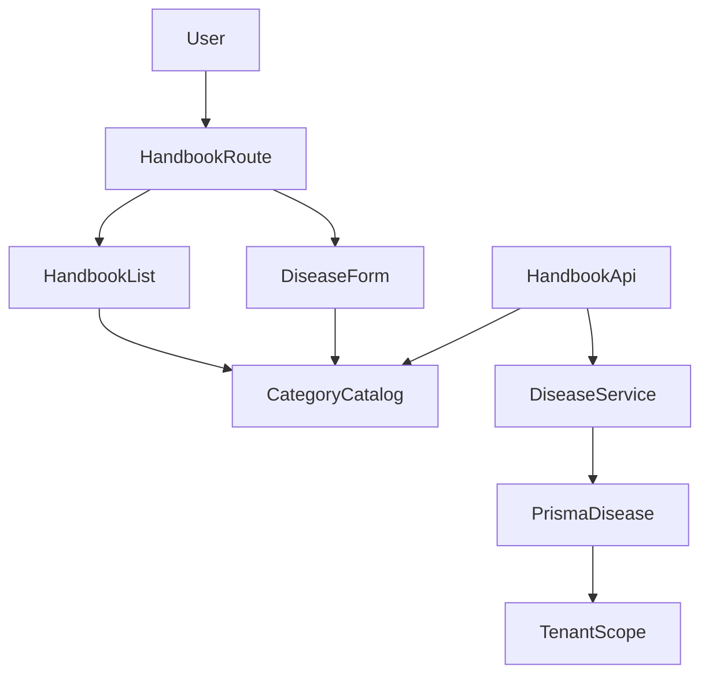
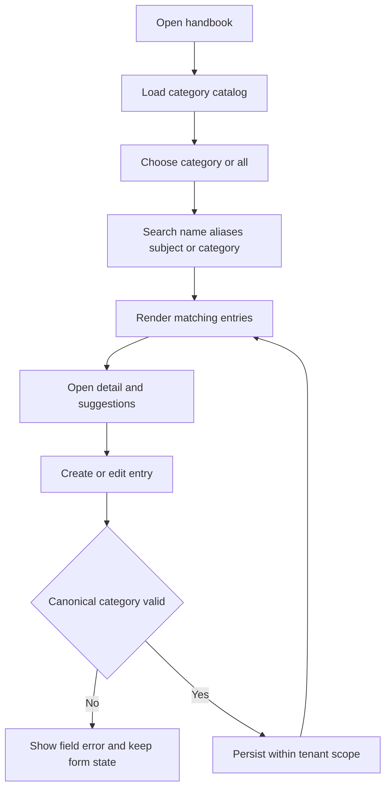

# Design Document

## Overview

This feature replaces the Handbook's broad three-domain filter with the five core-value categories requested by the product owner. It affects the category contract, tenant-scoped persistence/API boundary, and the existing mobile-first Handbook list/form while retaining disease/problem details and stock-aware suggestions.

The implementation is intentionally bounded: the Handbook remains a rule-based advice catalog. AI diagnosis, aquaculture as a category, sharing, reminders, and advanced fallback behavior remain outside the scope lock.

### Goals

- Make the five approved categories the only selectable Handbook categories.
- Preserve existing technical advice and recommendation behavior.
- Keep category data tenant-scoped, validated, searchable, and reversible.

### Non-Goals

- Product catalog redesign or renaming of tenant-editable product categories.
- New consultation formulas, AI, image recognition, or native mobile code.
- Splitting the combined first category or adding a sixth category.

## Requirements Traceability

| Requirement | Summary | Components | Interfaces | Flows |
|---|---|---|---|---|
| 1.1-1.3 | Canonical five-value catalog and safe unknown fallback | `HandbookCategoryCatalog`, migration mapper | Category contract | Load/migrate catalog |
| 2.1-2.4 | Filter/search/create/edit behavior | `HandbookList`, `DiseaseForm`, selectors | UI state contract | User browses and edits |
| 3.1-3.4 | Validation, persistence, migration, tenant isolation | Handbook service/controller, Prisma Disease | API + data contract | Request → guard → service → DB |
| 4.1-4.3 | Mobile/accessibility, recommendation invariants, regression proof | Existing Handbook components and tests | UI behavior | Render/filter/recommend |
| 5.1-5.2 | Bounded client/backend performance | selectors and list query | Pagination/filter query | Filter/search |
| 6.1-6.2 | Permission and tenant boundary | existing tenant guards + Handbook API | Auth context | Authorized request |
| 7.1-7.2 | Migration observability and rollback | migration/seed task | migration output | Deploy/rollback |

## Architecture

### Existing Architecture Analysis

- Frontend runtime entrypoint: `frontend/app/(app)/so-tay/page.tsx`; detail and edit routes are sibling pages.
- Frontend data source is currently `frontend/lib/handbook.ts` mock data; `suggestProducts` must remain category-agnostic.
- Backend persistence already has `Disease` and related tables in `backend/prisma/schema.prisma`, but no Handbook HTTP module was found.
- Existing visual rules are authoritative in `DESIGN.md`: Be Vietnam Pro, body text at least 16px, targets at least 48px, white/soft surfaces, primary `#5CAD45`, and separate routes for forms.

### Architecture Pattern & Boundary Map

Use a dedicated Handbook category catalog at the domain boundary. The category catalog is not a foreign key to tenant product `Category`.



### Technology Stack

| Layer | Choice / Version | Role in Feature | Notes |
|---|---|---|---|
| Frontend | Next.js 16, React 19, TypeScript, Tailwind v4 | Handbook list/form/detail and typed selectors | Reuse existing components and tokens |
| Backend | NestJS 11, class-validator, Prisma 7 | Tenant-scoped category validation and CRUD boundary | Follow existing guard/DTO patterns |
| Data | PostgreSQL through Prisma | Persist stable category value on `Disease` | Migration must preserve old rows |
| Verification | Vitest, Jest, existing build/lint commands | Unit/component/API/regression proof | No new test framework |

## Canonical Contracts & Invariants

| Contract Area | Canonical Decision | Applies To | Must Stay Consistent In |
|---|---|---|---|
| Transport / entrypoints | Handbook list/create/update APIs remain tenant-scoped and use the existing tenant auth/permission boundary; exact route names follow the repository's tenant product convention during implementation | Backend task, frontend adapter, tests | DTOs, controller, service, client |
| Data / persistence | Store a dedicated stable Handbook category identifier on `Disease`; do not reference mutable product `Category` rows | Prisma, migration, API, FE type | Schema, seed, DTO, UI catalog |
| Generated artifacts / runtime outputs | The five display labels come only from `HandbookCategoryCatalog`; no component may duplicate the literal list | FE/BE catalog modules, tests | List, form, detail, API serialization |

<!-- contract:HandbookCategory -->
```json
{
  "id": "CROP_PROTECTION_AND_FERTILIZER | CROP_SEEDLINGS | ANIMAL_FEED | VETERINARY_DRUGS | LIVESTOCK | UNCATEGORIZED",
  "label": "Thuốc bảo vệ thực vật + Phân bón | Cây giống | Thức ăn chăn nuôi | Thuốc thú y | Con giống | Chưa phân loại",
  "selectable": "true for the five canonical ids; false for UNCATEGORIZED",
  "legacyMapping": "CROP/LIVESTOCK/AQUACULTURE/GENERAL are mapped explicitly; unmappable values become UNCATEGORIZED"
}
```

## System Flows



Key decision: category changes affect classification only; they never re-rank or auto-add products. Existing pinned → ingredient → tag ordering and stock restrictions remain invariants.

## Components and Interfaces

| Component | Domain/Layer | Intent | Req Coverage | Key Dependencies | Contracts |
|---|---|---|---|---|---|
| `HandbookCategoryCatalog` | Shared domain | Own the five IDs, labels, order, and fallback | 1, 4, 5 | none | State |
| Handbook category persistence | Backend/data | Validate and store category under tenant scope | 3, 6, 7 | Prisma, tenant guard | API, State |
| Handbook list/form integration | Frontend/UI | Filter and edit using the canonical catalog | 2, 4, 5 | route components, catalog | State |
| Regression/reachability gate | Verification | Prove runtime wiring and preserved suggestion behavior | 4, 7 | FE/BE test commands | Runtime |

### Shared category catalog

- Stable IDs are uppercase strings in the canonical contract.
- The ordered array is the only source for display options.
- `UNCATEGORIZED` is renderable for legacy rows but is not a valid new-write selection.
- The catalog must be typed without `any` and reused by list, form, detail, API mapping, and tests.

### Backend persistence and API

- Add a dedicated category field to `Disease` rather than changing `AgriDomain` semantics.
- The service derives tenant scope from the authenticated request context; client tenant IDs are ignored/rejected.
- Create/update validation accepts only the five selectable IDs; reads can include `UNCATEGORIZED`.
- List queries apply tenant and category filters before serialization and preserve existing pagination.
- Migration maps legacy domain values only through an explicit mapping table; unmappable rows remain visible as `UNCATEGORIZED` and are reported.

### Frontend list/form

- Replace `HandbookField`/three-domain filter options with the canonical category type and options.
- Preserve the current search fields and `suggestProducts` signature.
- Use existing `ListFilterBar`, route form pattern, and design tokens; do not introduce a modal or new visual system.
- The form must show a labeled category control and reject empty/new invalid selection before submit.

## Data Models

### Logical Data Model

`Disease` remains the Handbook aggregate root. Add one non-null category for new records, with a temporary/defaultable migration value `UNCATEGORIZED` for legacy rows. Keep `DiseaseIngredient`, `DiseaseProductPin`, `DiseaseConsultField`, `DiseaseProductFallback`, and sale snapshot relations unchanged.

Recommended index: `(tenantId, handbookCategory, deletedAt)` for list/filter queries if the existing query volume justifies it; do not add a speculative index without measuring the current query plan.

### Migration and rollback

- Deploy the additive field/enum and backfill in a transaction or resumable migration as supported by the existing Prisma migration conventions.
- Write a report/log count for mapped and unmapped rows.
- Rollback restores the previous application/schema version; no Disease, pin, ingredient, or sale snapshot rows are deleted.

## Error Handling

- Invalid category on create/update: field-level 400 response; preserve submitted form values.
- Missing tenant/permission: existing guard response; do not return category results.
- Legacy unmappable category: read as `Chưa phân loại`, log/report it, do not silently classify.
- Category filter with no rows: existing clear empty state with filter and query preserved.

## Testing Strategy

- Unit: catalog order/labels, legacy mapping, unknown fallback, selector filtering, and recommendation invariance.
- Component: `/so-tay` filters, search, empty state, and create/edit category validation at mobile and desktop viewports.
- Backend integration/E2E: valid/invalid category writes, list filtering, tenant isolation, and permission rejection.
- Build/regression: `pnpm --dir frontend test`, `pnpm --dir frontend lint`, `pnpm --dir frontend build`, `pnpm --dir backend test`, and `pnpm --dir backend build` as applicable to the implemented slice.

## Security Considerations

- Preserve existing tenant access guards and Handbook permissions; UI visibility is not authorization.
- Validate category values at the backend boundary and never trust client tenant identifiers.
- Do not expose internal migration details or raw tenant data in user-facing errors.

## Performance Considerations

- Keep the client selector pure and O(n) over filtered Handbook entries.
- Apply tenant/category filters in the database once the API is runtime-backed.
- Preserve pagination and avoid loading product recommendations until an entry detail/suggestion view needs them.

## Unresolved Questions

- Confirm final seed mapping for existing disease records before applying the migration; the fallback contract is already fixed.
