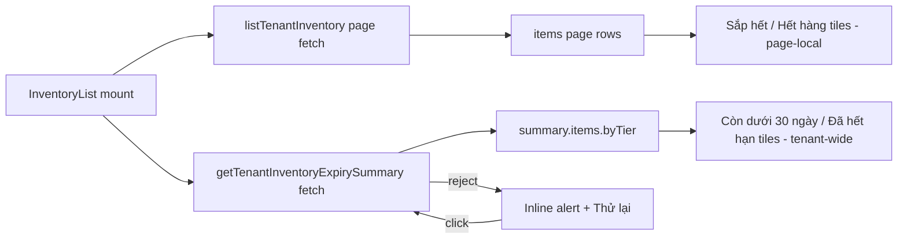

# Design: Inventory Expiry Tenant-Wide Summary UI

## Overview

Wire the already-shipped `GET /tenant/inventory/expiry-summary` into
`InventoryList` so the two expiry alert tiles ("Còn dưới 30 ngày", "Đã hết
hạn") count across the whole tenant, not just the current page. No backend or
schema change. No new dependency.

## Canonical Contracts & Invariants

<!-- contract:InventoryExpirySummaryUI -->
```json
{"client":"getTenantInventoryExpirySummary() from frontend/lib/tenant-inventory-api.ts","fetch":"independent useEffect, no deps besides a manual retry tick","tiles":"CRITICAL and EXPIRED counts read from summary.items.byTier, never from the paginated items array","states":"loading -> Skeleton per tile; error -> single inline alert spanning both tile slots with a Thử lại button; success -> AlertTile as before"}
```

The paginated list fetch (`listTenantInventory`) and the summary fetch remain
two independent `useEffect`s with independent `loading`/`error` state. A
failure in one must not block or clear the other.

## Component and data flow



## Implementation notes

- `InventoryList` gains `summary`, `summaryLoading`, `summaryError`,
  `summaryTick` state. A second `useEffect` keyed off `summaryTick` calls
  `getTenantInventoryExpirySummary()`; incrementing `summaryTick` re-fires it
  (the existing repo pattern used elsewhere, e.g. `stockTick`/`salesTick` in
  `frontend/components/app/reports/reports-page.tsx`).
- `criticalCount`/`expiredCount` are derived from
  `summary?.items.byTier.CRITICAL ?? 0` / `summary?.items.byTier.EXPIRED ?? 0`
  instead of `items.filter(...)`.
- Tile grid slot for the two expiry tiles renders one of: two `Skeleton`
  placeholders (loading), one `col-span-2` inline error with retry (error), or
  the two `AlertTile`s (success) — mutually exclusive, matching the existing
  `ListSkeleton`/error-card conventions already used for the page-local list
  fetch in the same file.
- Uses the existing `Skeleton` primitive (`frontend/components/ui/skeleton.tsx`)
  and the same destructive color pair (`#ffebee`/`#c62828`) already used by the
  "Đã hết hạn" tile and the page-level error card, per DESIGN.md §21/§13.

## Requirements Traceability

| Requirement | Design | Task |
|---|---|---|
| R1.1-R1.3 | independent summary fetch, byTier counts | R0-01 |
| R2.1-R2.3 | Skeleton/error/retry states, independent failure domains | R0-01 |
| R3.1-R3.2 | component tests, frontend test run | R0-01 |

## Test strategy

Component tests in
`frontend/components/app/inventory/inventory-list.test.tsx`: tenant-wide count
diverges from page-local count; loading placeholder while summary pending;
error alert with retry re-fetching and recovering. Command: `pnpm --dir
frontend test`.

## Security, performance, rollback

No new endpoint, no new auth surface; reuses `userFetch` via the existing
typed client. One extra GET per list-mount, bounded tenant-wide aggregate
(same query the backend already serves for `specs/core-stock-lifecycle`
follow-on work). Rollback: revert the two touched frontend files: the tiles
fall back to page-local counts.

## Risk Assessment

| Risk | Severity | Mitigation |
|---|---|---|
| Summary fetch failure hides both tiles indefinitely | Medium | Inline retry button re-fires the request without reloading the page. |
| Two independent fetches racing on unmount | Low | Both effects use an `active` flag guard, matching the existing page fetch pattern in the same file. |
