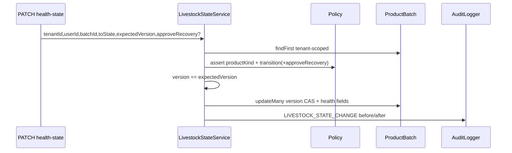

# Design — livestock-cas-recovery

## Context

First slice: `LivestockStateService.changeState` + policy only allows `HEALTHY → *`; FEFO CAS already uses `version`+`healthState`. Gaps: recovery, adjustment/return qty updates ignore `version` (race can resell concurrent-changed batches).

## Decisions

| Decision | Choice | Why |
|---|---|---|
| Recovery policy | Explicit `approveRecovery: true` on body for QUARANTINED/SICK→HEALTHY only | No silent recovery; no dual-control invent |
| Terminal states | DEAD/REJECTED irreversible in this slice | Catalog death/reject; multi-step approval out of scope |
| Permission | Keep `inventory:edit` | Avoid RBAC migration; audit captures actor |
| CAS shape | `updateMany` where `id+tenantId+version` (+ `qtyOnHand gte` when decrease); `version: { increment: 1 }` | Match FEFO/health-state pattern |
| Partial returns | Out of scope; handoff contract below | User lock |

## Transition matrix (this release)

```text
HEALTHY      → QUARANTINED | SICK | DEAD | REJECTED   (existing)
QUARANTINED  → HEALTHY  only if approveRecovery=true
SICK         → HEALTHY  only if approveRecovery=true
DEAD         → (none)
REJECTED     → (none)
```

## Data flow



Adjustment/return:

```text
complete/return → load batch (optional) → updateMany { version, qty constraint } → version++
```

## API delta

`ChangeLivestockStateDto`:

- `approveRecovery?: boolean` — required true for recovery path
- `toState` allowlist expands to include `HEALTHY` (validator); policy enforces when legal

## Error reasons

| reason | HTTP | When |
|---|---|---|
| INVALID_TRANSITION | 422 | Illegal edge or recovery without flag |
| RECOVERY_NOT_APPROVED | 422 | Optional alias if preferred in policy for missing flag |
| STALE_VERSION | 409 | expectedVersion mismatch / CAS count 0 |
| NOT_LIVESTOCK / BATCH_NOT_FOUND | 422/404 | Existing |

## Partial return / refund contract (dependency — not implemented)

When partial returns ship later:

1. Each return line that restores/decrements batch **must** accept optional `expectedBatchVersion` or re-read + CAS inside serializable tx (same as full return).
2. Returning livestock to stock **must not** force `HEALTHY`; restore qty only; health stays previous (or explicit quarantine on damaged return — product decision).
3. Refunds stay payment/debt layer; no silent health recovery.
4. Partial qty cannot exceed original `SaleLineBatch` remaining returnable (ledger later).

## Risks

- Adjustment increase without version still races; mitigated by version CAS.
- Sales return without reading current version: CAS on version from sale-time is wrong — use **read current version then CAS**, or CAS without expected from client by reading inside tx then `updateMany` with that version.
