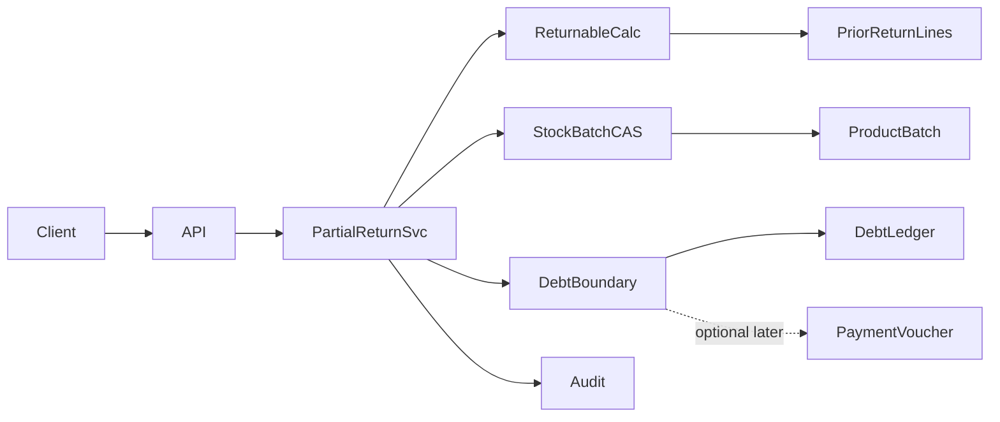

# Design — partial-returns-refunds (Luồng C)

## Overview

**Purpose:** Allow partial sales and purchase returns with hard qty caps, tenant-safe stock/batch CAS, and a clear refund vs debt boundary — without silent livestock recovery.

**Users:** Tenant staff with `sales:edit` / `purchase:edit`.

**Impact:** Extends `SalesReturnsService` / `PurchaseReturnsService` beyond full-return-only; likely schema for return-line linkage and idempotency; depends on `livestock-cas-recovery` batch version contract.

### Goals

- Partial return documents with line/batch qty ≤ remaining returnable
- No double-return of the same qty
- Stock + batch + movement + debt/audit in one serializable transaction
- Refund/payment layer separated from inventory return
- CAS on ProductBatch; never auto-HEALTHY

### Non-Goals

- FE UI; dual-control recovery; aquaculture; inventing new RBAC; replacing full-return paths

## Architecture

### Existing Architecture Analysis

- Full return: load COMPLETED original → create return header+lines → stock/batch → movements → full debt ADJUST → audit.
- Guards: `SALE_ALREADY_RETURNED` / `PURCHASE_ALREADY_RETURNED` via any COMPLETED return for original id.
- Livestock handoff (dependency): read version in tx → `updateMany` + increment; restore qty only.

### Architecture Pattern & Boundary Map



**Integration:**

- Extend existing return services; prefer `createPartialReturn` alongside `createFullReturn` (or unified entry with mode).
- Full-return uniqueness: either (a) full path remains exclusive if any return exists, or (b) full path only when remaining = all and no prior returns — **product open question**; partial path always uses remaining-qty sum.

### Technology Stack

| Layer | Choice | Role |
|-------|--------|------|
| Backend | NestJS + Prisma | Services/controllers |
| DB | PostgreSQL Serializable | Atomic return |
| Audit | AuditLogger.writeInTx | SALE_RETURN / PURCHASE_RETURN |

## Canonical Contracts & Invariants

| Contract Area | Canonical Decision | Applies To | Must Stay Consistent In |
|---------------|--------------------|------------|-------------------------|
| Auth | tenantId from auth; sales:edit / purchase:edit | Controllers | All return mutations |
| Transport | POST partial body with lines; optional idempotencyKey | Sales/Purchase controllers | DTOs + services |
| Data / remaining qty | remaining = original qtyBase − sum(completed return lines for same saleLine/batch or purchase line) | Partial return validation | Service + tests |
| ProductBatch CAS | Read version in tx; updateMany id+tenantId+version (+ qty gte on decrease); version++ | Sales restore / purchase decrease | livestock-cas-recovery R6 |
| Livestock health | Return never sets HEALTHY / never sets approveRecovery | Batch restore | inventory livestock policy |
| Debt | Ledger ADJUST on return for debt portion only; cash refund not silent | DebtLedger / optional voucher | Debts + returns |
| Original docs | Sale/Purchase immutable | Completeness | No status rewrite for partial |

<!-- contract:PartialSalesReturnRequest -->
```json
{
  "idempotencyKey": "string?",
  "note": "string?",
  "settlementMode": "DEBT_ADJUST_ONLY | NONE | REFUND_VOUCHER?",
  "debtAdjust": "bigint-string?",
  "lines": [
    {
      "saleLineId": "uuid",
      "batchId": "uuid?",
      "qtyBase": "decimal-string"
    }
  ]
}
```

<!-- contract:PartialPurchaseReturnRequest -->
```json
{
  "idempotencyKey": "string?",
  "note": "string?",
  "settlementMode": "DEBT_ADJUST_ONLY | NONE | REFUND_VOUCHER?",
  "debtAdjust": "bigint-string?",
  "lines": [
    {
      "purchaseLineId": "uuid",
      "batchId": "uuid?",
      "qtyBase": "decimal-string"
    }
  ]
}
```

<!-- contract:PartialReturnErrorReasons -->
```text
SALE_NOT_RETURNABLE | PURCHASE_NOT_RETURNABLE
RETURN_QTY_EXCEEDS_REMAINING
SALE_ALREADY_RETURNED | PURCHASE_ALREADY_RETURNED
STOCK_RETURN_CONFLICT | BATCH_RETURN_CONFLICT | STALE_VERSION
DEBT_RETURN_CONFLICT
SETTLEMENT_REQUIRED | SETTLEMENT_NOT_SUPPORTED
```

### Machine-checkable contracts

Tasks that implement DTOs/services must copy the three contract blocks above verbatim when touching request shape or error reasons.

## System Flows

```mermaid
sequenceDiagram
  participant C as Client
  participant S as PartialReturnService
  participant DB as Prisma Tx Serializable
  C->>S: partial return + lines + optional key
  S->>DB: begin
  S->>DB: load original tenant-scoped COMPLETED
  S->>DB: idempotency hit? return existing
  S->>DB: sum prior return lines; assert remaining
  S->>DB: create return doc + lines
  S->>DB: stock + ProductBatch CAS + movements
  S->>DB: debt ADJUST per policy (if any)
  S->>DB: audit
  S->>DB: commit
  Note over S,DB: never healthState=HEALTHY
```

### Settlement boundary (decision locked for design; open product params)

1. **Inventory return** always owns stock/batch/movements.
2. **Debt ADJUST** only when original had outstanding debt and settlement allows; amount ≤ remaining debt and ≤ returned economic share (formula open).
3. **Cash REFUND** via PaymentVoucher (or existing debts voucher types) only when product approves `REFUND_VOUCHER` mode. **Superseded 2026-07-25 by Luồng B** (§ Cash refund contract): `REFUND_VOUCHER` is now implemented and no longer fails closed.
4. Full-return legacy behavior (full debt wipe on return) remains for full path; partial must not blindly use full `debtAmount`.

## Requirements Traceability

| Req | Design element |
|-----|----------------|
| R1.* | Partial sales service + remaining calc + stock restore |
| R2.* | Partial purchase service + remaining + stock decrease |
| R3.* | Settlement modes + DebtLedger |
| R4.* | CAS + no HEALTHY |
| R5.* | tenant, audit, idempotency, Serializable |
| R6–R7 | Acceptance tests + concurrency |

## Data model deltas (expected; implement only after open Qs)

- `SalesReturnLine`: add `saleLineId`, optional `batchId`; possibly `originalQtyBase` snapshot.
- `SalesReturn` / `PurchaseReturn`: optional `idempotencyKey` unique per tenant.
- Indexes on `(salesReturnId)`, `(originalSaleId)` already; add query path for sum by saleLineId across returns.
- Do **not** mutate `SaleLineBatch` rows; they remain sale-time allocation facts.

## Dependency on livestock-cas-recovery

| Handoff rule (from livestock design) | This design |
|--------------------------------------|-------------|
| Batch restore/decrement must CAS version | R4.1–R4.3 |
| Must not force HEALTHY | R4.4 |
| Refunds stay payment/debt layer | R3.* |
| Partial qty ≤ original allocation remaining | R1.2 / R2.2 |

If livestock CAS on full returns is incomplete, keep implementation **blocked** (`spec.json.blocker`); do not invent alternate CAS shape.

## Risks

| Risk | Severity | Mitigation |
|------|----------|------------|
| Remaining-qty race | High | Serializable + sum inside tx |
| Schema under-specified for batch lines | High | Migration before partial sales path |
| Cash refund ambiguity | Medium | Fail closed until product decides |
| Full vs partial uniqueness collision | Medium | Explicit product rule in open Q |
| Silent health recovery | High | Explicit assert health unchanged in tests |

## Test strategy

- Unit: remaining calc pure function; service happy/over/idempotent/CAS fail/debt/health.
- No e2e FE required this slice.
- Commands (implement phase): focused return service specs + prisma validate + build.

## Resolved implementation decisions (2026-07-25)

Locked from existing conventions (full-return debt wipe pattern, Sale.idempotencyKey uniqueness, CAS already on full returns):

1. **Remaining-qty ledger:** computed sum of COMPLETED return lines keyed by `saleLineId` + optional `batchId` (sales) or `purchaseLineId` + optional `batchId` (purchase). No extra ledger table.
2. ~~**Cash refund:** out-of-slice. `settlementMode=REFUND_VOUCHER` → `SETTLEMENT_NOT_SUPPORTED`.~~ **Superseded 2026-07-25 (Luồng B, task R2-01):** `REFUND_VOUCHER` creates a real `PaymentVoucher` per § Cash refund contract. Cash-paid docs may still use `NONE` (inventory-only) or `DEBT_ADJUST_ONLY`.
3. **Debt partial formula:** economic share = `floor(sale.debtAmount * returnedLineTotalSum / sale.total)` when total>0; else 0. Cap by customer/supplier remaining balance and optional client `debtAdjust` (must be ≤ share). Missing debt party → `DEBT_RETURN_CONFLICT`.
4. **Full vs partial uniqueness:** any COMPLETED return blocks `createFullReturn` (`SALE_ALREADY_RETURNED` / `PURCHASE_ALREADY_RETURNED`). Partials allowed until remaining qty = 0; then `SALE_ALREADY_RETURNED` / `RETURN_QTY_EXCEEDS_REMAINING`.
5. **settlementMode default:** omit → `DEBT_ADJUST_ONLY` if original `debtAmount>0`, else `NONE`.

## Unresolved questions (design)

1. ~~Exact remaining-qty ledger storage.~~ → sum return lines (above).
2. ~~Cash refund in-slice or later.~~ → later; fail closed.
3. ~~Debt pro-rata formula.~~ → floor debt × returned/total (above).
4. ~~Full vs partial uniqueness.~~ → full blocked if any return; partial uses remaining.
5. ~~settlementMode default.~~ → DEBT_ADJUST_ONLY when debt>0 else NONE.

---

# Cash refund contract (Luồng B, locked 2026-07-25)

Closes the fail-closed gap left by decision #2. Scope: make `settlementMode=REFUND_VOUCHER` create a real `PaymentVoucher` + `DebtLedger` trail for partial sales/purchase returns. Audit ref: `docs/audit-core-business-catalog-2026-07-22.md` §8.5 item 1 ("Cash refund/payment voucher thực tế — hiện fail-closed, chưa tự tạo payout").

## B1. Money-direction semantics (explicit, not silent)

The existing `DebtsService.createVoucher` pairs **CUSTOMER↔RECEIPT** / **SUPPLIER↔PAYMENT** and always **DECREASES** party balance, capped by outstanding balance. A refund is the opposite money flow, so it uses the inverse pairing and **never touches party balance**:

| Return kind | Money flow | `voucherType` | `partyType` | Party balance | `DebtLedger` |
|---|---|---|---|---|---|
| Sales return refund | Shop → customer | `PAYMENT` | `CUSTOMER` | **unchanged** | `ADJUST` / `INCREASE`, `refType='SALE_RETURN_REFUND'` |
| Purchase return refund | Supplier → shop | `RECEIPT` | `SUPPLIER` | **unchanged** | `ADJUST` / `INCREASE`, `refType='PURCHASE_RETURN_REFUND'` |

**Locked rules:**

- `DebtsService.createVoucher` is **NOT reused and NOT modified**. Its direction guard (`(partyType==='CUSTOMER') !== (voucherType==='RECEIPT')` → 422) would reject every refund by construction, and its balance-decrement + `balance >= amount` cap encode *debt settlement*, not *refund*. Refund voucher rows are written directly by the return services.
- Party balance is **not** mutated by the refund path. Debt reduction on a return is owned solely by `debtAdjust` (`DEBT_ADJUST_ONLY`), which already CAS-decrements balance and writes an `ADJUST`/`DECREASE` ledger row. Keeping the two disjoint is what prevents double counting.
- The refund `DebtLedger` row is a **financial audit trail with `direction=INCREASE` and `balanceAfter=null`** — it records cash movement, not a balance mutation. `balanceAfter=null` is the machine-readable marker that no balance was recomputed (contrast: `DebtsService` always sets `balanceAfter`).
- `PaymentMethod` for a refund is client-chosen from `CASH | BANK_TRANSFER | QR` (no `MIXED`), default `CASH`.
- `docNo` prefix: `RFS-` (sales refund) / `RFP-` (purchase refund) — distinct from `PT-` (debts voucher), `SR-`/`PRT-` (return docs), so financial reports can segregate refunds by prefix without schema change.

## B2. Settlement mode matrix (paid-vs-debt)

`settlementMode` stays single-valued; refund and debt adjust are mutually exclusive per return document.

| Mode | Stock | Debt balance | PaymentVoucher | Constraint |
|---|---|---|---|---|
| `NONE` | restored/decreased | untouched | none | `debtAdjust>0` → `SETTLEMENT_REQUIRED` |
| `DEBT_ADJUST_ONLY` | restored/decreased | CAS decrement ≤ pro-rata share | none | unchanged from Luồng C |
| `REFUND_VOUCHER` | restored/decreased | **untouched** | **created** | `debtAdjust` must be absent/`0` → else `SETTLEMENT_REQUIRED` |

Rationale: a partially-unpaid document must not both forgive debt and hand back cash for the same returned value in one document. A customer needing both settles in two return documents (or a debts voucher), which keeps each ledger row attributable.

## B3. Refund cap (over-refund + insufficient paid amount)

```text
paidCap        = original.amountPaid − sum(prior refunds for that original)
economicShare  = returned line total of THIS return document (returnDoc.total)
refundCap      = min(paidCap, economicShare)
refundAmount   = dto.refundAmount ?? refundCap
```

- `refundCap <= 0` → `REFUND_EXCEEDS_PAID` (covers a fully-debt document with `amountPaid=0`, and an already fully-refunded document).
- `refundAmount > refundCap` → `REFUND_EXCEEDS_PAID`.
- `refundAmount <= 0` (explicit non-positive) → `REFUND_AMOUNT_INVALID`.
- `economicShare` is the just-created return document total, so the cap is inherently per-return and cannot exceed the returned goods' value.

**Prior-refund tracking is derived, no new column.** `sum(prior refunds)` is computed in-transaction:

```ts
tx.paymentVoucher.aggregate({
  _sum: { amount: true },
  where: { tenantId, refSaleId: saleId, voucherType: 'PAYMENT', partyType: 'CUSTOMER' },
})
```

This is exact because the CUSTOMER+PAYMENT (resp. SUPPLIER+RECEIPT) pairing is **unreachable through any existing writer** — `DebtsService.createVoucher` rejects it with 422, and no other code path creates vouchers. So that combination uniquely identifies refunds. Avoiding a `refundedAmount` column also removes the Luồng A schema-overlap risk on `Sale`/`Purchase` (see B8).

## B4. Idempotency

- Refund reuses the **return document's** `idempotencyKey` — one key ⇒ one return document ⇒ at most one refund voucher. No second key surface.
- Voucher `idempotencyKey` = `` `refund:${returnDocId}` `` (deterministic from the return doc id, satisfying `@@unique([tenantId, idempotencyKey])` on `PaymentVoucher`).
- Idempotent replay short-circuits **before** the settlement block (existing Luồng C behavior: pre-read on `SalesReturn`/`PurchaseReturn` unique key returns the existing document), so a retry creates neither a second voucher nor a second stock write.
- A `P2002` on the voucher insert means the same return document is being refunded concurrently → `REFUND_ALREADY_APPLIED` (conflict, whole tx rolls back).

## B5. Tenant scope, permissions, audit

- `tenantId` comes only from `request.user.tenantId`; every read/write in the refund path is tenant-filtered. Cross-tenant original → existing `Sale not found` / `Purchase not found` (404 shape unchanged).
- **No new RBAC strings** (Luồng C `out_of_scope`): refund rides the existing `@RequireTenantPermission('sales:edit' | 'purchase:edit')` + `@RequireFeature('inventory')` on the partial-return routes.
- Audit: new `AuditAction` values `SALE_REFUND` / `PURCHASE_REFUND`, emitted **in addition to** the existing `SALE_RETURN` / `PURCHASE_RETURN` row, so the inventory event and the financial event are separately queryable. Payload `after`: `{ returnId, voucherId, docNo, amount, method, partyType, partyId }`. Enum values ship in a migration deployed **before** app code emits them (per existing schema comment convention).

## B6. Atomicity and rollback

- Refund executes **inside the same existing Serializable transaction** as the return document + stock/batch CAS. No new transaction, no post-commit hook.
- Ordering inside the tx: load original → idempotency → remaining-qty assert → create return doc + lines → stock/batch CAS → **settlement (debt adjust XOR refund)** → audit → commit.
- Because settlement runs **after** the stock writes but in the same tx, any refund failure (`REFUND_EXCEEDS_PAID`, `REFUND_AMOUNT_INVALID`, `REFUND_ALREADY_APPLIED`, party missing) rolls back the stock and batch mutations. **Invariant: a failed refund leaves stock, batch `qtyOnHand`, batch `version`, and party balance exactly as before.**
- `Sale` / `Purchase` rows stay immutable: `amountPaid` is **not** decremented. The refund is represented by the voucher, and the derived cap in B3 accounts for it. This preserves the reports aggregation over `amountPaid` (`reports.service.ts` is out of bounds for this slice) — a refund never rewrites historical sale settlement.

## B7. Error reasons (additive)

<!-- contract:RefundErrorReasons -->
```text
REFUND_EXCEEDS_PAID
REFUND_AMOUNT_INVALID
REFUND_ALREADY_APPLIED
REFUND_PARTY_MISSING
```

All raised as `ConflictException({ reason: '<CODE>' })`, matching the Luồng C structured-error shape. `SETTLEMENT_NOT_SUPPORTED` remains in the reason list but becomes unreachable for `REFUND_VOUCHER`; it is retained for forward compatibility with future modes.

## B8. Request contract delta

<!-- contract:RefundSettlementRequestDelta -->
```json
{
  "settlementMode": "DEBT_ADJUST_ONLY | NONE | REFUND_VOUCHER?",
  "refundAmount": "bigint-string?",
  "refundMethod": "CASH | BANK_TRANSFER | QR?"
}
```

Both `CreatePartialSalesReturnDto` and `CreatePartialPurchaseReturnDto` gain `refundAmount` (optional; omit ⇒ full `refundCap`) and `refundMethod` (optional; default `CASH`). `settlementMode` already accepts `REFUND_VOUCHER`; no enum change.

## B9. Luồng A merge-conflict boundary

Only the payment slice is committed on `feat/payment-refund`:

| Artifact | Luồng B change | Conflict risk with Luồng A |
|---|---|---|
| `prisma/schema.prisma` | `enum AuditAction`: +`SALE_REFUND`, +`PURCHASE_REFUND` | **Low, textual only** — if A also appends enum values, resolve by keeping **both** sets of values (enum members are order-independent). No model/field/index change. |
| `prisma/migrations/2026072502*_payment_refund_audit/` | new dir, `ALTER TYPE ... ADD VALUE IF NOT EXISTS` | **None** — additive, idempotent, order-independent with A's migrations. |
| `sales-return.service.ts`, `purchase-return.service.ts`, both DTOs, `refund-settlement.ts` | payment-only edits | **None expected** — A owns ProductKind/Handbook/Reports. |

**Explicitly untouched by this slice:** ProductKind, Handbook, Reports (incl. `reports.service.ts` `amountPaid`/`debtAmount` aggregation), `debts.service.ts`, `Sale`/`Purchase`/`SalesReturn`/`PurchaseReturn` model fields.

## B10. Test strategy (Luồng B)

- Refund happy path creates voucher with the locked direction pair (`PAYMENT`+`CUSTOMER` / `RECEIPT`+`SUPPLIER`), `balanceAfter=null`, and **no** `customer.updateMany` / `supplier.updateMany` balance write.
- No double count: `REFUND_VOUCHER` writes zero `ADJUST`/`DECREASE` balance rows; `DEBT_ADJUST_ONLY` writes zero vouchers.
- Over-refund: explicit `refundAmount` above cap, and `amountPaid=0` document → `REFUND_EXCEEDS_PAID`, **zero** stock/batch/voucher writes committed.
- Prior-refund accumulation: `aggregate` returning a prior sum shrinks the cap.
- `refundAmount` + `debtAdjust` together → `SETTLEMENT_REQUIRED`.
- Rollback: refund failure after a successful stock CAS still rejects (tx-level), asserted by the error propagating out of the transaction callback.
- Idempotent replay: existing return doc short-circuits, no voucher create.
- Tenant isolation: foreign-tenant original → not found, no voucher.
- `P2002` on voucher → `REFUND_ALREADY_APPLIED`.

