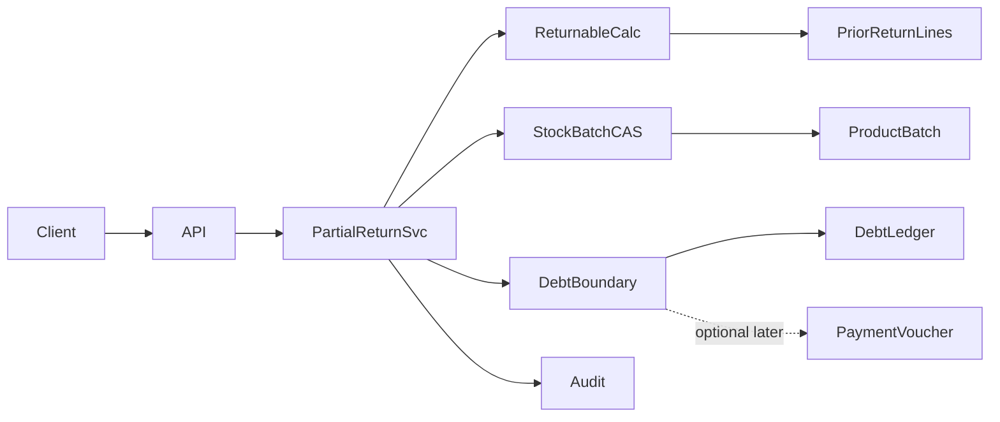

# Design — partial-returns-refunds (Luồng C)

## Overview

**Purpose:** Allow partial sales and purchase returns with hard qty caps, tenant-safe stock/batch CAS, and a clear refund vs debt boundary — without silent livestock recovery.

**Users:** Tenant staff with `sales:edit` / `purchase:edit`.

**Impact:** Extends `SalesReturnsService` / `PurchaseReturnsService` beyond full-return-only; likely schema for return-line linkage and idempotency; depends on `livestock-cas-recovery` batch version contract.

### Goals

- Partial return documents with line/batch qty ≤ remaining returnable
- No double-return of the same qty
- Stock + batch + movement + debt/audit in one serializable transaction
- Refund/payment layer separated from inventory return
- CAS on ProductBatch; never auto-HEALTHY

### Non-Goals

- FE UI; dual-control recovery; aquaculture; inventing new RBAC; replacing full-return paths

## Architecture

### Existing Architecture Analysis

- Full return: load COMPLETED original → create return header+lines → stock/batch → movements → full debt ADJUST → audit.
- Guards: `SALE_ALREADY_RETURNED` / `PURCHASE_ALREADY_RETURNED` via any COMPLETED return for original id.
- Livestock handoff (dependency): read version in tx → `updateMany` + increment; restore qty only.

### Architecture Pattern & Boundary Map



**Integration:**

- Extend existing return services; prefer `createPartialReturn` alongside `createFullReturn` (or unified entry with mode).
- Full-return uniqueness: either (a) full path remains exclusive if any return exists, or (b) full path only when remaining = all and no prior returns — **product open question**; partial path always uses remaining-qty sum.

### Technology Stack

| Layer | Choice | Role |
|-------|--------|------|
| Backend | NestJS + Prisma | Services/controllers |
| DB | PostgreSQL Serializable | Atomic return |
| Audit | AuditLogger.writeInTx | SALE_RETURN / PURCHASE_RETURN |

## Canonical Contracts & Invariants

| Contract Area | Canonical Decision | Applies To | Must Stay Consistent In |
|---------------|--------------------|------------|-------------------------|
| Auth | tenantId from auth; sales:edit / purchase:edit | Controllers | All return mutations |
| Transport | POST partial body with lines; optional idempotencyKey | Sales/Purchase controllers | DTOs + services |
| Data / remaining qty | remaining = original qtyBase − sum(completed return lines for same saleLine/batch or purchase line) | Partial return validation | Service + tests |
| ProductBatch CAS | Read version in tx; updateMany id+tenantId+version (+ qty gte on decrease); version++ | Sales restore / purchase decrease | livestock-cas-recovery R6 |
| Livestock health | Return never sets HEALTHY / never sets approveRecovery | Batch restore | inventory livestock policy |
| Debt | Ledger ADJUST on return for debt portion only; cash refund not silent | DebtLedger / optional voucher | Debts + returns |
| Original docs | Sale/Purchase immutable | Completeness | No status rewrite for partial |

<!-- contract:PartialSalesReturnRequest -->
```json
{
  "idempotencyKey": "string?",
  "note": "string?",
  "settlementMode": "DEBT_ADJUST_ONLY | NONE | REFUND_VOUCHER?",
  "debtAdjust": "bigint-string?",
  "lines": [
    {
      "saleLineId": "uuid",
      "batchId": "uuid?",
      "qtyBase": "decimal-string"
    }
  ]
}
```

<!-- contract:PartialPurchaseReturnRequest -->
```json
{
  "idempotencyKey": "string?",
  "note": "string?",
  "settlementMode": "DEBT_ADJUST_ONLY | NONE | REFUND_VOUCHER?",
  "debtAdjust": "bigint-string?",
  "lines": [
    {
      "purchaseLineId": "uuid",
      "batchId": "uuid?",
      "qtyBase": "decimal-string"
    }
  ]
}
```

<!-- contract:PartialReturnErrorReasons -->
```text
SALE_NOT_RETURNABLE | PURCHASE_NOT_RETURNABLE
RETURN_QTY_EXCEEDS_REMAINING
SALE_ALREADY_RETURNED | PURCHASE_ALREADY_RETURNED
STOCK_RETURN_CONFLICT | BATCH_RETURN_CONFLICT | STALE_VERSION
DEBT_RETURN_CONFLICT
SETTLEMENT_REQUIRED | SETTLEMENT_NOT_SUPPORTED
```

### Machine-checkable contracts

Tasks that implement DTOs/services must copy the three contract blocks above verbatim when touching request shape or error reasons.

## System Flows

```mermaid
sequenceDiagram
  participant C as Client
  participant S as PartialReturnService
  participant DB as Prisma Tx Serializable
  C->>S: partial return + lines + optional key
  S->>DB: begin
  S->>DB: load original tenant-scoped COMPLETED
  S->>DB: idempotency hit? return existing
  S->>DB: sum prior return lines; assert remaining
  S->>DB: create return doc + lines
  S->>DB: stock + ProductBatch CAS + movements
  S->>DB: debt ADJUST per policy (if any)
  S->>DB: audit
  S->>DB: commit
  Note over S,DB: never healthState=HEALTHY
```

### Settlement boundary (decision locked for design; open product params)

1. **Inventory return** always owns stock/batch/movements.
2. **Debt ADJUST** only when original had outstanding debt and settlement allows; amount ≤ remaining debt and ≤ returned economic share (formula open).
3. **Cash REFUND** via PaymentVoucher (or existing debts voucher types) only when product approves `REFUND_VOUCHER` mode; until then fail closed with `SETTLEMENT_NOT_SUPPORTED` for cash-only refund requests.
4. Full-return legacy behavior (full debt wipe on return) remains for full path; partial must not blindly use full `debtAmount`.

## Requirements Traceability

| Req | Design element |
|-----|----------------|
| R1.* | Partial sales service + remaining calc + stock restore |
| R2.* | Partial purchase service + remaining + stock decrease |
| R3.* | Settlement modes + DebtLedger |
| R4.* | CAS + no HEALTHY |
| R5.* | tenant, audit, idempotency, Serializable |
| R6–R7 | Acceptance tests + concurrency |

## Data model deltas (expected; implement only after open Qs)

- `SalesReturnLine`: add `saleLineId`, optional `batchId`; possibly `originalQtyBase` snapshot.
- `SalesReturn` / `PurchaseReturn`: optional `idempotencyKey` unique per tenant.
- Indexes on `(salesReturnId)`, `(originalSaleId)` already; add query path for sum by saleLineId across returns.
- Do **not** mutate `SaleLineBatch` rows; they remain sale-time allocation facts.

## Dependency on livestock-cas-recovery

| Handoff rule (from livestock design) | This design |
|--------------------------------------|-------------|
| Batch restore/decrement must CAS version | R4.1–R4.3 |
| Must not force HEALTHY | R4.4 |
| Refunds stay payment/debt layer | R3.* |
| Partial qty ≤ original allocation remaining | R1.2 / R2.2 |

If livestock CAS on full returns is incomplete, keep implementation **blocked** (`spec.json.blocker`); do not invent alternate CAS shape.

## Risks

| Risk | Severity | Mitigation |
|------|----------|------------|
| Remaining-qty race | High | Serializable + sum inside tx |
| Schema under-specified for batch lines | High | Migration before partial sales path |
| Cash refund ambiguity | Medium | Fail closed until product decides |
| Full vs partial uniqueness collision | Medium | Explicit product rule in open Q |
| Silent health recovery | High | Explicit assert health unchanged in tests |

## Test strategy

- Unit: remaining calc pure function; service happy/over/idempotent/CAS fail/debt/health.
- No e2e FE required this slice.
- Commands (implement phase): focused return service specs + prisma validate + build.

## Resolved implementation decisions (2026-07-25)

Locked from existing conventions (full-return debt wipe pattern, Sale.idempotencyKey uniqueness, CAS already on full returns):

1. **Remaining-qty ledger:** computed sum of COMPLETED return lines keyed by `saleLineId` + optional `batchId` (sales) or `purchaseLineId` + optional `batchId` (purchase). No extra ledger table.
2. **Cash refund:** out-of-slice. `settlementMode=REFUND_VOUCHER` → `SETTLEMENT_NOT_SUPPORTED`. Cash-paid docs use `NONE` (inventory-only) unless explicit debt adjust requested.
3. **Debt partial formula:** economic share = `floor(sale.debtAmount * returnedLineTotalSum / sale.total)` when total>0; else 0. Cap by customer/supplier remaining balance and optional client `debtAdjust` (must be ≤ share). Missing debt party → `DEBT_RETURN_CONFLICT`.
4. **Full vs partial uniqueness:** any COMPLETED return blocks `createFullReturn` (`SALE_ALREADY_RETURNED` / `PURCHASE_ALREADY_RETURNED`). Partials allowed until remaining qty = 0; then `SALE_ALREADY_RETURNED` / `RETURN_QTY_EXCEEDS_REMAINING`.
5. **settlementMode default:** omit → `DEBT_ADJUST_ONLY` if original `debtAmount>0`, else `NONE`.

## Unresolved questions (design)

1. ~~Exact remaining-qty ledger storage.~~ → sum return lines (above).
2. ~~Cash refund in-slice or later.~~ → later; fail closed.
3. ~~Debt pro-rata formula.~~ → floor debt × returned/total (above).
4. ~~Full vs partial uniqueness.~~ → full blocked if any return; partial uses remaining.
5. ~~settlementMode default.~~ → DEBT_ADJUST_ONLY when debt>0 else NONE.
