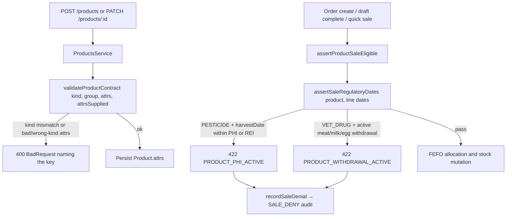

# Design

## Context

Two gaps remain after `sale-regulatory-date-gates` and `catalog-specialized-sale-safety`: `ProductKind` is not yet authoritative over specialized attrs, and the existing regulatory hard gates are kind-agnostic. Both live in pure modules with no Prisma I/O, so this slice is two focused edits plus tests. No schema, DTO, controller, or frontend change is required.

## Part 1 — `backend/src/platform/products/product-contract.ts`

1. Add a per-kind specialized attr table alongside `REQUIRED_ATTRS`, declaring numeric requirements: `PESTICIDE` → `phiDays`, `reiDays`; `VET_DRUG` → `withdrawalMeatDays`, `withdrawalMilkDays`, `withdrawalEggDays`; `FERTILIZER` → `nitrogenPercent`, `phosphorusPercent`, `potassiumPercent`.
2. Accept camelCase and snake_case spellings via one alias map, mirroring `SALE_ADVISORY_ATTR_KEYS` in the sale policy, so the two modules agree on naming.
3. Reject a numeric attr that is absent, non-finite, or negative with `BadRequestException` naming the key and the kind. Zero is valid: a pesticide with no waiting period is real data, and the sale gates only fire on positive values.
4. Derive the forbidden-key set per kind as the union of every other kind's specialized keys minus its own, then reject the first offender. This directly encodes the catalog prohibitions (no PHI/REI on fertilizer or veterinary drugs, no withdrawal on crop kinds) without a hand-maintained deny list.
5. Add an `attrsSupplied` flag to `validateProductContract` so the specialized rules run only when the caller sent attrs. `ProductsService.update` passes `dto.attrs !== undefined`; `create` always passes true. This is the R2b legacy boundary.

## Part 2 — `backend/src/platform/sales/sale-eligibility-policy.ts`

1. Gate the PHI branch on `productKind === PESTICIDE` and add a sibling REI branch keyed on the same supplied harvest date. Both reuse `PRODUCT_PHI_ACTIVE` with `field: 'harvestDate'`; the message distinguishes pre-harvest interval from re-entry interval.
2. Replace the collapsing `.find(...)` over the three withdrawal periods with an explicit per-type loop, gated on `productKind === VET_DRUG`, so meat, milk, and egg are evaluated independently and the message names the type that is still active.
3. Attach `productKind` to both denial payloads, matching `assertProductSaleEligible`.
4. Keep the reason codes unchanged so `frontend/lib/sales-api-error.ts` needs no edit.

## Data flow

## Invariants

- A gate never mutates stock, debt, or audit state before it passes; both calls stay ahead of allocation on all three paths.
- Missing event dates and missing regulatory attrs stay non-blocking at sale time; nothing is defaulted or inferred.
- Reason codes are unchanged, so the frontend mapper contract holds.
- Draft completion re-evaluates from the persisted `SaleLine` snapshots and the completion timestamp, so REI is re-checked without new columns.

## Risk assessment

| Risk | Mitigation |
|---|---|
| Tightened attrs block edits to legacy products | R2b `attrsSupplied` boundary: implicit merges skip the new rules |
| Kind-scoping the PHI branch weakens an existing gate for non-pesticide rows | Catalog forbids PHI on other kinds; wrong-kind rejection stops new rows from carrying it, and tests pin both directions |
| Per-type withdrawal loop changes error text | Reason code and field are unchanged; only `message` gains the type name |
| Zero-day regulatory values misread as missing | Required check accepts zero; sale gates keep firing only on positive values |
