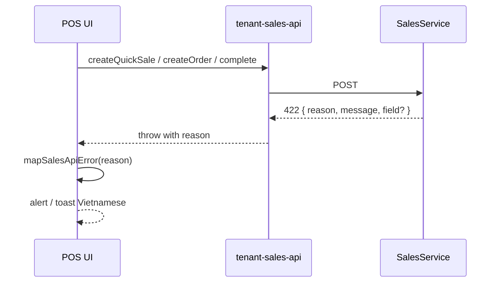

# Design: sale-checkout-fe-gates

## Overview

Close FE lag after backend sale eligibility gates: map structured 422 reasons to Vietnamese POS copy, and optionally show PHI/REI/withdrawal advisories as non-blocking UI when product metadata is already available.

### Goals

- One pure reason→message helper for sales APIs.
- Wire helper on quick-sale, order-form, order-detail complete.
- Advisory display chips when attrs/agro present; never hard-block.

### Non-Goals

- Harvest PHI hard gate, livestock SM, backend policy changes, audit events, returns.

## Requirements Traceability

| Req | Design element |
|---|---|
| R1.x | `mapSalesApiError` pure helper |
| R2.x | Import helper in quick-sale / order-form / order-detail |
| R3.x | `SaleAdvisoriesStrip` or inline chips from line product meta |
| R4.x | Unit + component tests |
| R5.x | No new HTTP for map; attrs from picker |

## Architecture



## Canonical Contracts

<!-- contract:SalesApiErrorReason -->
```ts
type SalesApiErrorReason =
  | 'PRODUCT_UNSELLABLE'
  | 'PRODUCT_LOCKED'
  | 'PRODUCT_RECALLED'
  | 'PRODUCT_INACTIVE'
  | 'INSUFFICIENT_STOCK'
  | 'INVALID_CUSTOMER'
  | 'IDEMPOTENCY_CONFLICT'
  | 'VALIDATION_ERROR'
  | string; // unknown → fallback
```

<!-- contract:SalesApiErrorBody -->
```ts
type SalesApiErrorBody = {
  reason?: string;
  message?: string;
  field?: string;
  productKind?: string;
  status?: number;
};
```

### Invariants

1. Map pure: input reason (+ optional fallback) → string; no I/O.
2. Unknown reason → generic fallback (never blank).
3. Advisory UI must not throw if fields missing.
4. Do not invent hard-block on PHI/REI values alone.
5. Prefer existing product fields on cart lines; do not block if attrs absent.
6. userFetch must surface `reason` on thrown errors (verify; if only `message`, extend parse once).

### Module layout

```text
frontend/lib/sales-api-error.ts          # mapSalesApiError
frontend/lib/sales-api-error.test.ts
frontend/components/app/sales/sale-advisories-strip.tsx  # optional small
frontend/components/app/sales/quick-sale.tsx             # wire
frontend/components/app/sales/order-form.tsx
frontend/components/app/sales/order-detail.tsx
```

## UX copy (suggested VI)

| reason | Message |
|---|---|
| PRODUCT_LOCKED | Sản phẩm đang bị khóa, không thể bán. |
| PRODUCT_RECALLED | Sản phẩm đã thu hồi, không thể bán. |
| PRODUCT_INACTIVE | Sản phẩm ngừng kinh doanh, không thể bán. |
| PRODUCT_UNSELLABLE | Sản phẩm không hợp lệ hoặc không bán được. |
| INSUFFICIENT_STOCK | (keep existing) |
| INVALID_CUSTOMER | (keep existing) |

## Risk Assessment

| Risk | Severity | Mitigation |
|---|---|---|
| userFetch swallows reason | High | Inspect parse; fix once in map consumer |
| Cart lines lack attrs | Medium | Hide advisory strip |
| Copy churn vs BA | Low | Keep short VI; adjust later |

## Test strategy

- Unit: every eligibility reason + fallback.
- Component: quick-sale mock reject PRODUCT_LOCKED → alert text.
- Regression: INSUFFICIENT_STOCK still works.
