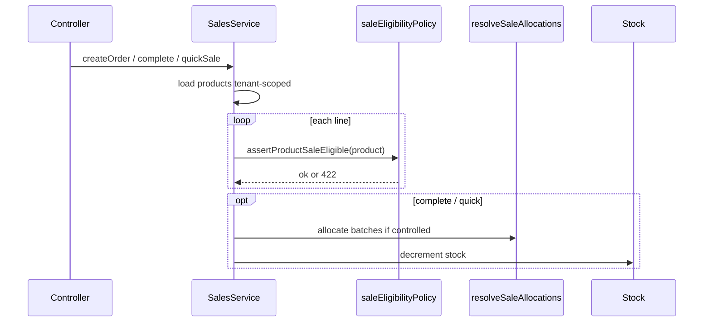

# Design: Sale Checkout Kind Gates

## Overview

Close audit gap #4: sale create/complete/quick-sale currently only check `ACTIVE` + not locked/recalled. Add a pure **sale eligibility policy** and wire it into `SalesService` before line persistence and before stock dual-write. Reuse FEFO/batch-policy for lot integrity. Catalog PHI/REI/withdrawal are **advisory metadata** in this slice (no harvest calendar).

### Goals

- Single policy module for product sale eligibility.
- Hard reject unsellable products on all three write paths.
- Keep batch/FEFO behavior from `core-stock-lifecycle`.

### Non-Goals

- FE POS UI, returns, handbook snapshot, reports, livestock state machine, aqua rules, new PHI columns.
- Changing public sale response DTO to include PHI/REI advisory payload (extract/log/test only this slice).

## Requirements Traceability

| Req | Design element |
|---|---|
| R1.x | `sale-eligibility-policy.ts` pure functions + error shape |
| R2.x | Calls from `createOrder`, `completeInTransaction`, `createQuickSale` |
| R3.x | No bypass of `resolveSaleAllocations` / `isBatchControlled` |
| R4.x | Optional `advisories` from attrs keys |
| R5.x | Policy unit tests + sales.service.spec deny cases |
| R6.x | Same tx / tenant product queries |

## Architecture



## Canonical Contracts

<!-- contract:SaleEligibilityError -->
```json
{
  "reason": "PRODUCT_UNSELLABLE | PRODUCT_LOCKED | PRODUCT_RECALLED | PRODUCT_INACTIVE",
  "message": "human readable",
  "field": "productId",
  "productKind": "optional ProductKind string"
}
```

<!-- contract:SaleEligibilityInput -->
```json
{
  "id": "uuid",
  "status": "ACTIVE | INACTIVE | ...",
  "isLocked": false,
  "isRecalled": false,
  "productKind": "PESTICIDE | ... | null",
  "attrs": {}
}
```

### Invariants

1. No stock mutation after eligibility throw (order of checks: product load → eligibility → money/settlement → FEFO → stock).
2. Complete path **must** load product `status`, `isLocked`, `isRecalled`, `productKind` (and `attrs` only if advisories used). Current code selecting only `productKind` on complete is insufficient — implementer MUST expand select or re-fetch. Do not trust DRAFT-time only.
3. Policy pure: no Prisma inside policy module.
4. Prefer specific reasons (`PRODUCT_RECALLED`) over generic when distinguishable; map legacy `PRODUCT_UNSELLABLE` for inactive/missing product.
5. Advisory attrs keys (document in policy): `phiDays`, `reiDays`, `withdrawalMeatDays`, `withdrawalMilkDays`, `withdrawalEggDays` (read optional; snake_case aliases accepted if present). Not required on API responses this slice.
6. Hard eligibility is flag-based; `productKind` does not invent extra hard rejects beyond catalog-out-of-scope items.
7. Missing / soft-deleted product on complete → reject (`PRODUCT_UNSELLABLE` or equivalent); never skip assert.

### Module layout

```text
backend/src/platform/sales/
  sale-eligibility-policy.ts
  sale-eligibility-policy.spec.ts
  sales.service.ts          # wire
  sales.service.spec.ts     # deny paths
```

No new Nest module; policy is pure import.

## Risk Assessment

| Risk | Severity | Mitigation |
|---|---|---|
| Complete sells after mid-DRAFT recall | High | Re-assert on complete |
| Drift reason codes vs FE | Medium | Stable reason enum in contract |
| Over-block on missing attrs | Medium | Advisory only (R4.2) |
| Double work with FEFO | Low | Product gate first; FEFO second |

## Test strategy

- Unit: locked/recalled/inactive deny; active allow; advisories extracted.
- Service: createOrder reject locked → no sale create; complete reject recalled → no stockMovement.
- Regression: happy path still completes with FEFO when applicable.

## Security

- Tenant-scoped product load only.
- No client override of eligibility.
- No secrets.
