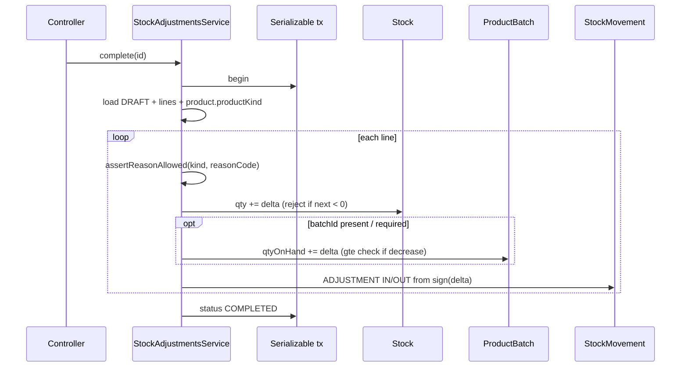

# Design: Stock Adjustment Core Reasons

## Overview

Provide tenant stock-adjustment completion that respects core-value inventory rules: completed purchase/sale stay immutable; corrections use adjustment documents with **kind-specific reason codes** from `docs/core-business-catalog.md`. Reuse Prisma `StockAdjustment` models; wire Nest API; dual-write stock and batch like `core-stock-lifecycle`.

### Goals

- Close audit gap #6 (adjustment service missing).
- Enforce closed reason vocabulary per `ProductKind`.
- Preserve stock ≥ 0 and batch integrity on decrease.

### Non-Goals

- Returns, transfers, FE cycle count, aquaculture reason packs, handbook.

## Requirements Traceability

| Req | Design element |
|---|---|
| R1.x | Document lifecycle DRAFT→COMPLETED, serializable complete |
| R2.x | `adjustment-reason-policy.ts` kind→reasonCode set |
| R3.x | Stock update + ProductBatch + StockMovement ADJUSTMENT |
| R4.x | Jest service/controller tests + receipt task |
| R5.x | Same isolation/retry patterns as sales/purchases |

## Architecture



## Canonical Contracts

<!-- contract:AdjustmentLineInput -->
```json
{
  "productId": "uuid",
  "delta": "Decimal string base units (signed; negative = decrease)",
  "reasonCode": "CLOSED_VOCAB_STRING",
  "batchId": "uuid | null",
  "note": "optional string"
}
```

<!-- contract:AdjustmentCompleteError -->
```json
{
  "reason": "INVALID_REASON | INSUFFICIENT_STOCK | BATCH_REQUIRED | INSUFFICIENT_BATCH | INVALID_STATE",
  "message": "human readable",
  "field": "optional"
}
```

### Invariants

1. Auth tenant only; no body tenantId authority.
2. COMPLETED document immutable (PATCH/complete on COMPLETED → 422 `INVALID_STATE`).
3. Same-tx Stock + batch + movement for each line with `delta ≠ 0`; reject complete if any line has `delta = 0` or empty lines.
4. `StockReason.ADJUSTMENT` on movements; direction IN if delta>0 else OUT; qty = abs(delta); `refType = 'StockAdjustment'`, `refId = adjustment.id`, `refLineId = line.id`.
5. Reason codes validated against kind map; unknown kind uses fallback set.
6. On complete, set line `qtyBefore` / `qtyAfter` from warehouse stock snapshot (do not trust client).
7. Prisma default `StockAdjustment.status = "COMPLETED"` is a trap — **create MUST write `status: 'DRAFT'`** explicitly; never rely on schema default for draft path.
8. Controlled decrease (`isBatchControlled(productKind)` and delta < 0): require `batchId` of same product/tenant with sufficient `qtyOnHand`; optional-batch kinds may decrease stock without batch only when no batch stock is required by policy (match `batch-policy` + core-stock-lifecycle anti-drift: if product has batch qty, prefer explicit batch).

### Schema delta

- Add `StockAdjustmentLine.reasonCode String` (required on create).
- Optionally add `StockAdjustment.status` enum later; for Phase 1 keep string `DRAFT` | `COMPLETED` and enforce in service (**override schema default on create**).
- Optionally add `idempotencyKey` on header — nice-to-have, not required if out of first ship.

### Module layout

```text
backend/src/platform/stock-adjustments/
  adjustment-reason-policy.ts
  stock-adjustments.service.ts
  stock-adjustments.controller.ts
  stock-adjustments.module.ts
  dto/
  *.spec.ts
```

Register in `app.module.ts`. Permissions: reuse `inventory:edit` or add `inventory:adjust` — prefer **`inventory:edit`** for create/complete and **`inventory:view`** for list/detail to avoid seed churn; document in tasks.

## Risk Assessment

| Risk | Severity | Mitigation |
|---|---|---|
| Negative stock race | High | Serializable + conditional updateMany |
| Batch drift | High | Require batch on controlled decrease; conditional batch update |
| Wrong reason opens compliance hole | Medium | Closed map + unit tests per kind |
| Schema string status typos | Low | Service constants DRAFT/COMPLETED |

## Test strategy

- Unit: reason policy allow/deny matrix.
- Service: complete happy path, insufficient stock, bad reason, batch fail, double complete.
- Controller: tenant guard metadata smoke if pattern exists; else service isolation tests.
