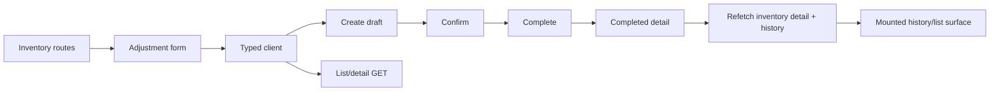

# Design: Stock Adjustment Frontend

## Overview

Extend the authenticated inventory portal with typed API client, adjustment list/detail, and create/complete flow. No backend or dependency change.

## Canonical Contracts & Invariants

<!-- contract:AdjustmentFrontendApi -->
```json
{"list":"GET /tenant/stock-adjustments?page=1&pageSize=20&status=DRAFT|COMPLETED","detail":"GET /tenant/stock-adjustments/:id","create":"POST /tenant/stock-adjustments with warehouseId, optional note, and lines of productId, signed decimal delta, reasonCode, optional batchId","complete":"POST /tenant/stock-adjustments/:id/complete","response":"decimal quantities are strings; status is DRAFT or COMPLETED","error":"reason, message, optional field"}
```

Decimal quantities remain strings; completed records are read-only; tenant scope comes from userFetch; warehouseId must come from the existing authenticated/default warehouse context; if no warehouse context exists, the form shows a blocking Vietnamese message and does not submit; reason choices come only from frontend/lib/stock-adjustment-reasons.ts; unknown API reason codes render safely.

## Component and data flow



Use existing inventory primitives, Vietnamese labels “Điều chỉnh tồn”, “Phiếu điều chỉnh”, “Lý do”, “Chênh lệch”, “Lưu nháp”, “Hoàn tất phiếu”, “Hủy”; match DESIGN.md tokens #5CAD45/#4F9C3A/#3F8530, #E6EAE6 borders, 16px body/cards, 10px controls, 48px targets, Be Vietnam Pro.

## Requirements Traceability

| Requirement | Design | Task |
|---|---|---|
| R1.1-R1.2 | typed client | R0-01 |
| R2.1-R2.3 | mounted history/list, detail/status gate | R1-01 |
| R3.1-R3.4 | reason policy, form/confirmation, explicit refetch | R2-01 |
| R4.1-R4.3 | DESIGN.md responsive primitives | R1-01,R2-01,R3-01 |
| R5.1-R5.2 | tests and route smoke | R0-01,R1-01,R2-01,R3-01 |

## Test strategy

Unit API/validation; component list/detail/form states; runtime flow at mobile and desktop; commands: pnpm --dir frontend test, pnpm --dir frontend lint, pnpm --dir frontend build.

## Security, performance, rollback

Use userFetch only, never accept tenantId, never log tokens/raw bodies; page size remains bounded at 20; rollback removes FE client/actions only.

## Risk Assessment

| Risk | Severity | Mitigation |
|---|---|---|
| Warehouse source absent | High | Reuse existing source or block; never fabricate. |
| Accidental completion | High | Explicit confirmation and disable while pending. |
