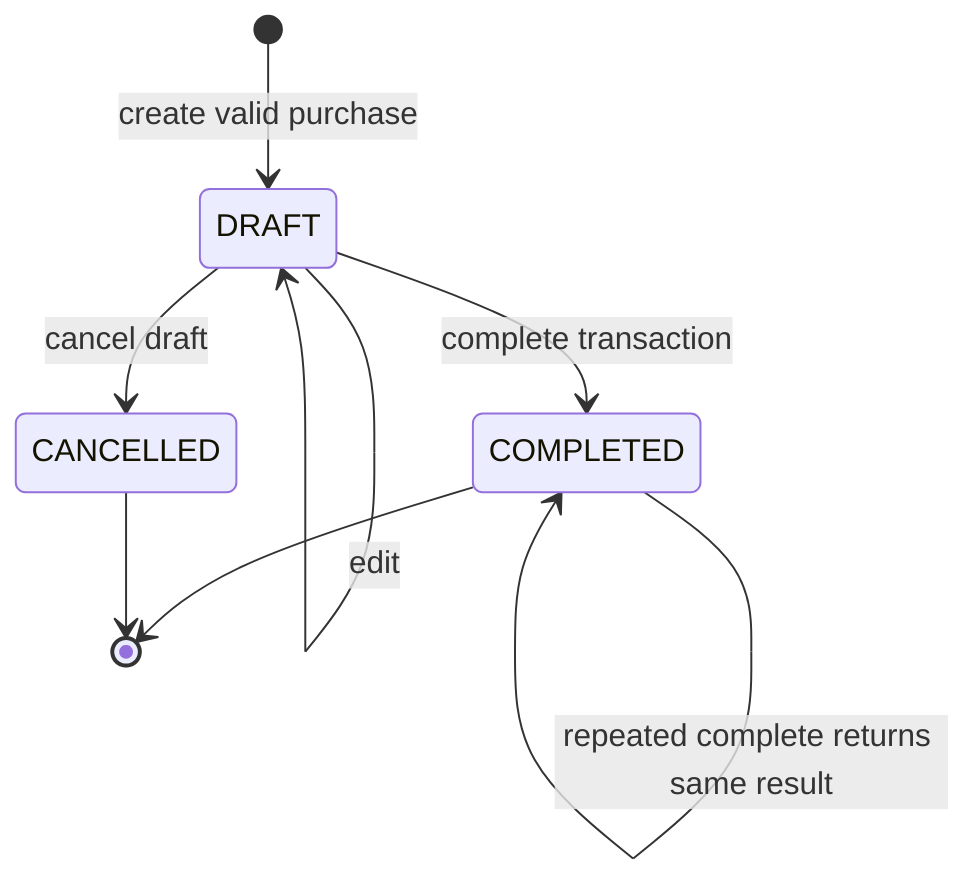
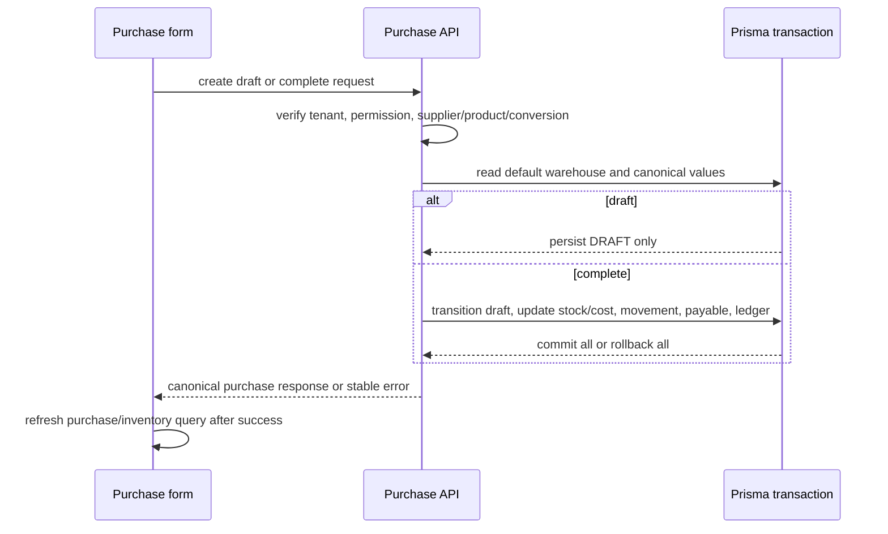
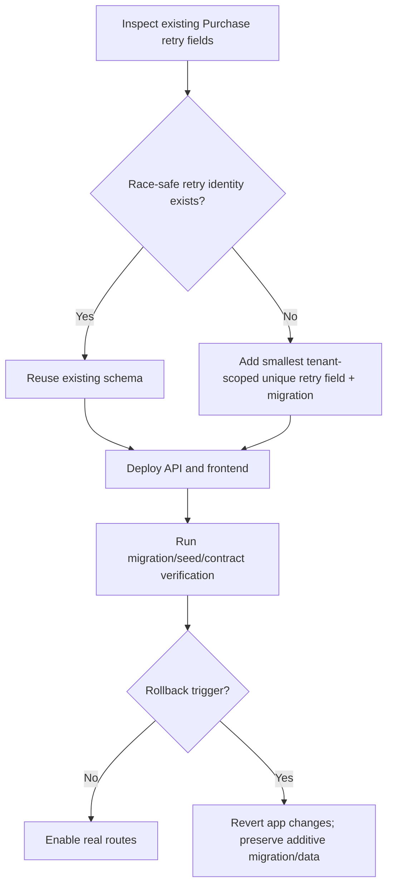

# Tenant Purchase Management Design

## Overview

This feature turns the user-app purchase and inventory surfaces into a real tenant-scoped inventory intake workflow. A store user can manage suppliers, prepare a draft, select a base or purchase unit, and complete the document. Completion updates purchase history, stock, stock movement, moving-average cost, and supplier payable in one transaction.

The design extends existing NestJS/Prisma and Next.js patterns. It uses one default warehouse in Simple Mode, server-derived monetary and conversion values, and explicit API loading/error states. Supplier CRUD is included because the approved scope is Expand; supplier payment vouchers and purchase returns remain deferred.

### Goals

- Replace seed-backed `/nhap-hang` and `/ton-kho` with authenticated tenant API flows.
- Make completion an atomic, retry-safe inbound stock operation.
- Preserve base-unit inventory invariants while supporting purchase-unit conversion.
- Expose supplier records and payable changes without duplicating debt/payment systems.

### Non-Goals

- Purchase returns, payment-voucher CRUD, purchase orders, approval/receiving stages, multi-warehouse, FIFO, accounting, import/export, or product/conversion CRUD.
- Local-only inventory adjustment writes; detail may show a deferred action state.

## Architecture

### Existing Architecture Analysis

- Backend controllers authenticate via tenant access token, enforce tenant permission and entitlement guards, and delegate business rules to Prisma-backed services.
- Sales already demonstrates an atomic Prisma transaction for stock movement and customer debt. Purchase reuses the same transaction boundary with inbound quantity and supplier debt.
- Frontend API clients call `userFetch`; purchase and inventory components currently use seed libraries and must be replaced at their runtime entrypoints.

### Architecture Pattern & Boundary Map

Selected pattern: tenant-scoped vertical slice with a Purchase aggregate service, a Supplier service, and a read-only inventory query boundary. Completion owns one database transaction; the controller never accepts tenant identity or derived financial/quantity fields.

```mermaid
flowchart LR
  PurchaseUI[/nhap-hang] --> PurchaseClient[tenant-purchases-api]
  PurchaseClient --> PurchaseGuard[Tenant auth + permission + entitlement]
  PurchaseGuard --> PurchaseController[PurchaseController]
  PurchaseController --> PurchaseService[PurchaseService]
  SupplierUI[Supplier picker/CRUD] --> SupplierClient[supplier API client]
  SupplierClient --> SupplierController[SupplierController]
  PurchaseService --> Tx[(Prisma transaction)]
  Tx --> Purchase[(Purchase + PurchaseLine)]
  Tx --> Stock[(Stock + StockMovement)]
  Tx --> Payable[(Supplier.balance + DebtLedger)]
  InventoryUI[/ton-kho] --> InventoryClient[tenant-inventory-api]
  InventoryClient --> InventoryQuery[tenant-scoped inventory query]
  InventoryQuery --> DB[(PostgreSQL)]
```

### Technology Stack

| Layer | Choice / Version | Role | Notes |
|---|---|---|---|
| Frontend | Next.js/React/TypeScript | Purchase form/list/detail and inventory read states | Reuse `userFetch`, existing components, and `DESIGN.md` |
| Backend | NestJS, class-validator, Jest | Supplier/purchase APIs and business validation | Follow products/sales controller-service split |
| Data | Prisma/PostgreSQL | Existing retail tables | Add migration only if the approved retry contract cannot use existing fields |
| Runtime | Existing tenant auth and entitlement guards | Authorization and feature gating | No alternate auth path |

## Canonical Contracts & Invariants

| Contract Area | Canonical Decision | Applies To | Must Stay Consistent In |
|---|---|---|---|
| Auth/session | `tenantId` and `userId` come only from the verified tenant access token. Every query/write is tenant-scoped. | All controllers/services | DTOs, guards, tests, UI clients |
| Permissions | Purchase routes use existing purchase permissions; supplier routes use supplier permissions; inventory routes use inventory read permission and entitlement. Exact codes must be confirmed from the catalog before implementation. | API entrypoints | Controller decorators, E2E fixtures, frontend errors |
| Warehouse | Server resolves exactly one active default warehouse for the tenant. The client cannot choose or override it in this slice. | Create/complete/inventory | DTO, service, API response, tests |
| Lifecycle | `DRAFT` has no stock/payable effects; `COMPLETED` applies effects exactly once; `CANCELLED` is terminal and does not reverse effects in this slice. | Purchase service/UI | State transitions, actions, tests |
| Conversion | Base unit is valid with factor 1. A non-base unit requires a tenant/product conversion whose kind is `PURCHASE` or `BOTH` and whose positive Decimal `factorToBase` is used to derive `qtyBase`. Client `qtyBase` is ignored/rejected. | DTO/service/UI | API, line persistence, stock movement, tests |
| Money | Monetary input is integer VND serialized as JSON strings or numbers according to existing API convention; server calculates subtotal, total, paid, and debt. BigInt values are serialized safely. | Purchase API/UI | DTO, response mapper, tests |
| Completion transaction | One Prisma transaction creates/updates purchase records, increments stock, updates moving-average cost, creates `IN/PURCHASE` movements, and conditionally updates supplier balance plus supplier debt ledger. Any failure rolls back all effects. | Completion | Service, integration/E2E |
| Retry/concurrency | Completion uses a conditional state transition or row lock so only one request can move a draft to completed. Repeating completion returns the persisted completed result; a different logical payload for the same retry identity conflicts. | Completion endpoint | API contract, tests, UI submit guard |
| Retention | Supplier soft deletion does not delete historical purchases; inactive/deleted suppliers cannot be used for new drafts. | Supplier/purchase | Queries, constraints, tests |

## System Flows





## Requirements Traceability

| Requirement | Design elements | Tasks |
|---|---|---|
| 1.1–1.4 | SupplierController/Service, supplier query and write guards | R0-01, R1-02, R3-01 |
| 2.1–2.4 | Purchase lifecycle service and state machine | R0-01, R1-01, R2-01 |
| 3.1–3.5 | Conversion validation, Decimal derivation, typed form display | R0-01, R1-01, R2-01 |
| 4.1–4.5 | Completion transaction, stock/cost/movement invariants | R1-01, R3-01 |
| 5.1–5.4 | Payment/debt rules and supplier ledger | R1-01, R3-01 |
| 6.1–6.4 | Guards, tenant filters, retry/concurrency contract | R0-01, R1-01, R1-02, R3-01 |
| 7.1–7.4 | Purchase API client and route reachability | R2-01, R3-01 |
| 8.1–8.4 | Inventory query/client and route reachability | R2-02, R3-01 |
| 9.1–9.2 | Pagination and bounded transaction tests | R1-01, R2-01 |
| 10.1–10.3 | Tenant scope and server-derived values | R0-01, R1-01, R1-02, R3-01 |
| 11.1–11.3 | Rollback, audit references, full verification | R1-01, R3-01 |

## Components and Interfaces

| Component | Layer | Intent | Requirements | Dependencies |
|---|---|---|---|---|
| PurchaseController/Service | Backend | Own purchase lifecycle and completion transaction | 2–6, 9–11 | Prisma, auth/entitlement guards |
| SupplierController/Service | Backend | Tenant-scoped supplier CRUD/search | 1, 6, 10 | Prisma, supplier permissions |
| Purchase DTOs/API client | Shared boundary | Validate and serialize purchase request/response | 2–7, 10 | class-validator, `userFetch` |
| Purchase UI | Frontend | Real list/form/detail flow with error preservation | 2–7 | Purchase client, supplier client |
| Inventory query/API/UI | Frontend/backend | Show durable stock/cost/movement state | 4, 8–11 | Product/stock/movement tables |

### Purchase service

- Resolve and validate one active default warehouse.
- Load supplier and all products with tenant scope; load base unit and only purchase-enabled conversions.
- Normalize lines deterministically; derive `qtyBase`, line totals, subtotal, total, amount paid, and debt.
- Draft writes only `Purchase` and `PurchaseLine`.
- Completion conditionally transitions the purchase and then updates stock rows with Decimal quantities and moving-average cost; writes movements with `refType=PURCHASE`, `refId`, and `refLineId`.
- For unpaid amount, increment `Supplier.balance` and write `DebtLedger` with `SUPPLIER/PURCHASE/INCREASE` and `balanceAfter`.
- Require Purchase.idempotencyKey and a tenant-scoped unique constraint; compare the canonical normalized payload before returning a replay result.

### API contract

| Method | Endpoint | Purpose | Response | Key errors |
|---|---|---|---|---|
| GET | `/tenant/purchases` | Paginated purchase list | `{items, page, pageSize, total}` | 401, 403 |
| POST | `/tenant/purchases` | Create draft or completed purchase | Purchase detail | 400, 403, 409, 422 |
| GET | `/tenant/purchases/:id` | Purchase detail | Purchase detail | 401, 403, 404 |
| PATCH | `/tenant/purchases/:id` | Edit draft | Purchase detail | 403, 404, 409, 422 |
| POST | `/tenant/purchases/:id/complete` | Complete draft atomically | Purchase detail | 403, 404, 409, 422 |
| POST | `/tenant/purchases/:id/cancel` | Cancel draft | Purchase detail | 403, 404, 409 |
| GET | `/tenant/suppliers` | Search/list suppliers | Paginated supplier list | 401, 403 |
| POST/PATCH/DELETE | `/tenant/suppliers[/:id]` | Supplier CRUD | Supplier | 403, 404, 409, 422 |
| GET | `/tenant/inventory` | Paginated stock view | Inventory item list | 401, 403 |
| GET | `/tenant/inventory/:productId` | Stock/movement detail | Inventory detail | 401, 403, 404 |

Request rules: client sends supplierId, lines with productId/unitId/qty/unitPrice, discount/shipping, amountPaid/paymentMethod, note, and retry identity as applicable. Server ignores or rejects client-supplied `qtyBase`, totals, balances, and stock values.

## Data Models

Reuse existing Prisma models. No purchase-specific model is required. `PurchaseLine.qtyBase` is the canonical inbound quantity; `Stock.qty` is always base-unit quantity. Existing `ProductUnitConversion.factorToBase` is the canonical conversion source. The implementation must not create duplicate conversion tables.

Moving-average cost for a completed line is:

`newAvgCost = floor((oldQty × oldAvgCost + receivedQtyBase × receivedUnitCostBase) / (oldQty + receivedQtyBase))`.

The received unit cost is calculated in integer VND per base unit. Allocate document discount and shipping proportionally by each line subtotal; apply line discount before allocation, then divide each line’s allocated net cost by its qtyBase using integer floor with a remainder assigned to the final line. A zero-quantity or zero-total line is invalid.

## Error Handling

| Condition | HTTP | Client behavior |
|---|---:|---|
| Missing/invalid token | 401 | Existing `userFetch` auth handling |
| Missing permission/feature | 403 | Show permission/plan guidance; preserve form |
| Cross-tenant/missing record | 404 or existing guarded contract | Do not reveal existence; preserve form |
| Invalid supplier/product/unit/conversion/amount | 422 | Show field-level error; preserve form |
| Invalid state or duplicate conflicting completion | 409 | Refresh detail; never apply local effects |
| Transaction/database failure | 500 | Stable retryable message; prove rollback |

## Testing Strategy

- Unit: DTO normalization, conversion factor validation, Decimal `qtyBase`, money totals, lifecycle transitions, average-cost allocation, and response serialization.
- Integration: create draft without side effects; complete with stock/movement/payable/debt; full payment; invalid conversion; inactive supplier; repeated/concurrent completion; rollback; tenant isolation; permission/entitlement denial.
- Frontend tests: typed API client requests, purchase form submit/duplicate prevention/error preservation, inventory data mapping/filter counts, and no seed fallback.
- E2E/UI: `/nhap-hang/tao → save draft → complete → detail`, then `/ton-kho` reflects stock/cost; supplier create/edit/search; unauthorized and cross-tenant paths.
- Build/lint: backend tests/build and frontend test/lint/build, plus diff check.

## Security Considerations

- Tenant identity is token-derived, never body-derived.
- Every relation lookup includes tenant constraints or is reached through a tenant-constrained parent.
- Server derives all quantity, conversion, monetary, stock, supplier balance, and debt values.
- Supplier soft deletion preserves historical references while preventing new purchases.

## Performance & Scalability

- Use server pagination for purchases, suppliers, and inventory; default page size ≤20.
- Batch product/conversion/supplier reads before transaction writes; cap a purchase at 100 lines in validation.
- Keep completion synchronous and transactional for the first slice; no event bus or background reconciliation.

## Migration Strategy



The approved retry contract adds nullable Purchase.idempotencyKey with a tenant-scoped unique constraint on (tenantId, idempotencyKey), plus the smallest Prisma migration. The key is required for create/complete attempts, is compared against a canonical normalized payload, and prevents duplicate effects under concurrent retries. No other schema change is allowed.
