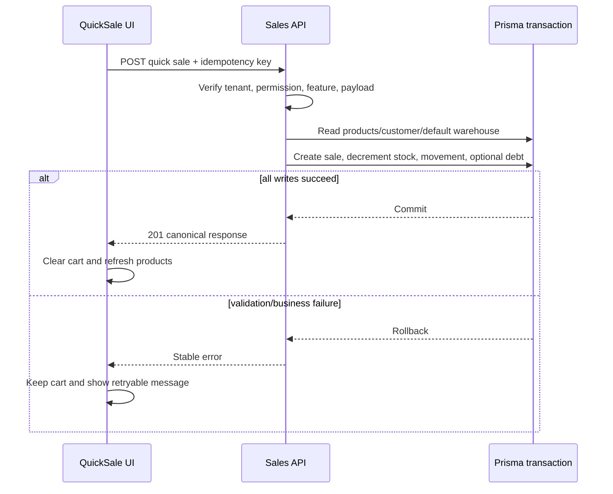

# Design Document

## Overview

This feature delivers the first real revenue path for tenant users: checkout from `/ban-nhanh` using the tenant's current product catalog. A completed checkout persists a sale and applies stock/payment/debt effects consistently.

The implementation extends existing NestJS/Prisma and Next.js patterns. It does not introduce a new persistence model, event bus, offline queue, or customer-management feature.

### Goals
- Create a tenant-scoped completed quick sale with atomic stock and debt effects.
- Replace mock product search and local-only success with authenticated API wiring.
- Preserve the existing mobile-first UX and cart on failures.

### Non-Goals
- Draft orders, returns, customer CRUD/search, disease recommendations, offline mode, printing, tax, batch allocation, and warehouse selection.

## Architecture

### Existing Architecture Analysis
- Backend uses NestJS controllers, DTO validation, tenant access/permission guards, entitlement guards, and Prisma services.
- Product reads already use `/tenant/products` and `/tenant/products/lookups`; frontend API calls use `userFetch`.
- The relational schema already contains the sale, stock, movement, customer, debt, and document-sequence tables.

### Architecture Pattern & Boundary Map

Selected pattern: one tenant-scoped application service with a single Prisma transaction. The controller authenticates and authorizes; the service validates business invariants and owns persistence; the frontend owns cart interaction and invokes the API.

```mermaid
flowchart LR
  UI[/ban-nhanh] --> Picker[Real tenant ProductPicker]
  UI --> Client[tenant-sales-api.ts]
  Client --> Guard[Tenant access + permission + entitlement guards]
  Guard --> Controller[POST /tenant/sales/quick]
  Controller --> Service[SalesService.createQuickSale]
  Service --> Tx[(Prisma transaction)]
  Tx --> Sale[Sale + SaleLine]
  Tx --> Stock[Stock + StockMovement]
  Tx --> Debt[DebtLedger when unpaid]
```

## Technology Stack

| Layer | Choice / Version | Role in Feature | Notes |
|---|---|---|---|
| Frontend | Next.js 16, React 19, TypeScript | Product picker, cart submit, result/error states | Reuse existing sales components |
| Backend | NestJS, class-validator, Jest | Authenticated quick-sale endpoint and domain service | Follow product module patterns |
| Data | Prisma/PostgreSQL | Existing Sale, Stock, Movement, DebtLedger persistence | No migration planned |
| Transport | JSON over authenticated HTTP | Quick-sale request/response | Use `userFetch` on frontend |

## Canonical Contracts & Invariants

| Contract Area | Canonical Decision | Applies To | Must Stay Consistent In |
|---|---|---|---|
| Auth / session | Tenant/user identity comes only from the verified tenant access token; endpoint requires the existing `sales:create` permission and `inventory`. | Backend endpoint | Controller, service tests, e2e, frontend caller |
| Transport / entrypoints | `POST /tenant/sales/quick`; frontend calls it through `userFetch`; default warehouse is server-resolved. | API/UI | DTO, API client, quick-sale submit |
| Data / persistence | One Prisma transaction writes Sale/SaleLine, decrements Stock, writes StockMovement, and conditionally writes DebtLedger. | Service/database | Service, tests, rollback proof |
| Idempotency | Client creates one UUID per checkout attempt; same tenant + same key + same payload returns original result; same key + different payload returns conflict. | API/UI | DTO, service, retry behavior |
| Deletion / retention policy | No new deletion behavior is introduced; existing soft-delete fields remain unchanged. | Data layer | Tasks and tests |

<!-- contract:QuickSaleApi -->
```json
{
  "request": {
    "idempotencyKey": "uuid",
    "customerId": "uuid|null",
    "paymentMethod": "CASH|TRANSFER|QR|DEBT",
    "amountPaid": 0,
    "discountAmount": 0,
    "lines": [{ "productId": "uuid", "unitId": "uuid", "qty": 1, "unitPrice": 1000 }]
  },
  "response": {
    "id": "uuid",
    "docNo": "BH-000001",
    "status": "COMPLETED",
    "subtotal": 1000,
    "discountAmount": 0,
    "total": 1000,
    "amountPaid": 1000,
    "changeAmount": 0,
    "debtAmount": 0,
    "paymentMethod": "CASH",
    "lines": [{ "productId": "uuid", "qty": 1, "qtyBase": 1, "unitPrice": 1000, "lineTotal": 1000 }]
  }
}
```

Error shape: `{ "reason": "INSUFFICIENT_STOCK|PRODUCT_UNSELLABLE|INVALID_CUSTOMER|IDEMPOTENCY_CONFLICT|VALIDATION_ERROR", "message": "..." }` with 400/403/409/422 as appropriate.

## System Flows



## Requirements Traceability

| Requirement | Design elements | Tasks |
|---|---|---|
| 1.1–1.4 | Sales DTO/service, default warehouse, Sale aggregate | R0-01, R1-01 |
| 2.1–2.5 | Transaction and stock/debt invariants | R1-01 |
| 3.1–3.5 | ProductPicker and quick-sale API client/submit | R2-01, R2-02 |
| 4.1–4.4 | Guards and idempotency contract | R0-01, R1-01 |
| 5.1–5.2 | Bounded cart and single product list request | R1-01, R2-01 |
| 6.1–6.2 | Tenant guard and negative-path tests | R1-01, R3-01 |
| 7.1–7.2 | Transaction rollback and cart preservation | R1-01, R2-02, R3-01 |

## Components and Interfaces

| Component | Layer | Intent | Requirements | Contracts |
|---|---|---|---|---|
| SalesController | Backend | Expose authorized quick-sale route | 1, 4, 6 | QuickSaleApi |
| SalesService | Backend | Validate and persist the atomic sale | 1, 2, 4, 7 | QuickSaleApi |
| tenant-sales-api.ts | Frontend | Typed authenticated API client | 3, 4, 7 | QuickSaleApi |
| ProductPicker | Frontend | Search current tenant products | 3.1, 3.2 | Tenant product API |
| QuickSale | Frontend | Submit checkout and display result/errors | 3.3–3.5, 7.2 | QuickSaleApi |

### Backend service
- Resolve exactly one warehouse with `tenantId`, `isDefault=true`, and `deletedAt IS NULL`; fail with a stable configuration error when zero or multiple matches exist.
- Load all requested products in the tenant and reject missing, inactive, locked, recalled, or insufficient stock lines.
- Use integer monetary values and decimal quantities; derive all totals server-side.
- Validate each submitted `unitId` against the product base unit or a valid product conversion, derive `qtyBase` on the server, and use the derived quantity for stock checks/decrements.
- Use conditional stock updates or equivalent row-safe transaction checks so concurrent checkout cannot make stock negative.
- Persist an `OUT/SALE` movement for each line and a `SALE` debt ledger row only for unpaid amount; increment `Customer.balance` in the same transaction.
- Check idempotency before mutation and persist the result under the unique tenant/key constraint.
- For an existing idempotency key, compare a canonical fingerprint of the normalized request (sorted lines, normalized quantities and money, customer, payment, discount) before returning the original result; do not add a schema column in this slice.

### Frontend integration
- `ProductPicker` loads `listTenantProducts()` and `getProductLookups()` once, maps rows with `mapTenantProduct`, and filters the in-memory result.
- `QuickSale` generates one idempotency key when payment begins, calls `createQuickSale`, disables repeated confirmation, and retains lines on error.
- Use existing `userFetch` so bearer token refresh and 401 handling remain centralized.
- Preserve `DESIGN.md` mobile-first tokens and existing component layout; no new visual system.

## Data Models

Reuse existing `Sale`, `SaleLine`, `Stock`, `StockMovement`, `Customer`, `DebtLedger`, `Warehouse`, and `DocumentSequence` models. The feature must not add columns or migrations. All writes are tenant-scoped and occur in one transaction.

## Error Handling

| Condition | HTTP | Client behavior |
|---|---:|---|
| Missing/invalid token | 401 | Existing `userFetch` auth handling |
| Missing permission/feature | 403 | Show permission/plan guidance; preserve cart |
| Invalid line/customer/payment | 422 | Show validation message; preserve cart |
| Insufficient/unsellable stock | 409 | Show product-specific retry message; preserve cart |
| Reused key with different payload | 409 | Do not retry automatically; preserve cart |
| Database/unknown failure | 500 | Generic retryable error; preserve cart |

## Verification Strategy
- Unit: DTO/payment/total validation and service business rules.
- Integration/E2E: tenant isolation, permission/feature guards, successful sale, rollback, stock/debt side effects, and idempotency.
- Frontend: Vitest for API-backed picker/submit state where practical; Next build plus browser reachability for `/ban-nhanh`.
- Manual/runtime: verify mobile checkout success and failure preserves the cart.

## Rollback Plan

If implementation causes regressions, disable the new submit path behind the existing frontend feature boundary or revert the sales module/client changes; no migration rollback is needed because the design reuses existing tables. Existing mock UI can remain as a temporary fallback only during development, not as completion evidence.
