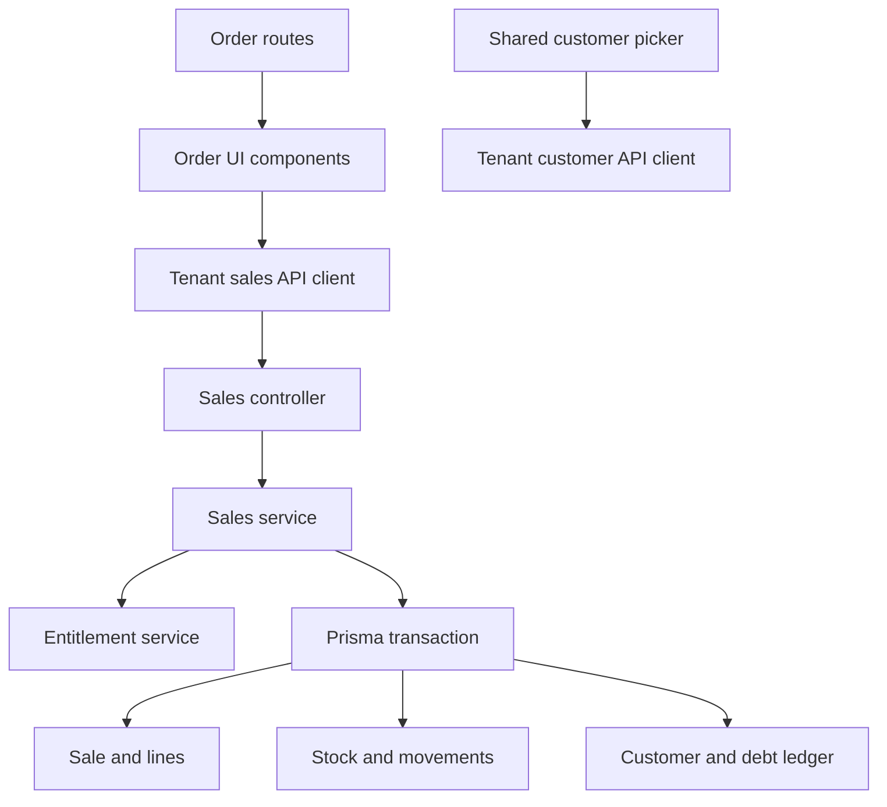
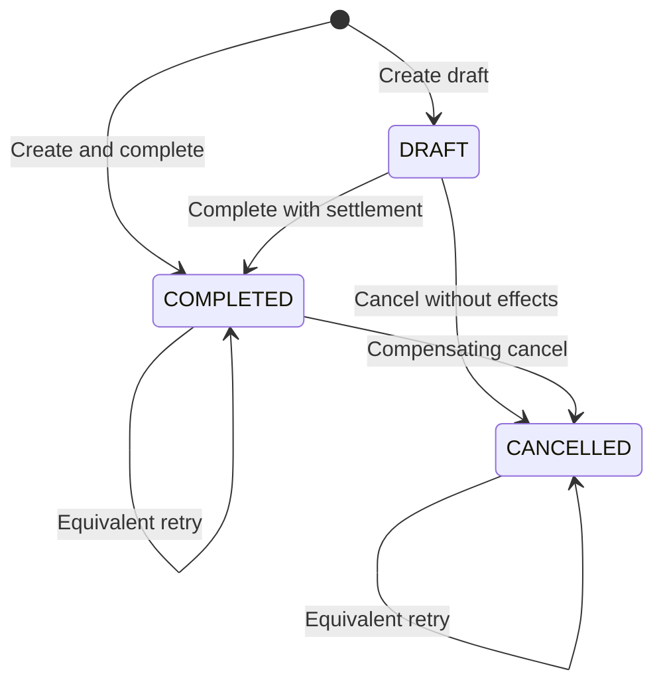
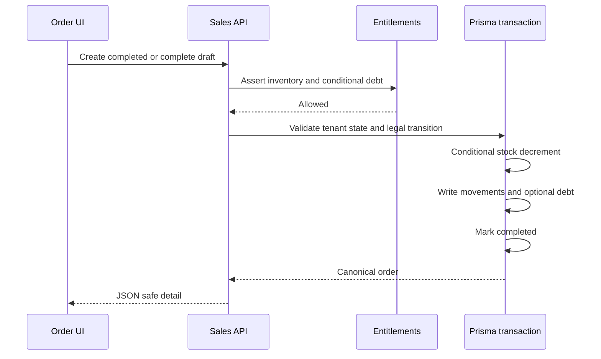
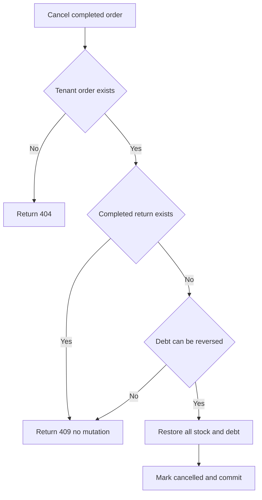
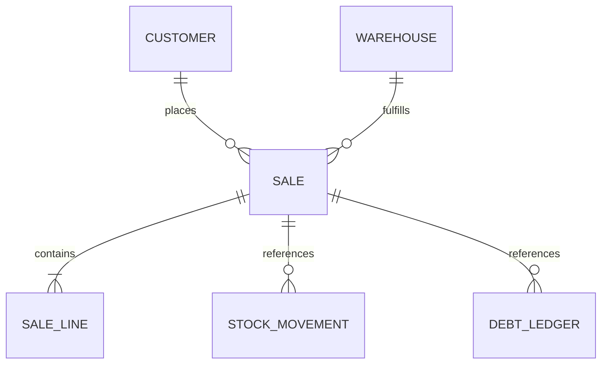

# Design: Tenant Sales Order Management

## Overview

This feature turns the existing `/don-ban-hang` mock experience into a real tenant sales-order workflow while preserving the current Next.js routes and the existing `Sale` aggregate. It extends `SalesModule` instead of introducing a second order domain, and it reuses the quick-sale validation/effect rules plus the purchase module's proven draft and Serializable transaction pattern.

The critical boundary is the lifecycle transaction. A draft stores validated snapshots and totals without inventory or debt effects. Completion applies stock and optional customer debt exactly once. Cancellation of a draft is a state-only transition; cancellation of a completed order is an explicit compensating void that either restores all scoped inventory/debt effects or changes nothing.

### Goals

- Replace seeded order/customer runtime data with tenant APIs on list, create, and detail routes.
- Provide tenant-safe, permissioned, entitlement-aware order query and lifecycle endpoints.
- Keep order, stock movement, stock quantity, customer balance, and debt ledger consistent under retry, failure, and concurrency.
- Preserve `DESIGN.md` mobile-first, responsive, accessible interaction patterns.

### Non-Goals

- Sales Return, partial line return, refund/cashbook document, or reopening a terminal order.
- Editing a persisted draft.
- Tax, receipt printing, Zalo sharing, multi-warehouse choice, batch allocation, offline writes, handbook context, or pricing-tier expansion.
- Retrofitting audit actions, monthly order quota reservation, or `DocumentSequence` across existing sales/purchase flows.
- A new SalesOrder module, model, repository abstraction, or global multi-feature entitlement guard.

## Architecture

### Existing Architecture Analysis

- `SalesController` exposes only `POST /tenant/sales/quick`; `SalesService` already owns product/customer validation and atomic stock/debt effects.
- `Sale.channel=ORDER` and `Sale.status=DRAFT|COMPLETED|CANCELLED` already model the requested lifecycle.
- `PurchasesService` supplies the established list/detail/draft/direct-complete/Serializable-retry pattern.
- `/don-ban-hang`, `/don-ban-hang/tao`, and `/don-ban-hang/:id` already exist, but the list/detail/form use `frontend/lib/orders.ts` seeds and local transitions.
- `ProductPicker` is API-backed; `CustomerPicker` remains seed-backed and is shared with quick sale.

### Architecture Pattern & Boundary Map



**Architecture Integration**

- Selected pattern: existing Nest domain service plus explicit REST DTOs and a typed frontend client.
- Domain boundaries: `SalesService` owns sale lifecycle; entitlement service authorizes transactional features; Prisma owns atomic persistence; frontend components own view state only.
- Existing patterns preserved: guarded controllers, tenant predicates, class-validator DTOs, JSON-safe response mapping, `userFetch`, route-level client components, and component/E2E tests.
- New components rationale: only DTO files, migration, API client types/functions, and tests are added; no new service/module abstraction is justified.
- Steering compliance: YAGNI, KISS, DRY; exact tenant scope; server-authoritative totals/state; additive migration; no speculative adjacent workflow.

### Technology Stack

| Layer | Choice / Version | Role in Feature | Notes |
|---|---|---|---|
| Frontend | Next.js 16.2, React 19.2, TypeScript | Existing order routes and stateful UI | Reuse current routes/components and `userFetch`. |
| Backend | NestJS 11, TypeScript, class-validator | Guarded REST endpoints and typed validation | Extend `SalesController`/`SalesService`. |
| Data | PostgreSQL via Prisma 7.8 | Sale lifecycle and atomic inventory/debt writes | Serializable transactions with bounded P2034 retry. |
| UI | Tailwind CSS v4, Lucide, existing sheets/shared list primitives | Responsive and accessible interaction | Must match `DESIGN.md`; no new dependency. |

## Canonical Contracts & Invariants

| Contract Area | Canonical Decision | Applies To | Must Stay Consistent In |
|---|---|---|---|
| Auth / session | Tenant and actor identity come only from the verified tenant access token. Reads require `sales:view`, create requires `sales:create`, and lifecycle transitions require `sales:edit`. | All order endpoints | Controller metadata, service predicates, unit/E2E tests, frontend errors |
| Entitlements | Every order route requires `advanced_mode`; stock-affecting transactions assert `inventory`; debt creation or compensation additionally asserts `debt` before mutation. | Controller and lifecycle transactions | Controller, service, tests |
| Transport / entrypoints | Canonical base path is `/tenant/sales/orders`; the existing quick-sale path remains unchanged. | Backend/FE | DTOs, client, components, E2E |
| Data / persistence | `Sale.channel=ORDER`; draft has no stock/debt effects; terminal transition and all effects commit in one Serializable transaction. | Sale, lines, stock, movements, customer, ledger | Schema, service, tests |
| Idempotency | Tenant-wide create key equality includes channel and normalized payload; cross-channel reuse is 409. Completion/cancellation replay is state-idempotent and never duplicates effects. | Create, complete, cancel, quick-sale regression | Service, API client, tests |
| Cancellation | Draft cancel is state-only. Completed cancel restores all line stock and original debt, writes compensating records, then marks cancelled; any ineligible compensation rolls back and returns 409. | Completed orders | Service, UI copy, E2E |
| Generated artifacts / runtime outputs | Frontend renders explicit JSON-safe DTOs and never imports seeded orders/customers at runtime; business API responses are not PWA-cached. | All order screens | API mapper, UI, service worker regression |

### Machine-Checkable API Contract

<!-- contract:SALES_ORDER_API_V1 -->
```text
Base: /tenant/sales/orders
List: GET /?search=&status=DRAFT|COMPLETED|CANCELLED&page=1&pageSize=20 -> {items: SalesOrderSummary[], page, pageSize, total}
Detail: GET /:id -> SalesOrderDetail
Create: POST / -> {idempotencyKey, status:DRAFT|COMPLETED, customerId?, discountAmount, note?, settlement?, lines:[{productId,unitId,qty,unitPrice}]}
Complete: POST /:id/complete -> {paymentMethod:CASH|BANK_TRANSFER|QR|DEBT, amountPaid}
Cancel: POST /:id/cancel -> SalesOrderDetail
SalesOrderSummary: {id,docNo,status,customerName,customerPhone,itemCount,total,paymentMethod,soldAt,createdAt}
SalesOrderDetail: {id,docNo,channel:ORDER,status,customer:{id,name,phone}|null,warehouseId,subtotal,discountAmount,total,amountPaid,changeAmount,debtAmount,paymentMethod:CASH|BANK_TRANSFER|QR|DEBT|null,note,soldAt,completedAt,createdAt,updatedAt,lines:[{id,productId,productName,unitId,unitName,qty,qtyBase,unitPrice,lineTotal}]}
Errors: 401 unauthenticated; 403 permission or entitlement; 404 non-enumerating tenant or object miss; 409 idempotency, state, race, or compensation conflict; 422 validation, stock, or business-rule failure
Serialization: money is integer VND JSON number within Number.MAX_SAFE_INTEGER; qty and qtyBase are decimal strings; DRAFT rejects settlement; COMPLETED requires settlement
```

### Lifecycle Invariants

- Legal transitions: `DRAFT -> COMPLETED`, `DRAFT -> CANCELLED`, `COMPLETED -> CANCELLED`.
- Terminal replay: repeating the transition already reflected by state returns the same order; the opposite terminal transition returns 409.
- Draft persistence validates tenant product, sale unit, customer, non-negative integer money, and discount not exceeding subtotal, but never changes stock/debt.
- Completion calculates `amountPaid`, `changeAmount`, and `debtAmount` server-side. `DEBT` requires zero paid; only `CASH` may exceed total and produce change; any unpaid amount requires a customer.
- Stock decrement uses a conditional `qty >= qtyBase` predicate per line. Missing or insufficient stock aborts the full transaction.
- Completed cancellation increments stock from persisted line `qtyBase`, creates one `IN/SALE_CANCEL` movement per line, and never alters average cost.
- Debt compensation uses a conditional customer balance decrement by the original sale `debtAmount`; an insufficient aggregate balance aborts the full cancellation.
- A completed order with any completed `SalesReturn` is not eligible for completed cancellation.
- Every order/product/customer/warehouse/stock/return lookup includes tenant ownership or is reached only through a tenant-scoped parent.

## System Flows

### Lifecycle State Machine



### Completion or Direct-Complete Sequence



### Completed Cancellation Decision



## Requirements Traceability

| Requirement | Summary | Components | Interfaces | Flows |
|---|---|---|---|---|
| 1.1 | Tenant order list | SalesService query, client, list | GET collection | List load |
| 1.2 | Search/filter/page cap | Query DTO, list component | GET query | List load |
| 1.3 | Snapshot detail | Response mapper, detail component | GET item | Detail load |
| 1.4 | Non-enumerating miss | Tenant query boundary | GET item | Error path |
| 2.1 | Persist draft/completed order | Create DTO, SalesService | POST collection | Create |
| 2.2 | Draft side-effect freedom | SalesService transaction | POST collection | Create draft |
| 2.3 | Typed validation rollback | DTO, preparation logic | POST collection | Error path |
| 2.4 | Direct completion | Shared completion transaction | POST collection | Completion sequence |
| 2.5 | Create replay/conflict | Channel-aware idempotency | POST collection | Retry |
| 3.1 | Draft completion state | Lifecycle transaction | POST complete | Completion sequence |
| 3.2 | Stock decrement/movement | Stock effect logic | POST complete | Completion sequence |
| 3.3 | Optional customer debt | Debt effect logic | POST complete | Completion sequence |
| 3.4 | Full rollback | Prisma transaction | POST complete | Error path |
| 3.5 | Completion replay | Lifecycle state check | POST complete | Retry |
| 4.1 | Draft cancellation | Lifecycle transaction | POST cancel | State machine |
| 4.2 | Completed compensation | Compensation logic | POST cancel | Cancellation decision |
| 4.3 | Ineligible compensation | Return/debt guards | POST cancel | Cancellation decision |
| 4.4 | Cancel replay/conflict | Lifecycle state check | POST cancel | Retry |
| 4.5 | Complete/cancel race | Serializable retry | Complete/cancel | State machine |
| 5.1 | Token/permissions | Controller guards | All endpoints | All |
| 5.2 | Layered entitlements | Controller plus service | All/mutations | All mutations |
| 5.3 | Tenant/actor derivation | Controller/service | All endpoints | All |
| 5.4 | Denial without mutation | Guards and tenant predicates | All endpoints | Error paths |
| 6.1 | Real list states | OrderList | GET collection | List load |
| 6.2 | Responsive server paging | OrderList shared primitives | GET collection | List load |
| 6.3 | Real detail states | Detail route and OrderDetail | GET item | Detail load |
| 6.4 | Cancel interaction | List/detail lifecycle state | POST cancel | Cancellation |
| 7.1 | Real products/customers/units | Pickers and form | Customer/product APIs | Form load |
| 7.2 | Draft submit/retry | OrderForm and client | POST collection | Create draft |
| 7.3 | Settlement/debt UI | PaymentSheet and parent state | Create/complete | Completion sequence |
| 7.4 | Canonical refresh | OrderForm/Detail/List | Mutation responses | Success path |
| 7.5 | Remove runtime mocks | Shared picker and order helpers | Customer/sales clients | All UI |
| 8.1 | Query performance | Index, query, acceptance fixture | GET collection | Performance test |
| 8.2 | Explicit safe DTOs | Response mapper | All responses | All |
| 8.3 | Multi-layer proof | Unit/component/E2E suites | All contracts | Verification |
| 8.4 | Accessible responsive UI | Existing components/routes | UI state | Runtime check |

## Components and Interfaces

| Component | Domain/Layer | Intent | Requirement Coverage | Key Dependencies | Contracts |
|---|---|---|---|---|---|
| SalesController | Backend API | Expose guarded order endpoints | 1.1-5.4, 8.2 | SalesService P0 | API |
| SalesService | Backend domain | Query and transition the Sale aggregate | 1.1-5.4, 8.1-8.3 | Prisma P0, Entitlements P0 | Service, state |
| Sale schema extension | Data | Persist note, query efficiently, classify cancel movement | 1.1-4.5, 8.1 | PostgreSQL P0 | State |
| Tenant sales API client | Frontend data | Own exact request/response mapping | 6.1-7.5, 8.2 | userFetch P0 | API |
| Shared CustomerPicker | Frontend UI | Select real tenant customer for quick sale/order | 7.1, 7.5 | Tenant customer API P0 | State |
| OrderList and OrderCard | Frontend UI | Server-backed responsive list and cancel action | 6.1, 6.2, 6.4, 8.4 | Sales client P0 | State |
| OrderDetail and detail route | Frontend UI | Server detail and lifecycle actions | 6.3, 6.4, 7.3, 7.4, 8.4 | Sales client P0, PaymentSheet P1 | State |
| OrderForm | Frontend UI | Create draft or completed order | 7.1-7.4, 8.4 | Pickers P0, PaymentSheet P0 | State |

### Backend API

#### SalesController

| Field | Detail |
|---|---|
| Intent | Translate verified tenant identity and validated DTOs into SalesService calls. |
| Requirements | 1.1-5.4, 8.2 |

**Responsibilities & Constraints**

- Register the five canonical order endpoints without altering `/tenant/sales/quick`.
- Apply tenant token and permission guards plus `advanced_mode` route entitlement.
- Accept only declared DTO properties and pass token-derived tenant/user IDs.

**Dependencies**

- Inbound: Next.js tenant sales client — HTTP consumer (P0).
- Outbound: SalesService — query/lifecycle owner (P0).
- Outbound: existing tenant guards/EntitlementsGuard — boundary authorization (P0).

**Contracts**: Service [x] / API [x] / Event [ ] / Batch [ ] / State [ ]

##### API Contract

The complete contract is `SALES_ORDER_API_V1`. Permissions are `sales:view` for GET, `sales:create` for POST collection, and `sales:edit` for complete/cancel.

**Implementation Notes**

- Integration: keep `SalesModule` registration unchanged.
- Validation: controller metadata unit tests plus E2E permission/feature denial.
- Risks: route order must place static `orders`/`quick` paths before dynamic identifiers where Nest matching could conflict.

### Backend Domain

#### SalesService

| Field | Detail |
|---|---|
| Intent | Own order query, validation, lifecycle transitions, inventory, debt, idempotency, and explicit response mapping. |
| Requirements | 1.1-5.4, 8.1-8.3 |

**Responsibilities & Constraints**

- Reuse one normalized line preparation path for quick sale and order creation without changing quick-sale DTO/response behavior.
- Keep creation/completion/cancellation transactions short and free of external/network calls.
- Use `Serializable` isolation with at most three attempts for P2034 conflicts.
- Read terminal state before any effects and ensure a concurrent opposite transition cannot commit partial work.
- Explicitly map money to safe numbers and decimals to strings.

**Dependencies**

- Inbound: SalesController (P0).
- Outbound: PrismaService — transaction and query owner (P0).
- Outbound: EntitlementService — transactional inventory/debt authorization (P0).

**Contracts**: Service [x] / API [x] / Event [ ] / Batch [ ] / State [x]

##### Service Interface

```typescript
interface SalesOrderService {
  listOrders(tenantId: string, query: SalesOrderQuery): Promise<SalesOrderList>;
  findOrder(tenantId: string, id: string): Promise<SalesOrderDetail>;
  createOrder(tenantId: string, actorId: string, input: CreateSalesOrder): Promise<SalesOrderDetail>;
  completeOrder(tenantId: string, actorId: string, id: string, settlement: Settlement): Promise<SalesOrderDetail>;
  cancelOrder(tenantId: string, actorId: string, id: string): Promise<SalesOrderDetail>;
}
```

- Preconditions: verified token identity; controller permission/advanced-mode checks; validated DTO.
- Postconditions: returned state equals committed persistence; no side effect exists outside a successful transaction.
- Invariants: tenant scope, legal transition, server totals, stock non-negative, exact-once movement/debt writes.

##### State Management

- State model: persisted `SaleStatus`; no client-authoritative lifecycle state.
- Persistence: one transaction spans every effect of each mutation.
- Concurrency: Serializable isolation, conditional predicates, bounded P2034 retry, terminal-state replay.

**Implementation Notes**

- Integration: inject existing EntitlementService through `SalesModule`; do not create a second sales service.
- Validation: unit tests force each write failure; E2E verifies persisted counts and cross-tenant behavior.
- Risks: tenant-wide idempotency key must include channel in replay equality to protect quick sale.

### Data

#### Sale Schema Extension

- Add nullable `Sale.note` for the existing order form/detail contract.
- Add `StockReason.SALE_CANCEL` for explicit compensating movement semantics.
- Add `@@index([tenantId, channel, status, soldAt])` for the canonical list predicate/order.
- Use one additive migration; create no new model and perform no data rewrite.
- Existing rows remain valid: `note=null`; existing enum values and indexes remain.

### Frontend Data and UI

#### Tenant Sales API Client

- Extend `frontend/lib/tenant-sales-api.ts` with exact `SALES_ORDER_API_V1` types/functions while retaining quick-sale exports.
- Map wire status/payment/snapshot fields into display helpers without resolving current mock customer/product records.
- Keep a stable create key in component state across retry; do not generate a new key after an ambiguous network failure.

#### Shared CustomerPicker

- Query `listCustomers` when the sheet opens/search changes; render loading, retry, empty, anonymous, and selected states.
- Preserve anonymous checkout and selected real customer ID for both order and quick sale.
- Do not add customer creation; it remains outside scope.

#### Order Screens

- `OrderList`: debounce server search, query status/page, reset state on filters, and merge mobile pages without duplicates.
- Detail route/component: fetch by ID, render canonical snapshots and state, and keep errors distinct from not found.
- `OrderForm`: add `unitId`, stable idempotency, pending/error state, draft submit, and settlement flow.
- `PaymentSheet`: reuse paid methods; parent component owns partial/full-debt options and customer gate. Any shared prop extension must preserve quick sale behavior.
- Lifecycle success uses returned DTO and targeted router refresh/product/customer refetch where already available; no local-only status mutation.

## Data Models

### Domain Model



- Aggregate root: `Sale` with `SaleLine` snapshots.
- Transactional collaborators: `Stock`, `StockMovement`, `Customer`, `DebtLedger`, `SalesReturn` eligibility check.
- A draft owns commercial intent only; a completed order owns realized inventory/debt effects; a cancelled completed order retains immutable sale/line history plus compensating records.

### Consistency & Integrity

- No line deletion on lifecycle transition.
- `total = subtotal - discountAmount`; tax remains zero and out of scope.
- `debtAmount = max(total - amountPaid, 0)`; `changeAmount = max(amountPaid - total, 0)` only for cash.
- Movement quantity uses persisted `qtyBase`; UI display quantity uses persisted `qty`/unit snapshot.
- Cancellation never deletes original movement/ledger rows; it appends compensation.

## Error Handling

### Error Strategy

- 401: token absent/expired after existing refresh path fails.
- 403: missing permission, `advanced_mode`, `inventory`, or conditional `debt` entitlement.
- 404: order/object not found within tenant scope; do not disclose cross-tenant existence.
- 409: idempotency mismatch, illegal transition, race loss, completed return, or unsafe debt compensation.
- 422: invalid DTO/business input, unsellable product, invalid unit/customer, warehouse configuration, or insufficient stock.
- 500: unexpected failure; transaction rolls back and UI preserves editable state with retry.

### Monitoring

- Use existing Nest error handling; do not introduce telemetry infrastructure.
- Tests and runtime evidence inspect reason codes, persisted row counts, and before/after balances/stock.

## Testing Strategy

### Unit Tests

- Query filters, explicit response mapping, amount/settlement normalization, cross-channel idempotency, and legal states.
- Draft has zero effects; completion and cancellation call the exact stock/debt writes.
- Forced movement/debt/status failures roll back; P2034 retries are bounded.
- Controller permissions and route feature metadata remain correct.

### Integration and E2E Tests

- Tenant A cannot list/read/transition Tenant B orders; permission/feature denial performs no write.
- Create draft/direct-complete, equivalent retry, conflicting retry, and quick-sale cross-channel regression.
- Complete draft once, insufficient-stock rollback, conditional debt, and no-debt path.
- Cancel draft, cancel paid completed, cancel debt completed, reject unsafe debt reversal/returned sale, and replay.
- Concurrent complete/cancel commits one legal outcome with exact movement/ledger counts.
- 1,000-order fixture, 30 warm page-size-20 requests, measured p95 under 500 ms.

### Frontend Component and Runtime Tests

- API client paths/payloads and JSON mapping.
- Customer picker loading/search/anonymous/selected/error plus quick-sale regression.
- List loading/error/empty/filter/pagination/mobile accumulation/cancel behavior.
- Form draft/direct-complete/debt validation, stable retry key, duplicate-click prevention, and failure state preservation.
- Detail loading/not-found/server snapshots/complete/cancel/conflict.
- Browser viewports 390, 768, and 1280 px; keyboard/Escape/focus, labels, text statuses, sticky actions, and 48 px mobile targets.

## Security Considerations

- Threat: BOLA through order/product/customer IDs. Control: token-derived tenant and tenant predicate on every lookup; non-enumerating 404 tests.
- Threat: privilege escalation through lifecycle routes. Control: method-specific permission metadata and `advanced_mode` plus transactional feature assertions.
- Threat: mass assignment/excessive data. Control: class-validator DTO allowlist and explicit response mapping.
- Threat: replay/double click. Control: stable create key, channel-aware equality, terminal-state idempotency, and disabled UI submission.
- Threat: stale state race. Control: Serializable transaction, legal-state checks, conditional updates, and canonical response refresh.

## Performance & Scalability

- Collection query uses tenant/channel/status/date index, deterministic order, parallel item/count reads, and maximum 20 rows.
- Mobile loads server pages of 8; desktop uses 10. Neither downloads the entire order history.
- No cache is introduced for order, stock, or debt data.
- Acceptance target: p95 under 500 ms for 30 warm page-size-20 requests with 1,000 tenant orders.

## Migration and Rollback Strategy

- Migration is additive: nullable note, one enum value, one composite index.
- Deploy schema before application code. Existing quick sale remains compatible throughout.
- Rollback trigger: migration failure, quick-sale regression, or lifecycle test failure.
- Application rollback: redeploy the previous backend/frontend; additive schema remains harmless.
- Database rollback: do not remove an enum value after it has been written. If application rollback occurs after cancellations, retain `SALE_CANCEL` rows and schema; a later corrective migration may remove only unused index/column after evidence.

## Unresolved Questions

- None.
