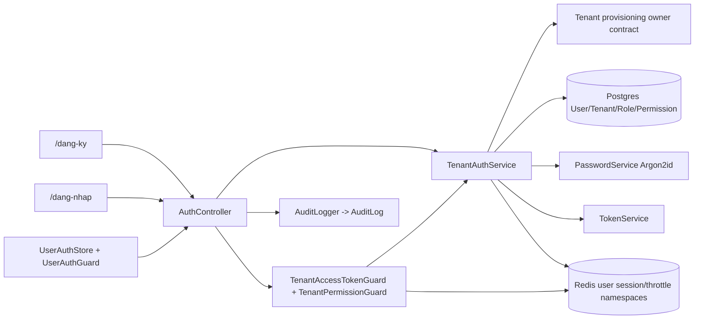
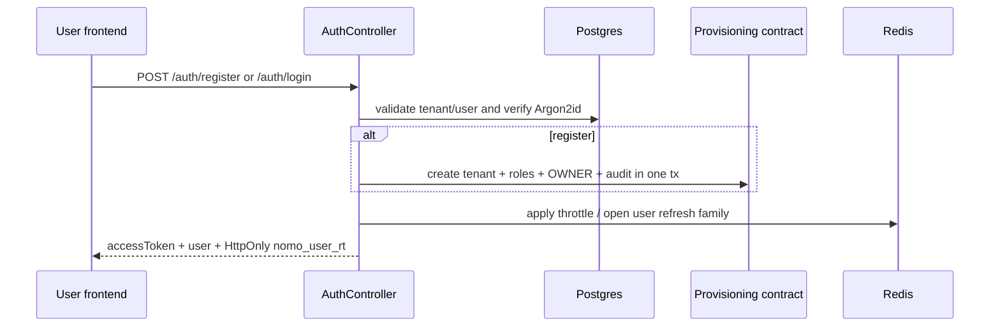
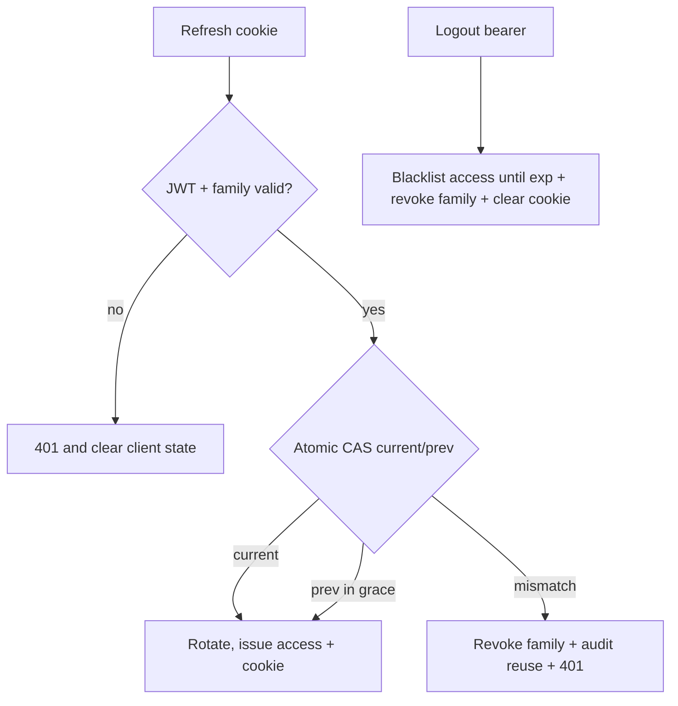
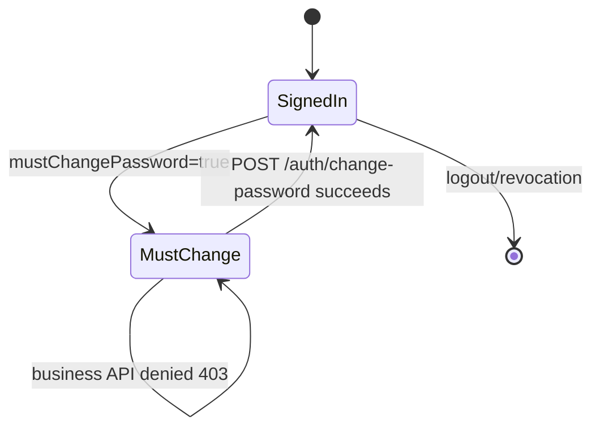

# Design Document — user-registration-authentication

## Overview

This feature completes the customer-facing tenant-user lifecycle: public store registration, identifier-based login, refreshable sessions, authorization-aware identity loading, and frontend guards. It extends the existing tenant auth skeleton and reuses the admin auth primitives without sharing admin session namespaces.

The first registration creates a Tenant and its OWNER user through the provisioning-owned transaction boundary. Authentication then uses the resulting User/Role/Permission graph and tenant-scoped JWT claims.

### Goals

- Provide a real `/dang-ky` and `/dang-nhap` flow.
- Provide secure tenant access/refresh/logout/me behavior.
- Enforce current tenant permissions and first-login password changes.
- Prove the full route chain with backend E2E and frontend runtime checks.

### Non-Goals

- OTP, email verification, OAuth, MFA, forgot-password, tenant staff management, billing, or admin auth changes.

## Architecture

### Existing Architecture Analysis

- NestJS feature modules under `backend/src/platform/*`; `AuthModule` already owns admin and minimal tenant auth.
- Prisma `User` is tenant-scoped and linked to `Role`; `RolePermission` links to `Permission`.
- `PasswordService` already provides Argon2id hashing and decoy verification.
- `RefreshTokenStore` already implements hash-only Redis families, Lua compare-and-swap rotation, grace handling, and access blacklisting under admin prefixes.
- Frontend admin auth is a Zustand in-memory pattern with refresh/retry; user auth must use an independent store and guard.

### Architecture Pattern & Boundary Map



**Architecture Integration**:

- Selected pattern: extend the existing auth module with a tenant realm service and user-specific session namespace.
- Domain boundaries: provisioning owns tenant/owner creation invariants; auth owns credential verification/session lifecycle; guards own request authorization; frontend store owns client session state.
- Existing patterns preserved: Nest DTO validation, Prisma transactions, Redis fail-closed behavior, Argon2id, in-memory access tokens, `DESIGN.md` touch/accessibility rules.
- New components rationale: user-specific session orchestration and frontend state are required because admin identity/session cannot be reused safely.

### Technology Stack

| Layer | Choice / Version | Role | Notes |
|---|---|---|---|
| Frontend | Next.js 16, React 19, Zustand, Tailwind v4 | Registration/login/session UI | Separate user store/guard |
| Backend | NestJS 11, Passport JWT, class-validator | Auth API/guards | Extend `AuthModule` |
| Password | Existing Argon2id `PasswordService` | Hash/verify/decoy | No new crypto library |
| Data | Prisma 7/PostgreSQL | User/Tenant/Role/Permission/AuditLog | Reuse indexes; additive migration only if justified |
| Session | Redis/ioredis | Refresh families, blacklist, throttling | Separate `user:*` keys |

## Canonical Contracts & Invariants

| Contract Area | Canonical Decision | Applies To | Must Stay Consistent In |
|---|---|---|---|
| Auth/session | Tenant realm uses access JWT ~15m and rotating refresh JWT ~30d. User access claims include `userType=tenant`, `sub`, `tenantId`, `username`, `role`, `permissions[]`, `familyId`, `type=access`. Refresh claims include `sub`, `tenantId`, `familyId`, `userType=tenant`, `type=refresh`. | Backend services/guards, frontend store | `token.service.ts`, tenant auth services, tests, frontend types |
| Transport/entrypoints | `POST /auth/register`, `POST /auth/login`, `POST /auth/refresh`, `POST /auth/logout`, `GET /auth/me`, `POST /auth/change-password`; refresh cookie is `nomo_user_rt`, HttpOnly, Secure in production, SameSite=None for existing cross-origin FE/BE dev topology, Path `/auth`. `/auth/refresh` selects the user or admin realm only from its distinct cookie name and rejects ambiguous/missing realm cookies. Cookie-authenticated mutation/refresh endpoints validate configured allowed Origin. | Controller, FE API client, E2E | API DTOs, cookie helpers, origin checks, runtime tests |
| Persistence/session | Redis stores only SHA-256 refresh/access values. User keys use `user:rt:{familyId}`, `user:rt:{familyId}:prev`, `user:bl:{hash}`, `user:rtidx:{userId}`, and bounded `user:login-attempt:*` keys. | Refresh store/throttler | Redis helpers, tests, operational docs |
| Identity/authorization | `tenantId` is server-derived from verified JWT; role grants are loaded from current tenant role/permission joins on login, refresh, and `/auth/me`; stale client claims never authorize a refreshed session. | Strategy, permission guard, controllers | Token claims, guard tests, E2E |
| Password | `PasswordService` Argon2id remains the only password hash/verify implementation. `mustChangePassword` gates all non-session-maintenance user routes until authenticated change succeeds. | Registration/login/change-password | User service, route guard, FE forced-change path |
| Audit | Use existing `AuditAction` values `LOGIN`, `LOGOUT`, `REFRESH_REUSE_DETECTED`; tenant auth rows use `actorType=USER`, tenantId, actorId, actorRoleCode, IP/User-Agent. `AuditInput.tenantId` is optional for backward compatibility and is persisted by both event-only and transactional logger paths. Never include password/token/hash fields. | Auth services, admin audit consumer | Audit logger, audit query sanitization, E2E |
| Rollback | User auth migration/route changes can be disabled/reverted without deleting admin Redis keys or changing admin cookie names/claims. | Deployment and migration | R8.5 task and release notes |

<!-- contract:TenantAuthResponse -->
```json
{
  "accessToken": "string",
  "user": {
    "id": "string",
    "tenantId": "string",
    "tenantSlug": "string",
    "tenantName": "string",
    "username": "string",
    "email": "string|null",
    "phone": "string|null",
    "fullName": "string",
    "role": "string",
    "permissions": ["resource:action"],
    "mustChangePassword": false
  }
}
```

<!-- contract:TenantMeResponse -->
```json
{
  "id": "string",
  "tenantId": "string",
  "tenantSlug": "string",
  "tenantName": "string",
  "username": "string",
  "email": "string|null",
  "phone": "string|null",
  "fullName": "string",
  "role": "string",
  "permissions": ["resource:action"],
  "mustChangePassword": false
}
```

## System Flows

### Registration and login



### Refresh, reuse, and logout



### Forced password change



## Requirements Traceability

| Requirement | Summary | Components | Interfaces | Flows |
|---|---|---|---|---|
| 1.1–1.6 | Atomic public registration | Registration DTO/service, provisioning contract, audit | `POST /auth/register` | Registration |
| 2.1–2.6 | Tenant identifier login | TenantAuthService, PasswordService, TokenService | `POST /auth/login` | Login |
| 3.1–3.5 | User session lifecycle | User refresh store, AuthController, TokenService | refresh/logout/me | Refresh/logout |
| 4.1–4.5 | Authorization/password change | Tenant guard/permission guard, password service | `/auth/me`, `/auth/change-password` | Forced change |
| 5.1–5.4 | Throttle and audit | Redis throttle, AuditLogger | auth events | Login/session |
| 6.1–6.6 | User frontend | User API client/store/guard/forms | `/dang-ky`, `/dang-nhap` | All |
| 7.1–7.4 | Verification | unit/E2E/build/runtime tasks | test commands | All |
| 8.1–8.5 | NFR/rollback | shared primitives, migration/release | runtime/config | All |

## Components and Interfaces

| Component | Layer | Intent | Req Coverage | Dependencies | Contracts |
|---|---|---|---|---|---|
| `TenantAuthService` | Backend | Registration/login/me/password lifecycle | 1–5 | Prisma, PasswordService, TokenService, Redis, AuditLogger | Service/API |
| `UserRefreshTokenStore` | Backend | User session rotation/revocation | 3,5,8 | RedisService | Service |
| `TenantPermissionGuard` | Backend | Enforce tenant role permissions | 4 | Passport identity, Prisma | Guard |
| `UserAuthController` routes | Backend API | Expose auth entrypoints | 1–4 | TenantAuthService | API |
| `UserAuthStore` | Frontend | In-memory access token and hydration | 6 | user API client | State |
| `UserAuthGuard` | Frontend | Protect user app routes | 6,7 | UserAuthStore | Runtime |
| User auth forms | Frontend | Registration/login/password change UX | 6 | UserAuthStore | UI |

### TenantAuthService

- Registration delegates tenant + owner creation to the provisioning-owned transactional service.
- Login reloads active tenant/user/role/permissions, updates last login, writes audit, opens user refresh family, and returns `TenantAuthResponse`.
- Refresh verifies realm, re-loads user and role grants, rotates the family, and returns a new access token.
- `/me` reloads identity and returns `TenantMeResponse`; it does not trust client-provided tenantId or permissions.
- Password change verifies current password, updates hash and `mustChangePassword`, revokes other user families, and audits without secret payloads.

### API Contract

| Method | Endpoint | Request | Response | Errors |
|---|---|---|---|---|
| POST | `/auth/register` | `RegisterTenantRequest` | `TenantAuthResponse` + cookie | 400, 409, 429, 503 |
| POST | `/auth/login` | `TenantLoginRequest` | `TenantAuthResponse` + cookie | 400, 401, 403, 429, 503 |
| POST | `/auth/refresh` | `nomo_user_rt` cookie | `{ accessToken: string, user: TenantMeResponse }` + cookie | 401, 503 |
| POST | `/auth/logout` | Bearer access token | 204 + cleared cookie | 401, 503 |
| GET | `/auth/me` | Bearer access token | `TenantMeResponse` | 401, 403 |
| POST | `/auth/change-password` | current/new password | `TenantMeResponse` | 400, 401, 403, 503 |

### Frontend state

- The current account invariant is one `User` → one `Tenant`; login therefore resolves the store from the authenticated user record and does not ask for a tenant/store code.
- A tenant picker is intentionally out of scope. If a future account model allows one user to belong to multiple tenants, login must add an explicit tenant-selection step after credential verification.

- `UserAuthStore` keeps `user`, `accessToken`, `loading`, `hasHydrated`, and methods `hydrate`, `login`, `register`, `logout`, `changePassword`, `setAccessToken`, `clear`.
- Access token is memory-only; refresh cookie is browser-managed HttpOnly.
- User API client deduplicates refresh and retries one request, then clears user session on failure.

## Data Models

### Domain Model

- `Tenant` 1—N `User`; each user references exactly one tenant and one tenant-scoped `Role`; role grants resolve through `RolePermission` → `Permission`.
- Registration creates the aggregate boundary Tenant + role templates + first OWNER user + audit rows.
- Sessions are Redis-only ephemeral families; no raw credential is persisted.

### Physical Data Model

- Reuse `User.lastLoginAt`, `User.mustChangePassword`, existing tenant/user/role indexes, and `AuditLog`.
- Add only additive migration changes if implementation proves an index or enum is missing; do not alter admin auth columns or keys.
- Redis keys and TTLs are defined in Canonical Contracts.

## Security Assessment

| Threat | Severity | Control |
|---|---|---|
| Cross-tenant token/resource access | Critical | Server-derived tenantId, realm claim validation, tenant-scoped queries, E2E denial |
| Refresh token replay | Critical | Hash-only Redis family, atomic rotation, grace, reuse revocation/audit |
| Credential brute force | High | Argon2id, decoy verify, bounded Redis throttle, generic errors |
| Password/token leakage | Critical | HttpOnly refresh cookie, memory-only access token, sanitized audit/log payloads |
| Stale permissions | High | Reload role grants on refresh/me, short access TTL |
| Redis failure fail-open | High | Guard/refresh fail closed with 503; no token issuance when required state unavailable |

## Performance & Reliability

- Login query must use tenant/user identifier indexes and one role/permission join shape; no unbounded tenant scan.
- Failed registration attempts use the same bounded Redis throttle policy as failed login attempts.
- Refresh and blacklist operations are bounded Redis calls; request-level refresh deduplication is frontend-only and does not alter server correctness.
- Registration uses one database transaction; rollback tests verify no orphan data.
- Rollback path disables user routes and reverts only additive user-auth migration/key code; admin session namespaces remain intact.

## Unresolved Questions

- Provisioning task must finalize the shared transaction service signature before R1 registration implementation.
